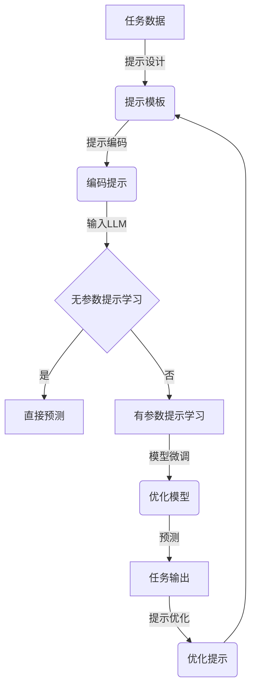

# 大规模语言模型从理论到实践：提示学习

## 1. 背景介绍

在过去几年中,大规模语言模型(Large Language Models, LLMs)取得了令人瞩目的进展,展现出惊人的语言生成能力。这些模型通过从海量文本数据中学习,能够捕捉语言的丰富模式,并生成看似人类水平的自然语言输出。然而,训练这些庞大的模型需要耗费大量的计算资源,并且它们在特定任务上的性能并不理想。

为了更好地利用LLMs的强大能力,同时降低计算成本,研究人员提出了"提示学习"(Prompt Learning)的范式。提示学习的核心思想是,通过精心设计的提示(Prompt),将LLMs的一般语言知识转移到特定的下游任务上。这种方法不需要对整个模型进行从头训练,而是利用少量的任务数据对LLMs进行指导,从而获得良好的任务表现。

提示学习不仅在自然语言处理(NLP)任务中取得了成功,而且还在计算机视觉、推理等其他领域展现出巨大的潜力。本文将全面探讨提示学习的理论基础、核心算法、实践应用,以及未来发展趋势和挑战。

## 2. 核心概念与联系

### 2.1 大规模语言模型

大规模语言模型是一种基于深度学习的模型,旨在从海量文本数据中学习语言的统计规律。这些模型通常采用自注意力机制(Self-Attention)和Transformer架构,能够有效地捕捉长距离的上下文依赖关系。

著名的LLMs包括GPT(Generative Pre-trained Transformer)系列、BERT(Bidirectional Encoder Representations from Transformers)、T5(Text-to-Text Transfer Transformer)等。这些模型通过在大规模文本语料库上进行预训练,学习到丰富的语言知识,并可以通过微调(Fine-tuning)或提示学习等方式,将这些知识迁移到特定的下游任务中。

### 2.2 提示学习

提示学习是一种新兴的范式,旨在通过设计合适的提示,指导LLMs完成特定的任务。传统的微调方法需要在大量标注数据上对整个模型进行训练,而提示学习只需要少量的任务数据,就能够获得良好的性能。

提示学习的核心思想是,将任务输入和输出表示为一个自然语言提示,并将其输入到LLMs中,让模型根据提示生成所需的输出。例如,在文本分类任务中,我们可以将输入文本和期望的类别标签组合成一个提示,如"文本:这是一篇关于科技的文章。类别:"。模型将根据提示生成类别标签。

提示学习的优势在于,它能够充分利用LLMs中蕴含的丰富语言知识,同时避免了从头训练模型的巨大计算开销。此外,提示学习还具有更好的可解释性和可控性,因为我们可以通过设计不同的提示来控制模型的输出。

### 2.3 提示学习与其他技术的联系

提示学习与其他一些技术有着密切的联系,例如:

- **元学习(Meta-Learning)**: 提示学习可以被视为一种元学习策略,其中LLMs在预训练阶段学习了一般的语言知识,而提示则指导模型如何将这些知识迁移到特定任务上。
- **少样本学习(Few-Shot Learning)**: 提示学习通常只需要少量的任务数据,因此属于少样本学习的范畴。
- **知识蒸馏(Knowledge Distillation)**: 提示学习可以被视为一种知识蒸馏的形式,其中LLMs的知识被蒸馏到特定任务的提示中。
- **自然语言处理(NLP)**: 提示学习最初主要应用于NLP任务,但后来也被推广到其他领域,如计算机视觉和推理任务。

## 3. 核心算法原理具体操作步骤

提示学习的核心算法原理包括以下几个关键步骤:

### 3.1 提示设计

提示设计是提示学习中最关键的一步。一个好的提示应该能够将任务输入和输出自然地表示为一个自然语言序列,并且能够指导LLMs生成所需的输出。

提示设计有多种方式,包括:

1. **手工设计提示**: 人工编写提示模板,将任务输入和输出组合成自然语言序列。这种方式需要一定的领域知识和经验。
2. **自动提示搜索**: 通过搜索算法自动生成最优的提示模板,例如使用梯度下降、强化学习或进化算法等方法。
3. **基于示例的提示**: 利用任务的少量示例数据,构建包含输入-输出对的提示。这种方式通常更加简单和直观。

### 3.2 提示编码

将设计好的提示编码为LLMs可以理解的输入格式。常见的编码方式包括:

1. **文本提示编码**: 将提示表示为文本序列,并使用LLMs的标准文本编码器(如字符级或子词级编码器)对其进行编码。
2. **连续提示编码**: 将提示表示为连续的向量,并将其作为LLMs的额外输入。这种方式需要对LLMs进行一定的修改。

### 3.3 提示学习

将编码后的提示输入到LLMs中,并根据模型的输出进行任务预测或生成。这个过程可以是:

1. **无参数提示学习**: 直接利用LLMs的预训练权重,不进行任何参数更新。这种方式计算成本最低,但性能可能受到限制。
2. **有参数提示学习**: 在提示学习过程中,同时对LLMs的部分参数进行微调,以使模型更好地适应任务。这种方式可以提高性能,但计算成本也会增加。

### 3.4 提示优化

为了获得更好的性能,我们可以对提示进行优化,包括:

1. **提示调整**: 通过调整提示模板或示例,使提示更加合适。
2. **提示集成**: 将多个不同的提示模型进行集成,以获得更加鲁棒的预测结果。
3. **提示正则化**: 在提示学习过程中加入正则化项,以防止过拟合。

### 3.5 算法流程图

以下是提示学习算法的基本流程图:

上图展示了提示学习算法的主要步骤,包括提示设计、编码、学习和优化。根据具体情况,算法可以选择无参数或有参数的提示学习方式,并通过提示优化来不断改进性能。

## 4. 数学模型和公式详细讲解举例说明

提示学习的数学模型基于大规模语言模型,通常采用自注意力机制和Transformer架构。下面我们将详细介绍这些模型的数学原理。

### 4.1 自注意力机制

自注意力机制是Transformer模型的核心组件,它能够有效地捕捉输入序列中的长距离依赖关系。给定一个输入序列 $\boldsymbol{X} = (x_1, x_2, \dots, x_n)$,自注意力机制首先计算每个输入元素与所有其他元素之间的相关性分数,称为注意力权重:

$$\text{Attention}(Q, K, V) = \text{softmax}\left(\frac{QK^\top}{\sqrt{d_k}}\right)V$$

其中 $Q$、$K$、$V$ 分别表示查询(Query)、键(Key)和值(Value),它们是通过线性变换从输入序列 $\boldsymbol{X}$ 得到的。$d_k$ 是缩放因子,用于防止较深层次的注意力值过小。

注意力权重反映了每个输入元素对其他元素的重要性。通过将注意力权重与值 $V$ 相乘并求和,我们可以得到每个输入元素的注意力表示:

$$\text{Attention}(X) = \text{Attention}(Q, K, V) = \sum_{i=1}^n \alpha_i V_i$$

其中 $\alpha_i$ 是第 $i$ 个输入元素的注意力权重。

最终,自注意力输出是通过残差连接和层归一化得到的:

$$\text{Output} = \text{LayerNorm}(X + \text{Attention}(X))$$

### 4.2 Transformer 模型

Transformer 是一种基于自注意力机制的序列到序列模型,广泛应用于自然语言处理任务。它由编码器(Encoder)和解码器(Decoder)两个部分组成。

编码器将输入序列 $\boldsymbol{X}$ 映射到一个连续的表示 $\boldsymbol{Z}$:

$$\boldsymbol{Z} = \text{Encoder}(\boldsymbol{X})$$

解码器则根据编码器的输出 $\boldsymbol{Z}$ 和目标序列的前缀 $\boldsymbol{Y}_{<t}$ 来生成下一个标记 $y_t$:

$$P(y_t | \boldsymbol{Y}_{<t}, \boldsymbol{X}) = \text{Decoder}(\boldsymbol{Z}, \boldsymbol{Y}_{<t})$$

在提示学习中,我们将任务输入和提示序列作为 $\boldsymbol{X}$ 输入到Transformer模型,并根据模型生成的输出序列进行任务预测或生成。

### 4.3 提示嵌入

在有参数的提示学习中,我们需要为提示序列学习一个连续的嵌入表示,称为提示嵌入(Prompt Embedding)。给定一个提示序列 $\boldsymbol{P} = (p_1, p_2, \dots, p_m)$,其嵌入表示为:

$$\boldsymbol{E}_P = (e_{p_1}, e_{p_2}, \dots, e_{p_m})$$

其中 $e_{p_i}$ 是提示标记 $p_i$ 对应的嵌入向量。

提示嵌入 $\boldsymbol{E}_P$ 将与任务输入的嵌入 $\boldsymbol{E}_X$ 拼接,作为Transformer模型的输入:

$$\boldsymbol{E}_\text{input} = [\boldsymbol{E}_P; \boldsymbol{E}_X]$$

在提示学习过程中,提示嵌入 $\boldsymbol{E}_P$ 将与Transformer模型的其他参数一起进行优化,以使模型能够更好地适应任务。

### 4.4 示例

让我们以文本分类任务为例,说明提示学习的数学模型。假设我们有一个输入文本 $\boldsymbol{X} = (x_1, x_2, \dots, x_n)$,需要将其分类为 $K$ 个类别之一。我们可以设计一个提示序列 $\boldsymbol{P} = (\text{"文本:"}, x_1, x_2, \dots, x_n, \text{"类别:"})$,并将其输入到Transformer模型中。

模型将根据提示序列生成一个输出序列 $\boldsymbol{Y} = (y_1, y_2, \dots, y_m)$,其中 $y_m$ 应该是预测的类别标签。我们可以计算每个类别标签的概率分布:

$$P(y_m = k | \boldsymbol{X}, \boldsymbol{P}) = \text{softmax}(\boldsymbol{W}_k^\top \boldsymbol{h}_m + b_k)$$

其中 $\boldsymbol{h}_m$ 是解码器在时间步 $m$ 的隐状态, $\boldsymbol{W}_k$ 和 $b_k$ 分别是第 $k$ 类的权重和偏置项。

在无参数的提示学习中,我们直接利用预训练的Transformer模型进行预测。而在有参数的提示学习中,我们将同时优化提示嵌入 $\boldsymbol{E}_P$ 和模型参数,以最小化分类损失函数:

$$\mathcal{L} = -\sum_{i=1}^N \log P(y_m^{(i)} = t^{(i)} | \boldsymbol{X}^{(i)}, \boldsymbol{P})$$

其中 $N$ 是训练样本数, $t^{(i)}$