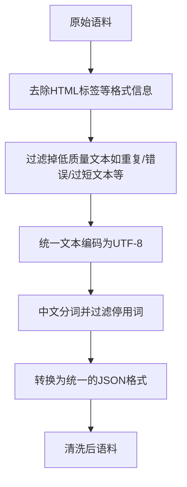

# 大语言模型原理与工程实践：手把手教你训练 7B 大语言模型 语料预处理

## 1. 背景介绍
### 1.1 大语言模型的兴起
近年来,随着深度学习技术的快速发展,大语言模型(Large Language Model,LLM)已经成为自然语言处理(NLP)领域的研究热点。从2018年Google发布的BERT,到2019年OpenAI的GPT-2,再到2020年的GPT-3,大语言模型不断刷新着NLP任务的性能上限。这些模型展现出了惊人的语言理解和生成能力,在机器翻译、问答系统、文本摘要等诸多应用中取得了突破性进展。

### 1.2 训练大语言模型的挑战
然而,训练一个高质量的大语言模型并非易事。它对算力、数据和工程实现都提出了极高的要求:
- 在算力方面,动辄数百亿甚至上千亿参数的模型需要强大的分布式训练能力,对计算资源的需求非常大。
- 在数据方面,大语言模型通常要在海量的无标注语料上进行预训练,这就要求高质量、多样化的大规模文本数据。
- 在工程实现方面,大语言模型的训练流程复杂,需要精心的优化和大量的调试,对工程师的功力有很高的要求。

### 1.3 语料预处理的重要性
在众多影响大语言模型性能的因素中,语料的质量无疑是最为关键的。再先进的模型架构和训练算法,如果输入的数据存在大量噪声和错误,也很难得到理想的结果。因此,语料预处理是大语言模型训练不可或缺的一环。本文将重点介绍大语言模型训练中语料预处理的原理和实践,手把手带你构建一个7B规模语言模型的高质量训练集。

## 2. 核心概念与联系
### 2.1 大语言模型的定义与特点
大语言模型本质上是一个基于海量无标注文本语料训练的神经网络模型,旨在学习自然语言的统计规律和深层语义表示。与传统的自然语言处理模型不同,大语言模型通常采用Transformer等高容量的网络结构,参数量动辄上百亿,因此得名"大语言模型"。它的显著特点包括:

1. 参数量巨大,可以学习海量语料中蕴含的语言知识。
2. 采用无监督的预训练范式,不需要人工标注的数据。
3. 可以通过少量样本微调适应下游任务,展现出强大的迁移学习能力。
4. 在机器翻译、问答、对话等多个NLP任务上取得了显著的性能提升。

### 2.2 语料预处理的定义与作用
语料预处理是指在将原始文本数据输入语言模型进行训练之前,对其进行一系列的清洗、格式转换、过滤等操作的过程。其主要作用包括:

1. 提高语料质量:过滤掉错误、噪声、冗余等无效信息,保证语料的准确性和代表性。
2. 统一语料格式:将不同来源、不同格式的原始语料转换为统一的格式,方便后续处理。
3. 优化数据存储:对语料进行压缩、二进制化等处理,提高数据读取和存储的效率。
4. 匹配模型需求:根据所选的模型架构和训练范式,对语料进行相应的处理,如BPE分词、生成用于MLM任务的Mask语料等。

语料预处理的质量直接影响到最终模型的性能,是大语言模型训练流程中的关键一环。下图展示了语料预处理在整个大语言模型训练流程中的位置:


## 3. 核心算法原理具体操作步骤
本节将详细介绍大语言模型训练中常用的语料预处理算法和操作步骤。我们以训练一个7B参数的中文大语言模型为例,讲解如何从原始语料出发,逐步构建高质量的训练集。

### 3.1 语料收集与清洗
#### 3.1.1 语料来源选择
大语言模型的语料需要覆盖足够广泛的领域和体裁,才能学习到丰富、鲁棒的语言知识。常见的语料来源包括:
- 网页数据:如新闻、博客、百科等。覆盖面广但噪声较多。
- 图书数据:质量较高但体裁单一,主要为书面语。
- 社交媒体数据:口语化、对话性强,但非标准用语较多。

针对中文大模型,我们选择了以下数据源:
- 中文维基百科:规模约1B Token,百科知识丰富,文本质量高。
- 新闻语料:规模约10B Token,涵盖了较长时间跨度的新闻文本。
- 网络小说:规模约10B Token,弥补了书面语数据的不足。
- 社交媒体语料:规模约5B Token,引入了大量口语化表达。

通过这些数据源的组合,我们获得了约26B Token的原始中文语料。

#### 3.1.2 语料清洗流程
原始语料往往包含大量的噪声和错误,需要经过系统的清洗才能用于模型训练。我们采用了如下的语料清洗流程:



其中的关键步骤包括:
- 采用正则表达式去除HTML标签、URL等格式信息。
- 过滤掉重复度高于50%的文本。
- 去除错误的编码字符如乱码等。
- 去除过短(如小于10个字)的文本片段。
- 采用jieba分词工具对中文文本进行分词,并过滤停用词。
- 将所有文本统一转换为JSON格式,每条数据包括文章ID、标题、正文等字段。

经过上述清洗步骤,我们得到了约20B Token的高质量中文语料。

### 3.2 语料格式转换与数值化
#### 3.2.1 BPE分词
大语言模型通常采用Byte Pair Encoding (BPE)算法对文本进行分词。与基于词典的分词方法不同,BPE可以自动学习语料中的子词信息,在保留语义完整性的同时大幅减小词表大小。BPE的基本步骤如下:

1. 将语料中的所有单词拆分为字符,得到初始词表。
2. 统计词表中相邻字节对的出现频率,选择频率最高的字节对合并为新的子词。 
3. 重复第2步直到达到预设的子词表大小或者最大合并次数。
4. 利用学习到的子词表对语料进行分词,每个子词用一个唯一的ID表示。

我们选择了BPE词表大小为50000,最大合并次数为100万次。下面是一个BPE分词的例子:

原文:
- 语言模型是自然语言处理的重要基础
BPE分词结果:
- 语言 模型 是 自然 语言 处理 的 重要 基础

可以看到"语言"、"模型"等高频词被保留为完整的子词,而"自然语言处理"这样的长词则被拆分为多个子词。这种平衡有助于提高语言模型的学习效率和泛化能力。

#### 3.2.2 文本数值化
BPE分词得到的语料是文本格式,需要进一步转换为数值形式才能输入神经网络模型进行训练。这个过程主要包括:

1. 根据子词表将每个子词映射为唯一的整数ID。
2. 将每个句子表示为子词ID的序列。
3. 对句子进行padding,保证训练数据的长度一致。
4. 将数据集打包为TFRecord格式,提高数据读取效率。

例如,上面的分词结果转换为数值形式后可表示为:

```
[2431, 4500, 12, 189, 2431, 6251, 5, 7814, 9021]
```

其中每个整数对应一个子词在词表中的唯一ID。

我们采用了最大句长为512,Batch大小为1024的配置对语料进行数值化,最终得到了约1TB的预训练数据集。

### 3.3 数据增强与特殊Token处理
#### 3.3.1 动态Masking
Masked Language Model (MLM)是BERT等大语言模型常用的预训练任务之一。其核心思想是随机Mask掉句子中的部分Token,并训练模型预测被Mask位置的原始Token。这种自监督学习范式可以有效提高模型对语言的理解能力。

传统的MLM实现通常在数据准备阶段就确定了需要Mask的Token及其位置,导致每个样本只能被训练一次。为了提高数据利用率,我们采用了动态Masking策略,即在每个训练步动态地生成新的Mask样本。其基本步骤如下:

1. 对每个句子以15%的概率随机选择Token进行Mask。
2. 对选中的Token,以80%的概率替换为[MASK]符号,以10%的概率保持不变,以10%的概率替换为一个随机Token。
3. 生成新的Mask样本输入模型进行训练,并以被Mask位置的原始Token作为预测目标。

通过动态Masking,我们可以在每个Epoch动态生成不同的训练样本,大大增强了数据的丰富性和模型的泛化能力。

#### 3.3.2 特殊Token处理
除了MLM任务外,BERT还引入了Next Sentence Prediction (NSP)任务来训练模型对句子关系的理解。为此需要在语料中加入一些特殊的Token:

- [CLS]:位于每个句子开头,用于表示整个句子的语义。
- [SEP]:用于分隔两个句子,如NSP任务的前后句。
- [MASK]:MLM任务中用于替换被Mask掉的Token。
- [PAD]:用于Padding,保证数据维度一致。

在数据准备阶段,我们需要在适当的位置插入这些特殊Token,并在词表中为它们分配唯一的ID。这样模型才能正确识别它们的语义功能。

以上就是大语言模型语料预处理的核心步骤和算法。通过这些处理,我们得到了一个高质量、大规模的中文预训练数据集,为训练7B大模型奠定了坚实的基础。

## 4. 数学模型和公式详细讲解举例说明
本节我们将重点介绍语料预处理中用到的一些数学模型和公式,并给出具体的例子加以说明。

### 4.1 BPE词表学习中的字节对频率统计
BPE词表学习的核心是统计语料中相邻字节对的出现频率,并迭代地合并高频字节对形成新的子词。这个过程可以用数学公式表示如下:

令语料中的字符集合为$V$,初始词表$W_0$为$V$的所有单字符。在第$i$次合并时,词表为$W_i$。定义词表中每个子词$w$的频率为$f(w)$,两个子词$w_1$和$w_2$的组合频率为:

$$
f(w_1,w_2)=\sum_{s\in S}Count(s,w_1w_2)
$$

其中$S$为语料集合,$Count(s,w_1w_2)$表示子串$w_1w_2$在句子$s$中出现的次数。

在每一次迭代中,我们选择组合频率最大的字节对$(w_1^*,w_2^*)$进行合并:

$$
(w_1^*,w_2^*)=\arg\max_{(w_1,w_2)\in W_i\times W_i}f(w_1,w_2)
$$

合并后得到新的子词$w^*=w_1^*w_2^*$,更新词表为$W_{i+1}=W_i\cup\{w^*\}$。

重复上述过程直到达到预设的词表大小$|W|$或者最大迭代次数$N$。

例如,对于句子"我爱自然语言处理",