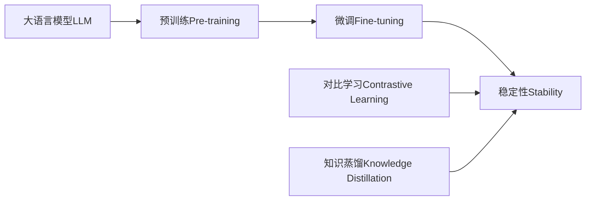

# 大语言模型原理与工程实践：稳定性优化

## 1. 背景介绍
### 1.1 大语言模型的兴起
近年来,随着深度学习技术的快速发展,自然语言处理(NLP)领域取得了突破性进展。其中,大语言模型(Large Language Model,LLM)作为 NLP 的重要分支,受到了学术界和工业界的广泛关注。LLM 通过在海量文本数据上进行预训练,可以学习到丰富的语言知识和语义信息,在机器翻译、问答系统、文本生成等任务上取得了优异的表现。

### 1.2 LLM 面临的稳定性挑战
尽管 LLM 展现出了强大的能力,但在实际应用中仍然面临着稳定性方面的挑战。模型的输出可能存在不一致、自相矛盾、逻辑混乱等问题,严重影响了用户体验和实际应用价值。因此,如何提高 LLM 的稳定性,使其能够生成高质量、连贯、合理的文本,成为了亟待解决的关键问题。

### 1.3 本文的主要内容
本文将深入探讨大语言模型稳定性优化的原理与工程实践。我们将首先介绍 LLM 的核心概念与联系,然后详细阐述稳定性优化的算法原理和具体操作步骤。接着,我们将通过数学模型和代码实例,进一步说明稳定性优化的实现细节。此外,本文还将讨论 LLM 稳定性优化在实际应用场景中的价值,并推荐相关的工具和资源。最后,我们将总结 LLM 稳定性优化的未来发展趋势与挑战,并在附录中解答常见问题。

## 2. 核心概念与联系
### 2.1 大语言模型(LLM)
大语言模型是一类基于深度神经网络的语言模型,通过在大规模文本数据上进行预训练,可以学习到丰富的语言知识和语义信息。常见的 LLM 包括 BERT、GPT、T5 等。LLM 的核心思想是利用自监督学习,通过构建合适的预训练任务,让模型从海量无标注数据中自主学习语言规律和知识。

### 2.2 稳定性(Stability)
稳定性是指 LLM 生成文本的一致性、连贯性和合理性。一个稳定的 LLM 应该能够生成逻辑清晰、自洽、符合人类认知的文本。稳定性差的 LLM 可能会产生自相矛盾、语义混乱、偏离主题等问题,严重影响模型的实用价值。

### 2.3 预训练(Pre-training)
预训练是 LLM 的关键步骤,通过在大规模无标注文本数据上进行自监督学习,让模型掌握语言的基本规律和知识。常见的预训练任务包括语言模型、掩码语言模型(Masked Language Model,MLM)、下一句预测(Next Sentence Prediction,NSP)等。预训练可以帮助模型学习到丰富的语言表示,为下游任务提供良好的初始化。

### 2.4 微调(Fine-tuning)
微调是在预训练的基础上,针对特定任务对 LLM 进行进一步训练的过程。通过在任务相关的标注数据上微调模型,可以使 LLM 适应特定领域或任务的需求。微调可以显著提升模型在下游任务上的表现,同时也有助于提高模型的稳定性。

### 2.5 对比学习(Contrastive Learning)
对比学习是一种无监督学习范式,通过构建正负样本对,让模型学习区分相似和不相似的样本。在 LLM 稳定性优化中,对比学习可以用于引导模型生成一致、连贯的文本,同时抑制生成不合理、矛盾的文本。

### 2.6 知识蒸馏(Knowledge Distillation)
知识蒸馏是一种将大型复杂模型的知识转移到小型简单模型的技术。在 LLM 稳定性优化中,知识蒸馏可以用于提取预训练模型中的稳定性相关知识,并将其注入到微调后的模型中,从而提高模型的稳定性。

以下是核心概念之间的联系图:

## 3. 核心算法原理具体操作步骤
### 3.1 基于对比学习的稳定性优化
#### 3.1.1 构建正负样本对
首先,我们需要构建正负样本对用于对比学习。正样本对由同一主题或上下文生成的文本组成,负样本对由不同主题或上下文生成的文本组成。通过这种方式,我们可以引导模型学习生成一致、连贯的文本。

具体步骤如下:
1. 对于每个输入上下文,生成多个候选文本。
2. 将同一上下文生成的文本组成正样本对。
3. 将不同上下文生成的文本组成负样本对。
4. 对正负样本对进行采样,构建训练数据集。

#### 3.1.2 对比损失函数
接下来,我们需要定义对比损失函数,用于优化模型在正负样本对上的表现。常用的对比损失函数包括 InfoNCE 损失和对比预测编码(Contrastive Predictive Coding,CPC)损失。

以 InfoNCE 损失为例,其定义如下:

$$
\mathcal{L}_{\text{InfoNCE}} = -\mathbb{E}_{(x, y) \sim \mathcal{D}} \left[ \log \frac{\exp(f(x)^T f(y))}{\exp(f(x)^T f(y)) + \sum_{y' \in \mathcal{Y}_{\text{neg}}} \exp(f(x)^T f(y'))} \right]
$$

其中,$x$和$y$为正样本对,$ \mathcal{Y}_{\text{neg}}$为负样本集合,$f(\cdot)$为编码函数,用于将文本映射到向量空间。

#### 3.1.3 模型优化
最后,我们使用对比损失函数对模型进行优化。具体步骤如下:
1. 将正负样本对输入到模型中,得到对应的编码向量。
2. 计算正样本对和负样本对的对比损失。
3. 使用梯度下降算法更新模型参数,最小化对比损失。
4. 重复步骤 1-3,直到模型收敛或达到预设的训练轮数。

通过基于对比学习的稳定性优化,我们可以使模型学会生成一致、连贯的文本,提高其稳定性。

### 3.2 基于知识蒸馏的稳定性优化
#### 3.2.1 训练教师模型
首先,我们需要训练一个大型的教师模型,作为知识蒸馏的源模型。教师模型通常是在大规模数据上预训练并微调得到的高性能模型。

具体步骤如下:
1. 在大规模无标注文本数据上预训练教师模型。
2. 在任务相关的标注数据上微调教师模型。
3. 评估教师模型在稳定性方面的表现,确保其具有良好的稳定性。

#### 3.2.2 蒸馏知识
接下来,我们将教师模型的知识蒸馏到学生模型中。学生模型通常是一个较小、较简单的模型,用于提高推理效率和降低计算成本。

具体步骤如下:
1. 使用教师模型对输入文本进行推理,得到软标签(soft labels)。
2. 使用学生模型对同样的输入文本进行推理,得到预测结果。
3. 计算学生模型预测结果与教师模型软标签之间的蒸馏损失。常用的蒸馏损失函数包括 KL 散度损失和均方误差损失。
4. 使用梯度下降算法更新学生模型参数,最小化蒸馏损失。
5. 重复步骤 1-4,直到学生模型收敛或达到预设的训练轮数。

#### 3.2.3 模型评估与部署
最后,我们对蒸馏后的学生模型进行评估,并将其部署到实际应用中。

具体步骤如下:
1. 在测试集上评估学生模型的稳定性表现,包括一致性、连贯性和合理性等指标。
2. 对比学生模型和教师模型的性能,确保学生模型在保持较高稳定性的同时,也具有较好的推理效率。
3. 将学生模型部署到实际应用中,并持续监控其稳定性表现,必要时进行迭代优化。

通过基于知识蒸馏的稳定性优化,我们可以将教师模型的稳定性知识转移到学生模型中,在提高推理效率的同时,保证模型的稳定性。

## 4. 数学模型和公式详细讲解举例说明
### 4.1 Transformer 模型
Transformer 是 LLM 的核心架构,其中的自注意力机制(Self-Attention)和前馈神经网络(Feed-Forward Network)是实现稳定性优化的关键组件。

#### 4.1.1 自注意力机制
自注意力机制允许模型在处理当前词时,关注输入序列中的其他相关词。给定输入序列$\mathbf{X} = (\mathbf{x}_1, \mathbf{x}_2, \dots, \mathbf{x}_n)$,自注意力机制的计算过程如下:

$$
\mathbf{Q} = \mathbf{X} \mathbf{W}^Q, \mathbf{K} = \mathbf{X} \mathbf{W}^K, \mathbf{V} = \mathbf{X} \mathbf{W}^V
$$

$$
\text{Attention}(\mathbf{Q}, \mathbf{K}, \mathbf{V}) = \text{softmax}\left(\frac{\mathbf{Q}\mathbf{K}^T}{\sqrt{d_k}}\right) \mathbf{V}
$$

其中,$\mathbf{W}^Q, \mathbf{W}^K, \mathbf{W}^V$为可学习的权重矩阵,$d_k$为键向量的维度。

自注意力机制可以帮助模型捕捉输入序列中的长距离依赖关系,提高生成文本的连贯性和一致性。

#### 4.1.2 前馈神经网络
前馈神经网络用于对自注意力的输出进行非线性变换,增强模型的表达能力。前馈神经网络的计算过程如下:

$$
\text{FFN}(\mathbf{x}) = \max(0, \mathbf{x}\mathbf{W}_1 + \mathbf{b}_1)\mathbf{W}_2 + \mathbf{b}_2
$$

其中,$\mathbf{W}_1, \mathbf{W}_2$为可学习的权重矩阵,$\mathbf{b}_1, \mathbf{b}_2$为偏置项。

前馈神经网络可以帮助模型学习更加复杂的特征表示,提高生成文本的质量和稳定性。

### 4.2 对比损失函数
对比损失函数是稳定性优化中的关键组件,用于引导模型学习区分相似和不相似的文本。以 InfoNCE 损失为例,其数学定义如下:

$$
\mathcal{L}_{\text{InfoNCE}} = -\mathbb{E}_{(x, y) \sim \mathcal{D}} \left[ \log \frac{\exp(f(x)^T f(y))}{\exp(f(x)^T f(y)) + \sum_{y' \in \mathcal{Y}_{\text{neg}}} \exp(f(x)^T f(y'))} \right]
$$

其中,$x$和$y$为正样本对,$ \mathcal{Y}_{\text{neg}}$为负样本集合,$f(\cdot)$为编码函数。

InfoNCE 损失鼓励模型对正样本对的编码向量之间的相似度进行最大化,同时最小化正样本与负样本之间的相似度。通过优化 InfoNCE 损失,模型可以学习到更加一致、连贯的文本表示。

### 4.3 知识蒸馏损失函数
知识蒸馏损失函数用于将教师模型的知识转移到学生模型中。以 KL 散度损失为例,其数学定义如下:

$$
\mathcal{L}_{\text{KD}} = \sum_{i=1}^N \text{KL}