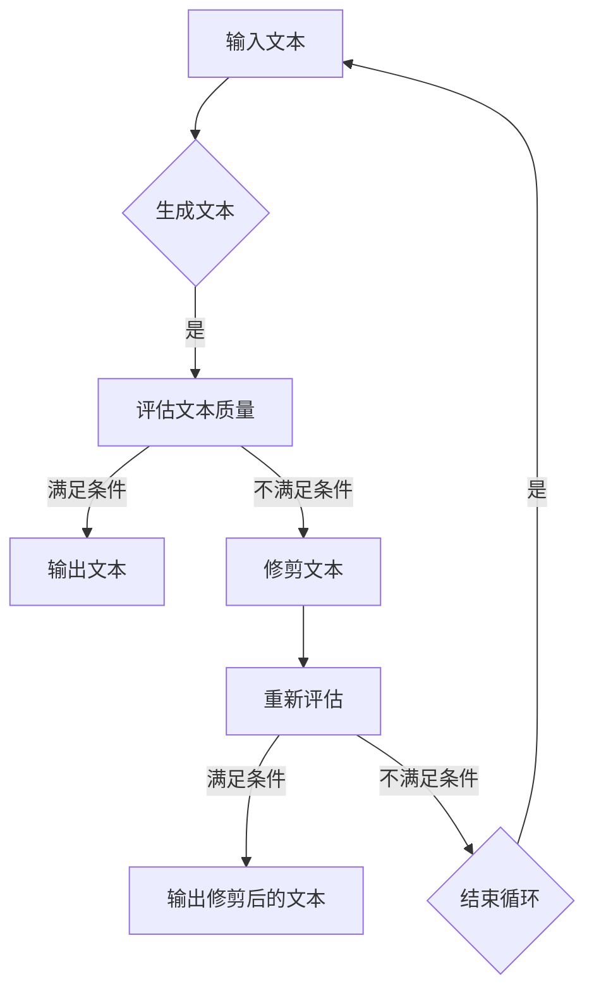

## 背景介绍

随着自然语言处理(NLP)技术的飞速发展，大语言模型（如BERT、GPT系列等）在各个领域取得了显著的成果。然而，在这些模型中，如何确保生成的文本质量？本篇博客将从理论和实践角度探讨大语言模型中的质量过滤策略。

## 核心概念与联系

质量过滤是指在生成文本过程中，对输出文本进行实时评估和修剪，以确保其符合预期的标准。核心概念包括：

1. **生成策略**：决定模型何时停止生成，并输出结果。
2. **评估标准**：衡量生成文本的好坏程度。
3. **修剪规则**：根据评估结果对文本进行修剪。

## 核心算法原理具体操作步骤

以下是一个简单的质量过滤流程图：

### 数学模型和公式详细讲解举例说明

在实际应用中，我们可以使用BLEU（Bilingual Evaluation Understudy）等评分标准来评估生成文本的质量。例如，给定一个翻译任务，我们可以计算机器生成的文本与人类翻译之间的BLEU分数。

$$
\\text{BLEU} = \\frac{\\sum_{i=1}^{n} \\text{BP}^{\\alpha}(s_i, t_i)}{n}
$$

其中，$s_i$ 和 $t_i$ 是源语言和目标语言的句子，$n$ 是总句子数量，$\\text{BP}$ 是BPrecision计算公式，$\\alpha$ 是重叠比例权重。

## 项目实践：代码实例和详细解释说明

以下是一个简单的Python示例，使用transformers库实现了大语言模型的质量过滤：

```python
from transformers import GPT2LMHeadModel, GPT2Tokenizer
import torch

tokenizer = GPT2Tokenizer.from_pretrained(\"gpt2\")
model = GPT2LMHeadModel.from_pretrained(\"gpt2\")

def generate_text(prompt, max_length=100):
    input_ids = tokenizer.encode(prompt, return_tensors=\"pt\")
    output = model.generate(input_ids, max_length=max_length)
    text = tokenizer.decode(output[0], skip_special_tokens=True)
    return text

def filter_quality(text, quality_threshold=0.8):
    # 使用自定义评估标准对文本进行评估
    quality_score = evaluate_quality(text)
    if quality_score < quality_threshold:
        # 对不符合要求的文本进行修剪
        text = truncate_text(text)
    return text

prompt = \"请简述自然语言处理技术的发展趋势\"
generated_text = generate_text(prompt)
filtered_text = filter_quality(generated_text)

print(filtered_text)
```

## 实际应用场景

质量过滤策略在多个领域有广泛应用，如：

1. **机器翻译**：确保生成的翻译文本与人类翻译的质量接近。
2. **文本摘要**：生成准确、简洁的摘要，满足用户需求。
3. **聊天机器人**：提高对话质量，使得聊天体验更加自然。

## 工具和资源推荐

- **transformers库**：提供了许多预训练模型及相关工具，可以快速尝试大语言模型。
- **NLTK库**：包含了NLP领域的许多工具和数据集，方便开发者进行实验和研究。
- **BLEU评分工具**：用于评估翻译任务中的文本质量。

## 总结：未来发展趋势与挑战

随着大语言模型技术的不断发展，我们需要不断优化质量过滤策略，以应对各种复杂场景下的挑战。同时，我们也期待未来出现更高效、更智能的质量评估方法，从而进一步提升模型性能。

## 附录：常见问题与解答

Q: 如何选择合适的评估标准？

A: 根据具体应用场景选择合适的评估标准，如BLEU分数、ROUGE分数等。可以结合实际需求进行权衡和调整。

Q: 什么是修剪规则？

A: 修剪规则是在生成文本过程中，对不符合预期的文本进行修改或删除的规则。例如，可以根据词频、关键词等信息对文本进行修剪。

作者：禅与计算机程序设计艺术 / Zen and the Art of Computer Programming
```