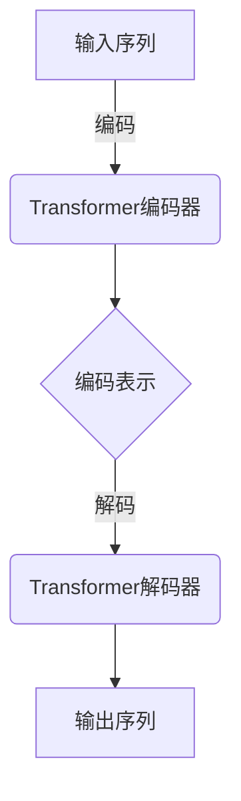
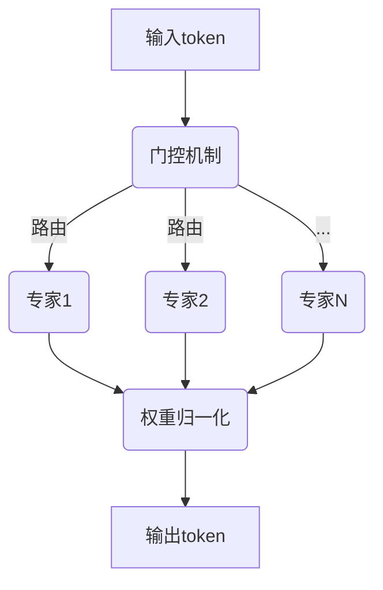

以下是题为《大语言模型原理基础与前沿 MoE与集成》的技术博客文章正文：

# 大语言模型原理基础与前沿 MoE与集成

## 1. 背景介绍

### 1.1 大语言模型的兴起

近年来,大型语言模型(Large Language Model,LLM)在自然语言处理(NLP)领域掀起了一场革命。从GPT-3到ChatGPT,这些基于海量语料训练的大型神经网络模型展现出了令人惊叹的语言理解和生成能力,在各种NLP任务上取得了卓越的表现。

大语言模型的关键优势在于其强大的上下文理解能力和泛化性能,可以在看似无关的领域中发现隐藏的联系,并生成富有创意和洞见的输出。这种通用性使得LLM可以应用于广泛的场景,如问答系统、写作辅助、代码生成等。

### 1.2 模型规模与计算资源挑战

然而,训练大型语言模型需要消耗大量的计算资源和存储空间。例如,GPT-3拥有1750亿个参数,其训练过程耗费了数十亿美元的算力成本。这种昂贵的计算成本无疑限制了大语言模型在工业界的广泛应用。

为了在保持模型性能的同时降低计算开销,研究人员提出了多种优化策略,其中最具代表性的是混合专家(Mixture of Experts,MoE)架构和模型集成(Model Ensemble)技术。

## 2. 核心概念与联系

### 2.1 大语言模型的基本架构

大语言模型通常采用Transformer的编码器-解码器架构,其中编码器对输入序列进行编码,解码器则根据编码信息生成目标序列。编码器和解码器均由多个相同的Transformer块组成,每个块包含多头自注意力(Multi-Head Attention)和前馈神经网络(Feed-Forward Neural Network)等核心组件。



### 2.2 MoE架构

MoE架构的核心思想是将模型的前馈神经网络层替换为多个专家(Expert)子网络,每个输入token只需要由少数相关专家处理,从而降低了计算量。具体来说,MoE架构包含以下几个关键组件:

- 门控(Gating)机制:决定每个token应该被路由到哪些专家进行处理
- 专家(Expert)子网络:负责对分配给它的token进行计算和处理
- 权重归一化(Weight Normalization):确保来自不同专家的输出在合并时具有相同的尺度



### 2.3 模型集成

模型集成是将多个独立训练的模型的预测结果进行组合,以获得比单个模型更好的性能。在大语言模型中,常见的集成方法包括:

- 简单平均(Simple Averaging)
- 加权平均(Weighted Averaging)
- 贝叶斯模型平均(Bayesian Model Averaging)
- 级联集成(Stacking Ensemble)

不同的集成策略对模型的泛化性能、鲁棒性和多样性等方面有不同的影响。

## 3. 核心算法原理具体操作步骤

### 3.1 MoE门控机制

MoE架构中,门控机制负责将每个输入token路由到合适的专家子网络。常见的门控算法包括:

1. **硬门控(Hard Gating)**:对每个token进行硬分配,即将其完全分配给一个专家子网络。
2. **软门控(Soft Gating)**:对每个token进行软分配,即将其分配给多个专家子网络,分配比例由门控值决定。

无论是硬门控还是软门控,门控值的计算都可以通过注意力机制实现。以硬门控为例,其具体步骤如下:

1. 计算token与每个专家的相关性分数:
   $$\text{relevance}_i = \mathbf{q}^\top \mathbf{k}_i$$
   其中$\mathbf{q}$为token的查询向量,$\mathbf{k}_i$为第$i$个专家的键向量。

2. 对相关性分数进行归一化,得到门控概率:
   $$p(z=i|\mathbf{x}) = \frac{\exp(\text{relevance}_i)}{\sum_j \exp(\text{relevance}_j)}$$

3. 根据门控概率,将token硬分配给概率最大的专家子网络进行处理。

### 3.2 模型集成算法

以下以加权平均集成为例,介绍模型集成的具体步骤:

1. 训练$N$个独立的大语言模型$\{M_1, M_2, \cdots, M_N\}$。
2. 对于每个输入$\mathbf{x}$,由各个模型生成预测结果$\{y_1, y_2, \cdots, y_N\}$。
3. 根据每个模型的权重$\{w_1, w_2, \cdots, w_N\}$,计算加权平均预测:
   $$y_\text{ensemble} = \sum_{i=1}^N w_i y_i$$
   其中$\sum_i w_i = 1$。
4. 将$y_\text{ensemble}$作为最终的集成预测结果输出。

模型权重$w_i$可以根据每个模型在验证集上的性能进行设置,也可以通过贝叶斯模型平均等方法自适应地学习得到。

## 4. 数学模型和公式详细讲解举例说明

### 4.1 MoE门控机制的数学模型

在MoE架构中,门控机制的作用是将每个输入token分配给一个或多个专家子网络进行处理。我们以硬门控为例,详细介绍其数学模型。

假设输入token的表示为$\mathbf{x}$,第$i$个专家子网络对应的键向量为$\mathbf{k}_i$,则token与第$i$个专家的相关性分数可表示为:

$$\text{relevance}_i = \mathbf{x}^\top \mathbf{k}_i$$

相关性分数越大,说明token与该专家的相关性越高。为了将token分配给最相关的专家,我们需要对相关性分数进行归一化,得到门控概率:

$$p(z=i|\mathbf{x}) = \frac{\exp(\text{relevance}_i)}{\sum_j \exp(\text{relevance}_j)}$$

其中$z$表示门控变量,即token被分配给哪个专家。根据门控概率的大小,我们可以将token硬分配给概率最大的专家子网络进行处理。

以上是硬门控机制的数学模型。对于软门控,我们可以直接将门控概率作为token分配给各个专家的权重,从而实现软分配。

### 4.2 模型集成的数学模型

在模型集成中,我们需要将多个独立训练的模型的预测结果进行组合,以获得更好的泛化性能。加权平均集成是一种常见的集成方法,其数学模型如下:

假设我们有$N$个独立训练的模型$\{M_1, M_2, \cdots, M_N\}$,对于输入$\mathbf{x}$,每个模型都会生成一个预测结果$y_i$。我们可以对这些预测结果进行加权平均,得到集成预测:

$$y_\text{ensemble} = \sum_{i=1}^N w_i y_i$$

其中$w_i$是第$i$个模型的权重,满足$\sum_i w_i = 1$。

权重$w_i$可以根据每个模型在验证集上的性能进行设置,也可以通过贝叶斯模型平均等方法自适应地学习得到。例如,在贝叶斯模型平均中,我们假设每个模型的预测服从高斯分布,并根据数据对模型权重和方差进行贝叶斯估计。

通过加权平均集成,我们可以有效地融合多个模型的优点,提高预测的准确性和鲁棒性。

## 5. 项目实践:代码实例和详细解释说明

为了更好地理解MoE架构和模型集成技术,我们提供了一个基于PyTorch的代码示例,实现了一个简单的MoE模型和加权平均集成。

### 5.1 MoE模型实现

```python
import torch
import torch.nn as nn

class MoELayer(nn.Module):
    def __init__(self, d_model, num_experts, expert_capacity):
        super().__init__()
        self.num_experts = num_experts
        self.expert_capacity = expert_capacity
        self.gate = nn.Linear(d_model, num_experts)
        self.experts = nn.ModuleList([nn.Linear(d_model, d_model) for _ in range(num_experts)])
        
    def forward(self, x):
        # 计算门控值
        gate_scores = self.gate(x)
        
        # 硬门控
        gate_probs = nn.functional.gumbel_softmax(gate_scores, hard=True, dim=-1)
        
        # 分配token给专家
        expert_inputs = torch.split(x, self.expert_capacity, dim=0)
        expert_outputs = []
        for i, expert in enumerate(self.experts):
            expert_output = expert(expert_inputs[i])
            expert_outputs.append(expert_output)
        
        # 合并专家输出
        output = torch.cat(expert_outputs, dim=0)
        
        return output
```

在这个实现中,我们定义了一个`MoELayer`模块,包含以下几个关键组件:

- `gate`:一个线性层,用于计算每个token与各个专家的相关性分数。
- `experts`:一个线性层列表,每个线性层对应一个专家子网络。
- `forward`函数:实现了MoE的前向传播过程,包括门控值计算、硬门控分配、专家处理和输出合并等步骤。

在`forward`函数中,我们首先使用`gate`计算每个token与各个专家的相关性分数。然后,我们使用Gumbel Softmax技术进行硬门控,将每个token完全分配给一个专家子网络。接下来,我们将输入token按照分配结果分割成多个子批次,并分别送入对应的专家子网络进行处理。最后,我们将各个专家的输出合并,得到最终的MoE层输出。

### 5.2 模型集成实现

```python
import torch
import torch.nn as nn

class EnsembleModel(nn.Module):
    def __init__(self, models, weights=None):
        super().__init__()
        self.models = nn.ModuleList(models)
        if weights is None:
            weights = [1 / len(models)] * len(models)
        self.weights = nn.Parameter(torch.tensor(weights), requires_grad=True)
        
    def forward(self, x):
        outputs = [model(x) for model in self.models]
        weighted_outputs = [w * output for w, output in zip(self.weights, outputs)]
        ensemble_output = sum(weighted_outputs)
        return ensemble_output
```

在这个实现中,我们定义了一个`EnsembleModel`模块,用于将多个独立训练的模型进行集成。该模块包含以下组件:

- `models`:一个模型列表,存储要进行集成的多个模型。
- `weights`:一个可训练的张量,表示每个模型在集成中的权重。

在`forward`函数中,我们首先通过各个模型获取输入`x`的预测结果。然后,我们将每个模型的预测结果与对应的权重相乘,得到加权预测。最后,我们对加权预测求和,得到最终的集成输出。

需要注意的是,在这个实现中,我们将模型权重`weights`设置为可训练的参数,这意味着在训练过程中,权重会根据数据自适应地进行调整,以获得最优的集成性能。

### 5.3 使用示例

以下是一个使用上述MoE模型和集成模型的示例:

```python
# 定义模型
moe_layer = MoELayer(d_model=512, num_experts=8, expert_capacity=64)
model1 = nn.Sequential(nn.Linear(10, 512), moe_layer, nn.Linear(512, 1))
model2 = nn.Sequential(nn.Linear(10, 512), moe_layer, nn.Linear(512, 1))

# 定义集成模型
ensemble_model = EnsembleModel([model1, model2])

# 前向传播
x = torch.randn(128, 10)
output = ensemble_model(x)
```

在这个示例中,我们首先定义了两个包含MoE层