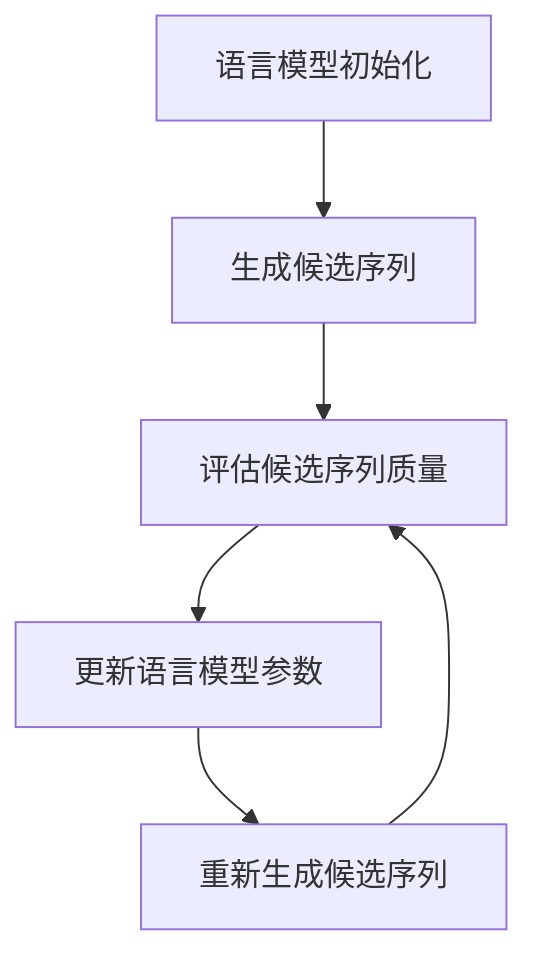

# 大语言模型原理基础与前沿 全局最优分配

## 1.背景介绍

### 1.1 语言模型的重要性

语言模型在自然语言处理领域扮演着关键角色。它们旨在捕捉语言的统计规律,并对句子或文本序列的概率分布进行建模。高质量的语言模型对于诸多任务至关重要,包括机器翻译、语音识别、文本生成、信息检索等。

随着深度学习技术的快速发展,基于神经网络的大型语言模型(Large Language Models,LLMs)近年来取得了令人瞩目的进展。这些模型能够从海量文本数据中学习丰富的语言知识,并展现出惊人的泛化能力,在各种自然语言处理任务中取得了超越人类的表现。

### 1.2 大语言模型的挑战

尽管大语言模型取得了巨大成功,但它们也面临着一些重大挑战:

1. **训练数据偏差**: 模型训练所使用的数据可能存在偏差,导致模型输出具有潜在的偏见或不当内容。
2. **缺乏因果推理能力**: 大多数现有模型缺乏对因果关系的深入理解,难以进行复杂的推理和决策。
3. **解释性差**: 大型语言模型通常被视为"黑箱",很难解释其内部决策机制。
4. **计算资源需求大**: 训练这些庞大的模型需要大量的计算资源,导致高昂的成本和碳排放。

为了应对这些挑战,研究人员一直在探索各种新颖的模型架构和训练策略,其中全局最优分配(Global Optimal Allocation)便是一种极具前景的方法。

## 2.核心概念与联系

### 2.1 语言模型基础

语言模型的核心任务是估计一个文本序列的概率。形式化地,给定一个长度为 $T$ 的词序列 $\boldsymbol{x} = (x_1, x_2, \ldots, x_T)$,语言模型的目标是计算该序列的概率 $P(\boldsymbol{x})$。根据链式法则,该概率可以分解为:

$$P(\boldsymbol{x}) = \prod_{t=1}^T P(x_t | x_1, \ldots, x_{t-1})$$

其中 $P(x_t | x_1, \ldots, x_{t-1})$ 表示在给定前 $t-1$ 个词的情况下,第 $t$ 个词 $x_t$ 出现的条件概率。

神经网络语言模型通常采用序列到序列(Sequence-to-Sequence,Seq2Seq)的架构,使用编码器(Encoder)来捕获上下文信息,解码器(Decoder)则根据上下文和已生成的词序列来预测下一个词。

### 2.2 全局最优分配概念

全局最优分配(Global Optimal Allocation)是一种新兴的语言模型训练范式,旨在直接优化生成文本序列的全局质量,而不是局部词预测的准确性。

传统语言模型通过最大化每个词的条件概率来进行训练,这可能会导致生成的文本在局部上看起来合理,但在全局上缺乏连贯性和一致性。相比之下,全局最优分配直接优化生成文本序列的期望质量,以产生更加流畅、连贯和符合上下文的输出。

全局最优分配的核心思想是将语言生成建模为一个序列级别的优化问题,目标是最大化生成序列的期望质量分数。这种方法通过引入一个评估函数(Evaluator),直接优化生成序列的质量,而不是局部词预测的准确性。

该范式的关键在于如何设计高质量的评估函数,并将其与语言模型的训练过程相结合。一种常见的方法是使用基于人工标注的评估指标(如 BLEU、ROUGE 等)作为评估函数,并通过强化学习或其他优化技术来最大化该指标。

### 2.3 全局最优分配与其他方法的联系

全局最优分配与其他一些语言模型训练范式存在一定的联系:

- **强化学习**: 全局最优分配可以被视为一种序列级别的强化学习问题,其中评估函数扮演了奖励函数的角色。
- **对抗训练**: 一些全局最优分配方法采用对抗训练的思路,通过生成对抗样本来提高模型的鲁棒性。
- **基于能量的模型**: 全局最优分配可以被看作是一种基于能量的模型,其中评估函数定义了序列的能量或质量分数。

尽管全局最优分配具有独特的优势,但它也面临着一些挑战,如评估函数的设计、训练稳定性和计算效率等。研究人员正在探索各种新颖的技术来解决这些问题,以充分发挥全局最优分配的潜力。

## 3.核心算法原理具体操作步骤

全局最优分配的核心算法原理可以概括为以下几个主要步骤:

1. **语言模型初始化**: 首先,我们需要初始化一个基准的语言模型,通常采用序列到序列(Seq2Seq)的架构。该模型将被用于生成候选文本序列。

2. **生成候选序列**: 使用当前的语言模型生成一组候选文本序列。这可以通过贪婪解码(Greedy Decoding)、束搜索(Beam Search)或其他解码策略来实现。

3. **评估候选序列质量**: 对生成的每个候选序列,使用预定义的评估函数(Evaluator)来计算其质量分数。评估函数可以是基于人工标注的指标(如 BLEU、ROUGE 等),也可以是基于人工设计的规则或其他方法。

4. **更新语言模型参数**: 根据候选序列的质量分数,使用优化算法(如策略梯度、进化策略等)来更新语言模型的参数,以最大化生成序列的期望质量。

5. **重新生成候选序列**: 使用更新后的语言模型重新生成一组新的候选序列,然后重复步骤 3 和 4,直到达到预定的训练迭代次数或收敛条件。

在实际应用中,全局最优分配算法可能会采用一些变体和扩展,以提高训练效率和性能。例如,可以引入基于注意力的机制来加强模型对评估函数的关注度,或者采用多阶段训练策略来分阶段优化不同的目标。

## 4.数学模型和公式详细讲解举例说明

在全局最优分配框架中,我们需要定义一个评估函数(Evaluator) $r(\boldsymbol{x}, \boldsymbol{y})$ 来衡量生成序列 $\boldsymbol{x}$ 相对于参考序列 $\boldsymbol{y}$ 的质量。评估函数的设计对模型的性能有着重大影响。

### 4.1 基于 BLEU 的评估函数

BLEU (Bilingual Evaluation Understudy) 是一种常用的机器翻译评估指标,它基于 n-gram 的精确度和惩罚因子来衡量生成序列与参考序列之间的相似性。对于一个语料库 $\mathcal{D}$ 中的每个样本 $(\boldsymbol{x}, \boldsymbol{y})$,BLEU 分数可以表示为:

$$\text{BLEU}(\boldsymbol{x}, \boldsymbol{y}) = \text{BP} \cdot \exp\left(\sum_{n=1}^N w_n \log p_n(\boldsymbol{x}, \boldsymbol{y})\right)$$

其中 $p_n(\boldsymbol{x}, \boldsymbol{y})$ 是生成序列 $\boldsymbol{x}$ 中 n-gram 的精确度,与参考序列 $\boldsymbol{y}$ 中 n-gram 的计数有关; $w_n$ 是 n-gram 的权重; $N$ 是最大 n-gram 的长度; $\text{BP}$ 是一个惩罚因子,用于惩罚过短的生成序列。

在全局最优分配中,我们可以将 BLEU 分数直接用作评估函数:

$$r(\boldsymbol{x}, \boldsymbol{y}) = \text{BLEU}(\boldsymbol{x}, \boldsymbol{y})$$

目标是最大化语料库 $\mathcal{D}$ 中所有样本的期望 BLEU 分数:

$$\mathbb{E}_{\boldsymbol{x} \sim p_\theta}[r(\boldsymbol{x}, \boldsymbol{y})] = \mathbb{E}_{\boldsymbol{x} \sim p_\theta}[\text{BLEU}(\boldsymbol{x}, \boldsymbol{y})]$$

其中 $p_\theta$ 是由参数 $\theta$ 参数化的语言模型,用于生成序列 $\boldsymbol{x}$。

### 4.2 基于 ROUGE 的评估函数

ROUGE (Recall-Oriented Understudy for Gisting Evaluation) 是另一种常用的文本摘要评估指标,它基于 n-gram 的召回率来衡量生成序列与参考序列之间的相似性。ROUGE-N 是 ROUGE 指标家族中的一种,它计算 n-gram 的召回率:

$$\text{ROUGE-N}(\boldsymbol{x}, \boldsymbol{y}) = \frac{\sum_{\text{gram}_n \in \boldsymbol{x}} \text{Count}_\text{match}(\text{gram}_n)}{\sum_{\text{gram}_n \in \boldsymbol{y}} \text{Count}(\text{gram}_n)}$$

其中 $\text{Count}_\text{match}(\text{gram}_n)$ 是生成序列 $\boldsymbol{x}$ 中与参考序列 $\boldsymbol{y}$ 相匹配的 n-gram 的计数,而 $\text{Count}(\text{gram}_n)$ 是参考序列 $\boldsymbol{y}$ 中 n-gram 的计数。

在全局最优分配中,我们可以将 ROUGE-N 分数作为评估函数:

$$r(\boldsymbol{x}, \boldsymbol{y}) = \text{ROUGE-N}(\boldsymbol{x}, \boldsymbol{y})$$

目标是最大化语料库 $\mathcal{D}$ 中所有样本的期望 ROUGE-N 分数:

$$\mathbb{E}_{\boldsymbol{x} \sim p_\theta}[r(\boldsymbol{x}, \boldsymbol{y})] = \mathbb{E}_{\boldsymbol{x} \sim p_\theta}[\text{ROUGE-N}(\boldsymbol{x}, \boldsymbol{y})]$$

### 4.3 基于规则的评估函数

除了基于人工标注的指标,我们还可以设计基于规则的评估函数,以捕捉特定的语言特征或约束。例如,在对话系统中,我们可能希望生成的回复是相关、多样且具有一致的情感倾向。因此,我们可以定义一个综合评估函数:

$$r(\boldsymbol{x}, \boldsymbol{y}) = \alpha_1 \text{Relevance}(\boldsymbol{x}, \boldsymbol{y}) + \alpha_2 \text{Diversity}(\boldsymbol{x}) + \alpha_3 \text{SentimentConsistency}(\boldsymbol{x}, \boldsymbol{y})$$

其中 $\text{Relevance}(\boldsymbol{x}, \boldsymbol{y})$ 衡量生成序列 $\boldsymbol{x}$ 与上下文 $\boldsymbol{y}$ 的相关性,可以使用语义相似度等指标计算; $\text{Diversity}(\boldsymbol{x})$ 衡量生成序列的多样性,可以使用 n-gram 熵等指标计算; $\text{SentimentConsistency}(\boldsymbol{x}, \boldsymbol{y})$ 衡量生成序列与上下文的情感倾向是否一致,可以使用情感分析模型计算; $\alpha_1$、$\alpha_2$ 和 $\alpha_3$ 是各项指标的权重系数。

通过定制化的评估函数,我们可以更好地控制生成序列的特定属性,从而满足不同任务的需求。

## 5.项目实践:代码实例和详细解释说明

在本节,我们将提供一个基于 PyTorch 的代码示例,演示如何使用全局最优分配来训练一个简单的语言模型。为了便于说明,我们将使用 BLEU 作为评估函数,并采用策略梯度 (Policy Gradient) 算法进行