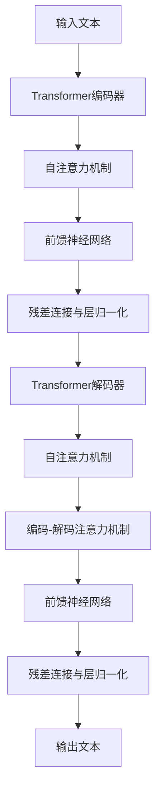

# 大语言模型原理基础与前沿 具有代表性的语言模型

## 1. 背景介绍
### 1.1 大语言模型的发展历程
#### 1.1.1 早期的语言模型
#### 1.1.2 神经网络语言模型的兴起
#### 1.1.3 Transformer 的革命性突破
### 1.2 大语言模型的应用场景
#### 1.2.1 自然语言处理任务
#### 1.2.2 对话系统与问答系统
#### 1.2.3 文本生成与创作
### 1.3 大语言模型面临的挑战
#### 1.3.1 计算资源需求
#### 1.3.2 数据质量与偏见
#### 1.3.3 可解释性与可控性

## 2. 核心概念与联系
### 2.1 语言模型的定义
#### 2.1.1 统计语言模型
#### 2.1.2 神经网络语言模型
### 2.2 自注意力机制与 Transformer
#### 2.2.1 自注意力机制的原理
#### 2.2.2 Transformer 的结构与创新
### 2.3 预训练与微调
#### 2.3.1 无监督预训练
#### 2.3.2 有监督微调
### 2.4 知识蒸馏与模型压缩
#### 2.4.1 知识蒸馏的概念
#### 2.4.2 模型压缩技术

## 3. 核心算法原理具体操作步骤
### 3.1 Transformer 的编码器-解码器结构
#### 3.1.1 编码器的自注意力层
#### 3.1.2 解码器的自注意力层与交叉注意力层
#### 3.1.3 前馈神经网络层
### 3.2 自注意力机制的计算过程
#### 3.2.1 查询、键、值的计算
#### 3.2.2 注意力权重的计算
#### 3.2.3 注意力输出的计算
### 3.3 位置编码
#### 3.3.1 绝对位置编码
#### 3.3.2 相对位置编码
### 3.4 预训练目标与损失函数
#### 3.4.1 语言模型目标
#### 3.4.2 去噪自编码目标
#### 3.4.3 对比学习目标

## 4. 数学模型和公式详细讲解举例说明
### 4.1 自注意力机制的数学表示
#### 4.1.1 查询、键、值的线性变换
#### 4.1.2 注意力权重的 Softmax 归一化
#### 4.1.3 注意力输出的加权求和
### 4.2 Transformer 的前馈神经网络层
#### 4.2.1 前馈神经网络的数学表示
#### 4.2.2 残差连接与层归一化
### 4.3 位置编码的数学表示
#### 4.3.1 正弦余弦位置编码
#### 4.3.2 可学习的位置编码
### 4.4 损失函数的数学表示
#### 4.4.1 交叉熵损失函数
#### 4.4.2 均方误差损失函数

## 5. 项目实践：代码实例和详细解释说明
### 5.1 使用 PyTorch 实现 Transformer
#### 5.1.1 编码器的实现
#### 5.1.2 解码器的实现
#### 5.1.3 Transformer 的完整实现
### 5.2 使用 TensorFlow 实现 BERT
#### 5.2.1 BERT 的输入表示
#### 5.2.2 BERT 的预训练任务
#### 5.2.3 BERT 的微调与应用
### 5.3 使用 Hugging Face 的 Transformers 库
#### 5.3.1 加载预训练模型
#### 5.3.2 微调预训练模型
#### 5.3.3 使用微调后的模型进行推理

## 6. 实际应用场景
### 6.1 机器翻译
#### 6.1.1 基于 Transformer 的神经机器翻译
#### 6.1.2 多语言机器翻译
### 6.2 文本摘要
#### 6.2.1 抽取式文本摘要
#### 6.2.2 生成式文本摘要
### 6.3 情感分析
#### 6.3.1 基于 BERT 的情感分类
#### 6.3.2 细粒度情感分析
### 6.4 命名实体识别
#### 6.4.1 基于 BERT 的命名实体识别
#### 6.4.2 嵌套命名实体识别

## 7. 工具和资源推荐
### 7.1 开源工具包
#### 7.1.1 Hugging Face Transformers
#### 7.1.2 OpenAI GPT
#### 7.1.3 Google BERT
### 7.2 预训练模型
#### 7.2.1 BERT 系列模型
#### 7.2.2 GPT 系列模型
#### 7.2.3 XLNet 与 RoBERTa
### 7.3 数据集
#### 7.3.1 通用语料库
#### 7.3.2 任务特定数据集
### 7.4 计算资源
#### 7.4.1 GPU 与 TPU
#### 7.4.2 云计算平台

## 8. 总结：未来发展趋势与挑战
### 8.1 模型规模的持续增长
#### 8.1.1 参数量的增加
#### 8.1.2 计算效率的提升
### 8.2 多模态语言模型
#### 8.2.1 文本-图像语言模型
#### 8.2.2 文本-语音语言模型
### 8.3 知识增强语言模型
#### 8.3.1 外部知识的融合
#### 8.3.2 常识推理能力
### 8.4 可解释性与可控性
#### 8.4.1 注意力可视化
#### 8.4.2 可控文本生成

## 9. 附录：常见问题与解答
### 9.1 如何选择合适的预训练模型？
### 9.2 如何处理不同语言的文本？
### 9.3 如何平衡模型性能与计算资源？
### 9.4 如何解决训练过程中的梯度消失与梯度爆炸问题？
### 9.5 如何应对数据隐私与安全问题？

大语言模型是自然语言处理领域近年来最引人注目的突破之一。从早期的统计语言模型到神经网络语言模型，再到 Transformer 的革命性创新，大语言模型在各种自然语言处理任务中取得了显著的性能提升。本文将深入探讨大语言模型的原理基础与前沿进展，重点介绍具有代表性的语言模型及其应用。

大语言模型的核心概念是通过学习大规模文本数据来建立对语言的理解和生成能力。传统的统计语言模型基于词频统计和 n-gram 模型，而神经网络语言模型则利用神经网络的强大表示能力来捕捉语言的复杂特征。Transformer 的出现标志着大语言模型的重大突破，它引入了自注意力机制，能够有效地捕捉长距离依赖关系，并且通过预训练和微调的方式实现了在各种下游任务上的出色表现。

在 Transformer 的基础上，研究者们提出了一系列改进和创新，如 BERT、GPT、XLNet 等模型。这些模型在编码器-解码器结构、预训练目标、位置编码等方面进行了优化，进一步提升了大语言模型的性能。同时，知识蒸馏和模型压缩技术的发展也使得大语言模型能够在资源受限的环境中得到应用。

本文将详细阐述 Transformer 的核心算法原理，包括自注意力机制的计算过程、位置编码的实现方式以及预训练目标与损失函数的设计。通过数学模型和公式的详细讲解，读者将对大语言模型的内部工作原理有更深入的理解。同时，本文还将提供使用 PyTorch、TensorFlow 等主流深度学习框架实现大语言模型的代码实例，并对其进行详细的解释说明。

大语言模型在实际应用中展现出了巨大的潜力。机器翻译、文本摘要、情感分析、命名实体识别等任务都能够利用大语言模型的强大表示能力获得显著的性能提升。本文将介绍大语言模型在这些应用场景中的具体实践，并讨论如何针对不同任务进行模型的微调和优化。

为了帮助读者更好地掌握大语言模型的相关知识和技能，本文还将推荐一系列实用的工具和资源，包括开源工具包、预训练模型、数据集以及计算资源。这些资源将为读者提供便利，助力其在大语言模型领域的研究和应用。

展望未来，大语言模型的发展趋势包括模型规模的持续增长、多模态语言模型的兴起、知识增强语言模型的探索以及可解释性与可控性的提升。这些发展方向将进一步拓展大语言模型的应用边界，使其在更广泛的场景中发挥作用。同时，大语言模型也面临着计算资源需求、数据质量与偏见、可解释性与可控性等挑战，需要研究者们持续努力来应对。

最后，本文还将在附录中解答一些常见的问题，如如何选择合适的预训练模型、如何处理不同语言的文本、如何平衡模型性能与计算资源等。这些问题的解答将为读者提供实用的指导，帮助其更好地应用大语言模型。

总之，大语言模型是自然语言处理领域的重要里程碑，其原理基础与前沿进展值得每一位研究者和从业者深入了解和学习。通过本文的介绍，读者将对大语言模型有全面而深入的认识，并能够将其应用于实际的自然语言处理任务中，推动人工智能技术的发展与进步。



上图展示了 Transformer 的核心架构，包括编码器和解码器两个部分。编码器通过自注意力机制和前馈神经网络对输入文本进行编码，捕捉其中的语义信息。解码器同样使用自注意力机制，并引入编码-解码注意力机制，将编码器的输出作为上下文信息，生成目标文本。残差连接与层归一化用于稳定训练过程并加速收敛。

下面是使用 PyTorch 实现 Transformer 编码器的示例代码：

```python
import torch
import torch.nn as nn

class TransformerEncoder(nn.Module):
    def __init__(self, d_model, nhead, dim_feedforward, num_layers):
        super(TransformerEncoder, self).__init__()
        self.encoder_layer = nn.TransformerEncoderLayer(d_model, nhead, dim_feedforward)
        self.encoder = nn.TransformerEncoder(self.encoder_layer, num_layers)
        
    def forward(self, src):
        output = self.encoder(src)
        return output
```

在上述代码中，`TransformerEncoder` 类继承自 `nn.Module`，实现了 Transformer 的编码器部分。它包含了若干个 `TransformerEncoderLayer`，每个层由自注意力机制和前馈神经网络组成。通过调用 `forward` 方法，输入文本经过编码器的处理，得到编码后的表示。

大语言模型在学术研究和工业应用中都取得了广泛的成功。以 Google 的 BERT 模型为例，它在多个自然语言处理基准测试中刷新了当时的最佳成绩，展示了预训练语言模型的强大能力。微软、Facebook 等科技巨头也纷纷推出了自己的大语言模型，如 Turing-NLG、RoBERTa 等，进一步推动了自然语言处理技术的发展。

未来，大语言模型的发展空间依然广阔。随着计算能力的提升和数据规模的扩大，我们有望看到更加强大、更加通用的语言模型的出现。同时，将语言模型与知识库、常识推理等技术相结合，有望赋予模型更强的理解和生成能力。此外，提高语言模型的可解释性和可控性也是未来的重要研究方向，这将有助于我们更好地理解模型的内部工作机制，并实现对生成结果的精细控