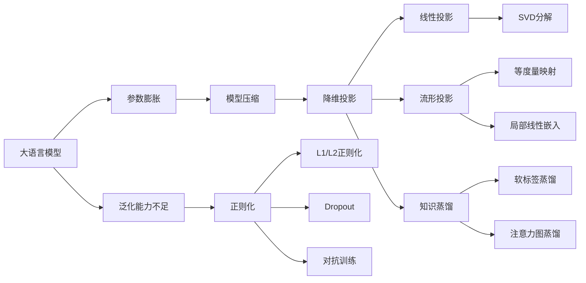

# 大语言模型原理基础与前沿 基于投影和正则化的方法

## 1. 背景介绍
### 1.1 大语言模型的发展历程
#### 1.1.1 早期的统计语言模型
#### 1.1.2 神经网络语言模型的兴起
#### 1.1.3 Transformer架构的革命性突破
### 1.2 大语言模型面临的挑战
#### 1.2.1 模型参数规模急剧膨胀  
#### 1.2.2 训练和推理的计算资源瓶颈
#### 1.2.3 模型泛化能力和鲁棒性有待提高
### 1.3 基于投影和正则化的大语言模型改进方法概述
#### 1.3.1 降维投影减小模型参数规模
#### 1.3.2 正则化方法提高模型泛化性
#### 1.3.3 投影和正则化的结合应用

## 2. 核心概念与联系
### 2.1 大语言模型的定义与架构
#### 2.1.1 语言模型的定义与目标
#### 2.1.2 Transformer编码器-解码器架构
#### 2.1.3 自注意力机制与前馈神经网络
### 2.2 降维投影技术原理
#### 2.2.1 线性降维投影
#### 2.2.2 非线性流形投影
#### 2.2.3 基于知识蒸馏的投影
### 2.3 正则化方法分类
#### 2.3.1 L1和L2正则化
#### 2.3.2 Dropout正则化
#### 2.3.3 对抗训练正则化
### 2.4 投影与正则化的关系与结合
#### 2.4.1 降维投影与模型压缩
#### 2.4.2 正则化与模型泛化
#### 2.4.3 投影正则化联合优化框架

## 3. 核心算法原理具体操作步骤
### 3.1 基于SVD的线性投影算法
#### 3.1.1 SVD分解原理
#### 3.1.2 基于SVD的Embedding层投影
#### 3.1.3 基于SVD的注意力机制投影
### 3.2 基于流形学习的非线性投影算法  
#### 3.2.1 流形学习的数学基础
#### 3.2.2 等度量映射投影
#### 3.2.3 局部线性嵌入投影
### 3.3 基于知识蒸馏的投影算法
#### 3.3.1 知识蒸馏的原理 
#### 3.3.2 基于软标签蒸馏的投影
#### 3.3.3 基于注意力图蒸馏的投影
### 3.4 L1和L2正则化算法
#### 3.4.1 L1和L2正则化项的定义
#### 3.4.2 基于L1和L2正则化的目标函数设计
#### 3.4.3 L1和L2正则化的优化算法
### 3.5 Dropout正则化算法
#### 3.5.1 Dropout正则化原理
#### 3.5.2 Embedding层Dropout
#### 3.5.3 注意力机制Dropout
### 3.6 对抗训练正则化算法
#### 3.6.1 对抗训练原理
#### 3.6.2 基于梯度惩罚的对抗训练
#### 3.6.3 基于对抗样本的对抗训练

## 4. 数学模型和公式详细讲解举例说明
### 4.1 SVD投影的数学模型与公式推导
### 4.2 流形投影中的测地距离与黎曼度量
### 4.3 知识蒸馏目标函数的设计与优化
### 4.4 L1和L2正则化项的凸优化分析
### 4.5 Dropout正则化的数学期望与方差分析
### 4.6 对抗训练中的鞍点优化与梯度惩罚项设计

## 5. 项目实践：代码实例和详细解释说明
### 5.1 基于PyTorch实现SVD投影层
### 5.2 使用TensorFlow实现流形投影算法
### 5.3 基于Hugging Face的知识蒸馏投影实践
### 5.4 在BERT中加入L1和L2正则化项
### 5.5 对GPT模型应用Dropout正则化
### 5.6 使用对抗训练提升RoBERTa的鲁棒性

## 6. 实际应用场景
### 6.1 大规模预训练语言模型的参数压缩
### 6.2 低资源场景下的小样本学习
### 6.3 提高语言模型的域适应能力
### 6.4 降低语言模型的过拟合风险
### 6.5 提升语言模型的对抗攻击防御能力

## 7. 工具和资源推荐
### 7.1 常用的深度学习框架
#### 7.1.1 PyTorch
#### 7.1.2 TensorFlow
#### 7.1.3 MindSpore
### 7.2 预训练语言模型开源实现
#### 7.2.1 Hugging Face Transformers库
#### 7.2.2 Google BERT 
#### 7.2.3 Facebook RoBERTa
### 7.3 模型压缩工具包
#### 7.3.1 微软NNI
#### 7.3.2 谷歌 TensorFlow Model Optimization
### 7.4 推荐学习资源
#### 7.4.1 《深度学习》书籍
#### 7.4.2 吴恩达《机器学习》课程
#### 7.4.3 CS224n 自然语言处理课程

## 8. 总结：未来发展趋势与挑战
### 8.1 大语言模型参数规模的扩展趋势
### 8.2 基于投影和正则化改进的局限性
### 8.3 联邦学习和隐私保护的需求
### 8.4 绿色环保AI的呼唤
### 8.5 打造可解释可信任的语言模型

## 9. 附录：常见问题与解答  
### 9.1 如何权衡投影和正则化的比重？
### 9.2 投影正则化方法对推理速度的影响？
### 9.3 如何选择合适的投影维度和正则化系数？
### 9.4 投影正则化方法在其他NLP任务中的应用前景？
### 9.5 投影正则化与模型蒸馏的异同比较？

大语言模型是自然语言处理领域近年来最引人瞩目的研究热点之一。从ELMo、GPT到BERT、XLNet等，大语言模型在多个NLP任务上取得了突破性的进展，展现出强大的语言理解和生成能力。然而，随着模型架构的日益复杂和参数规模的急剧膨胀，大语言模型也面临着诸多挑战，如训练和推理的计算资源瓶颈，模型泛化能力和鲁棒性有待提高等。

为了应对这些挑战，研究者们提出了许多改进方法，其中基于投影和正则化的方法备受关注。投影方法通过对模型的权重矩阵或特征向量进行降维映射，在保留重要信息的同时大幅减小模型参数规模。常见的投影技术包括线性投影如奇异值分解(SVD)，非线性流形投影如局部线性嵌入(LLE)，以及基于知识蒸馏的投影等。正则化方法通过在目标函数中引入惩罚项，限制模型权重的大小或分布，从而提高模型的泛化性能，降低过拟合风险。代表性的正则化方法有L1和L2正则化，Dropout，以及对抗训练等。

投影和正则化分别从参数压缩和泛化性提升的角度改进大语言模型，二者相辅相成，可以结合起来联合优化。比如，可以先用SVD投影初步减小模型规模，再对投影后的紧凑模型施加L2正则化和Dropout，同时提高模型的泛化能力。再比如，可以利用知识蒸馏投影从大型教师模型中提取知识，蒸馏到规模更小的学生模型，再在学生模型上进行对抗训练，使其更鲁棒。

在算法实现上，SVD投影可以对Embedding层和注意力机制的权重矩阵进行分解，用左右奇异向量的前k个分量重构出降维后的矩阵。流形投影可以用黎曼度量替代欧氏度量来描述词向量空间的内在几何结构，通过等度量映射或局部线性嵌入等方法得到低维流形。知识蒸馏投影可以利用软标签或注意力图等蒸馏信号，引导学生模型去模仿教师模型的输出分布或注意力模式。L1和L2正则化在目标函数中分别添加权重绝对值之和或平方和，利用梯度下降法优化。Dropout通过在Embedding层和注意力层随机屏蔽一部分神经元，抑制神经元之间的共适应。对抗训练引入扰动项去最大化目标函数，增强模型抵御对抗攻击的能力。

在实践中，可以使用PyTorch、TensorFlow等主流深度学习框架，调用Hugging Face的Transformers库中的预训练语言模型如BERT、GPT等，通过在这些模型上添加投影层和正则化项，来实现改进后的模型。以BERT为例，可以在Embedding层和注意力层后面插入SVD矩阵分解，在预训练和微调时施加L2正则化，在前馈层应用Dropout，在对抗训练时添加扰动项。

投影和正则化改进方法在诸多实际场景中大有可为。在大规模预训练语言模型中，它们可以帮助减小模型体积，加快训练和推理速度。在低资源的小样本学习中，正则化有助于防止过拟合，提高泛化性能。在模型迁移和域自适应中，投影有利于自适应地调整特征空间。在模型的安全和隐私保护中，对抗训练可以增强模型的鲁棒性。

展望未来，大语言模型的参数规模仍将持续扩展，对算力资源提出更高要求，同时也对模型压缩技术提出新的挑战。尽管投影和正则化方法取得了可喜的进展，但它们仍然存在一些局限性，如投影方法保留重要信息的同时也可能损失掉一些有价值的细节，正则化方法在提高泛化性的同时也可能限制模型的表达能力。此外，随着隐私保护和绿色环保AI的呼声日益高涨，亟需在联邦学习框架下开发分布式的投影和正则化算法，在提高模型性能的同时兼顾数据隐私和能耗优化。未来，打造更加高效、鲁棒、可解释、可信任的大语言模型，仍然任重道远。

作者：禅与计算机程序设计艺术 / Zen and the Art of Computer Programming