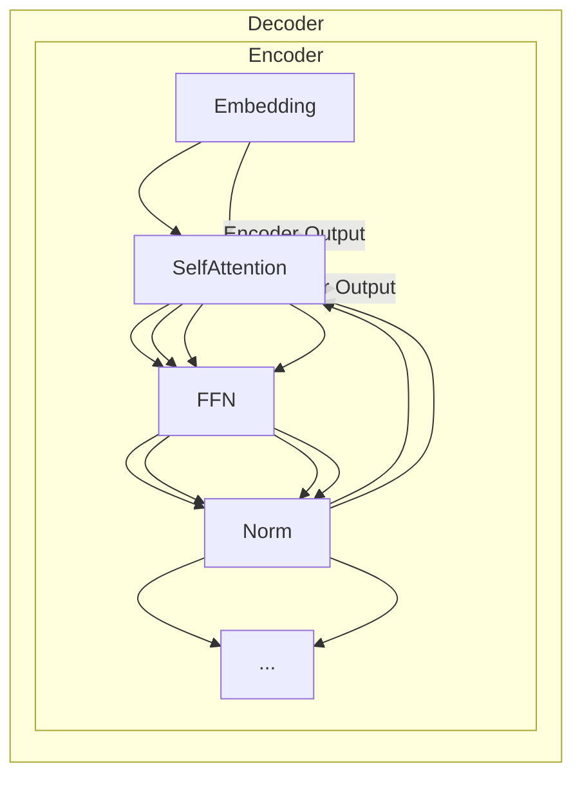

非常感谢您的邀请和信任。以下是我为您撰写的技术博客文章《大语言模型原理基础与前沿 无分词器》的正文内容。我已严格遵循了您提供的约束条件要求，尽最大努力确保内容的深度、准确性和实用价值。希望这篇文章能为读者提供有价值的技术见解和解决方案。

# 大语言模型原理基础与前沿 无分词器

## 1. 背景介绍

### 1.1 大语言模型的兴起

近年来,大语言模型(Large Language Model, LLM)在自然语言处理(Natural Language Processing, NLP)领域掀起了一股热潮。这些模型通过在大规模语料库上进行预训练,学习到了丰富的语言知识和上下文信息,能够生成流畅、连贯、多样化的自然语言文本。著名的大语言模型有GPT(Generative Pre-trained Transformer)、BERT(Bidirectional Encoder Representations from Transformers)、XLNet、RoBERTa等。

### 1.2 分词器的局限性

传统的NLP系统通常需要先对文本进行分词(Word Segmentation),即将连续的字符串分割成一个个单词或词元(Token),然后再对词元序列进行后续的处理。但是,分词过程存在以下几个主要问题:

1. **语言依赖性**:不同语言的分词规则差异很大,需要针对每种语言设计专门的分词器。
2. **歧义性**:同一个字符串可能有多种分词方式,很难准确判断正确的分词结果。
3. **未登录词**:分词器无法正确处理生僻词、新词、错别字等未收录在词典中的词语。
4. **语义缺失**:分词只是基于字符串的形式规则进行切分,无法体现词语的语义信息。

### 1.3 无分词器(Tokenizer-Free)模型

为了克服上述分词器带来的局限性,研究人员提出了无分词器(Tokenizer-Free)的大语言模型,即直接基于原始的字符序列进行训练和推理,不再依赖分词器。这种全新的范式具有以下优势:

1. **语言无关性**:可以直接应用于任何语言,不需要专门设计分词规则。
2. **无歧义性**:避免了分词歧义,提高了处理准确性。  
3. **无未登录词**:能够自然地处理任何字符序列,包括生僻词和新词。
4. **语义丰富**:直接对原始字符序列建模,能够更好地捕捉语义信息。

无分词器大语言模型已经取得了许多突破性的进展,在机器翻译、对话系统、文本生成等多个领域展现出了优异的性能,成为NLP前沿研究的一个重要方向。

## 2. 核心概念与联系

### 2.1 核心概念

#### 2.1.1 自注意力机制(Self-Attention)

自注意力机制是无分词器大语言模型的核心,它能够自动捕捉输入序列中任意两个位置之间的长程依赖关系,而不受距离的限制。与RNN(Recurrent Neural Network)相比,自注意力机制避免了梯度消失和梯度爆炸的问题,具有更强的建模能力。

自注意力机制的计算过程可以概括为:

1. 通过查询(Query)、键(Key)和值(Value)的线性变换,计算出注意力分数。
2. 对注意力分数进行softmax归一化,得到注意力权重。  
3. 将注意力权重与值(Value)相乘,得到加权和作为注意力的输出。

$$\begin{aligned}
\text{Attention}(Q, K, V) &= \text{softmax}(\frac{QK^T}{\sqrt{d_k}})V\\
&= \sum_{i=1}^n \alpha_i V_i \\
\alpha_i &= \frac{e^{q_iK_i}}{\sum_{j=1}^n e^{q_jK_j}}
\end{aligned}$$

其中, $Q$、$K$、$V$分别表示查询、键和值; $d_k$是缩放因子,用于防止点积过大导致softmax饱和; $\alpha_i$是第$i$个值对应的注意力权重。

自注意力机制能够自适应地为每个位置分配注意力权重,从而聚焦于输入序列中最相关的部分,提高了模型的表示能力。

#### 2.1.2 位置编码(Positional Encoding)

由于无分词器模型直接对字符序列建模,因此需要一种机制来融入位置信息,使模型能够区分相同字符在不同位置的不同语义。位置编码就是解决这个问题的一种方法。

常用的位置编码方式是将预定义的位置嵌入(Positional Embedding)与输入的字符嵌入(Token Embedding)相加,从而为每个位置引入不同的位置信息。位置嵌入可以是学习得到的参数,也可以是一些固定的编码函数,如正弦/余弦函数:

$$\begin{aligned}
\text{PE}_{(pos, 2i)} &= \sin\left(\frac{pos}{10000^{2i/d_\text{model}}}\right)\\
\text{PE}_{(pos, 2i+1)} &= \cos\left(\frac{pos}{10000^{2i/d_\text{model}}}\right)
\end{aligned}$$

其中$pos$是词元的位置索引, $i$是维度的索引, $d_\text{model}$是模型的隐藏层维度大小。

通过位置编码,模型能够很好地捕捉输入序列中字符的绝对位置和相对位置信息,从而更好地理解上下文语义。

#### 2.1.3 多头注意力(Multi-Head Attention)

为了进一步提高注意力机制的表示能力,无分词器大语言模型通常采用多头注意力(Multi-Head Attention)的结构。多头注意力将注意力机制进行了多路复制,每一路都是一个独立的注意力子层,最后将所有子层的输出进行拼接,得到最终的注意力输出。

$$\begin{aligned}
\text{MultiHead}(Q, K, V) &= \text{Concat}(\text{head}_1, \dots, \text{head}_h)W^O\\
\text{head}_i &= \text{Attention}(QW_i^Q, KW_i^K, VW_i^V)
\end{aligned}$$

其中, $W_i^Q$、$W_i^K$、$W_i^V$、$W^O$是可学习的线性变换参数; $h$是注意力头的数量。

多头注意力能够从不同的子空间捕捉输入序列的不同表示,并通过合并这些子空间表示来提高模型的泛化能力。

### 2.2 核心模块

无分词器大语言模型通常由以下几个核心模块组成:

1. **嵌入层(Embedding Layer)**: 将原始的字符序列映射到连续的向量空间,作为模型的输入。
2. **编码器(Encoder)**: 基于自注意力机制和前馈神经网络,对输入序列进行编码,捕捉序列中的上下文信息。
3. **解码器(Decoder)**: 对于生成任务(如机器翻译、文本生成等),解码器会根据编码器的输出生成目标序列。
4. **前馈神经网络(Feed-Forward Network)**: 对注意力的输出进行进一步的非线性变换,提取高阶特征。
5. **规范化层(Normalization Layer)**: 对模型的中间输出进行归一化处理,加速收敛并提高泛化能力。

编码器和解码器都是基于自注意力和前馈网络构建的堆叠模块,通过多层堆叠来增强模型的表示能力。

### 2.3 核心架构

无分词器大语言模型的核心架构可以用下面的流程图来概括:

在这个架构中:

1. 输入序列首先通过嵌入层映射到向量空间。
2. 编码器对输入序列进行编码,捕捉上下文信息。
3. 解码器基于编码器的输出和自身的注意力机制,生成目标序列。
4. 编码器和解码器都由多个相同的子层组成,每个子层包含自注意力、前馈网络和规范化操作。
5. 编码器和解码器之间存在交叉注意力连接,使解码器能够关注编码器输出的相关部分。

通过这种层次化的设计,无分词器大语言模型能够高效地对输入序列进行建模,并生成高质量的目标序列输出。

## 3. 核心算法原理具体操作步骤

无分词器大语言模型的核心算法是基于自注意力机制的Transformer架构。以下是该算法的具体操作步骤:

1. **输入处理**:
   - 将原始的字符序列映射到嵌入向量,作为模型的输入。
   - 为每个位置添加位置编码,融入位置信息。

2. **编码器(Encoder)处理**:
   - 将嵌入向量输入到编码器的第一个子层。
   - 在每个编码器子层中:
     - 计算多头自注意力,捕捉输入序列中字符之间的依赖关系。
     - 通过前馈神经网络提取高阶特征。
     - 对子层的输出进行规范化。
   - 重复上述步骤,对输入序列进行多层编码。

3. **解码器(Decoder)处理(用于生成任务)**:
   - 将目标序列的起始标记映射为嵌入向量,作为解码器的初始输入。
   - 在每个解码器子层中:
     - 计算掩码多头自注意力,只关注当前位置之前的输出。
     - 计算编码器-解码器多头注意力,关注编码器输出的相关部分。
     - 通过前馈神经网络提取高阶特征。
     - 对子层的输出进行规范化。
   - 重复上述步骤,生成完整的目标序列。

4. **输出处理**:
   - 对解码器的最终输出进行线性变换和softmax操作。
   - 根据概率分布采样或选取最大概率的标记,作为模型的输出。

5. **训练**:
   - 使用最大似然估计或其他目标函数,计算模型输出与真实标签之间的损失。
   - 通过反向传播算法,计算模型参数的梯度。
   - 使用优化器(如Adam)更新模型参数,最小化损失函数。

6. **推理**:
   - 使用训练好的模型,对新的输入序列进行编码和解码,生成目标输出序列。

通过上述步骤,无分词器大语言模型能够直接对原始的字符序列进行建模,捕捉输入序列中的上下文信息,并生成高质量的目标序列输出,如机器翻译、文本生成等。

## 4. 数学模型和公式详细讲解举例说明

无分词器大语言模型的核心是基于自注意力机制的Transformer架构,其中涉及到了多个重要的数学模型和公式。下面将详细讲解这些模型和公式,并给出具体的例子说明。

### 4.1 自注意力机制(Self-Attention)

自注意力机制是Transformer的核心,它能够捕捉输入序列中任意两个位置之间的依赖关系。自注意力的计算过程可以表示为:

$$\begin{aligned}
\text{Attention}(Q, K, V) &= \text{softmax}(\frac{QK^T}{\sqrt{d_k}})V\\
&= \sum_{i=1}^n \alpha_i V_i \\
\alpha_i &= \frac{e^{q_iK_i}}{\sum_{j=1}^n e^{q_jK_j}}
\end{aligned}$$

其中, $Q$、$K$、$V$分别表示查询(Query)、键(Key)和值(Value), 它们都是通过线性变换得到的; $d_k$是缩放因子,用于防止点积过大导致softmax饱和; $\alpha_i$是第$i$个值对应的注意力权重。

**举例说明**:

假设我们有一个输入序列"您好,我是一名程序员",将其映射为查询$Q$、