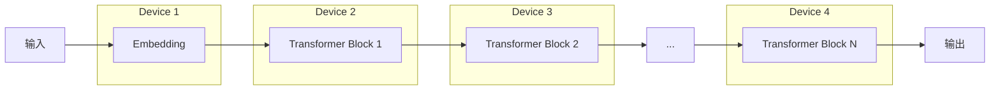

# 大语言模型原理基础与前沿 流水线并行

## 1.背景介绍
### 1.1 大语言模型发展历程
### 1.2 流水线并行技术的兴起
### 1.3 两者结合的意义

大语言模型（Large Language Model，LLM）是近年来自然语言处理（NLP）领域的重大突破。它利用海量文本数据和强大的神经网络模型，实现了前所未有的语言理解和生成能力。从2018年的BERT到2020年的GPT-3，再到2021年的PaLM等，LLM的参数规模和性能不断刷新纪录，展现出令人惊叹的能力。

与此同时，流水线并行（Pipeline Parallelism）作为一种并行化策略，在训练超大规模模型时展现出独特优势。传统的数据并行在面对超大模型时，受限于单个设备的内存容量，难以支撑TB级别的模型训练。而流水线并行可以将模型切分成多个部分，分布到不同设备上，实现高效的并行训练。

将流水线并行应用于大语言模型，有望进一步突破模型规模的瓶颈，实现更强大的语言理解和生成能力。这不仅具有重要的学术价值，也将为智能对话、知识问答、内容创作等实际应用带来革命性变化。本文将深入探讨大语言模型的原理基础，剖析流水线并行的核心技术，展望二者结合的美好前景。

## 2.核心概念与联系
### 2.1 Transformer架构
#### 2.1.1 自注意力机制
#### 2.1.2 前馈神经网络
#### 2.1.3 残差连接与层归一化
### 2.2 预训练与微调
#### 2.2.1 无监督预训练
#### 2.2.2 有监督微调
### 2.3 流水线并行
#### 2.3.1 模型切分
#### 2.3.2 设备间通信
#### 2.3.3 负载均衡

大语言模型的核心架构是Transformer，它以自注意力机制为基础，通过捕捉文本中的长距离依赖关系，实现强大的语义理解能力。Transformer的每一层由自注意力模块和前馈神经网络组成，并引入残差连接和层归一化来加速训练和提升泛化性能。

在训练过程中，大语言模型采用两阶段策略：无监督预训练和有监督微调。预训练阶段利用海量无标注文本数据，通过自回归或自编码等任务，学习通用的语言表征。微调阶段在特定任务的标注数据上进行训练，使模型适应下游应用。这种范式使得LLM具备强大的迁移学习能力。

流水线并行的关键在于将模型切分成多个部分，并将它们分布到不同的设备上。每个设备只负责一部分计算，并与相邻设备进行通信，形成一个流水线。前向传播时，数据在设备间依次流动；反向传播时，梯度以相反方向流动。为了实现高效并行，需要仔细设计切分策略，优化设备间通信，并均衡各个设备的负载。

下图展示了Transformer和流水线并行的结合：



## 3.核心算法原理具体操作步骤
### 3.1 Transformer前向传播
#### 3.1.1 输入编码
#### 3.1.2 自注意力计算
#### 3.1.3 前馈网络计算
### 3.2 Transformer反向传播
#### 3.2.1 损失函数定义
#### 3.2.2 梯度计算与更新
### 3.3 流水线并行调度
#### 3.3.1 正向传播调度
#### 3.3.2 反向传播调度
#### 3.3.3 梯度同步

Transformer的前向传播从输入编码开始，将离散的token映射为连续的向量表征。然后，这些向量通过一系列的Transformer Block进行处理。每个Block包含两个子层：多头自注意力层和前馈全连接层。

自注意力通过计算Query、Key、Value三个矩阵，捕捉输入序列中的长距离依赖。前馈网络通过两层全连接层对特征进行非线性变换。每个子层之后都接一个残差连接和层归一化操作，有助于稳定训练和加速收敛。

反向传播时，首先定义损失函数，常见的有交叉熵损失和平方损失等。然后，通过自动微分机制计算梯度，并利用优化算法（如Adam）更新模型参数。

在流水线并行中，前向传播和反向传播都需要按照流水线的调度规则进行。以3个设备为例，正向传播时：

1. 设备1完成第1层的计算，将结果发送给设备2；
2. 设备2等待设备1的数据，完成第2层计算，将结果发送给设备3；
3. 设备3等待设备2的数据，完成第3层及之后的计算。

反向传播时，梯度以相反方向在设备间流动：

1. 设备3计算最后一层的梯度，将其发送给设备2；
2. 设备2等待设备3的梯度，计算第2层的梯度，将其发送给设备1；
3. 设备1等待设备2的梯度，计算第1层的梯度。

最后，各设备上的梯度需要进行同步，以保证模型更新的一致性。同步方式可以是All-Reduce或者Parameter Server。

## 4.数学模型和公式详细讲解举例说明
### 4.1 Scaled Dot-Product Attention
$$
\text{Attention}(Q, K, V) = \text{softmax}(\frac{QK^T}{\sqrt{d_k}})V
$$
其中，$Q$、$K$、$V$分别是Query、Key、Value矩阵，$d_k$是Key的维度。

### 4.2 Multi-Head Attention
$$
\text{MultiHead}(Q, K, V) = \text{Concat}(\text{head}_1, ..., \text{head}_h)W^O \\
\text{head}_i = \text{Attention}(QW_i^Q, KW_i^K, VW_i^V)
$$
其中，$W_i^Q$、$W_i^K$、$W_i^V$、$W^O$是可学习的权重矩阵，$h$是注意力头的数量。

### 4.3 前馈网络
$$
\text{FFN}(x) = \max(0, xW_1 + b_1)W_2 + b_2
$$
其中，$W_1$、$W_2$、$b_1$、$b_2$是可学习的权重矩阵和偏置向量。

以上公式展示了Transformer的核心组件：Scaled Dot-Product Attention用于计算自注意力，Multi-Head Attention通过多个头并行计算以捕捉不同的注意力模式，前馈网络对特征进行非线性变换。

举例来说，假设我们有一个输入序列"我爱自然语言处理"，经过Embedding层后得到向量序列$X=\{x_1, x_2, x_3, x_4, x_5\}$。在自注意力计算中，$Q$、$K$、$V$都为$X$，通过计算$\text{softmax}(\frac{QK^T}{\sqrt{d_k}})V$，得到一个新的序列$Y=\{y_1, y_2, y_3, y_4, y_5\}$，其中每个向量$y_i$都融合了序列中其他位置的信息。这使得模型能够捕捉"我"与"自然语言处理"之间的长距离依赖关系。

## 5.项目实践：代码实例和详细解释说明
下面是一个PyTorch实现的Transformer Encoder代码示例：

```python
import torch
import torch.nn as nn

class TransformerEncoder(nn.Module):
    def __init__(self, d_model, nhead, dim_feedforward, num_layers):
        super(TransformerEncoder, self).__init__()
        encoder_layer = nn.TransformerEncoderLayer(d_model, nhead, dim_feedforward)
        self.encoder = nn.TransformerEncoder(encoder_layer, num_layers)
    
    def forward(self, src):
        return self.encoder(src)

# 示例用法
d_model = 512
nhead = 8
dim_feedforward = 2048
num_layers = 6

model = TransformerEncoder(d_model, nhead, dim_feedforward, num_layers)

src = torch.rand(10, 32, d_model) # (seq_len, batch_size, d_model)
output = model(src)
```

这段代码定义了一个Transformer Encoder模型，包含多个Encoder Layer。每个Encoder Layer由多头自注意力模块和前馈网络组成。输入`src`的形状为`(seq_len, batch_size, d_model)`，其中`seq_len`是序列长度，`batch_size`是批大小，`d_model`是特征维度。

在前向传播中，输入首先通过多头自注意力模块进行处理，捕捉序列内的长距离依赖关系。然后，自注意力的输出通过前馈网络进行非线性变换，得到最终的输出`output`。

这个示例展示了如何用PyTorch构建Transformer Encoder模型。在实际应用中，我们还需要加入Embedding层、位置编码等组件，并根据任务的需求设计输出层。此外，还可以使用流水线并行来加速训练和推理过程。

## 6.实际应用场景
### 6.1 智能对话系统
### 6.2 机器翻译
### 6.3 文本摘要
### 6.4 知识问答
### 6.5 内容生成

大语言模型在许多实际应用中展现出巨大潜力。在智能对话系统中，LLM可以生成流畅、连贯、富有逻辑的对话响应，大大提升对话体验。用户可以与系统进行多轮交互，讨论开放性话题。

机器翻译是LLM的另一个重要应用。基于Transformer的神经机器翻译模型，可以在海量双语语料的训练下，学习不同语言之间的映射关系。再结合流水线并行等技术，有望构建高质量、高效率的翻译系统。

LLM在文本摘要任务上也取得了瞩目成绩。通过学习大量文本的内在模式，LLM可以自动提取文章的关键信息，生成简洁、准确的摘要。这对于快速浏览和理解海量文本信息具有重要价值。

知识问答是验证LLM语言理解能力的重要任务。通过在海量文本上进行预训练，LLM可以建立起庞大的知识库。用户可以用自然语言提出问题，LLM则根据其理解生成恰当的答案。这为构建大规模知识库和智能问答系统提供了新思路。

内容生成是LLM的一个令人兴奋的应用方向。通过学习海量文本数据，LLM可以自动生成各种体裁的文本内容，如新闻报道、故事、诗歌等。再辅以流水线并行等技术，有望实现高质量、高效率的内容创作，为内容产业带来变革。

## 7.工具和资源推荐
### 7.1 开源代码库
- Hugging Face Transformers
- FairSeq
- DeepSpeed
### 7.2 预训练模型
- BERT
- GPT-3
- T5
- PaLM
### 7.3 数据集
- Wikipedia
- BookCorpus
- OpenWebText
- C4
### 7.4 教程与课程
- CS224n：Natural Language Processing with Deep Learning
- Transformer论文精读
- The Illustrated Transformer

对于有志于研究和应用大语言模型的读者，以上是一些有用的工具和资源。Hugging Face Transformers是一个功能强大的Transformer库，提供了多种预训练模型和下游任务的API。FairSeq和DeepSpeed则专注于大规模模型的高效训练。

在预训练模型方面，BERT、GPT-3、T5、PaLM等是代表性的里程碑式成果，展示了LLM在不同任务上的卓越性能。它们都基于海量高质量文本数据进行训练，如Wikipedia、BookCorpus、OpenWebText等。

对于初学者，CS224n是一门很好的入门课程，系统介绍了NLP领域的基本概念和深度学习方法。Transformer论文精读和The Illustrated Transformer等教程，则有助于深入理解Transformer的原理和实现细节。

## 8.总结：未来发展趋势与挑战
### 8.1 模型规模的