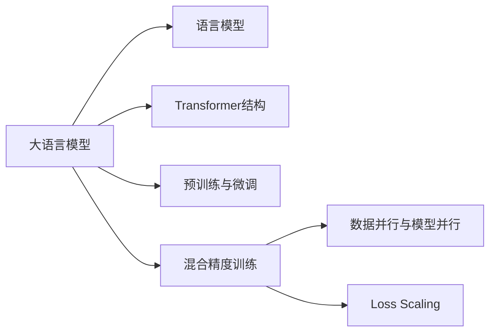

# 大语言模型原理基础与前沿 混合精度

## 1.背景介绍
### 1.1 大语言模型概述
#### 1.1.1 大语言模型的定义与特点
大语言模型(Large Language Model,LLM)是一类基于海量文本数据训练的语言模型,旨在学习自然语言的统计规律和语义表示。与传统的语言模型相比,大语言模型具有参数量大(数十亿到上万亿)、语料规模大(TB到PB级)、训练时间长(数周到数月)等特点。代表性的大语言模型包括GPT系列、BERT系列、XLNet、RoBERTa等。

#### 1.1.2 大语言模型的发展历程
大语言模型的发展可以追溯到2018年,谷歌发布了BERT模型,该模型在多个自然语言处理任务上取得了显著效果提升。此后,OpenAI、微软、Facebook等公司和研究机构纷纷开展大语言模型的研究,推动了该领域的快速发展。近年来,随着计算能力的提升和训练技巧的进步,大语言模型的规模不断扩大,从亿级参数发展到千亿级参数,并在更多领域展现出强大的性能。

### 1.2 混合精度训练
#### 1.2.1 混合精度训练的提出背景
大语言模型的训练通常需要消耗大量的计算资源和训练时间。为了提高训练效率,混合精度训练(Mixed Precision Training)应运而生。混合精度训练最早由Nvidia公司在2018年提出,通过在不同精度(如FP32和FP16)之间灵活切换,在保证模型性能的同时大幅降低显存占用和加速训练过程。

#### 1.2.2 混合精度训练的优势
与传统的单精度训练相比,混合精度训练主要有以下优势:

1. 降低显存占用:FP16的数据类型占用显存是FP32的一半,因此可以在相同的硬件条件下支持更大规模的模型训练。
2. 加速训练过程:GPU对FP16的计算速度通常是FP32的2-8倍,使用混合精度可以明显缩短训练时间。 
3. 保持模型性能:通过合理设置训练超参数和数值稳定性优化,混合精度训练与单精度训练在模型性能上相当。

## 2.核心概念与联系
### 2.1 语言模型
语言模型是一种对语言规律进行建模的方法,旨在学习单词之间的依赖关系和句子的生成规律。常见的语言模型包括n-gram模型、RNN语言模型、Transformer语言模型等。大语言模型本质上是一种参数量巨大的语言模型,通过海量数据训练学习到更加准确和全面的语言表示。

### 2.2 Transformer结构
Transformer是一种基于自注意力机制的神经网络结构,广泛应用于自然语言处理领域。与传统的RNN和CNN不同,Transformer通过自注意力机制建模词与词之间的长距离依赖关系,并实现了并行计算。Transformer结构是大语言模型的核心组件,如BERT和GPT都是基于Transformer构建的。

### 2.3 预训练与微调
预训练(Pre-training)是指在大规模无监督数据上训练通用语言模型,学习语言的基本规律和语义表示。微调(Fine-tuning)是指在预训练模型的基础上,针对特定任务使用少量标注数据进行训练,快速适应下游任务。预训练-微调范式是大语言模型的重要应用模式,使得模型可以高效地迁移到不同任务中。

### 2.4 数据并行与模型并行
数据并行和模型并行是两种常见的分布式训练方法。数据并行是指将数据划分到不同的设备上,每个设备独立训练模型副本,并定期同步梯度。模型并行是指将模型参数划分到不同设备,多个设备协同完成前向和反向传播。在大语言模型训练中,数据并行和模型并行通常结合使用,以支持更大规模的模型训练。

### 2.5 Loss Scaling
Loss Scaling是混合精度训练中的一项关键技术,用于缓解FP16梯度的数值稳定性问题。由于FP16的动态范围较小,在梯度反向传播过程中容易出现梯度消失或溢出。Loss Scaling通过在前向传播时将Loss乘以一个缩放因子,在反向传播时再除以该因子,从而放大梯度值,提高数值稳定性。

下面是上述核心概念之间的联系图:

## 3.核心算法原理具体操作步骤
大语言模型的训练通常采用预训练-微调的范式,结合混合精度训练以提高训练效率。下面以BERT模型为例,介绍大语言模型混合精度训练的核心算法原理和具体操作步骤。

### 3.1 BERT模型结构
BERT(Bidirectional Encoder Representations from Transformers)是一种基于Transformer的双向语言模型,通过Masked Language Modeling(MLM)和Next Sentence Prediction(NSP)两个预训练任务学习语言表示。BERT的结构主要包括:

1. Embedding层:将输入的词表示为向量,包括Token Embedding、Segment Embedding和Position Embedding。
2. Transformer Encoder层:由多个Transformer Encoder块组成,每个块包含自注意力机制和前馈神经网络。
3. Output层:根据任务的不同,输出相应的预测结果,如MLM任务的词表概率分布。

### 3.2 混合精度训练流程
BERT模型的混合精度训练流程如下:

1. 数据准备:对输入文本进行tokenize、编码,构建MLM和NSP任务的训练样本。
2. 模型初始化:加载预训练模型参数或随机初始化,将模型参数转换为FP16格式。
3. 前向传播:
   - 将输入数据转换为FP16格式,输入BERT模型。
   - 在Embedding层和Transformer Encoder层进行前向计算,得到输出表示。
   - 计算MLM和NSP任务的损失函数,并应用Loss Scaling放大损失值。
4. 反向传播:
   - 对放大后的损失函数进行反向传播,计算梯度。
   - 对梯度应用Loss Scaling的逆操作,将梯度缩小到原始尺度。
   - 将梯度转换为FP32格式,用于参数更新。
5. 优化器更新:使用优化器(如Adam)更新模型参数,参数保持FP32格式。
6. 迭代训练:重复步骤3-5,直到模型收敛或达到预设的训练轮数。

在训练过程中,需要对数值稳定性进行监控,如果出现NaN或Inf,需要调整Loss Scaling因子或优化器超参数。

### 3.3 混合精度训练的注意事项
使用混合精度训练需要注意以下几点:

1. 模型兼容性:并非所有的模型结构都适合混合精度训练,需要对模型进行适当修改,如将LayerNorm层的参数保持为FP32格式。
2. 数值稳定性:混合精度训练对数值稳定性要求较高,需要合理设置Loss Scaling因子,并监控训练过程中的梯度和损失值。
3. 超参数调整:混合精度训练可能需要调整优化器的学习率、权重衰减等超参数,以适应不同的数值尺度。
4. 硬件支持:混合精度训练需要硬件(如GPU)支持FP16计算,需要确保硬件环境满足要求。

## 4.数学模型和公式详细讲解举例说明
大语言模型的训练涉及多个数学模型和公式,下面以BERT的MLM任务为例,详细讲解其中的关键公式。

### 4.1 Masked Language Modeling(MLM)
MLM是BERT的核心预训练任务之一,通过随机遮挡部分词tokens,预测被遮挡位置的原始词,从而学习语言的上下文表示。假设输入序列为 $\mathbf{x}=(x_1,x_2,\dots,x_n)$,其中 $x_i$ 表示第 $i$ 个词的token ID。对于每个位置 $i$,以概率 $p$ 进行遮挡,将其替换为特殊符号 [MASK]。

令 $\mathbf{m}=(m_1,m_2,\dots,m_n)$ 表示遮挡向量,其中 $m_i=1$ 表示 $x_i$ 被遮挡,$m_i=0$ 表示 $x_i$ 未被遮挡。则MLM任务的目标是最大化被遮挡位置的条件概率:

$$
\max_{\theta} \prod_{i=1}^{n} P(x_i|\mathbf{x}_{\setminus i},\mathbf{m};\theta)^{m_i}
$$

其中 $\theta$ 表示模型参数,$\mathbf{x}_{\setminus i}$ 表示去除 $x_i$ 的输入序列。

### 4.2 Transformer Encoder
Transformer Encoder是BERT的核心组件,用于学习输入序列的上下文表示。假设第 $l$ 层Transformer Encoder的输入为 $\mathbf{h}^{(l)}=(\mathbf{h}_1^{(l)},\mathbf{h}_2^{(l)},\dots,\mathbf{h}_n^{(l)})$,其中 $\mathbf{h}_i^{(l)} \in \mathbb{R}^d$ 表示第 $i$ 个位置的 $d$ 维隐藏状态。

Transformer Encoder主要包括两个子层:Multi-Head Self-Attention和Position-wise Feed-Forward Network。

#### 4.2.1 Multi-Head Self-Attention
Multi-Head Self-Attention通过多个注意力头捕捉不同位置之间的依赖关系。对于每个注意力头 $h$,首先计算查询矩阵 $\mathbf{Q}^{(h)}$、键矩阵 $\mathbf{K}^{(h)}$ 和值矩阵 $\mathbf{V}^{(h)}$:

$$
\begin{aligned}
\mathbf{Q}^{(h)} &= \mathbf{H}^{(l)}\mathbf{W}_Q^{(h)} \\
\mathbf{K}^{(h)} &= \mathbf{H}^{(l)}\mathbf{W}_K^{(h)} \\
\mathbf{V}^{(h)} &= \mathbf{H}^{(l)}\mathbf{W}_V^{(h)}
\end{aligned}
$$

其中 $\mathbf{W}_Q^{(h)}, \mathbf{W}_K^{(h)}, \mathbf{W}_V^{(h)} \in \mathbb{R}^{d \times d_h}$ 为可学习的投影矩阵,$d_h=d/H$ 为每个注意力头的维度,$H$ 为注意力头数量。

然后计算注意力权重矩阵 $\mathbf{A}^{(h)}$:

$$
\mathbf{A}^{(h)} = \text{softmax}(\frac{\mathbf{Q}^{(h)}{\mathbf{K}^{(h)}}^T}{\sqrt{d_h}})
$$

最后,将注意力权重矩阵与值矩阵相乘,并将所有注意力头的结果拼接起来:

$$
\text{MultiHead}(\mathbf{H}^{(l)}) = \text{Concat}(\text{head}_1,\dots,\text{head}_H)\mathbf{W}^O
$$

其中 $\text{head}_h=\mathbf{A}^{(h)}\mathbf{V}^{(h)}$,$\mathbf{W}^O \in \mathbb{R}^{d \times d}$ 为可学习的投影矩阵。

#### 4.2.2 Position-wise Feed-Forward Network
Position-wise Feed-Forward Network对每个位置的隐藏状态进行非线性变换:

$$
\text{FFN}(\mathbf{h}_i^{(l)}) = \text{ReLU}(\mathbf{h}_i^{(l)}\mathbf{W}_1 + \mathbf{b}_1)\mathbf{W}_2 + \mathbf{b}_2
$$

其中 $\mathbf{W}_1 \in \mathbb{R}^{d \times d_{ff}}, \mathbf{W}_2 \in \mathbb{R}^{d_{ff} \times d}$ 为可学习的权重矩阵,$\mathbf{b}_1 \in \mathbb{R}^{d_{ff}}, \mathbf{b}_2