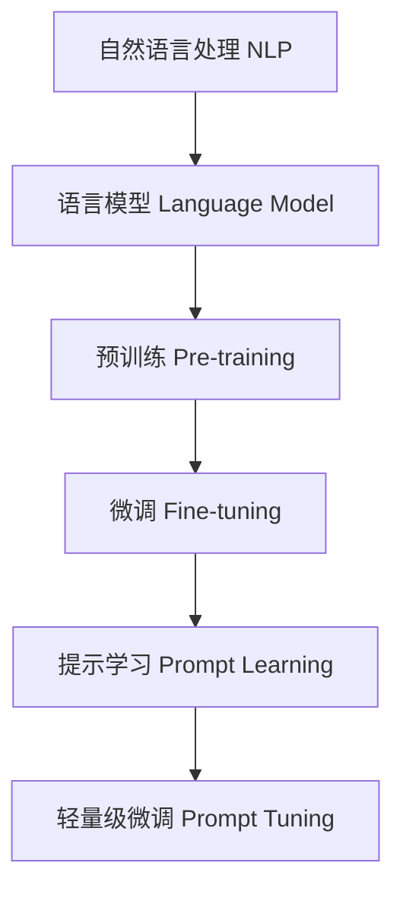
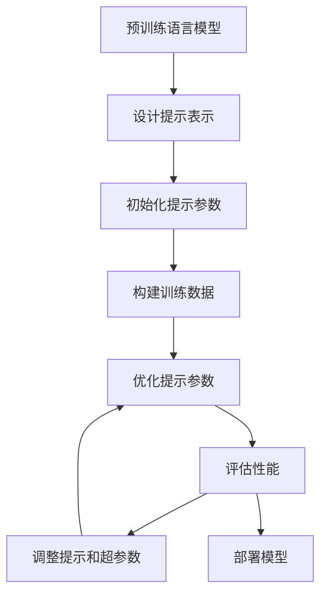

# 大语言模型原理基础与前沿 轻量级微调

## 1.背景介绍

### 1.1 大语言模型的兴起

近年来,大型语言模型(Large Language Models, LLMs)在自然语言处理(NLP)领域取得了令人瞩目的成就。这些模型通过在海量文本数据上进行预训练,学习了丰富的语言知识和上下文信息,从而在广泛的下游任务中展现出了强大的泛化能力。

代表性的大语言模型包括 GPT-3、BERT、XLNet、RoBERTa 等,它们在机器翻译、文本生成、问答系统、情感分析等多个领域展现出卓越的性能。这些模型的出现,标志着 NLP 领域迎来了一个新的里程碑。

### 1.2 大语言模型的挑战

尽管大语言模型取得了巨大的成功,但它们也面临着一些挑战:

1. **计算资源消耗巨大**: 训练这些大型模型需要消耗大量的计算资源,包括 GPU 和 TPU 等专用硬件加速器,以及海量的训练数据。这使得只有拥有足够算力的科技巨头和研究机构才能从事相关研究。

2. **知识迁移能力有限**: 虽然大语言模型具有强大的泛化能力,但在特定领域或任务上的表现仍然有待提高。直接将通用预训练模型应用于特定任务时,往往需要大量的微调和优化。

3. **缺乏可解释性**: 大语言模型通常被视为一个黑盒子,其内部工作机制并不十分透明。这使得理解和控制模型行为变得更加困难。

4. **存在潜在的安全和隐私风险**: 训练数据中可能存在有偏见、不当或不安全的内容,而大语言模型可能会学习和放大这些问题,从而产生不可预期的风险。

### 1.3 轻量级微调的重要性

为了解决上述挑战,轻量级微调(Prompt Tuning)应运而生。轻量级微调是一种高效的微调方法,通过添加少量可训练参数,即提示(Prompt),来适应特定任务,从而避免了完全微调大语言模型所需的巨大计算资源。

轻量级微调的优势在于:

1. **高效**: 由于只需要微调少量参数,因此计算资源消耗大幅降低,训练时间也大大缩短。

2. **灵活**: 可以针对不同的任务设计不同的提示,实现高度的灵活性和可定制性。

3. **可解释性更强**: 通过分析提示的内容和结构,可以更好地理解模型的行为和决策过程。

4. **知识迁移更好**: 由于保留了大语言模型的主体参数,因此可以更好地利用预训练模型中丰富的语言知识。

本文将深入探讨大语言模型的原理和基础知识,重点介绍轻量级微调的方法和前沿进展,为读者提供全面的理解和实践指导。

## 2.核心概念与联系

在深入探讨轻量级微调之前,我们需要先了解一些核心概念和它们之间的联系。

### 2.1 自然语言处理(NLP)

自然语言处理(Natural Language Processing, NLP)是人工智能的一个重要分支,旨在使计算机能够理解、处理和生成人类自然语言。NLP 广泛应用于机器翻译、文本分类、情感分析、问答系统等领域。

### 2.2 语言模型(Language Model)

语言模型是 NLP 中的一个核心概念,它旨在捕捉语言的统计规律,估计一个句子或文本序列的概率。语言模型可以用于多种 NLP 任务,如文本生成、机器翻译和语音识别等。

常见的语言模型包括 N-gram 模型、神经网络语言模型等。近年来,基于 Transformer 的大型语言模型(如 GPT、BERT 等)取得了巨大的成功,成为 NLP 领域的主流方法。

### 2.3 预训练与微调(Pre-training and Fine-tuning)

预训练是指在大规模无标注数据上训练一个通用的语言模型,以捕获丰富的语言知识和上下文信息。而微调则是将预训练模型在特定任务的标注数据上进行进一步训练,以适应该任务的特征和需求。

预训练和微调的组合使得模型能够从通用知识中获益,同时也可以针对特定任务进行优化,实现了知识迁移和模型复用。这种范式已经成为 NLP 领域的主流方法。

### 2.4 提示学习(Prompt Learning)

提示学习是一种新兴的微调方法,它通过设计特定的提示(Prompt)来指导语言模型完成特定任务,而不是直接对模型参数进行微调。提示可以是一段文本、一个模板或者一个任务描述。

提示学习的优点在于高效、灵活和可解释性强。它避免了完全微调模型所需的巨大计算资源,同时也保留了预训练模型中丰富的语言知识。轻量级微调就是提示学习的一种重要形式。

### 2.5 Mermaid 流程图

下面的 Mermaid 流程图展示了上述核心概念之间的关系:



## 3.核心算法原理具体操作步骤

轻量级微调的核心思想是在预训练的大语言模型中引入少量可训练的提示参数,通过优化这些参数来适应特定的下游任务,从而避免了完全微调模型所需的巨大计算资源。

### 3.1 提示表示

提示(Prompt)是轻量级微调的关键,它可以是一段文本、一个模板或者一个任务描述。提示的设计需要结合具体任务和领域知识,以确保它能够有效地引导语言模型生成所需的输出。

常见的提示表示形式包括:

1. **前缀提示(Prefix Prompt)**: 在输入序列的开头添加一段特定的文本,作为提示。

2. **模板提示(Template Prompt)**: 使用带有占位符的模板,将输入和输出嵌入到模板中。

3. **连续提示(Continuous Prompt)**: 将提示表示为一个连续的向量序列,作为模型的额外输入。

4. **离散提示(Discrete Prompt)**: 将提示表示为一组离散的标记(Token),作为模型的额外输入。

不同的提示表示形式适用于不同的任务和场景,需要根据具体情况进行选择和设计。

### 3.2 提示优化

在轻量级微调中,我们需要优化提示参数,使得在下游任务上获得更好的性能。常见的优化方法包括:

1. **梯度下降**: 使用标准的梯度下降算法,如 SGD、Adam 等,来更新提示参数。

2. **元学习**: 将提示参数的优化视为一个元学习问题,通过在多个任务上进行联合训练来获得通用的提示参数。

3. **搜索算法**: 使用启发式搜索算法,如进化算法、蒙特卡罗树搜索等,来探索更优的提示参数组合。

4. **基于规则的方法**: 根据任务的特点和领域知识,手动设计提示参数的初始值或更新策略。

在实际应用中,我们还需要考虑提示长度、训练数据量、任务复杂度等因素,并进行相应的调优和优化。

### 3.3 Mermaid 流程图

下面的 Mermaid 流程图展示了轻量级微调的核心算法原理和具体操作步骤:



## 4.数学模型和公式详细讲解举例说明

在深入理解轻量级微调的数学模型之前,我们先回顾一下预训练语言模型的基本原理。

### 4.1 预训练语言模型

预训练语言模型的目标是学习一个概率分布 $P(x)$,其中 $x = (x_1, x_2, \dots, x_n)$ 表示一个长度为 $n$ 的文本序列。根据链式法则,我们可以将 $P(x)$ 分解为:

$$P(x) = \prod_{t=1}^{n} P(x_t | x_{<t})$$

其中 $x_{<t}$ 表示序列前 $t-1$ 个标记。我们的目标是最大化训练数据的对数似然:

$$\mathcal{L}_{pre} = \sum_{x \in \mathcal{D}} \log P(x)$$

其中 $\mathcal{D}$ 是训练数据集。

常见的预训练目标包括掩码语言模型(Masked Language Modeling, MLM)和下一句预测(Next Sentence Prediction, NSP)等。通过在大规模无标注数据上进行预训练,语言模型可以学习到丰富的语言知识和上下文信息。

### 4.2 轻量级微调

在轻量级微调中,我们引入一个提示(Prompt) $p$,它是一个可训练的参数序列。提示 $p$ 将与输入序列 $x$ 拼接,形成新的输入序列 $x' = (p, x)$。

我们的目标是最大化在下游任务 $\mathcal{T}$ 上的条件对数似然:

$$\mathcal{L}_{ft} = \sum_{(x, y) \in \mathcal{T}} \log P(y | x')$$

其中 $y$ 是期望的输出序列。

通过优化提示参数 $p$,我们可以使语言模型在特定任务上获得更好的性能,而无需微调整个模型的参数。这种方法的计算成本远低于完全微调,同时也保留了预训练模型中丰富的语言知识。

### 4.3 提示设计

提示的设计对于轻量级微调的效果至关重要。一个好的提示应该能够有效地引导语言模型生成所需的输出,同时也需要考虑提示的长度、结构和可解释性等因素。

常见的提示设计策略包括:

1. **手工设计**: 根据任务的特点和领域知识,手动设计提示的内容和结构。

2. **自动搜索**: 使用启发式搜索算法或元学习等方法,自动探索更优的提示参数组合。

3. **数据增强**: 通过构造额外的训练样本,来增强提示的表达能力和泛化性能。

4. **多任务学习**: 在多个相关任务上联合优化提示参数,以提高其通用性和鲁棒性。

下面是一个提示设计的示例,用于文本分类任务:

$$\text{Prompt} = \text{"这段文本描述的主题是: "}$$

在这个例子中,提示为一个简单的文本前缀,它将与输入文本拼接,并由语言模型生成相应的主题标签作为输出。通过优化这个提示,我们可以使语言模型更好地适应文本分类任务。

## 5.项目实践: 代码实例和详细解释说明

在本节中,我们将通过一个实际的代码示例,演示如何使用 Python 和 Hugging Face Transformers 库实现轻量级微调。我们将以文本分类任务为例,对 BERT 模型进行轻量级微调。

### 5.1 导入所需库

```python
import torch
from transformers import BertTokenizer, BertForSequenceClassification
from transformers import TrainingArguments, Trainer
from datasets import load_dataset
```

我们导入了 PyTorch、Hugging Face Transformers 和 Datasets 库,用于加载预训练模型、处理数据和进行训练。

### 5.2 加载数据集

```python
dataset = load_dataset("imdb")
```

我们使用 Hugging Face Datasets 库加载 IMDB 电影评论数据集,用于文本分类任务。

### 5.3 定义提示模板

```python
prompt_template = "对于以下评论文本: {text} \n\n 评论的情感是: "
```

我们定义了一个