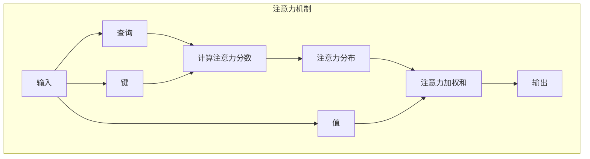
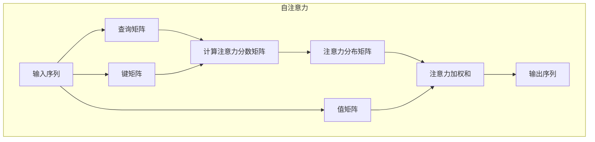
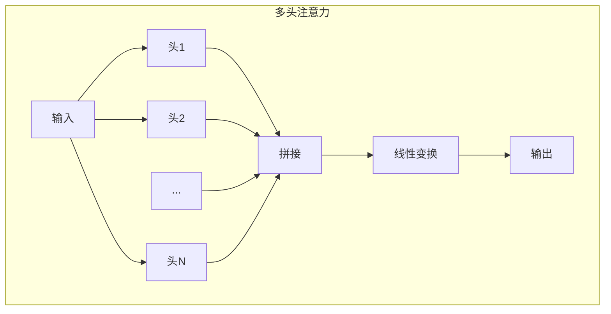
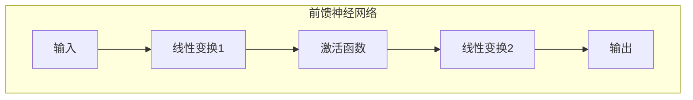
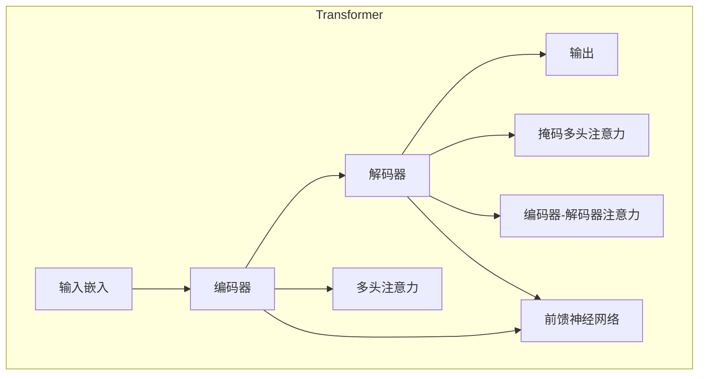

# 大语言模型原理基础与前沿 通过高效和精简检索进行问答和多跳推理

## 1. 背景介绍

### 1.1 语言模型的重要性

语言模型是自然语言处理领域的核心技术之一,它们被广泛应用于机器翻译、问答系统、文本生成等多个领域。随着深度学习技术的快速发展,大型语言模型(Large Language Model,LLM)已成为自然语言处理的主导范式。

### 1.2 大语言模型的兴起

近年来,受益于大规模语料库和强大的计算能力,大型语言模型取得了令人瞩目的成就。模型如GPT-3、BERT等通过在海量文本数据上进行预训练,学习到了丰富的语言知识,展现出令人惊叹的自然语言理解和生成能力。

### 1.3 问答和多跳推理的重要性

在实际应用中,问答和多跳推理是非常重要的任务。多跳推理需要模型从多个证据中推理出答案,这对语言理解和推理能力提出了更高的要求。高效准确的问答和多跳推理系统,可以为用户提供高质量的信息服务。

## 2. 核心概念与联系

### 2.1 注意力机制

注意力机制是大语言模型的核心,它允许模型动态地关注输入序列的不同部分,捕捉长距离依赖关系。注意力机制包括查询(Query)、键(Key)、值(Value)三个向量,通过计算查询与键的相似性得到注意力分布,然后将注意力分布与值相乘得到加权和作为输出。

### 2.2 自注意力

自注意力是注意力机制在编码器-解码器架构中的应用,它允许每个位置的输出与输入序列的所有位置相关联。查询、键、值矩阵都来自于同一个输入序列,通过计算注意力分数矩阵得到注意力分布矩阵,将其与值矩阵相乘得到注意力加权和作为输出序列。

### 2.3 多头注意力

多头注意力通过独立学习多个注意力分布,从不同的表示子空间捕捉不同的相关模式。每个注意力头对输入进行线性变换得到查询、键、值,计算注意力输出,最后将所有头的输出拼接并进行线性变换作为最终输出。

### 2.4 前馈神经网络

前馈神经网络是Transformer中的另一个重要组件,它对序列的每个位置进行相同的前馈计算,增强了模型的表示能力。输入首先经过一个线性变换和非线性激活函数,再经过另一个线性变换得到输出。

### 2.5 Transformer架构

Transformer是一种全注意力架构,不依赖序列操作如卷积或循环,显著提高了并行计算能力。编码器由多头自注意力和前馈神经网络组成,对输入序列建模。解码器除了类似的结构外,还引入了掩码多头注意力来防止关注未来位置,以及编码器-解码器注意力来融合编码器的输出。

## 3. 核心算法原理具体操作步骤

### 3.1 注意力计算

1) 线性投影得到查询(Q)、键(K)、值(V)矩阵:

$$\begin{aligned}
Q &= XW_Q \\
K &= XW_K \\
V &= XW_V
\end{aligned}$$

其中$X$是输入序列,$W_Q,W_K,W_V$是可学习的权重矩阵。

2) 计算注意力分数:

$$\text{Attention}(Q, K, V) = \text{softmax}\left(\frac{QK^T}{\sqrt{d_k}}\right)V$$

其中$d_k$是缩放因子,用于防止较深层时注意力梯度过小。

3) 多头注意力通过独立学习$h$个注意力头,捕捉不同的相关模式:

$$\text{MultiHead}(Q, K, V) = \text{Concat}(\text{head}_1, \ldots, \text{head}_h)W^O$$

其中$\text{head}_i = \text{Attention}(QW_i^Q, KW_i^K, VW_i^V)$,并且通过$W^O$对拼接的向量进行线性变换。

### 3.2 位置编码

由于Transformer没有捕捉序列顺序的内在机制,因此需要添加位置编码来赋予每个位置不同的表示:

$$\begin{aligned}
\text{PE}_{(pos, 2i)} &= \sin\left(pos/10000^{2i/d_{\text{model}}}\right) \\
\text{PE}_{(pos, 2i+1)} &= \cos\left(pos/10000^{2i/d_{\text{model}}}\right)
\end{aligned}$$

其中$pos$是位置下标,$i$是维度索引。位置编码直接加到输入嵌入上。

### 3.3 编码器

编码器由$N$个相同的层组成,每层包括两个子层:

1) 多头自注意力子层:

$$\text{MultiHead}(Q, K, V) = \text{Concat}(\text{head}_1, \ldots, \text{head}_h)W^O$$

2) 全连接前馈神经网络子层:

$$\text{FFN}(x) = \max(0, xW_1 + b_1)W_2 + b_2$$

每个子层的输出都会进行残差连接,并经过层归一化。

### 3.4 解码器

解码器也由$N$个相同的层组成,每层包括三个子层:

1) 掩码多头自注意力子层,防止关注未来位置。
2) 多头编码器-解码器注意力子层,关注编码器输出。
3) 全连接前馈神经网络子层。

与编码器类似,每个子层的输出都会进行残差连接和层归一化。

### 3.5 高效和精简检索

为了提高检索效率,可以采用近似最近邻搜索算法,如局部敏感哈希(Locality Sensitive Hashing,LSH)、层次导航小世界图(Hierarchical Navigable Small World,HNSW)等。这些算法通过构建高效的索引结构,在牺牲少量准确性的情况下,大幅提高了检索速度。

为了提高检索精简性,可以采用密集向量检索(Dense Vector Retrieval)技术。将文档映射到密集向量空间,利用向量相似性进行语义检索,可以获得更高的检索质量。常用的密集向量编码方法包括双编码器(Bi-Encoder)、交叉编码器(Cross-Encoder)等。

## 4. 数学模型和公式详细讲解举例说明

### 4.1 注意力分数计算

注意力分数的计算公式为:

$$\text{Attention}(Q, K, V) = \text{softmax}\left(\frac{QK^T}{\sqrt{d_k}}\right)V$$

其中$Q$为查询矩阵,$K$为键矩阵,$V$为值矩阵,$d_k$为缩放因子。

例如,假设$Q$、$K$、$V$的形状均为$(2, 3, 4)$,则计算过程如下:

1) 计算$QK^T$:

$$
QK^T = \begin{bmatrix}
q_1 \cdot k_1 & q_1 \cdot k_2 & q_1 \cdot k_3\\
q_2 \cdot k_1 & q_2 \cdot k_2 & q_2 \cdot k_3
\end{bmatrix}
$$

其中$q_i$和$k_j$分别为$Q$和$K$的第$i$行和第$j$列。

2) 对$QK^T$进行缩放:

$$
\frac{QK^T}{\sqrt{4}} = \begin{bmatrix}
\frac{q_1 \cdot k_1}{\sqrt{4}} & \frac{q_1 \cdot k_2}{\sqrt{4}} & \frac{q_1 \cdot k_3}{\sqrt{4}}\\
\frac{q_2 \cdot k_1}{\sqrt{4}} & \frac{q_2 \cdot k_2}{\sqrt{4}} & \frac{q_2 \cdot k_3}{\sqrt{4}}
\end{bmatrix}
$$

3) 对缩放后的矩阵进行softmax操作:

$$
\text{softmax}\left(\frac{QK^T}{\sqrt{4}}\right) = \begin{bmatrix}
\alpha_{11} & \alpha_{12} & \alpha_{13}\\
\alpha_{21} & \alpha_{22} & \alpha_{23}
\end{bmatrix}
$$

其中$\alpha_{ij}$为softmax输出,表示查询$q_i$对键$k_j$的注意力权重。

4) 将注意力权重与值矩阵$V$相乘:

$$
\text{Attention}(Q, K, V) = \begin{bmatrix}
\alpha_{11}v_1 + \alpha_{12}v_2 + \alpha_{13}v_3\\
\alpha_{21}v_1 + \alpha_{22}v_2 + \alpha_{23}v_3
\end{bmatrix}
$$

其中$v_j$为$V$的第$j$列,表示第$j$个值向量。

通过上述步骤,我们得到了注意力加权和,它是查询$Q$对值$V$的加权表示,权重由$Q$与$K$的相似性决定。

### 4.2 位置编码

位置编码的公式为:

$$\begin{aligned}
\text{PE}_{(pos, 2i)} &= \sin\left(pos/10000^{2i/d_{\text{model}}}\right) \\
\text{PE}_{(pos, 2i+1)} &= \cos\left(pos/10000^{2i/d_{\text{model}}}\right)
\end{aligned}$$

其中$pos$是位置下标,$i$是维度索引,$d_{\text{model}}$是模型维度。

例如,假设$d_{\text{model}}=8$,位置下标$pos=0$,则位置编码为:

$$
\begin{aligned}
\text{PE}_{(0, 0)} &= \sin(0/1) = 0 \\
\text{PE}_{(0, 1)} &= \cos(0/1) = 1 \\
\text{PE}_{(0, 2)} &= \sin(0/10^{2/8}) = 0 \\
\text{PE}_{(0, 3)} &= \cos(0/10^{2/8}) = 1 \\
\text{PE}_{(0, 4)} &= \sin(0/10^{4/8}) = 0 \\
\text{PE}_{(0, 5)} &= \cos(0/10^{4/8}) = 1 \\
\text{PE}_{(0, 6)} &= \sin(0/10^{6/8}) = 0 \\
\text{PE}_{(0, 7)} &= \cos(0/10^{6/8}) = 1
\end{aligned}
$$

通过构造这种特殊的正弦/余弦函数,位置编码为不同位置赋予了不同的值,从而为模型提供了位置信息。

## 5. 项目实践:代码实例和详细解释说明

以下是一