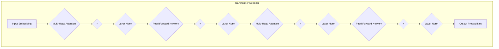

# 大语言模型应用指南：Algorithm-of-Thought

## 1. 背景介绍

随着人工智能技术的不断发展,大型语言模型(Large Language Models, LLMs)已经成为当前最具影响力的技术之一。这些模型通过从海量文本数据中学习,掌握了丰富的自然语言理解和生成能力,在自然语言处理、问答系统、内容创作等领域展现出了令人惊叹的表现。

然而,尽管大型语言模型拥有强大的语言能力,但它们仍然存在一些局限性,例如缺乏持久的记忆和推理能力、容易产生不一致和虚构的输出、缺乏对语境和常识的深入理解等。为了解决这些问题,研究人员提出了一种新的范式——"Algorithm-of-Thought"(思维算法),旨在赋予语言模型更强的推理和思维能力。

### 1.1 什么是Algorithm-of-Thought?

Algorithm-of-Thought是一种新兴的人工智能范式,它试图通过显式建模人类的思维过程,来增强语言模型的推理和问题解决能力。与传统的语言模型不同,Algorithm-of-Thought模型不仅关注语言的表面形式,还致力于捕捉语言背后的逻辑和推理过程。

这种方法的核心思想是将复杂的任务分解为一系列基本的推理步骤,并使用语言模型来执行这些步骤。每个步骤都可以被视为一个子任务,模型需要根据当前的上下文和记忆来选择合适的操作,逐步推进直到完成整个任务。

### 1.2 Algorithm-of-Thought的优势

相比传统的语言模型,Algorithm-of-Thought范式具有以下几个主要优势:

1. **增强推理能力**:通过显式建模推理过程,Algorithm-of-Thought模型能够更好地处理需要多步推理的复杂任务,提高了模型的推理能力。

2. **提高一致性和可解释性**:由于推理过程是可解释的,Algorithm-of-Thought模型的输出更加一致和可解释,有助于建立人们对模型的信任。

3. **融合外部知识**:Algorithm-of-Thought模型可以灵活地融合外部知识库,从而扩展其推理能力和知识覆盖面。

4. **多模态处理**:除了文本,Algorithm-of-Thought模型还可以处理图像、视频等多模态数据,为更广泛的应用场景铺平了道路。

## 2. 核心概念与联系

Algorithm-of-Thought范式涉及了多个核心概念,包括思维链(Thought Chain)、推理程序(Reasoning Programs)和记忆模块(Memory Module)等。这些概念相互关联,共同构建了一个完整的思维框架。

### 2.1 思维链(Thought Chain)

思维链是Algorithm-of-Thought范式的核心概念之一。它描述了一系列相互关联的推理步骤,模拟了人类解决复杂问题时的思维过程。每个推理步骤都可以被视为一个子任务,模型需要根据当前的上下文和记忆来选择合适的操作,逐步推进直到完成整个任务。

思维链的基本结构如下所示:

```
Thought Chain = [Step 1, Step 2, Step 3, ..., Step N]
```

其中,每个步骤(Step)都包含以下几个要素:

- **Operation**: 当前步骤要执行的操作,例如检索信息、进行计算或推理等。
- **Arguments**: 操作所需的输入参数。
- **Observation**: 执行操作后的观察结果。
- **Memory**: 当前步骤的记忆状态。

通过构建和跟踪思维链,模型可以更好地理解和解释其推理过程,从而提高输出的一致性和可解释性。

### 2.2 推理程序(Reasoning Programs)

推理程序是Algorithm-of-Thought模型用于执行各种推理操作的核心组件。它们可以被视为一系列可编程的函数或模块,用于执行特定的任务,如信息检索、数学计算、逻辑推理等。

推理程序的设计灵感来自于传统的计算机程序,但它们是基于语言模型构建的,因此具有更强的灵活性和泛化能力。通过组合不同的推理程序,模型可以执行复杂的推理任务,从而增强其问题解决能力。

推理程序的示例包括:

- **信息检索程序**:从给定的知识库中检索相关信息。
- **数学计算程序**:执行算术运算、代数计算等数学操作。
- **逻辑推理程序**:进行逻辑推理,如归纳、演绎、规则匹配等。
- **规划程序**:制定行动计划,解决多步骤问题。

### 2.3 记忆模块(Memory Module)

记忆模块是Algorithm-of-Thought模型中用于存储和管理信息的关键组件。传统的语言模型通常缺乏持久的记忆能力,导致它们在处理需要长期记忆的任务时表现不佳。记忆模块的引入旨在解决这一问题。

记忆模块可以存储各种类型的信息,包括:

- **上下文信息**:任务的背景信息、已知事实等。
- **中间结果**:推理过程中产生的中间计算结果或观察结果。
- **外部知识**:从外部知识库检索到的相关信息。

记忆模块不仅可以存储信息,还可以根据需要检索和更新信息,从而支持模型进行有效的推理和决策。通过与思维链和推理程序的紧密集成,记忆模块为Algorithm-of-Thought模型提供了持久的记忆能力,增强了其处理复杂任务的能力。

## 3. 核心算法原理具体操作步骤

Algorithm-of-Thought模型的核心算法原理可以概括为以下几个主要步骤:

1. **任务分解**:将复杂的任务分解为一系列可管理的子任务或推理步骤。
2. **推理程序选择**:根据当前的上下文和记忆状态,选择合适的推理程序来执行每个子任务。
3. **推理程序执行**:执行选定的推理程序,获取观察结果并更新记忆状态。
4. **结果整合**:将各个子任务的结果整合,形成最终的输出或决策。

下面我们将详细介绍这些步骤的具体操作过程。

### 3.1 任务分解

任务分解是Algorithm-of-Thought模型的第一步,它将复杂的任务划分为一系列可管理的子任务或推理步骤。这个过程可以由模型自主完成,也可以由人工指定。

自主任务分解通常依赖于模型的语义理解能力。模型需要分析输入的任务描述,识别出关键信息和子目标,然后将它们组织成一系列有序的推理步骤。这个过程可以通过设计特定的任务分解模块来实现。

另一种方式是由人工专家预先设计好任务分解的模板,模型只需要根据具体的输入来实例化这些模板。这种方式可以提高任务分解的质量和一致性,但需要人工的参与。

无论采用何种方式,任务分解的目标都是将复杂的问题划分为一系列可管理的子任务,为后续的推理程序执行做好准备。

### 3.2 推理程序选择

在完成任务分解后,模型需要为每个子任务选择合适的推理程序。推理程序的选择过程需要考虑当前的上下文和记忆状态,以确保选择的程序能够有效地执行当前的子任务。

推理程序选择可以通过多种方式实现,例如:

1. **基于规则的选择**:根据预定义的规则和模式匹配来选择推理程序。这种方式需要人工设计规则,但可以保证选择的一致性和可解释性。

2. **基于学习的选择**:通过机器学习模型来学习推理程序的选择策略。这种方式更加灵活和自适应,但需要大量的训练数据和计算资源。

3. **基于注意力机制的选择**:利用注意力机制动态地选择和组合多个推理程序。这种方式具有较好的灵活性,但可解释性较差。

无论采用何种方式,推理程序的选择都应该确保与当前的上下文和记忆状态相匹配,从而能够有效地执行相应的子任务。

### 3.3 推理程序执行

在选择了合适的推理程序后,模型需要执行该程序来完成当前的子任务。推理程序的执行过程通常包括以下几个步骤:

1. **输入处理**:根据程序的需求,从记忆模块中检索相关的输入信息。
2. **程序执行**:执行推理程序的核心逻辑,进行相应的计算、推理或信息处理操作。
3. **结果观察**:观察程序执行的结果,包括中间结果和最终输出。
4. **记忆更新**:将观察到的结果存储到记忆模块中,以供后续的推理步骤使用。

推理程序的执行可能需要与其他模块(如记忆模块)进行交互,以获取所需的输入信息或存储中间结果。此外,某些复杂的推理程序可能需要多次迭代执行,直到达到预期的结果或满足终止条件。

### 3.4 结果整合

在完成所有推理步骤后,模型需要将各个步骤的结果整合起来,形成最终的输出或决策。结果整合的过程可能涉及以下操作:

1. **结果汇总**:收集和组织各个推理步骤产生的中间结果。
2. **冲突解决**:如果不同步骤的结果存在冲突或矛盾,需要进行冲突解决和一致性检查。
3. **输出生成**:根据汇总的结果,生成最终的输出或决策,可以是文本、数值或其他形式的结果。
4. **可解释性增强**:为了提高输出的可解释性,模型可以生成一个推理过程的解释,说明每个步骤的作用和最终结果的来源。

结果整合是Algorithm-of-Thought模型的最后一步,它将分散的推理步骤整合成一个连贯的输出,同时还需要确保输出的一致性和可解释性。

## 4. 数学模型和公式详细讲解举例说明

Algorithm-of-Thought模型通常采用基于transformer的序列到序列(Seq2Seq)架构,其核心数学模型是transformer解码器。下面我们将详细介绍transformer解码器的数学模型和公式。

### 4.1 transformer解码器架构

transformer解码器是一种基于自注意力机制的神经网络架构,它可以有效地捕捉输入序列中的长程依赖关系。transformer解码器的架构如下图所示:



transformer解码器由多个解码器层组成,每个解码器层包含以下几个主要组件:

1. **Multi-Head Attention**:多头自注意力机制,用于捕捉输入序列中的长程依赖关系。
2. **Feed Forward Network**:前馈神经网络,对注意力的输出进行进一步的非线性变换。
3. **Layer Normalization**:层归一化,用于稳定训练过程和加速收敛。
4. **Residual Connection**:残差连接,将输入和输出相加,有助于梯度传播和防止梯度消失。

### 4.2 多头自注意力机制

多头自注意力机制是transformer解码器的核心部分,它允许模型同时关注输入序列中的多个位置,从而捕捉长程依赖关系。多头自注意力的计算过程如下:

给定一个输入序列 $X = (x_1, x_2, \dots, x_n)$,我们首先将其线性映射到查询(Query)、键(Key)和值(Value)向量:

$$
Q = XW