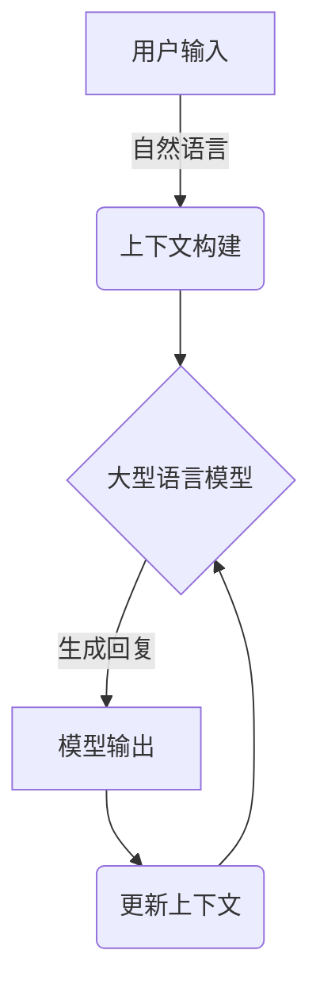
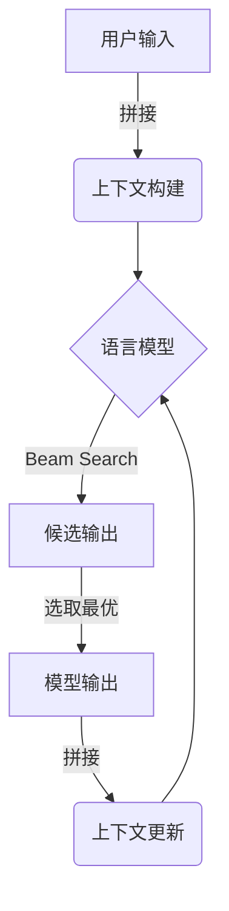

# 大语言模型应用指南：Chat Completion交互格式

## 1.背景介绍

随着人工智能和自然语言处理技术的不断发展,大型语言模型已经成为当前最前沿和最受关注的研究领域之一。这些模型通过从海量文本数据中学习,能够生成看似人类写作的连贯、流畅的文本输出。其中,OpenAI推出的GPT(Generative Pre-trained Transformer)系列模型无疑是最具代表性的,尤其是GPT-3,凭借其惊人的文本生成能力,掀起了一股"大模型"热潮。

基于大型语言模型的应用也日益广泛,从内容创作、问答系统、对话助手到代码生成等,都有了令人惊叹的实践案例。其中,Chat Completion交互格式是指用户可以通过自然语言与大型语言模型进行对话式交互,模型会根据上下文生成相应的回复,实现类似人机对话的效果。这种交互方式更加自然、直观,为大型语言模型的应用拓展了新的维度。

## 2.核心概念与联系

### 2.1 大型语言模型

大型语言模型是一种基于自然语言处理(NLP)技术训练的深度学习模型,通过从海量文本数据中学习,能够生成看似人类写作的连贯、流畅的文本输出。这些模型通常采用Transformer等注意力机制架构,具有极大的参数量和计算能力,可以捕捉文本中的复杂语义和上下文信息。

常见的大型语言模型包括GPT(Generative Pre-trained Transformer)系列、BERT(Bidirectional Encoder Representations from Transformers)、XLNet、RoBERTa等。其中,GPT-3是目前规模最大、能力最强的语言模型之一,拥有1750亿个参数,在各种自然语言任务上都表现出色。

### 2.2 Chat Completion交互

Chat Completion交互是指用户可以通过自然语言与大型语言模型进行对话式交互,模型会根据上下文生成相应的回复,实现类似人机对话的效果。这种交互方式更加自然、直观,为大型语言模型的应用拓展了新的维度。

在Chat Completion交互中,用户的输入会被视为对话的一部分,与之前的上下文信息一起被送入语言模型。模型会基于当前对话状态生成合理的回复,并将其作为新的上下文信息,继续下一轮对话。这种交互方式可以支持多轮对话,模型会根据对话历史动态调整回复内容,从而实现更加人性化的交互体验。

Chat Completion交互格式的核心在于上下文理解和生成能力。大型语言模型需要充分利用对话历史信息,捕捉上下文语义,并生成与之相关、连贯的回复内容。这对模型的语言理解和生成能力提出了极高的要求。

### 2.3 Mermaid流程图



上图使用Mermaid流程图展示了Chat Completion交互的核心流程:

1. 用户通过自然语言输入查询或utterance。
2. 系统将用户输入与之前的对话历史构建成当前的上下文信息。
3. 将上下文信息输入到大型语言模型中,模型基于上下文生成相应的回复。
4. 模型将生成的回复作为输出。
5. 系统将模型输出作为新的上下文信息,更新对话历史,进入下一轮交互。

这种交互方式实现了人机对话的自然流程,用户可以自然地与模型进行多轮交互,而不需要过多的人机交互设计。

## 3.核心算法原理具体操作步骤  

Chat Completion交互的核心算法原理主要包括以下几个步骤:

### 3.1 上下文构建

对话的上下文信息是生成合理回复的关键。在Chat Completion交互中,系统需要将用户的当前输入与之前的对话历史进行整合,构建出完整的上下文表示。

常见的上下文构建方法包括:

1. **拼接**:将当前输入与之前的对话历史按顺序拼接成一个序列,作为模型的输入。
2. **分隔符**:使用特殊的分隔符(如[SEP])将不同utterance分开,模型可以学习到utterance之间的边界。
3. **注意力掩码**:在Transformer的注意力机制中,使用掩码操作来控制不同位置的token之间是否应该计算注意力权重。

不同的上下文构建方式会影响模型对上下文的理解能力,需要根据具体的模型架构和任务进行选择和调优。

### 3.2 语言模型生成

基于构建的上下文表示,语言模型需要生成与之相关、连贯的回复内容。这通常是一个token by token(单词或子词)生成的过程,每一步都需要根据之前生成的内容和上下文进行概率预测。

生成过程中,常见的策略包括:

1. **Greedy Search**:每一步选择概率最大的token作为输出。
2. **Beam Search**:每一步保留若干个概率最大的候选token,组合成多个beam,最终输出概率最大的beam。
3. **Top-k Sampling**:每一步从概率最大的k个token中随机采样作为输出。
4. **Nucleus Sampling**:每一步从概率累计达到一定阈值的token中随机采样作为输出。

不同的生成策略会影响输出的多样性和质量,需要根据具体应用场景进行权衡选择。此外,还可以引入一些约束条件(如关键词、长度等)来控制生成内容。

### 3.3 上下文更新

为了支持多轮对话,Chat Completion交互需要将当前生成的回复内容作为新的上下文信息,与之前的对话历史进行整合,为下一轮交互做好准备。

上下文更新的方式通常与上下文构建的方式保持一致,如拼接、使用分隔符等。同时,也可以采用一些策略来控制上下文的长度,防止过长的上下文影响模型效率,例如:

1. **截断**:只保留最近的几轮对话作为上下文。
2. **压缩**:使用压缩模型将之前的对话历史编码成紧凑的向量表示。

### 3.4 Mermaid流程图



上图使用Mermaid流程图展示了Chat Completion交互核心算法的具体操作步骤:

1. 将用户的当前输入与之前的对话历史进行拼接,构建出完整的上下文表示。
2. 将上下文输入到语言模型中。
3. 语言模型使用Beam Search策略生成多个候选输出。
4. 从候选输出中选取概率最大的作为最终输出。
5. 将模型输出与之前的上下文进行拼接,更新对话历史,作为下一轮交互的上下文。

该流程图清晰地展示了Chat Completion交互的核心算法逻辑,可以帮助读者更好地理解其工作原理。

## 4.数学模型和公式详细讲解举例说明

在Chat Completion交互中,大型语言模型的核心是基于自注意力机制的Transformer架构。Transformer通过自注意力机制来捕捉序列中不同位置token之间的长程依赖关系,从而更好地建模语义和上下文信息。下面将详细介绍Transformer中的自注意力机制及其数学原理。

### 4.1 Scaled Dot-Product Attention

自注意力机制的核心是Scaled Dot-Product Attention,它通过计算查询(Query)与键(Key)的点积,并根据值(Value)的线性组合来计算注意力权重。具体计算公式如下:

$$\text{Attention}(Q, K, V) = \text{softmax}\left(\frac{QK^T}{\sqrt{d_k}}\right)V$$

其中:
- $Q$是查询矩阵(Query Matrix)
- $K$是键矩阵(Key Matrix)
- $V$是值矩阵(Value Matrix)
- $d_k$是缩放因子,通常设置为$\sqrt{d_k}$,其中$d_k$是键的维度

该公式可分为以下几个步骤:

1. 计算查询和键的点积: $QK^T$
2. 对点积结果进行缩放: $\frac{QK^T}{\sqrt{d_k}}$
3. 对缩放后的点积结果应用softmax函数,得到注意力权重矩阵
4. 将注意力权重矩阵与值矩阵相乘,得到加权后的值矩阵

通过这种方式,Transformer可以自动学习到不同位置token之间的关系,并据此分配注意力权重,从而更好地捕捉长程依赖关系。

### 4.2 Multi-Head Attention

为了进一步提高模型的表现能力,Transformer引入了Multi-Head Attention机制。Multi-Head Attention将注意力机制进行了多路复制,每一路被称为一个"头"(Head),各个头可以关注输入序列的不同子空间表示,最终将所有头的结果进行拼接。具体计算公式如下:

$$\text{MultiHead}(Q, K, V) = \text{Concat}(head_1, ..., head_h)W^O$$
$$\text{where } head_i = \text{Attention}(QW_i^Q, KW_i^K, VW_i^V)$$

其中:
- $Q$、$K$、$V$分别为查询、键和值矩阵
- $W_i^Q$、$W_i^K$、$W_i^V$为第$i$个头对应的线性变换矩阵
- $W^O$为最终的线性变换矩阵,用于将各头的结果拼接后进行变换

Multi-Head Attention允许模型从不同的子空间获取不同的表示,并通过拼接的方式融合这些表示,从而提高了模型的表达能力和泛化性能。

### 4.3 Transformer架构

基于自注意力机制,Transformer的整体架构由编码器(Encoder)和解码器(Decoder)两个主要部分组成。

**编码器(Encoder)**的主要作用是将输入序列映射到一个连续的表示空间中,捕捉序列中token之间的依赖关系。编码器由多个相同的层组成,每一层包括两个子层:Multi-Head Attention层和全连接前馈网络层。

**解码器(Decoder)**的作用是基于编码器的输出,生成目标序列。解码器的结构与编码器类似,也由多个相同的层组成,每一层包括三个子层:Masked Multi-Head Attention层、Multi-Head Attention层和全连接前馈网络层。其中,Masked Multi-Head Attention层用于捕捉已生成序列中token之间的依赖关系,而Multi-Head Attention层则用于关注编码器的输出。

通过这种编码器-解码器的架构,Transformer能够有效地捕捉输入和输出序列之间的关系,并生成相应的目标序列。在Chat Completion交互中,编码器用于编码对话历史作为上下文表示,而解码器则根据上下文生成回复内容。

Transformer架构的自注意力机制和层次结构设计,使其能够有效地建模长期依赖关系,并在各种自然语言处理任务上取得了卓越的表现。

## 5.项目实践:代码实例和详细解释说明

为了更好地理解Chat Completion交互的实现,我们将基于Hugging Face的Transformers库,提供一个使用GPT-2模型进行对话交互的Python代码示例。

### 5.1 准备工作

首先,我们需要安装Transformers库和其他必要的依赖项:

```bash
pip install transformers
```

### 5.2 导入模块

```python
from transformers import AutoModelForCausalLM, AutoTokenizer
import torch
```

- `AutoModelForCausalLM`用于加载语言模型,支持自回归(Causal LM)任务。
- `AutoTokenizer`用于对输入文本进行tokenize操作。
- `torch`是PyTorch深度学习框架,用于模型计算。

### 5.3 加载模型和分词器

```python
model_name = "gpt2"
tokenizer = AutoTokenizer.from_pretrained(model_name)
model = AutoModelForCausalLM