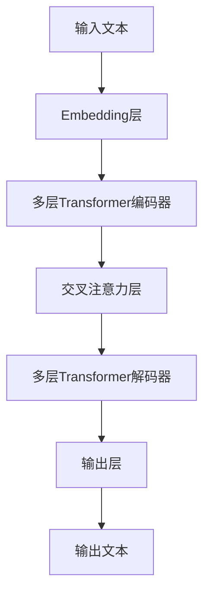

# 大语言模型应用指南：GPT-4V简介

## 1. 背景介绍

### 1.1 人工智能的发展历程

人工智能(Artificial Intelligence, AI)是当代科技领域最具革命性和颠覆性的技术之一。自20世纪50年代AI概念被正式提出以来,经历了几个重要的发展阶段。

- 第一阶段(1950s-1960s):专家系统和符号主义
- 第二阶段(1980s-1990s):机器学习和神经网络
- 第三阶段(2010s-至今):深度学习和大数据时代

近年来,受益于算力、数据和算法的飞速发展,AI取得了突破性进展,尤其是在自然语言处理(NLP)领域。

### 1.2 大语言模型的兴起

大型语言模型(Large Language Model, LLM)是NLP领域的一种全新范式,通过在海量文本数据上进行预训练,学习人类语言的统计规律和语义知识。代表性模型包括GPT、BERT、T5等。这些模型展现出惊人的泛化能力,可应用于多种下游任务。

其中,OpenAI推出的GPT系列模型无疑是最受瞩目的LLM之一。GPT-4V(Generative Pre-trained Transformer Version 4)是该系列的最新力作,在规模、性能和能力上都有重大突破,被视为通用人工智能(AGI)的重要里程碑。

## 2. 核心概念与联系

### 2.1 GPT-4V模型架构

GPT-4V采用Transformer编码器-解码器架构,整体结构如下流程图所示:



其核心部分包括:

- **Embedding层**:将原始文本转换为向量表示
- **Transformer编码器**:捕捉输入序列的上下文信息
- **交叉注意力层**:融合编码器和解码器的信息
- **Transformer解码器**:生成目标输出序列

### 2.2 自注意力机制

Transformer的自注意力机制是GPT-4V的核心创新,使模型能够同时关注输入序列中的所有位置,捕捉长距离依赖关系。自注意力机制如下公式所示:

$$\mathrm{Attention}(Q, K, V) = \mathrm{softmax}\left(\frac{QK^T}{\sqrt{d_k}}\right)V$$

其中 $Q$ 为查询(Query)、$K$ 为键(Key)、$V$ 为值(Value),$d_k$ 为缩放因子。

### 2.3 预训练和微调

GPT-4V首先在大规模文本语料上进行无监督预训练,学习通用的语言知识。然后针对特定任务(如机器翻译、问答等)进行有监督微调,使模型适应目标领域。

预训练和微调的结合使GPT-4V具有强大的迁移能力,可快速适应新领域、新任务。

## 3. 核心算法原理具体操作步骤

GPT-4V的核心算法原理可概括为以下几个步骤:

### 3.1 输入处理

1. 将原始文本切分为词元(token)序列
2. 将词元映射为embedding向量表示

### 3.2 Transformer编码器

对输入序列进行多层Transformer编码,捕捉上下文信息:

1. 每一层计算多头自注意力
2. 进行层归一化和残差连接
3. 通过前馈全连接网络
4. 再次进行层归一化和残差连接

### 3.3 交叉注意力

编码器输出与解码器输入(如前一步生成的标记)计算注意力,融合信息:

$$\mathrm{CrossAttention}(Q, K, V) = \mathrm{softmax}\left(\frac{QK^T}{\sqrt{d_k}}\right)V$$

### 3.4 Transformer解码器

对融合后的向量序列进行多层Transformer解码:

1. 计算掩码多头自注意力
2. 与交叉注意力输出计算注意力
3. 进行层归一化和残差连接
4. 通过前馈全连接网络
5. 再次进行层归一化和残差连接

### 3.5 输出生成

最后一层解码器输出通过线性层和softmax生成词元概率分布,并将最大概率词元作为输出。重复上述步骤直至生成完整序列。

## 4. 数学模型和公式详细讲解举例说明

### 4.1 自注意力计算

自注意力机制是Transformer的核心创新,它使用查询(Query)、键(Key)和值(Value)向量来计算注意力权重。具体计算过程如下:

1. 计算查询与所有键的点积得分: $\mathrm{score}(q_i, k_j) = q_i^Tk_j$
2. 对分数进行缩放: $\mathrm{score}(q_i, k_j) = \frac{q_i^Tk_j}{\sqrt{d_k}}$
3. 对分数计算softmax得到注意力权重: $\alpha_{ij} = \mathrm{softmax}(\mathrm{score}(q_i, k_j))$
4. 加权求和值向量: $\mathrm{head}_i = \sum_{j=1}^n \alpha_{ij}v_j$

其中 $d_k$ 为缩放因子,用于防止点积过大导致梯度消失。最终多头注意力输出为所有头连接: $\mathrm{MultiHead}(Q, K, V) = \mathrm{Concat}(\mathrm{head}_1, ..., \mathrm{head}_h)W^O$

例如,给定一个长度为4的查询向量 $q = [0.1, 0.2, 0.3, 0.4]$,以及三个长度为4的键向量 $k_1 = [0.5, 0.6, 0.7, 0.8]$、$k_2 = [0.1, 0.3, 0.2, 0.4]$、$k_3 = [0.9, 0.1, 0.2, 0.3]$,计算单头自注意力权重:

$$\begin{aligned}
\mathrm{score}(q, k_1) &= [0.1, 0.2, 0.3, 0.4] \cdot [0.5, 0.6, 0.7, 0.8]^T = [0.74] \\
\mathrm{score}(q, k_2) &= [0.1, 0.2, 0.3, 0.4] \cdot [0.1, 0.3, 0.2, 0.4]^T = [0.26] \\
\mathrm{score}(q, k_3) &= [0.1, 0.2, 0.3, 0.4] \cdot [0.9, 0.1, 0.2, 0.3]^T = [0.45]
\end{aligned}$$

假设缩放因子 $\sqrt{d_k} = 2$,则:

$$\begin{aligned}
\alpha_1 &= \mathrm{softmax}([0.74/2, 0.26/2, 0.45/2]) = [0.64, 0.16, 0.20] \\
\mathrm{head} &= 0.64v_1 + 0.16v_2 + 0.20v_3
\end{aligned}$$

### 4.2 交叉注意力计算

交叉注意力机制用于融合编码器和解码器的信息,计算过程与自注意力类似:

1. 计算查询(来自解码器)与所有键(来自编码器)的点积得分
2. 对分数进行缩放
3. 对分数计算softmax得到注意力权重
4. 加权求和值向量

例如,给定解码器查询向量 $q = [0.2, 0.4, 0.6, 0.8]$,以及编码器键向量 $k_1 = [0.7, 0.8, 0.9, 0.1]$、$k_2 = [0.3, 0.2, 0.4, 0.5]$、$k_3 = [0.6, 0.1, 0.7, 0.3]$,计算交叉注意力权重:

$$\begin{aligned}
\mathrm{score}(q, k_1) &= [0.2, 0.4, 0.6, 0.8] \cdot [0.7, 0.8, 0.9, 0.1]^T = [1.26] \\
\mathrm{score}(q, k_2) &= [0.2, 0.4, 0.6, 0.8] \cdot [0.3, 0.2, 0.4, 0.5]^T = [0.82] \\
\mathrm{score}(q, k_3) &= [0.2, 0.4, 0.6, 0.8] \cdot [0.6, 0.1, 0.7, 0.3]^T = [1.06]
\end{aligned}$$

假设缩放因子 $\sqrt{d_k} = 2$,则:

$$\begin{aligned}
\alpha_1 &= \mathrm{softmax}([1.26/2, 0.82/2, 1.06/2]) = [0.53, 0.16, 0.31] \\
\mathrm{CrossAttention} &= 0.53v_1 + 0.16v_2 + 0.31v_3
\end{aligned}$$

通过上述计算,模型可以动态地捕捉输入序列中不同位置之间的依赖关系,提高了表示能力。

## 5. 项目实践:代码实例和详细解释说明

为了帮助读者更好地理解GPT-4V的实现细节,下面给出了一个使用PyTorch框架的简化版本代码示例。

### 5.1 导入所需库

```python
import torch
import torch.nn as nn
import math
```

### 5.2 定义多头自注意力层

```python
class MultiHeadAttention(nn.Module):
    def __init__(self, d_model, num_heads):
        super().__init__()
        self.num_heads = num_heads
        self.head_dim = d_model // num_heads
        
        self.qkv_proj = nn.Linear(d_model, 3 * d_model)
        self.out_proj = nn.Linear(d_model, d_model)
        
    def forward(self, x, mask=None):
        batch_size, seq_len, _ = x.size()
        qkv = self.qkv_proj(x)
        q, k, v = qkv.chunk(3, dim=-1)
        
        q = q.view(batch_size, seq_len, self.num_heads, self.head_dim).transpose(1, 2)
        k = k.view(batch_size, seq_len, self.num_heads, self.head_dim).transpose(1, 2)
        v = v.view(batch_size, seq_len, self.num_heads, self.head_dim).transpose(1, 2)
        
        scores = torch.matmul(q, k.transpose(-2, -1)) / math.sqrt(self.head_dim)
        if mask is not None:
            scores = scores.masked_fill(mask == 0, -1e9)
        attn = nn.Softmax(dim=-1)(scores)
        out = torch.matmul(attn, v).transpose(1, 2).contiguous()
        out = out.view(batch_size, seq_len, -1)
        out = self.out_proj(out)
        
        return out
```

这个类实现了多头自注意力层的前向计算过程。其中:

- `qkv_proj`线性层将输入分别映射到查询(Query)、键(Key)和值(Value)向量
- `scores`计算查询与键的点积得分,并进行缩放
- `attn`为注意力权重,通过对`scores`计算softmax得到
- `out`为加权求和后的注意力输出,最后通过`out_proj`线性层进行投影

### 5.3 定义前馈全连接层

```python
class FeedForward(nn.Module):
    def __init__(self, d_model, d_ff):
        super().__init__()
        self.fc1 = nn.Linear(d_model, d_ff)
        self.fc2 = nn.Linear(d_ff, d_model)
        self.act = nn.GELU()
        
    def forward(self, x):
        out = self.fc1(x)
        out = self.act(out)
        out = self.fc2(out)
        return out
```

前馈全连接层包含两个线性层和一个GELU激活函数,用于为每个位置提供位置独立的表示能力。

### 5.4 定义Transformer编码器层

```python
class TransformerEncoderLayer(nn.Module):
    def __init__(self, d_model, num_heads, d_ff, dropout=0.1):
        super().__init__()
        self.attn = MultiHeadAttention(d_model, num_heads)
        self.ff = FeedForward(d_model, d_ff)
        self.norm1 = nn.LayerNorm(d_model)
        self.norm2 = nn.LayerNorm(d_model)
        self.dropout1 = nn.Dropout(dropout)
        self.dropout2 = nn.Dropout(dropout)
        
    def forward(self, x, mask=None):
        