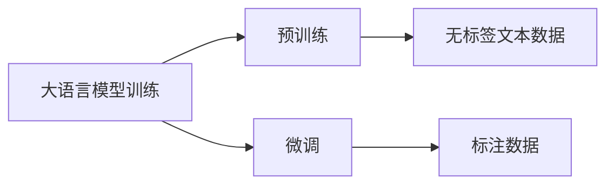

## 1.背景介绍

在过去的几年里，我们见证了人工智能领域的一场革命。特别是在自然语言处理（NLP）领域，大规模的预训练语言模型（例如GPT-3、BERT等）的出现，使得机器能够更好地理解和生成人类语言。这些大语言模型的出现，不仅改变了我们处理文本数据的方式，也为各种各样的应用场景提供了可能性。本文将深入探讨大语言模型的概念、原理以及应用。

## 2.核心概念与联系

大语言模型是一种利用深度学习技术，通过在大量文本数据上进行预训练，从而能够生成人类语言的模型。这些模型的核心是一个神经网络，通常是一个Transformer网络，它能够处理序列数据，并捕捉到文本中的复杂模式。


## 3.核心算法原理具体操作步骤

大语言模型的训练通常分为两个阶段：预训练和微调。预训练阶段，模型会在大量的无标签文本数据上进行训练，学习到语言的统计规律。微调阶段，模型会在特定任务的标注数据上进行训练，以便更好地完成特定的任务。



## 4.数学模型和公式详细讲解举例说明

大语言模型的训练过程可以用数学公式来表示。在预训练阶段，我们的目标是最大化模型对文本数据的似然估计：

$$
\max_{\theta} \sum_{i=1}^{N} \log P(x_i | x_{<i}; \theta)
$$

其中$x_i$表示文本中的第$i$个词，$x_{<i}$表示词$x_i$之前的所有词，$\theta$表示模型的参数。这个公式表示的是我们希望模型能够尽可能地准确预测每一个词。

## 5.项目实践：代码实例和详细解释说明

在Python中，我们可以使用Hugging Face的Transformers库来使用预训练的大语言模型。以下是一个使用GPT-3生成文本的简单示例：

```python
from transformers import GPT3LMHeadModel, GPT3Tokenizer

tokenizer = GPT3Tokenizer.from_pretrained('gpt3')
model = GPT3LMHeadModel.from_pretrained('gpt3')

input_ids = tokenizer.encode('I love programming because', return_tensors='pt')
output = model.generate(input_ids, max_length=50, temperature=0.7)

print(tokenizer.decode(output[0], skip_special_tokens=True))
```

## 6.实际应用场景

大语言模型在许多实际应用场景中都发挥了重要作用。例如，在自然语言理解任务中，它们可以用来进行情感分析、文本分类等。在自然语言生成任务中，它们可以用来进行文本生成、机器翻译等。此外，它们还可以用来进行问答、对话系统等任务。

## 7.工具和资源推荐

如果你想深入学习大语言模型，以下是一些推荐的工具和资源：

- Hugging Face的Transformers库：这是一个非常强大的库，提供了许多预训练模型以及相关的工具。
- OpenAI的GPT-3：这是目前最大的语言模型，你可以在OpenAI的网站上申请使用。
- Google的BERT：这是一种基于Transformer的预训练模型，有很多变种，应用非常广泛。

## 8.总结：未来发展趋势与挑战

大语言模型无疑是人工智能领域的一项重要技术，它们的出现极大地推动了自然语言处理的发展。然而，它们也面临着许多挑战，例如模型的解释性、数据的隐私问题、模型的公平性等。未来，我们需要在保持模型性能的同时，解决这些挑战。

## 9.附录：常见问题与解答

1. **问**：大语言模型是如何理解语言的？
   
   **答**：大语言模型并不真正“理解”语言，它们只是学习到了语言的统计规律。当我们输入一段文本时，模型会根据它在训练数据中学到的规律，生成最可能的下一个词。

2. **问**：大语言模型可以用在哪些任务上？

   **答**：大语言模型可以用在许多自然语言处理任务上，例如文本生成、情感分析、文本分类、机器翻译、问答等。

作者：禅与计算机程序设计艺术 / Zen and the Art of Computer Programming