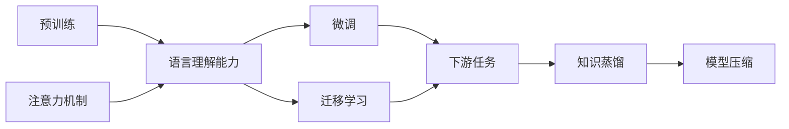

# 大语言模型应用指南：基础

## 1. 背景介绍
### 1.1 大语言模型概述
#### 1.1.1 定义与特点
大语言模型(Large Language Model, LLM)是一种基于深度学习的自然语言处理模型,通过在海量文本数据上进行预训练,可以学习到丰富的语言知识和语义信息。与传统的自然语言处理模型相比,大语言模型具有参数量大、语言理解能力强、通用性好等特点。

#### 1.1.2 发展历程
大语言模型的发展可以追溯到2018年,GPT(Generative Pre-trained Transformer)的提出开启了预训练语言模型的新时代。此后,BERT、XLNet、GPT-2等大语言模型相继问世,不断刷新各项NLP任务的性能记录。2020年,GPT-3的发布将大语言模型推向新的高度,其强大的zero-shot和few-shot学习能力令人惊叹。

### 1.2 大语言模型的应用价值
#### 1.2.1 自然语言处理
大语言模型为自然语言处理领域带来了革命性的变化。通过在大规模语料上预训练,LLM可以学习到丰富的语言知识,大幅提升文本分类、命名实体识别、关系抽取、机器翻译、文本摘要等NLP任务的性能,甚至在一些任务上达到了超越人类的水平。

#### 1.2.2 知识图谱
知识图谱是结构化知识的有效表示方式。大语言模型可以通过从文本中抽取实体和关系,自动构建高质量的知识图谱。同时LLM还可以利用知识图谱进行知识增强,提升语言理解和生成的质量。

#### 1.2.3 智能问答
基于大语言模型构建的智能问答系统,可以利用从海量文本中学习到的知识,准确理解用户问题并给出相关的答案。相比基于关键词匹配的传统问答,LLM驱动的问答更加智能,回答更加自然流畅。

#### 1.2.4 内容生成
大语言模型强大的语言生成能力,使其在内容创作领域具有广阔的应用前景。LLM可以根据上下文自动生成连贯的文本,应用于新闻写作、小说创作、广告文案、对话生成等。GPT-3的出现,更是催生了AI写作助手等创新应用。

## 2. 核心概念与联系
### 2.1 预训练(Pre-training)
预训练是大语言模型的核心,通过在大规模无标注语料上进行自监督学习,模型可以自动学习语言的统计规律和深层次语义信息。常见的预训练任务有语言模型、去噪自编码、对比学习等。预训练使得LLM具备良好的语言理解能力,为下游任务提供了优质的初始化参数。

### 2.2 微调(Fine-tuning)
微调是利用预训练语言模型解决具体任务的常用范式。将预训练模型在下游任务的标注数据上进行监督学习,通过反向传播调整模型参数,使其适应特定任务。微调一般只需较少的任务数据和训练轮数,即可取得不错的效果。

### 2.3 注意力机制(Attention Mechanism)
注意力机制是大语言模型的重要组成部分,尤其是Transformer结构的广泛应用,更加凸显了注意力机制的重要性。通过注意力机制,模型可以动态地关注输入序列中与当前预测最相关的信息,提取关键语义并建模长距离依赖。

### 2.4 迁移学习(Transfer Learning)
大语言模型是迁移学习的典型应用。将在大规模语料上学到的通用语言知识,迁移到下游的具体NLP任务中,可以显著提升模型性能,尤其在标注数据稀缺的情况下。迁移学习分为特定任务迁移和通用语言迁移两种范式。

### 2.5 知识蒸馏(Knowledge Distillation)
尽管大语言模型性能卓越,但其参数量巨大,推理速度较慢,不利于实际应用。知识蒸馏可以将大模型的知识转移到小模型中,在保持较高性能的同时,大幅压缩模型体积,加快推理速度。BERT-PKD、TinyBERT、DistilBERT等都是知识蒸馏的成功案例。

### 2.6 联系总结
大语言模型的核心概念环环相扣,构成了LLM的理论和应用基础。预训练是大语言模型的根本,奠定了模型的语言理解能力。微调和迁移学习是应用LLM解决实际问题的关键手段。注意力机制是模型的重要组成,赋予其捕捉关键信息的能力。知识蒸馏则是提高LLM实用性的有效途径。这些概念的有机结合,推动了大语言模型的飞速发展。

## 3. 核心算法原理具体操作步骤
### 3.1 Transformer结构
#### 3.1.1 自注意力层
1. 将输入序列X通过线性变换得到查询矩阵Q、键矩阵K、值矩阵V
2. 计算Q与K的点积并除以 $\sqrt{d_k}$ ,得到注意力分数
3. 对注意力分数应用softmax函数,得到注意力权重
4. 将注意力权重与V相乘,得到自注意力层输出

#### 3.1.2 前馈神经网络层
1. 将自注意力层输出通过两层全连接网络,中间用ReLU激活
2. 残差连接,将前馈网络输出与自注意力层输出相加
3. Layer Normalization层归一化

#### 3.1.3 Encoder-Decoder结构
1. 将输入序列通过N个Encoder层,得到编码表示
2. 将编码表示通过N个Decoder层,同时考虑目标序列信息,得到最终输出
3. Decoder中的自注意力层使用masked self-attention,避免看到未来信息

### 3.2 BERT预训练
#### 3.2.1 Masked Language Model(MLM)
1. 随机mask输入序列中15%的token,用[MASK]符号替换
2. 将masked序列输入BERT,得到每个位置的输出向量
3. 将mask位置的输出向量通过全连接层和softmax,预测原始token
4. 计算预测结果与真实token的交叉熵损失

#### 3.2.2 Next Sentence Prediction(NSP)
1. 从语料中抽取连续的句子对(A,B),其中50%的B是A的下一句,50%是随机句子
2. 将句子对拼接并输入BERT,得到[CLS]位置的输出向量
3. 将[CLS]向量通过全连接层和sigmoid,预测B是否为A的下一句
4. 计算预测结果与真实标签的二元交叉熵损失

### 3.3 GPT预训练
#### 3.3.1 Language Modeling(LM)
1. 将输入序列X通过GPT模型,得到每个位置的输出向量
2. 将第t个位置的输出向量通过全连接层和softmax,预测第t+1个token
3. 计算预测结果与真实token的交叉熵损失
4. 对所有位置的损失求平均,得到整个序列的语言模型损失

### 3.4 微调与推理
#### 3.4.1 文本分类任务
1. 在预训练模型最后添加全连接层,输出维度为类别数
2. 将任务数据中的文本输入模型,得到[CLS]位置的输出向量
3. 将[CLS]向量通过新增的全连接层,预测文本类别
4. 计算预测结果与真实标签的交叉熵损失,并用梯度下降法优化

#### 3.4.2 序列标注任务
1. 在预训练模型最后添加全连接层,输出维度为标签类别数
2. 将任务数据中的文本输入模型,得到每个位置的输出向量
3. 将每个位置的输出向量通过新增的全连接层,预测对应token的标签
4. 计算预测结果与真实标签的交叉熵损失,并用梯度下降法优化

#### 3.4.3 文本生成任务
1. 将输入文本编码并输入GPT模型,得到最后一个token的输出向量
2. 将输出向量通过全连接层和softmax,预测下一个token的概率分布
3. 根据预测概率采样或选择概率最大的token作为生成结果
4. 将生成的token拼接到输入,重复步骤1-3,直到达到最大长度或遇到终止符

## 4. 数学模型和公式详细讲解举例说明
### 4.1 Transformer中的注意力机制
#### 4.1.1 Scaled Dot-Product Attention
Transformer中的注意力机制可以表示为:

$$Attention(Q,K,V) = softmax(\frac{QK^T}{\sqrt{d_k}})V$$

其中,$Q$是查询矩阵,$K$是键矩阵,$V$是值矩阵,$d_k$是键向量的维度。将查询矩阵和键矩阵做点积,并除以 $\sqrt{d_k}$ 进行缩放,然后应用softmax函数得到注意力权重,最后与值矩阵相乘得到注意力输出。

例如,假设有一个长度为n的输入序列,每个token的嵌入维度为d。通过线性变换得到的Q、K、V矩阵都是 $n \times d$ 的。对于第i个位置的查询向量 $q_i$ ,与所有位置的键向量 $k_j$ 计算点积,得到注意力分数:

$$\alpha_{ij} = \frac{q_i \cdot k_j}{\sqrt{d}}$$

然后对所有位置的注意力分数应用softmax:

$$\hat{\alpha}_{ij} = \frac{exp(\alpha_{ij})}{\sum_{j=1}^n exp(\alpha_{ij})}$$

最后,将注意力权重与值向量 $v_j$ 相乘并求和,得到第i个位置的注意力输出:

$$o_i = \sum_{j=1}^n \hat{\alpha}_{ij} v_j$$

#### 4.1.2 Multi-Head Attention
为了捕捉不同子空间的信息,Transformer使用多头注意力机制。将Q、K、V矩阵分别乘以 $h$ 组不同的权重矩阵 $W_i^Q, W_i^K, W_i^V$ ,得到 $h$ 组不同的查询、键、值矩阵:

$$head_i = Attention(QW_i^Q, KW_i^K, VW_i^V)$$

其中, $W_i^Q \in \mathbb{R}^{d \times d_k}, W_i^K \in \mathbb{R}^{d \times d_k}, W_i^V \in \mathbb{R}^{d \times d_v}$, $d_k=d_v=d/h$ 。

然后,将所有头的输出拼接起来,再乘以权重矩阵 $W^O$ 得到最终的多头注意力输出:

$$MultiHead(Q,K,V) = Concat(head_1, ..., head_h)W^O$$

其中, $W^O \in \mathbb{R}^{hd_v \times d}$ 。

### 4.2 BERT中的MLM和NSP损失
#### 4.2.1 MLM损失
对于masked位置 $i$ ,设真实token为 $w_i$ ,BERT的输出向量为 $h_i$ ,词表大小为 $|V|$ ,MLM损失可以表示为:

$$L_{MLM}(i) = -\log \frac{\exp(h_i^T e(w_i))}{\sum_{j=1}^{|V|} \exp(h_i^T e(w_j))}$$

其中, $e(w)$ 表示token $w$ 的嵌入向量。对所有masked位置的损失求平均,得到整个序列的MLM损失:

$$L_{MLM} = \frac{1}{N} \sum_{i=1}^N L_{MLM}(i)$$

其中, $N$ 是masked位置的数量。

#### 4.2.2 NSP损失
设句子对标签为 $y$ (下一句为1,否则为0),BERT的[CLS]输出向量为 $h_{CLS}$ ,NSP损失可以表示为:

$$L_{NSP} = -[y \log \sigma(w^T h_{CLS}) + (1-y) \log (