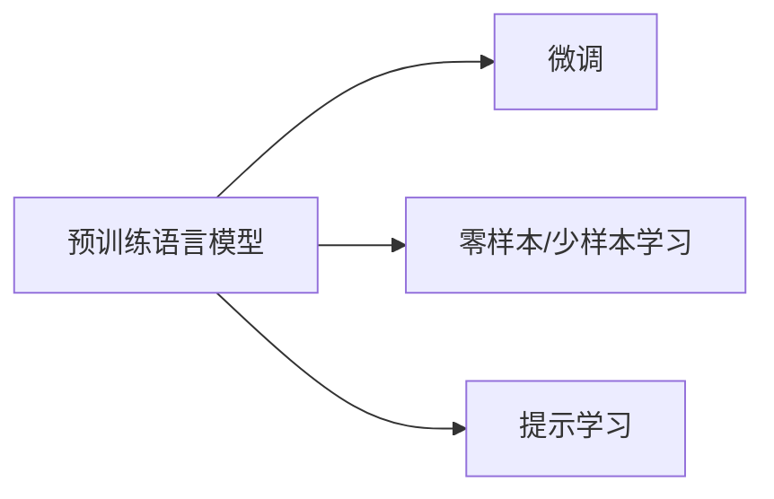

# 大语言模型应用指南：大语言模型的生态系统

## 1. 背景介绍

### 1.1 大语言模型的兴起
近年来,自然语言处理(NLP)领域取得了突破性的进展,尤其是随着深度学习技术的发展,大规模预训练语言模型(Pretrained Language Models, PLMs)成为了NLP领域的研究热点。这些大语言模型在多个NLP任务上取得了显著的性能提升,展现出强大的语言理解和生成能力。

### 1.2 大语言模型的应用潜力
大语言模型不仅在学术界备受关注,在工业界也有广泛的应用前景。许多科技巨头和创业公司都在积极探索大语言模型技术,将其应用于智能客服、语音助手、机器翻译、文本摘要、知识问答等领域。大语言模型强大的语言能力为人机交互、信息检索、内容生成等应用场景带来了新的机遇。

### 1.3 大语言模型生态系统概述
随着大语言模型的不断发展,围绕着大语言模型技术逐渐形成了一个蓬勃发展的生态系统。这个生态系统包括了预训练模型、微调技术、评估方法、数据集、开源框架等多个方面。理解大语言模型生态系统的全貌,对于有效应用大语言模型技术至关重要。本文将全面介绍大语言模型生态系统的各个组成部分,并探讨如何在实践中应用大语言模型技术。

## 2. 核心概念与联系

### 2.1 预训练语言模型(PLMs)
预训练语言模型是指在大规模无标注文本语料上进行预训练,学习通用的语言表示的模型。这些模型通过自监督学习的方式,在海量文本数据中捕捉词汇、语法、语义等多层次的语言知识。常见的预训练模型包括BERT、GPT、XLNet等。

### 2.2 微调(Fine-tuning)
微调是指在特定任务上,使用少量标注数据对预训练模型进行进一步训练的过程。通过微调,预训练模型可以快速适应下游任务,在小样本场景下取得优异的性能。微调是应用预训练语言模型的重要技术。

### 2.3 零样本/少样本学习
零样本学习和少样本学习是指在没有或很少标注数据的情况下进行学习的方法。大语言模型强大的语言理解能力使其在零样本/少样本场景下表现出色,大大降低了对标注数据的依赖。

### 2.4 提示学习(Prompt Learning)
提示学习是一种利用自然语言提示来引导语言模型执行特定任务的方法。通过设计合适的提示模板,可以让语言模型在零样本/少样本情况下完成各种任务,如文本分类、问答、摘要等。提示学习进一步释放了大语言模型的潜力。

### 2.5 概念之间的联系
预训练语言模型是大语言模型生态系统的基础,它们通过在大规模语料上学习通用语言知识,为下游任务提供了强大的语言理解能力。微调技术使得预训练模型可以快速适应特定任务。零样本/少样本学习和提示学习则进一步扩展了预训练模型的应用范围,使其在标注数据稀缺的情况下依然能够发挥作用。这些概念相互关联,共同构成了大语言模型生态系统的核心。



## 3. 核心算法原理具体操作步骤

### 3.1 预训练语言模型的训练过程
预训练语言模型的训练过程通常包括以下步骤:

1. 数据准备:收集大规模无标注文本语料,进行清洗、分词等预处理。
2. 模型构建:选择合适的神经网络架构,如Transformer,并设置模型参数。
3. 预训练任务设计:设计自监督学习任务,如掩码语言模型(MLM)、下一句预测(NSP)等。
4. 模型训练:在预处理后的语料上训练模型,通过最小化预训练任务的损失函数来优化模型参数。
5. 模型评估:在验证集上评估模型的性能,如MLM准确率、NSP准确率等。
6. 模型发布:将训练好的模型参数发布,供下游任务使用。

### 3.2 微调的具体步骤
在特定任务上微调预训练语言模型通常包括以下步骤:

1. 任务定义:明确下游任务的输入输出形式,选择合适的数据集。
2. 模型选择:选择预训练模型,如BERT、GPT等,并根据任务需要调整模型结构。
3. 数据准备:对下游任务的数据进行预处理,转换为模型需要的输入格式。
4. 微调:在下游任务的标注数据上对预训练模型进行微调,通过最小化任务特定的损失函数来优化模型参数。
5. 模型评估:在下游任务的验证集上评估微调后模型的性能。
6. 模型部署:将微调后的模型部署到生产环境,用于实际应用。

### 3.3 提示学习的实现流程
提示学习的实现流程通常包括以下步骤:

1. 任务分析:分析目标任务的输入输出形式,确定适合的提示模板。
2. 提示模板设计:根据任务特点设计自然语言提示模板,引导模型完成任务。
3. 数据准备:将任务输入转换为提示模板的形式,构建提示数据集。
4. 模型选择:选择预训练语言模型,如GPT-3等,根据任务需要调整模型参数。
5. 推理:将提示数据输入到模型中,生成对应的输出结果。
6. 结果评估:评估生成结果的质量,如准确率、流畅度等。
7. 迭代优化:根据评估结果,调整提示模板和模型参数,不断优化性能。

通过以上步骤,预训练语言模型、微调和提示学习等技术可以有效应用于各种自然语言处理任务,实现大语言模型的落地应用。

## 4. 数学模型和公式详细讲解举例说明

### 4.1 Transformer模型
Transformer是大语言模型的核心架构,它通过自注意力机制(Self-Attention)实现了并行计算和长距离依赖建模。Transformer的核心是注意力机制(Attention),其数学表达式为:

$$
Attention(Q,K,V) = softmax(\frac{QK^T}{\sqrt{d_k}})V
$$

其中,$Q$,$K$,$V$分别表示查询(Query)、键(Key)、值(Value),$d_k$为键向量的维度。注意力机制通过计算查询和键的相似度,对值进行加权求和,得到注意力输出。

Transformer中的自注意力机制将输入序列的每个位置都视为查询,计算其与所有位置的注意力权重,实现了并行计算和长距离依赖建模。

### 4.2 掩码语言模型(MLM)
掩码语言模型是BERT等预训练模型常用的预训练任务之一。其目标是根据上下文预测被掩码的单词。数学上,MLM的损失函数可以表示为:

$$
\mathcal{L}_{MLM} = -\sum_{i=1}^{N}m_i\log p(w_i|w_{\backslash i})
$$

其中,$N$为序列长度,$m_i$为掩码指示变量($m_i=1$表示第$i$个位置被掩码),$w_i$为第$i$个位置的单词,$w_{\backslash i}$表示除第$i$个位置外的其他单词。通过最小化MLM损失函数,模型可以学习到上下文信息,捕捉单词之间的依赖关系。

### 4.3 对比学习
对比学习是一种自监督学习方法,通过最大化正样本对的相似度,最小化负样本对的相似度,来学习数据的表示。在SimCSE等对比学习的语言模型中,损失函数可以表示为:

$$
\mathcal{L}_{CL} = -\log \frac{e^{sim(h_i,h_i^+)/\tau}}{\sum_{j=1}^{N}e^{sim(h_i,h_j)/\tau}}
$$

其中,$h_i$和$h_i^+$为正样本对的表示,$h_j$为负样本的表示,$sim(\cdot,\cdot)$为相似度函数,$\tau$为温度超参数。通过最小化对比学习损失函数,模型可以学习到更加有区分性的语言表示。

以上数学模型和公式是大语言模型中的一些典型示例,它们分别体现了Transformer架构、自监督预训练任务、对比学习等关键技术。通过这些数学模型的设计和优化,大语言模型可以有效地学习语言知识,实现强大的语言理解和生成能力。

## 5. 项目实践：代码实例和详细解释说明

下面以PyTorch为例,展示如何使用Hugging Face的Transformers库来微调预训练语言模型,实现文本分类任务。

```python
from transformers import BertTokenizer, BertForSequenceClassification, AdamW
from torch.utils.data import DataLoader, RandomSampler, SequentialSampler
from torch.utils.data import TensorDataset, random_split
import torch

# 加载预训练模型和分词器
model_name = 'bert-base-uncased'
tokenizer = BertTokenizer.from_pretrained(model_name)
model = BertForSequenceClassification.from_pretrained(model_name, num_labels=2)

# 准备数据
texts = [...]  # 文本数据
labels = [...]  # 对应的标签

# 将文本转换为模型输入
input_ids = []
attention_masks = []
for text in texts:
    encoded_dict = tokenizer.encode_plus(
        text,
        add_special_tokens=True,
        max_length=128,
        pad_to_max_length=True,
        return_attention_mask=True,
        return_tensors='pt'
    )
    input_ids.append(encoded_dict['input_ids'])
    attention_masks.append(encoded_dict['attention_mask'])

input_ids = torch.cat(input_ids, dim=0)
attention_masks = torch.cat(attention_masks, dim=0)
labels = torch.tensor(labels)

# 构建数据集和数据加载器
dataset = TensorDataset(input_ids, attention_masks, labels)
train_size = int(0.9 * len(dataset))
val_size = len(dataset) - train_size
train_dataset, val_dataset = random_split(dataset, [train_size, val_size])

batch_size = 32
train_dataloader = DataLoader(
    train_dataset,
    sampler=RandomSampler(train_dataset),
    batch_size=batch_size
)
validation_dataloader = DataLoader(
    val_dataset,
    sampler=SequentialSampler(val_dataset),
    batch_size=batch_size
)

# 定义优化器和学习率调度器
optimizer = AdamW(model.parameters(), lr=2e-5, eps=1e-8)
epochs = 3
total_steps = len(train_dataloader) * epochs
scheduler = get_linear_schedule_with_warmup(optimizer, num_warmup_steps=0, num_training_steps=total_steps)

# 训练模型
device = torch.device("cuda" if torch.cuda.is_available() else "cpu")
model.to(device)

for epoch in range(epochs):
    model.train()
    for batch in train_dataloader:
        batch = tuple(t.to(device) for t in batch)
        inputs = {'input_ids': batch[0], 'attention_mask': batch[1], 'labels': batch[2]}
        outputs = model(**inputs)
        loss = outputs[0]
        loss.backward()
        torch.nn.utils.clip_grad_norm_(model.parameters(), 1.0)
        optimizer.step()
        scheduler.step()
        optimizer.zero_grad()

    model.eval()
    eval_loss = 0
    eval_accuracy = 0
    for batch in validation_dataloader:
        batch = tuple(t.to(device) for t in batch)
        with torch.no_grad():
            inputs = {'input_ids': batch[0], 'attention_mask': batch[1], 'labels': batch[2]}
            outputs = model(**inputs)
        logits = outputs[1]
        predictions = torch.argmax(logits, dim=-1)
        eval_loss += outputs[0].item()
        eval_accuracy += torch.sum(predictions == batch[2]).item()
    
    print(f"Epoch {epoch+1}: Val Loss: {eval_loss/len(validation_dataloader)}, Val Acc: {eval_accuracy/len(val_dataset)}")

# 保存微调后的模型
model.save_pretrained("./finetuned_model")
```

以上代码实现了使用BERT模型进行文本分类的微调过程。主要步骤包括:

1. 加载预训练的BERT模