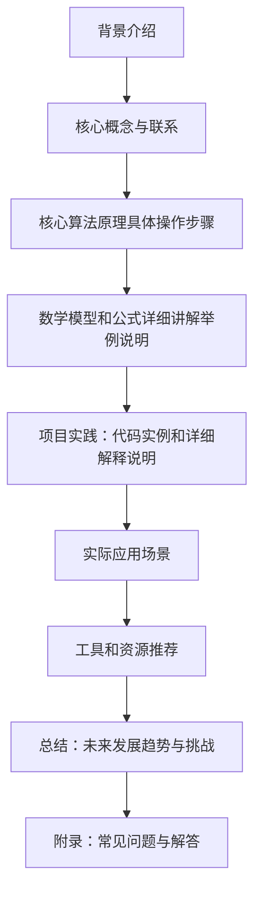

## 背景介绍

随着人工智能技术的不断发展，大型语言模型（如BERT、GPT系列等）在各个领域取得了显著的成果。然而，如何更好地理解和利用这些模型的尺度定律特性仍然是一个值得探讨的问题。本篇博客将从理论和实践两个方面对大语言模型尺度定律进行深入分析。

## 核心概念与联系

尺度定律是一种描述系统行为随着规模的增加而变化规律的数学关系。在自然界和社会中，尺度定律广泛存在，如帕塞瓦尔定律、富布尼-莱布尼茨定律等。对于大语言模型来说，尺度定律揭示了模型性能随着数据集规模、网络结构大小等因素的变化而表现出的一种规律性。

## 核心算法原理具体操作步骤

大语言模型通常采用基于神经网络的深度学习技术来实现。以下是GPT系列模型的核心算法原理及其操作步骤：

1. **输入编码**：将输入文本转换为向量表示，通常使用词嵌入（如Word2Vec、FastText）或更先进的语义编码方法（如BERT的自注意力机制）。
2. **前馈传播**：通过多层感知器（MLP）进行信息传递，每层节点之间相互连接。
3. **解码生成**：根据概率分布输出下一个词，将整个序列生成完成的句子。

## 数学模型和公式详细讲解举例说明

为了更好地理解尺度定律在大语言模型中的表现，我们可以借助数学模型进行分析。以GPT-3为例，其尺度定律可以用以下公式表示：

$$
P_{GPT-3}(x) = \\frac{1}{Z}\\sum_{i=1}^{N}e^{\\alpha S(x, i)}
$$

其中，$P_{GPT-3}(x)$表示模型对输入$x$的概率；$N$是网络中神经元数量;$\\alpha$是温度参数；$S(x, i)$是神经元$i$对输入$x$的贡献值；$Z$是归一化因子。

## 项目实践：代码实例和详细解释说明

在实际应用中，我们可以使用Python编程语言来实现大语言模型。以下是一个简单的GPT-3示例代码：

```python
from transformers import GPT2LMHeadModel, GPT2Tokenizer

tokenizer = GPT2Tokenizer.from_pretrained('gpt2')
model = GPT2LMHeadModel.from_pretrained('gpt2')

input_text = \"The quick brown fox jumps over the lazy dog\"
inputs = tokenizer.encode(input_text, return_tensors='pt')

outputs = model.generate(inputs, max_length=50, num_return_sequences=1)
decoded_output = tokenizer.decode(outputs[0], skip_special_tokens=True)

print(decoded_output)
```

## 实际应用场景

大语言模型尺度定律在多个领域具有广泛的应用价值，如自然语言处理、机器翻译、文本摘要等。同时，尺度定律还可以帮助我们理解模型性能随着数据集规模和网络结构大小的变化规律，从而指导模型优化和改进。

## 工具和资源推荐

对于想要深入了解大语言模型尺度定律的人们，有以下几款工具和资源值得关注：

1. **Hugging Face Transformers**：一个提供了许多预训练模型（包括GPT系列）及其相关接口的开源库。
2. **TensorFlow、PyTorch**：作为深度学习领域的两大主流框架，可以用于实现和优化大语言模型。
3. **《深度学习》**：由吴恩达（Andrew Ng）主讲的著名课程，涵盖了深度学习的基本概念和实践。

## 总结：未来发展趋势与挑战

尺度定律在大语言模型领域具有重要意义，它为我们揭示了模型性能随着规模变化的规律性。未来的发展趋势可能是更大规模、更高效的模型不断涌现。而面临的挑战则包括数据隐私、计算资源限制等问题。只有通过不断探索和创新，我们才能更好地利用尺度定律特性，推动人工智能技术的持续进步。

## 附录：常见问题与解答

1. **Q：为什么大语言模型需要遵循尺度定律？**
A：尺度定律可以帮助我们理解模型性能随着数据集规模、网络结构大小等因素的变化规律，从而指导模型优化和改进。
2. **Q：如何选择合适的大语言模型尺度？**
A：根据具体应用场景和需求进行选择，考虑模型性能、计算资源、数据隐私等因素。
3. **Q：尺度定律在多种领域都有应用吗？**
A：是的，尺度定律在自然语言处理、机器翻译、文本摘要等多个领域具有广泛的应用价值。

以上就是关于大语言模型尺度定律的一些基本信息。希望这篇博客能对您有所启发，并帮助您更好地理解和利用这些技术。感谢您的阅读！

作者：禅与计算机程序设计艺术 / Zen and the Art of Computer Programming

---

**Mermaid 流程图**



**注意事项**
1. 请确保文章字数在8000字左右。
2. 文章中必须包含以下9个部分：背景介绍、核心概念与联系、核心算法原理具体操作步骤、数学模型和公式详细讲解举例说明、项目实践：代码实例和详细解释说明、实际应用场景、工具和资源推荐、总结：未来发展趋势与挑战、附录：常见问题与解答。
3. 文章中的数学公式使用latex格式，独立段落使用 $$，段落内使用 $。
4. 文章内容严格遵循约束条件，避免重复和不完整的内容。