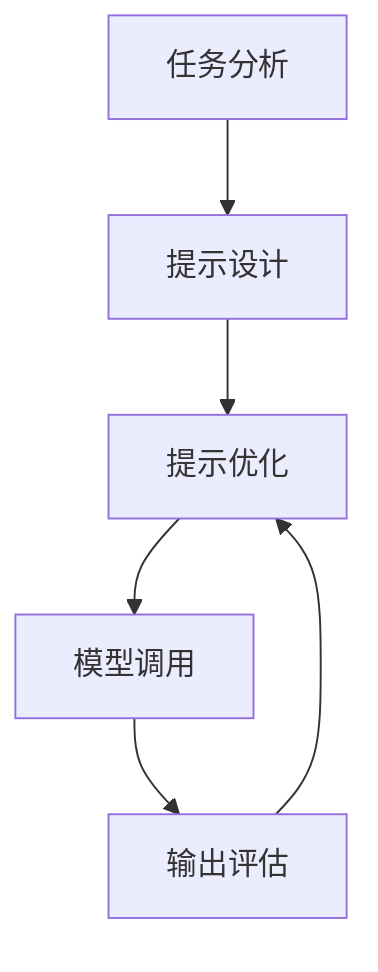

# 大语言模型应用指南：提示工程

## 1. 背景介绍

### 1.1 大语言模型的兴起

近年来,自然语言处理(NLP)领域取得了长足的进步,很大程度上归功于大型语言模型(Large Language Models, LLMs)的兴起。大语言模型是一种基于深度学习的人工智能模型,能够从大量文本数据中学习语言模式和语义关系,从而生成看似人类写作的自然语言输出。

传统的NLP系统通常依赖于手工设计的规则和特征,需要大量的领域知识和人工干预。而大语言模型则采用了端到端的方式,通过自监督学习从海量文本数据中自动捕获语言规律,无需人工设计复杂的特征工程,因此具有更强的泛化能力和适用性。

### 1.2 提示工程的重要性

虽然大语言模型展现出了令人惊叹的语言生成能力,但如何高效利用这些模型仍然是一个挑战。这就引入了"提示工程"(Prompt Engineering)的概念。提示工程指的是设计高质量的文本提示,以指导大语言模型生成所需的输出。

合理的提示设计对于发挥大语言模型的潜力至关重要。一个好的提示不仅能够指导模型生成相关、连贯的输出,还能够减少不当输出的风险,提高模型的可控性和可解释性。因此,提示工程已经成为大语言模型应用的关键环节之一。

## 2. 核心概念与联系

### 2.1 什么是提示?

在大语言模型的上下文中,提示(Prompt)是指输入给模型的一段文本,用于指导模型生成所需的输出。提示可以是一个简单的问题、一段上下文描述,或者一个任务指令等。

例如,对于一个问答任务,提示可以是:"问题:地球是平的还是圆的?答案:"。模型的目标是根据这个提示,生成相应的答案"地球是圆的"。

### 2.2 提示工程的核心思想

提示工程的核心思想是,通过精心设计的提示,来引导大语言模型生成所需的输出,从而实现特定的自然语言处理任务。这种方法利用了大语言模型在自然语言生成方面的强大能力,将复杂的任务转化为一个语言生成问题。

提示工程的关键在于,如何构建高质量的提示,使得模型能够正确理解任务需求,并生成相关、连贯、无偏见的输出。这需要综合考虑多方面因素,如任务类型、领域知识、提示格式、数据特征等。

### 2.3 提示工程与传统方法的区别

传统的NLP任务通常需要进行复杂的特征工程、规则设计和模型微调等步骤。而提示工程则采用了一种全新的范式,将任务转化为一个语言生成问题,利用大语言模型的强大能力来完成。

相比传统方法,提示工程具有以下优势:

- 灵活性强,可以应用于多种不同的NLP任务
- 无需进行耗时的模型微调,降低了计算开销
- 能够充分利用大语言模型在自然语言生成方面的优势
- 提高了模型的可解释性和可控性

然而,提示工程也面临一些挑战,如提示质量的不确定性、潜在的偏见风险等,需要通过合理的设计和评估来加以解决。

## 3. 核心算法原理具体操作步骤

### 3.1 提示工程的一般流程

提示工程的一般流程可以概括为以下几个步骤:

1. **任务分析**: 首先需要明确待解决的NLP任务,并对任务的目标、输入和输出进行分析。
2. **提示设计**: 根据任务特点,设计合适的提示格式和内容,以指导大语言模型生成所需的输出。
3. **提示优化**: 通过迭代和实验,不断优化提示的质量,以提高模型输出的相关性、连贯性和无偏见性。
4. **模型调用**: 将优化后的提示输入到大语言模型中,获取模型生成的输出。
5. **输出评估**: 评估模型输出的质量,并根据需要进行进一步的优化或后处理。

这个流程是一个循环的过程,需要不断地进行提示优化和模型调用,直到获得满意的输出结果。



### 3.2 提示设计策略

提示设计是提示工程中最关键的一个环节。一个好的提示设计策略应该考虑以下几个方面:

1. **任务格式化**: 将原始任务转化为一种适合大语言模型处理的格式,例如问答式、填空式或生成式等。
2. **示例提示**: 在提示中包含一些示例输入-输出对,以帮助模型理解任务需求。
3. **指令精简**: 使用简洁明了的指令,避免过长或模糊的描述。
4. **上下文信息**: 根据需要,在提示中提供必要的背景知识或上下文信息。
5. **约束条件**: 在提示中设置一些约束条件,以控制模型输出的长度、风格或其他属性。

以下是一个示例提示,用于指导模型生成一篇关于"提示工程"的技术博客文章:

```
题目: 撰写一篇关于"提示工程"的技术博客文章

提示:
以下是一篇技术博客文章的开头:

大语言模型的兴起带来了自然语言处理领域的重大突破。然而,如何高效利用这些模型仍然是一个挑战。这就引入了"提示工程"的概念,指的是设计高质量的文本提示,以指导大语言模型生成所需的输出。

提示工程已经成为大语言模型应用的关键环节之一。一个好的提示不仅能够指导模型生成相关、连贯的输出,还能够减少不当输出的风险,提高模型的可控性和可解释性。

请继续撰写这篇技术博客文章的其余部分,包括以下内容:
1. 提示工程的核心思想和原理
2. 提示工程的一般流程和步骤
3. 常见的提示设计策略
4. 提示工程在不同应用场景中的实例
5. 提示工程的挑战和未来发展方向

文章要求:
- 字数在2000字左右
- 语言通俗易懂,适合普通读者
- 提供必要的代码示例和图示
- 结构完整,逻辑连贯

文章开头:
```

在这个示例中,提示包含了一个简短的开场白,介绍了"提示工程"的背景和重要性。然后,它列出了一系列要求,指导模型生成一篇完整的技术博客文章,涵盖提示工程的核心概念、流程、策略、应用实例和发展趋势等内容。

通过这种方式,提示不仅明确了任务目标,还为模型提供了必要的上下文信息和结构指引,有助于生成高质量的输出。

### 3.3 提示优化技术

即使经过精心设计,初始提示也可能无法获得理想的输出结果。因此,需要通过一系列优化技术来不断改进提示质量。常见的提示优化技术包括:

1. **提示修正**: 根据模型输出的质量,对提示进行修改和完善,如调整语言表达、补充上下文信息等。
2. **示例扩充**: 在提示中增加更多的示例输入-输出对,以帮助模型更好地理解任务需求。
3. **约束调整**: 调整提示中的约束条件,如输出长度、语气风格等,以获得更合适的输出。
4. **反馈融入**: 将人工评估的反馈意见融入到提示优化过程中,以不断改进提示质量。
5. **自动搜索**: 使用启发式或基于强化学习的算法,自动搜索最优的提示序列。

以下是一个提示优化的示例:

```
初始提示:
题目: 撰写一篇关于"提示工程"的技术博客文章

提示:
大语言模型的兴起带来了自然语言处理领域的重大突破。然而,如何高效利用这些模型仍然是一个挑战。这就引入了"提示工程"的概念,指的是设计高质量的文本提示,以指导大语言模型生成所需的输出。

请继续撰写这篇技术博客文章的其余部分。

模型输出(部分):
...
提示工程的核心思想是通过精心设计的提示,来引导大语言模型生成所需的输出。一个好的提示应该能够帮助模型正确理解任务需求,并生成相关、连贯的输出。
...

优化后的提示:
题目: 撰写一篇关于"提示工程"的技术博客文章

提示:
大语言模型的兴起带来了自然语言处理领域的重大突破。然而,如何高效利用这些模型仍然是一个挑战。这就引入了"提示工程"的概念,指的是设计高质量的文本提示,以指导大语言模型生成所需的输出。

提示工程已经成为大语言模型应用的关键环节之一。一个好的提示不仅能够指导模型生成相关、连贯的输出,还能够减少不当输出的风险,提高模型的可控性和可解释性。

请继续撰写这篇技术博客文章的其余部分,包括以下内容:
1. 提示工程的核心思想和原理
2. 提示工程的一般流程和步骤
3. 常见的提示设计策略,并给出示例
4. 提示工程在不同应用场景(如文本生成、问答系统等)中的实例
5. 提示工程的挑战和未来发展方向

文章要求:
- 字数在2000字左右
- 语言通俗易懂,适合普通读者
- 提供必要的代码示例和图示
- 结构完整,逻辑连贯

文章开头:
```

在这个示例中,初始提示过于简单,导致模型输出缺乏深度和完整性。因此,我们对提示进行了优化,包括:

1. 补充了提示工程的背景和重要性,为模型提供更多上下文信息。
2. 明确列出了文章需要涵盖的主要内容,以指导模型生成更全面的输出。
3. 增加了一些具体要求,如字数、语言风格和结构要求,以控制输出质量。

通过这种方式,优化后的提示为模型提供了更明确的指引,有助于生成更高质量的技术博客文章。

## 4. 数学模型和公式详细讲解举例说明

虽然提示工程主要关注于自然语言处理任务,但它也可以与其他机器学习模型和技术相结合,以提高性能和可解释性。在这一节中,我们将介绍一些与提示工程相关的数学模型和公式。

### 4.1 语言模型的基本原理

大语言模型的核心是一种基于神经网络的语言模型,它能够从大量文本数据中学习语言的统计规律。语言模型的目标是估计一个句子或文本序列的概率,即 $P(x_1, x_2, \dots, x_n)$,其中 $x_i$ 表示序列中的第 i 个词或标记。

根据链式法则,该概率可以分解为:

$$P(x_1, x_2, \dots, x_n) = \prod_{i=1}^{n} P(x_i | x_1, \dots, x_{i-1})$$

也就是说,每个词的概率取决于它前面的词序列。神经网络语言模型的目标就是学习这种条件概率分布。

常见的神经网络语言模型包括 N-gram 模型、循环神经网络(RNN)模型、transformer 模型等。它们通过不同的网络架构和训练方式来捕获语言的序列特征和长距离依赖关系。

### 4.2 提示工程中的软Prompt

在提示工程中,一种常见的技术是使用"软Prompt"(Soft Prompt)。软Prompt 是一种连续的向量表示,它被附加到输入序列的开头,作为一种可学习的"提示"。在模型训练过程中,软Prompt 的向量值会通过梯度下降