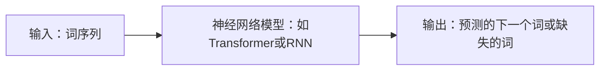

## 1.背景介绍

过去几年，自监督学习在神经网络领域获得了显著的进步，特别是在大语言模型的应用上。自监督学习的基本思想是使用未标记的数据进行训练，充分利用大量可用的数据资源，以提高模型的性能和泛化能力。

这种方法的优越性在于其对大规模数据集的处理能力，而且不需要人工标注，这大大降低了训练模型的成本和复杂性。自监督学习的成功应用，如OpenAI的GPT-3，已经证明了这种方法在自然语言处理、文本生成、对话系统等任务上的有效性。

## 2.核心概念与联系

自监督学习是一种无监督学习的形式，它通过在未标记的数据上预测某些部分的信息来进行训练。在大语言模型中，自监督学习通常通过预测文本中的下一个词或者是缺失的词来进行。

在这种情况下，模型的输入是一个词序列，目标是预测下一个词或者是缺失的词。这种方式使模型能够学习到词汇之间的关系，以及语言的语法和语义规则。

在神经网络中，自监督学习通常使用深度学习模型，如Transformer或者是RNN。这些模型能够处理序列数据，学习到数据中的长距离依赖关系。



## 3.核心算法原理具体操作步骤

自监督学习的训练过程可以分为以下几个步骤：

1. **数据预处理**：将原始文本数据转换为模型可以处理的格式。这通常包括分词、词嵌入等步骤。

2. **模型训练**：使用预处理后的数据训练模型。模型的目标是最小化预测下一个词或者是缺失的词的损失函数。

3. **模型评估**：使用验证集评估模型的性能。常用的评估指标包括准确率、召回率、F1值等。

4. **模型优化**：根据模型在验证集上的性能，进行模型的优化。这可能包括调整模型的参数、增加模型的复杂性等。

5. **模型应用**：将训练好的模型应用到实际任务中，如文本生成、对话系统等。

## 4.数学模型和公式详细讲解举例说明

在自监督学习中，我们通常使用交叉熵损失函数来训练模型。对于一个词序列 $x_1, x_2, ..., x_T$，模型的目标是最小化以下损失函数：

$$
L = -\sum_{t=1}^{T} \log p(x_t | x_1, ..., x_{t-1}; \theta)
$$

其中，$p(x_t | x_1, ..., x_{t-1}; \theta)$ 是模型在参数 $\theta$ 下，给定前 $t-1$ 个词后，预测第 $t$ 个词的概率。这个概率通常由模型的softmax输出层给出。

## 5.项目实践：代码实例和详细解释说明

在Python中，我们可以使用PyTorch库来实现自监督学习。以下是一个简单的例子：

```python
import torch
from torch import nn
from torch.nn import functional as F

# 定义模型
class LanguageModel(nn.Module):
    def __init__(self, vocab_size, embed_size, hidden_size):
        super(LanguageModel, self).__init__()
        self.embed = nn.Embedding(vocab_size, embed_size)
        self.rnn = nn.GRU(embed_size, hidden_size)
        self.linear = nn.Linear(hidden_size, vocab_size)

    def forward(self, x):
        x = self.embed(x)
        x, _ = self.rnn(x)
        x = self.linear(x)
        return x

# 训练模型
model = LanguageModel(vocab_size, embed_size, hidden_size)
optimizer = torch.optim.Adam(model.parameters())
loss_fn = nn.CrossEntropyLoss()

for epoch in range(num_epochs):
    for x, y in dataloader:
        y_pred = model(x)
        loss = loss_fn(y_pred, y)
        optimizer.zero_grad()
        loss.backward()
        optimizer.step()
```

在这个例子中，我们首先定义了一个语言模型，包括一个词嵌入层、一个GRU层和一个线性层。然后，我们使用Adam优化器和交叉熵损失函数来训练模型。

## 6.实际应用场景

自监督学习在许多自然语言处理任务中都有应用，包括：

- **文本生成**：自监督学习可以用来训练文本生成模型，如GPT-3。这些模型可以生成连贯、有意义的文本，应用在新闻生成、故事生成等任务上。

- **对话系统**：自监督学习也可以用来训练对话系统。通过预测下一个回复，模型可以学习到对话的动态和上下文。

- **机器翻译**：自监督学习可以用来训练机器翻译模型。模型可以通过预测下一个词来学习语言的语法和语义规则，从而进行翻译。

## 7.工具和资源推荐

以下是一些用于自监督学习的工具和资源：

- **PyTorch**：一个强大的深度学习框架，提供了丰富的模块和函数，用于构建和训练神经网络。

- **Hugging Face Transformers**：一个提供预训练语言模型的库，如BERT、GPT-2等。这些模型可以用于自监督学习的训练。

- **TensorFlow**：另一个深度学习框架，也提供了丰富的模块和函数，用于构建和训练神经网络。

## 8.总结：未来发展趋势与挑战

自监督学习在神经网络中的应用有着广阔的前景。随着技术的发展，我们可以期待更多的自监督学习方法被提出，以解决更多的任务。然而，自监督学习也面临着一些挑战，如如何处理大规模数据，如何提高模型的泛化能力，如何解决模型的可解释性问题等。

## 9.附录：常见问题与解答

**Q: 自监督学习和监督学习有什么区别？**

A: 自监督学习和监督学习的主要区别在于训练数据。在监督学习中，我们需要人工标注的数据。而在自监督学习中，我们使用未标记的数据进行训练，模型通过预测数据中的某些部分来学习。

**Q: 自监督学习有哪些应用？**

A: 自监督学习在许多自然语言处理任务中都有应用，如文本生成、对话系统、机器翻译等。

**Q: 如何评估自监督学习模型的性能？**

A: 自监督学习模型的性能通常通过在验证集上的准确率、召回率、F1值等指标进行评估。

**Q: 如何优化自监督学习模型？**

A: 自监督学习模型的优化通常包括调整模型的参数、增加模型的复杂性等。

作者：禅与计算机程序设计艺术 / Zen and the Art of Computer Programming