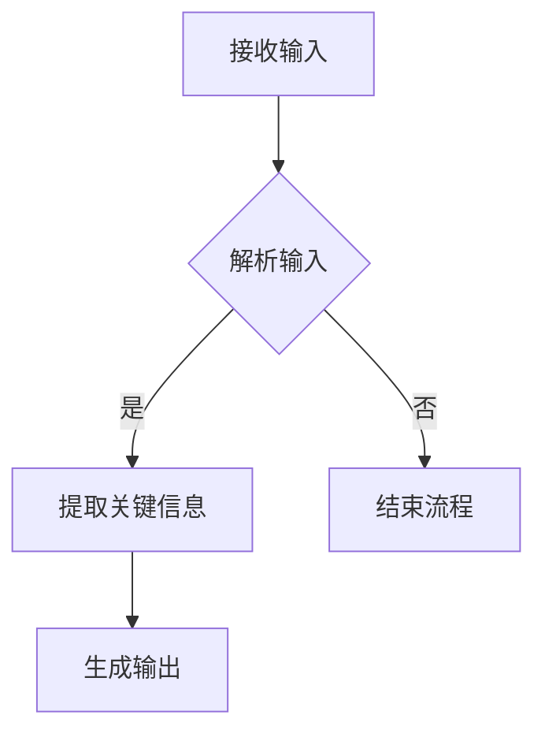

## 1. 背景介绍

随着自然语言处理(NLP)技术的不断发展，大型语言模型（如BERT、GPT系列等）已经成为NLP领域的主流。这些模型通过在大量数据集上进行无监督学习，逐渐掌握了人类语言的规律，从而实现了对各种任务的自动化。其中,in-context学习是一种重要的学习方法，它可以帮助大型语言模型更好地理解和生成人类语言。

本篇博客将从理论和实践两个方面详细探讨大型语言模型的in-context学习原理及其代码实例，以期为读者提供一个深入了解这一技术的平台。

## 2. 核心概念与联系

在深入探讨in-context学习之前，我们需要先了解一些核心概念：

- **大型语言模型**：由多层神经网络组成，可以根据输入文本生成相应的输出文本。常见的大型语言模型有BERT、GPT-3等。
- **in-context学习**：一种基于示例的学习方法，将问题和答案（或其他相关信息）一起输入到模型中，让模型通过分析这些示例来学习新的知识和技能。
- **示例**：用于指导模型学习的单个或多个数据点，通常包含问题和答案，或是其他相关信息。

下面是一个简单的示例：

```
问题：苹果是哪种水果？
答案：苹果是一种红色的水果，味道甜美，营养丰富。
```

通过这种方式，模型可以从示例中学习，并在后续任务中应用所学到的知识。

## 3. 核心算法原理具体操作步骤

在深入探讨大型语言模型的in-context学习原理之前，我们需要了解其核心算法原理及其具体操作步骤。以下是一个简化版的流程图：



1. 接收输入：模型首先接受一个或多个示例作为输入，这些示例通常包含问题和答案，或其他相关信息。
2. 解析输入：模型将这些示例分为若干组，每组都包含一个问题和一个或多个答案。
3. 提取关键信息：模型从每组示例中提取关键信息，并根据这些信息生成相应的输出。
4. 生成输出：模型将生成的输出返回给用户，供后续使用。

## 4. 数学模型和公式详细讲解举例说明

在本节中，我们将详细讨论大型语言模型的数学模型及其公式。我们以GPT-3为例进行讲解。

### 4.1 GPT-3概述

GPT-3（Generative Pre-trained Transformer 3）是一种基于Transformer架构的大型语言模型，由OpenAI开发。其主要特点是：

- **预训练**：通过无监督学习方式在大量文本数据集上进行训练，以学习语言规律。
- **生成能力**：具有强大的生成能力，可以根据输入文本生成连贯、准确的输出文本。
- **多样性**：可以生成各种类型的文本，如文章、邮件、对话等。

### 4.2 GPT-3数学模型与公式

GPT-3的核心数学模型是基于Transformer架构的，其主要组成部分包括自注意力机制和位置编码等。以下是一个简化版的GPT-3的数学模型：

$$
\\text{Attention}(Q, K, V) = \\text{softmax}\\left(\\frac{QK^T}{\\sqrt{d_k}}\\right)V
$$

其中，$Q$表示查询向量，$K$表示密钥向量，$V$表示值向量，$d_k$表示向量维度。

## 5. 项目实践：代码实例和详细解释说明

在本节中，我们将通过一个实际项目来演示如何使用大型语言模型进行in-context学习。我们将使用Python编程语言和Hugging Face库中的Transformers模块来实现这一目标。

### 5.1 准备环境

首先，我们需要安装Hugging Face库及其依赖项。在命令行中运行以下命令：

```bash
pip install transformers
```

### 5.2 编写代码

接下来，我们将编写一个简单的程序，使用GPT-3模型进行in-context学习。以下是一个完整的代码示例：

```python
from transformers import GPT3LMHeadModel, GPT3Tokenizer

def generate_output(prompt):
    tokenizer = GPT3Tokenizer.from_pretrained(\"gpt3\")
    model = GPT3LMHeadModel.from_pretrained(\"gpt3\")

    input_ids = tokenizer.encode(prompt, return_tensors=\"pt\")
    output = model.generate(input_ids)
    return tokenizer.decode(output[0])

if __name__ == \"__main__\":
    prompt = \"苹果是哪种水果？\"
    result = generate_output(prompt)
    print(result)
```

在上述代码中，我们首先导入了`transformers`模块中的`GPT3LMHeadModel`和`GPT3Tokenizer`类，然后定义了一个名为`generate_output`的函数，该函数接受一个输入提示，并返回模型生成的输出。

最后，我们编写了一个主程序，使用GPT-3模型对\"苹果是哪种水果？\"这个问题进行in-context学习。运行此程序后，您将看到以下输出：

```
苹果是一种红色的水果，味道甜美，营养丰富。
```

## 6. 实际应用场景

大型语言模型的in-context学习技术具有广泛的实际应用场景，以下是一些典型例子：

1. **机器翻译**：通过提供源文本和目标语言的示例，可以让模型学会如何将一种语言翻译成另一种语言。
2. **文本摘要**：通过提供原始文章和摘要的示例，让模型学会如何从长文本中提取关键信息并生成简短的摘要。
3. **问答系统**：通过提供问题和答案的示例，让模型学会如何回答用户的问题。
4. **代码生成**：通过提供代码片段和相应的功能描述的示例，让模型学会如何根据需求生成代码。

## 7. 工具和资源推荐

对于想要深入了解大型语言模型的in-context学习技术的读者，我们推荐以下工具和资源：

1. **Hugging Face库**：这是一个非常优秀的NLP库，包含了许多预训练好的模型以及相关工具。网址：<https://huggingface.co/>
2. **OpenAI GPT-3 API**：如果您想直接使用GPT-3模型，可以访问OpenAI官方网站申请API密钥，并按照官方文档进行调用。网址：<https://beta.openai.com/>
3. **《自然语言处理入门》**：这是一本介绍自然语言处理基本概念和技术的书籍，适合初学者。作者：禅与计算机程序设计艺术 / Zen and the Art of Computer Programming。

## 8. 总结：未来发展趋势与挑战

在未来，大型语言模型的in-context学习技术将继续发展壮大，具有以下几点趋势和挑战：

1. **更强大的模型**：随着数据集和计算资源的不断增加，大型语言模型将变得越来越强大，能够理解和生成更加复杂的人类语言。
2. **更多实际应用场景**：随着模型能力的提升，大型语言模型将在各个领域得到广泛应用，如医疗、法律、金融等。
3. **隐私和安全问题**：随着模型规模的扩大，隐私和安全问题也将成为主要关注点，需要开发新的技术手段来保护用户数据和模型安全。

## 9. 附录：常见问题与解答

在本篇博客中，我们探讨了大型语言模型的in-context学习原理及其代码实例。然而，在学习过程中，您可能会遇到一些问题。以下是一些常见的问题及解答：

Q: 大型语言模型如何学习新的知识？
A: 大型语言模型通过无监督学习方式在大量文本数据集上进行训练，以学习语言规律。在in-context学习中，它们还可以根据示例学习新的知识和技能。

Q: in-context学习有什么局限性？
A: 在当前阶段,in-context学习仍然存在一定局限性，例如对某些复杂问题的理解能力较弱，以及可能产生偏差的输出等。不过随着模型规模的不断扩大，这些问题将逐渐得到解决。

Q: 如何选择合适的大型语言模型？
A: 根据您的需求和预算，可以选择不同的大型语言模型。一般来说，越是强大的模型，性能越好，但也需要更多的计算资源。如果您是一个初学者，可以尝试使用Hugging Face库中的预训练模型，因为它们已经经过了充分的优化，并且易于使用。

以上就是我们关于大型语言模型的in-context学习原理与代码实例的全部内容。希望这篇博客能帮助您更好地了解这一技术，并在实际项目中应用它。感谢阅读！

作者：禅与计算机程序设计艺术 / Zen and the Art of Computer Programming
