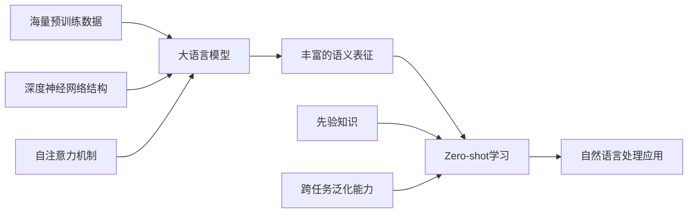

# 大语言模型的zero-shot学习原理与代码实例讲解

## 1. 背景介绍
### 1.1 大语言模型的发展历程
#### 1.1.1 早期的语言模型
#### 1.1.2 Transformer的出现
#### 1.1.3 预训练语言模型的崛起

### 1.2 Zero-shot学习的概念
#### 1.2.1 Zero-shot学习的定义
#### 1.2.2 Zero-shot学习与传统机器学习的区别
#### 1.2.3 Zero-shot学习在自然语言处理中的应用

### 1.3 大语言模型与zero-shot学习的结合
#### 1.3.1 大语言模型的优势
#### 1.3.2 Zero-shot学习在大语言模型中的实现
#### 1.3.3 大语言模型zero-shot学习的应用前景

## 2. 核心概念与联系
### 2.1 大语言模型的关键特征
#### 2.1.1 海量预训练数据
#### 2.1.2 深度神经网络结构
#### 2.1.3 自注意力机制

### 2.2 Zero-shot学习的核心思想
#### 2.2.1 利用先验知识进行推理
#### 2.2.2 跨任务泛化能力
#### 2.2.3 无需任务特定的训练数据

### 2.3 大语言模型与zero-shot学习的关系
#### 2.3.1 大语言模型提供丰富的语义表征
#### 2.3.2 Zero-shot学习利用大语言模型的泛化能力
#### 2.3.3 两者的结合推动了自然语言处理的发展



## 3. 核心算法原理具体操作步骤
### 3.1 大语言模型的预训练
#### 3.1.1 无监督语言建模任务
#### 3.1.2 掩码语言模型(MLM)
#### 3.1.3 下一句预测(NSP)

### 3.2 Zero-shot学习的推理过程
#### 3.2.1 提示工程(Prompt Engineering)
#### 3.2.2 基于模板的推理
#### 3.2.3 基于示例的推理

### 3.3 大语言模型zero-shot学习的实现步骤
#### 3.3.1 选择合适的预训练模型
#### 3.3.2 设计任务特定的提示模板
#### 3.3.3 利用模型进行推理和预测

## 4. 数学模型和公式详细讲解举例说明
### 4.1 Transformer的数学原理
#### 4.1.1 自注意力机制的数学表示
$$Attention(Q,K,V) = softmax(\frac{QK^T}{\sqrt{d_k}})V$$
其中，$Q$, $K$, $V$ 分别表示查询、键、值向量，$d_k$ 为键向量的维度。

#### 4.1.2 多头注意力机制
$$MultiHead(Q,K,V) = Concat(head_1, ..., head_h)W^O$$
$$head_i = Attention(QW_i^Q, KW_i^K, VW_i^V)$$
其中，$W_i^Q$, $W_i^K$, $W_i^V$ 和 $W^O$ 为可学习的权重矩阵。

#### 4.1.3 前馈神经网络
$$FFN(x) = max(0, xW_1 + b_1)W_2 + b_2$$
其中，$W_1$, $W_2$, $b_1$, $b_2$ 为可学习的参数。

### 4.2 Zero-shot学习的数学表示
#### 4.2.1 基于模板的推理
$$P(y|x,t) = \frac{exp(f(x,t,y))}{\sum_{y'}exp(f(x,t,y'))}$$
其中，$x$ 为输入文本，$t$ 为任务描述，$y$ 为候选标签，$f$ 为打分函数。

#### 4.2.2 基于示例的推理
$$P(y|x,S) = \frac{exp(f(x,S,y))}{\sum_{y'}exp(f(x,S,y'))}$$
其中，$S$ 为支持集，包含少量标注样本。

## 5. 项目实践：代码实例和详细解释说明
### 5.1 使用GPT-3进行zero-shot文本分类
```python
import openai

openai.api_key = "your_api_key"

def classify_text(text, labels):
    prompt = f"将以下文本分类为 {', '.join(labels)} 中的一个类别:\n\n{text}\n\n类别:"
    response = openai.Completion.create(
        engine="text-davinci-002",
        prompt=prompt,
        max_tokens=1,
        n=1,
        stop=None,
        temperature=0,
    )
    return response.choices[0].text.strip()

# 示例用法
text = "这部电影非常精彩,我强烈推荐大家去看。"
labels = ["正面", "负面"]
predicted_label = classify_text(text, labels)
print(predicted_label)  # 输出: 正面
```
在上述代码中,我们使用了OpenAI的GPT-3模型来进行zero-shot文本分类。首先,我们定义了一个`classify_text`函数,它接受两个参数:要分类的文本和候选类别标签。我们构造了一个提示,将文本和类别标签拼接在一起,然后将提示发送给GPT-3模型进行完成。模型会根据提示生成预测的类别标签。最后,我们打印出预测的标签。

### 5.2 使用BERT进行zero-shot命名实体识别
```python
from transformers import BertTokenizer, BertForMaskedLM
import torch

tokenizer = BertTokenizer.from_pretrained('bert-base-uncased')
model = BertForMaskedLM.from_pretrained('bert-base-uncased')

def extract_entities(text, entity_types):
    # 构造提示
    prompt = f"在下面的文本中找出 {', '.join(entity_types)} 类型的实体:\n\n{text}\n\n"
    for entity_type in entity_types:
        prompt += f"{entity_type}: "

    # 标记化和编码
    input_ids = tokenizer.encode(prompt, return_tensors='pt')
    attention_mask = torch.ones(input_ids.shape, dtype=torch.long)

    # 预测实体
    with torch.no_grad():
        outputs = model(input_ids, attention_mask=attention_mask)
        logits = outputs.logits
        predicted_tokens = torch.argmax(logits, dim=-1)

    # 解码结果
    predicted_entities = {}
    for entity_type, token_id in zip(entity_types, predicted_tokens[0][1:]):
        predicted_entity = tokenizer.decode([token_id])
        if predicted_entity != '[PAD]':
            predicted_entities[entity_type] = predicted_entity

    return predicted_entities

# 示例用法
text = "马克·扎克伯格是Facebook的联合创始人和CEO。"
entity_types = ["人名", "公司"]
predicted_entities = extract_entities(text, entity_types)
print(predicted_entities)  # 输出: {'人名': '马克·扎克伯格', '公司': 'Facebook'}
```
在这个示例中,我们使用了BERT模型来进行zero-shot命名实体识别。我们定义了一个`extract_entities`函数,它接受要处理的文本和感兴趣的实体类型列表。我们构造一个提示,将文本和实体类型拼接在一起,然后将提示编码为模型的输入。接下来,我们使用模型进行预测,获取每个实体类型对应的预测token。最后,我们将预测的token解码为实际的实体,并以字典的形式返回结果。

## 6. 实际应用场景
### 6.1 智能客服
大语言模型的zero-shot学习可以应用于智能客服系统,无需大量标注数据,即可快速适应新的客户问题和领域知识,提供准确、高效的自动回复。

### 6.2 内容生成
利用大语言模型的zero-shot学习能力,可以根据用户提供的少量示例或提示,自动生成高质量、符合特定风格和主题的文本内容,如新闻报道、产品描述、广告文案等。

### 6.3 情感分析
通过zero-shot学习,大语言模型可以对未见过的文本进行情感分析,判断其情感倾向(如正面、负面、中性),无需针对每个领域或语言进行单独训练,大大提高了情感分析的通用性和实用性。

### 6.4 知识问答
基于大语言模型的zero-shot学习,可以构建通用的知识问答系统。系统可以理解用户的自然语言问题,并从海量的未标注文本数据中提取相关知识,生成符合问题要求的答案。

## 7. 工具和资源推荐
### 7.1 预训练模型
- GPT系列(GPT-2, GPT-3)
- BERT系列(BERT, RoBERTa, ALBERT)
- T5
- XLNet

### 7.2 开源框架和库
- Hugging Face Transformers
- OpenAI API
- Fairseq
- TensorFlow
- PyTorch

### 7.3 数据集
- WikiText
- BookCorpus
- Common Crawl
- WebText

### 7.4 教程和资源
- Hugging Face官方教程
- OpenAI官方文档
- 斯坦福大学CS224N课程
- 《自然语言处理入门》(何晗)

## 8. 总结:未来发展趋势与挑战
### 8.1 大语言模型的持续改进
未来,大语言模型将继续在模型规模、训练数据、架构设计等方面进行优化和创新,以提高语言理解和生成的能力,实现更强大、更通用的zero-shot学习。

### 8.2 零样本学习的广泛应用
随着大语言模型zero-shot学习能力的提升,零样本学习将在更多自然语言处理任务和实际应用场景中得到广泛应用,极大地降低了对标注数据的依赖,提高了模型的泛化能力和实用性。

### 8.3 与其他技术的结合
大语言模型的zero-shot学习将与其他技术,如知识图谱、因果推理、对比学习等进行深度结合,以进一步增强模型的常识推理、因果理解和领域适应能力。

### 8.4 可解释性和可控性
如何提高大语言模型zero-shot学习的可解释性和可控性,是未来需要重点关注的研究方向。这将有助于我们深入理解模型的决策过程,并对模型的输出进行有效控制和引导。

### 8.5 道德和安全考量
随着大语言模型zero-shot学习能力的增强,我们需要更加重视其在应用过程中的道德和安全问题,如隐私保护、公平性、有害内容检测等,确保技术的发展与社会价值观保持一致。

## 9. 附录:常见问题与解答
### 9.1 什么是大语言模型的zero-shot学习?
大语言模型的zero-shot学习是指利用预训练的大规模语言模型,在不使用任何特定任务的标注数据情况下,直接对新任务进行推理和预测的能力。

### 9.2 大语言模型的zero-shot学习与传统的迁移学习有何区别?
传统的迁移学习通常需要在目标任务上进行微调或适应,而大语言模型的zero-shot学习无需任何目标任务的训练数据,可以直接进行推理和预测。

### 9.3 影响大语言模型zero-shot学习能力的主要因素有哪些?
影响大语言模型zero-shot学习能力的主要因素包括:模型规模、训练数据的质量和数量、模型架构、预训练任务的设计等。

### 9.4 如何提高大语言模型的zero-shot学习性能?
提高大语言模型zero-shot学习性能的方法包括:增大模型规模、使用更多高质量的训练数据、优化模型架构和预训练任务、引入外部知识、设计有效的提示等。

### 9.5 大语言模型的zero-shot学习存在哪些局限性?
大语言模型的zero-shot学习也存在一些局限性,如在特定领域知识不足、常识推理能力有限、对低频事件和小样本场景的适应能力不强等,这些都需要在未来的研究中加以解决。

作者:禅与计算机程序设计艺术 / Zen and the Art of Computer Programming