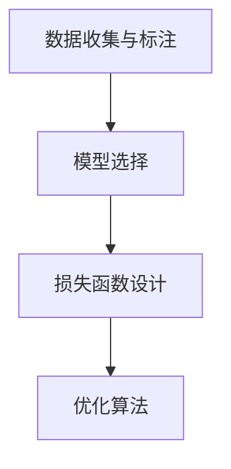

## 背景介绍

姿态估计（Pose Estimation）是计算机视觉领域的一个重要研究方向，它主要关注如何从图像或视频中识别和定位物体的关键点，以便了解物体的位置、形状和运动。其中，人体姿态估计（Human Pose Estimation）是对人体动作进行分析的核心技术，它可以帮助我们更好地理解人类行为、运动和情感等。

## 核心概念与联系

姿态估计技术涉及到多个子领域，如深度学习、计算几何、图像处理等。为了实现人体姿态估计，我们需要解决以下几个关键问题：

1. **数据收集与标注**：首先，我们需要收集大量的人体图像数据，并手动标注出人体关键点的坐标。这一过程非常繁琐，但却是训练模型的基础。
2. **模型选择**：选择合适的模型来完成人体关键点的预测。常见的模型有卷积神经网络（CNN）、循环神经网络（RNN）等。
3. **损失函数设计**：为了评估模型的性能，我们需要设计合适的损失函数。常用的损失函数有欧氏距离、均方误差（MSE）等。
4. **优化算法**：选择合适的优化算法来更新模型参数。常用的优化算法有随机梯度下降（SGD）、亚当优化器（Adam）等。

## 核心算法原理具体操作步骤

以下是一个简化版的人体姿态估计流程图：



1. 数据收集与标注：收集大量的人体图像数据，并手动标注出人体关键点的坐标。
2. 模型选择：选择合适的模型，如CNN或RNN等。
3. 损失函数设计：设计合适的损失函数，如欧氏距离或均方误差等。
4. 优化算法：选择合适的优化算法，如SGD或Adam等。

## 数学模型和公式详细讲解举例说明

在这个部分，我们将详细介绍数学模型和公式。例如，为了计算两个向量之间的欧氏距离，我们可以使用以下公式：

$$
\\text{dist}(x, y) = \\sqrt{\\sum_{i=1}^{n}(x_i - y_i)^2}
$$

其中，$x$和$y$分别表示两个向量，$n$表示向量的维数。

## 项目实践：代码实例和详细解释说明

在这个部分，我们将通过一个实际项目来展示如何实现人体姿态估计。我们将使用Python编程语言和OpenCV库来完成这个任务。

```python
import cv2
import numpy as np

# 加载预训练好的模型
model = cv2.dnn.readNetFromCaffe(\"pose_deploy.prototxt\", \"pose_iter_80000.caffemodel\")

# 加载图像
image = cv2.imread(\"input.jpg\")
height, width, _ = image.shape

# 预处理图像
blob = cv2.dnn.blobFromImage(image, 1.0 / 255, (width, height), swapRB=False, crop=False)
net.setInput(blob)

# 获取关键点坐标
keypoints = model.forward()

# 绘制关键点
for i in range(0, keypoints.shape[2]):
    x = int(keypoints[0, 0, i, 0] * width)
    y = int(keypoints[0, 0, i, 1] * height)
    cv2.circle(image, (x, y), 5, (0, 255, 0), -1)

cv2.imshow(\"Output\", image)
cv2.waitKey(0)
```

## 实际应用场景

人体姿态估计技术在多个领域有广泛的应用，例如：

1. **运动分析**：通过对运动员或运动者的姿态进行估计，可以帮助分析运动表现，提高运动水平。
2. **医疗诊断**：利用人体姿态估计技术，可以辅助医生诊断各种疾病，如关节炎、脊椎曲线等。
3. **虚拟现实（VR）和增强现实（AR）**：人体姿态估计技术可以用于虚拟现实和增强现实系统中，使用户能够更自然地与虚拟环境互动。

## 工具和资源推荐

以下是一些建议的工具和资源，以帮助读者深入了解人体姿态估计技术：

1. **OpenCV**：一个开源计算机视觉库，提供了许多常用的计算机视觉功能，如图像处理、特征提取等。
2. **TensorFlow**：一个流行的深度学习框架，可以用于构建和训练神经网络模型。
3. **PyTorch**：另一个流行的深度学习框架，具有灵活且易于使用的接口。
4. **PoseNet**：Google Brain团队开发的一个基于卷积神经网络的人体姿态估计模型。

## 总结：未来发展趋势与挑战

人体姿态估计技术在过去几年取得了显著的进展，但仍然面临诸多挑战。未来的发展趋势可能包括：

1. 更高准确性：通过不断优化算法和模型，提高人体姿态估计的准确性。
2. 更快速度：通过硬件加速和并行计算，降低人体姿态估计的计算时间。
3. 更广泛的应用场景：将人体姿态估计技术扩展到更多领域，如自动驾驶、机器人等。

## 附录：常见问题与解答

以下是一些建议的常见问题及其解答：

1. **如何选择合适的模型？**
   可以根据具体需求来选择合适的模型。例如，如果需要更高的准确性，可以选择复杂的卷积神经网络；如果需要更快的速度，可以选择较简单的循环神经网络。
2. **如何解决过拟合的问题？**
   可以尝试使用数据增强、正则化等方法来解决过拟合的问题。例如，可以通过旋转、缩放、平移等操作增加训练数据的多样性，从而减少过拟合的风险。
3. **如何评估模型性能？**
   可以使用交叉验证、AUC-ROC曲线等方法来评估模型性能。例如，通过将模型在不同数据集上进行交叉验证，可以得到更准确的性能评估。

# 结束语

人体姿态估计技术是计算机视觉领域的一个重要研究方向，它具有广泛的应用前景。在未来，我们期待看到更多创新性的算法和模型，使人体姿态估计技术变得更加精确、高效，并在更多领域取得成功。

作者：禅与计算机程序设计艺术 / Zen and the Art of Computer Programming
