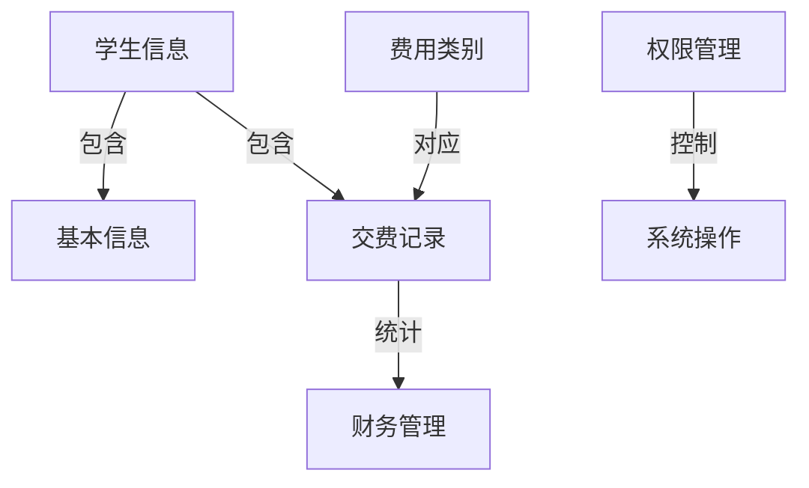

# 学生交费管理系统详细设计与具体代码实现

## 1.背景介绍

随着教育事业的不断发展,学校规模日益扩大,学生人数与日俱增,传统的人工管理学生交费记录已经无法满足现代化管理的需求。因此,构建一个高效、安全、便捷的学生交费管理系统势在必行。该系统可以自动化管理学生的交费信息,提高工作效率,减轻人力成本,并为学校的决策提供数据支持。

## 2.核心概念与联系

学生交费管理系统的核心概念包括:

1. **学生信息**:包括学生的基本信息(姓名、学号、班级等)和交费记录。
2. **费用类别**:学校针对不同项目收取的费用,如学费、住宿费、书本费等。
3. **交费记录**:记录每个学生针对不同费用类别的交费情况,包括交费金额、时间等。
4. **财务管理**:对学校收入和支出进行统计和管理。
5. **权限管理**:不同角色(管理员、教师、学生)拥有不同的系统操作权限。

这些核心概念相互关联,构成了完整的学生交费管理系统。其中,学生信息是系统的基础数据,费用类别和交费记录则是系统运行的核心数据。财务管理和权限管理为系统的正常运行提供支撑。



## 3.核心算法原理具体操作步骤

### 3.1 学生信息管理算法

1. **添加学生信息**
   - 输入学生基本信息(姓名、学号、班级等)
   - 检查学号是否已存在,若存在则提示错误
   - 将学生信息存入数据库

2. **修改学生信息**
   - 根据学号查询学生信息
   - 修改相应的学生信息字段
   - 更新数据库中的学生信息

3. **删除学生信息**
   - 根据学号查询学生信息
   - 删除该学生的所有交费记录
   - 删除该学生的基本信息

4. **查询学生信息**
   - 根据学号、姓名等条件查询学生信息
   - 返回满足条件的学生信息列表

### 3.2 交费记录管理算法

1. **添加交费记录**
   - 输入学号、费用类别、交费金额等信息
   - 检查学号和费用类别是否存在,若不存在则提示错误
   - 将交费记录存入数据库

2. **修改交费记录**
   - 根据交费记录ID查询交费记录
   - 修改相应的交费信息字段
   - 更新数据库中的交费记录

3. **删除交费记录**
   - 根据交费记录ID查询交费记录
   - 删除该交费记录

4. **查询交费记录**
   - 根据学号、费用类别、时间范围等条件查询交费记录
   - 返回满足条件的交费记录列表

### 3.3 财务统计算法

1. **统计学校总收入**
   - 查询所有交费记录
   - 累加所有交费金额,得到总收入

2. **统计某费用类别收入**
   - 查询指定费用类别的所有交费记录
   - 累加该类别的所有交费金额,得到该类别收入

3. **统计某学生应缴费用**
   - 查询该学生的所有交费记录
   - 根据学校规定的费用标准,计算该学生应缴的总费用
   - 将已交费用从应缴费用中扣除,得到剩余应缴费用

4. **生成财务报表**
   - 调用上述算法,获取总收入、各类别收入、学生应缴费用等数据
   - 将数据按格式生成财务报表(如Excel文件)

这些算法的实现需要使用数据结构(如列表、字典等)来存储和操作数据,并与数据库交互。

## 4.数学模型和公式详细讲解举例说明

在学生交费管理系统中,我们可以使用一些数学模型和公式来辅助设计和实现。

### 4.1 费用计算模型

假设学校共有 $n$ 种费用类别,分别记为 $f_1, f_2, \ldots, f_n$,每种费用类别的金额分别为 $c_1, c_2, \ldots, c_n$。对于某个学生 $s$,其应缴费用 $F_s$ 可以表示为:

$$F_s = \sum_{i=1}^{n} x_i c_i$$

其中,

- $x_i$ 是一个二值变量,表示该学生是否需要缴纳第 $i$ 种费用类别。如果需要,则 $x_i=1$;否则 $x_i=0$。
- $c_i$ 是第 $i$ 种费用类别的金额。

例如,假设学校有三种费用类别:学费 $f_1$ (金额 $c_1=10000$ 元)、住宿费 $f_2$ (金额 $c_2=5000$ 元)和书本费 $f_3$ (金额 $c_3=1000$ 元)。如果某个学生 $s$ 需要缴纳学费和住宿费,但不需要缴纳书本费,则其应缴费用为:

$$F_s = 1 \times 10000 + 1 \times 5000 + 0 \times 1000 = 15000 \text{ 元}$$

### 4.2 交费记录统计模型

对于某个学生 $s$,假设其已经缴纳的费用记录为 $R_s = \{r_1, r_2, \ldots, r_m\}$,其中每条记录 $r_i$ 包含了缴纳金额 $a_i$ 和对应的费用类别 $f_j$。则该学生已缴费用 $P_s$ 可以表示为:

$$P_s = \sum_{i=1}^{m} a_i$$

将已缴费用 $P_s$ 从应缴费用 $F_s$ 中扣除,即可得到该学生剩余应缴费用 $Q_s$:

$$Q_s = F_s - P_s$$

例如,假设某个学生 $s$ 的应缴费用 $F_s=15000$ 元,其已缴纳的费用记录为 $R_s = \{(10000, f_1), (3000, f_2)\}$,则:

$$P_s = 10000 + 3000 = 13000 \text{ 元}$$
$$Q_s = 15000 - 13000 = 2000 \text{ 元}$$

因此,该学生还需要缴纳 $2000$ 元的住宿费。

通过上述数学模型和公式,我们可以准确计算每个学生的应缴费用和已缴费用,为学校的财务管理提供数据支持。

## 5.项目实践:代码实例和详细解释说明

为了更好地理解学生交费管理系统的实现,我们提供了一些核心代码示例,并对其进行详细解释。

### 5.1 数据模型

```python
class Student:
    def __init__(self, name, student_id, class_name):
        self.name = name
        self.student_id = student_id
        self.class_name = class_name
        self.payment_records = []

class FeeCategory:
    def __init__(self, name, amount):
        self.name = name
        self.amount = amount

class PaymentRecord:
    def __init__(self, student, fee_category, amount, date):
        self.student = student
        self.fee_category = fee_category
        self.amount = amount
        self.date = date
```

在上述代码中,我们定义了三个核心类:

- `Student`类:表示学生的基本信息,包括姓名、学号和班级,以及该学生的交费记录列表。
- `FeeCategory`类:表示费用类别的名称和金额。
- `PaymentRecord`类:表示某个学生针对某个费用类别的具体交费记录,包括交费金额和日期。

这些类构成了系统的数据模型,为后续的功能实现提供了基础。

### 5.2 学生信息管理

```python
class StudentManager:
    def __init__(self):
        self.students = []

    def add_student(self, name, student_id, class_name):
        if self.get_student_by_id(student_id) is None:
            student = Student(name, student_id, class_name)
            self.students.append(student)
            return True
        else:
            return False

    def get_student_by_id(self, student_id):
        for student in self.students:
            if student.student_id == student_id:
                return student
        return None

    def update_student(self, student_id, name=None, class_name=None):
        student = self.get_student_by_id(student_id)
        if student:
            if name:
                student.name = name
            if class_name:
                student.class_name = class_name
            return True
        return False

    def delete_student(self, student_id):
        student = self.get_student_by_id(student_id)
        if student:
            self.students.remove(student)
            return True
        return False
```

`StudentManager`类提供了学生信息的增删改查功能:

- `add_student`方法:添加一个新的学生信息,首先检查学号是否已存在,如果不存在则创建新的`Student`对象并添加到列表中。
- `get_student_by_id`方法:根据学号查找学生信息,返回`Student`对象或`None`。
- `update_student`方法:根据学号修改学生的姓名或班级信息。
- `delete_student`方法:根据学号删除学生信息。

### 5.3 交费记录管理

```python
class PaymentManager:
    def __init__(self):
        self.payment_records = []
        self.fee_categories = []

    def add_fee_category(self, name, amount):
        fee_category = FeeCategory(name, amount)
        self.fee_categories.append(fee_category)

    def get_fee_category_by_name(self, name):
        for category in self.fee_categories:
            if category.name == name:
                return category
        return None

    def add_payment_record(self, student_id, fee_category_name, amount, date):
        student = StudentManager.get_student_by_id(student_id)
        fee_category = self.get_fee_category_by_name(fee_category_name)
        if student and fee_category:
            record = PaymentRecord(student, fee_category, amount, date)
            self.payment_records.append(record)
            student.payment_records.append(record)
            return True
        return False

    def update_payment_record(self, record_id, amount=None, date=None):
        for record in self.payment_records:
            if record.id == record_id:
                if amount:
                    record.amount = amount
                if date:
                    record.date = date
                return True
        return False

    def delete_payment_record(self, record_id):
        for record in self.payment_records:
            if record.id == record_id:
                self.payment_records.remove(record)
                record.student.payment_records.remove(record)
                return True
        return False
```

`PaymentManager`类管理费用类别和交费记录:

- `add_fee_category`方法:添加一个新的费用类别。
- `get_fee_category_by_name`方法:根据费用类别名称查找对应的`FeeCategory`对象。
- `add_payment_record`方法:为某个学生添加一条交费记录,需要提供学生ID、费用类别名称、交费金额和日期。
- `update_payment_record`方法:根据交费记录ID修改交费金额或日期。
- `delete_payment_record`方法:根据交费记录ID删除该记录。

### 5.4 财务统计

```python
class FinanceManager:
    def __init__(self, payment_manager):
        self.payment_manager = payment_manager

    def calculate_total_income(self):
        total = 0
        for record in self.payment_manager.payment_records:
            total += record.amount
        return total

    def calculate_category_income(self, category_name):
        category = self.payment_manager.get_fee_category_by_name(category_name)
        if category:
            total = 0
            for record in self.payment_manager.payment_records:
                if record.fee_category == category:
                    total += record.amount
            return total
        return 0

    def calculate_student_due(self, student_id):
        student = StudentManager.get_student_by_id(student_id)
        if student:
            due = 0
            for category in self.payment_manager.fee_categories:
                due += category.amount
            for record in student.payment_records:
                due -= record.amount
            return due
        return 0
```

`FinanceManager`类提供了财务统计功能:

- `calculate_total_income`方法:计算学校的总收入,遍历所有交费记录并累加交费金额。
- `calculate_category_income`方法:计算某个费用类别的总收入,遍历所有交费记录,累加属于该