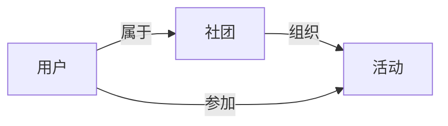

## 1.背景介绍

在现代教育环境中，学生社团扮演着重要的角色。它们为学生提供了一个平台，可以在这里发展技能，建立人际关系，以及参与到各种各样的活动中。然而，随着社团数量的增加和活动的多样化，管理这些社团以及他们的活动变得越来越困难。因此，有必要开发一个学生社团管理系统，以便更好地管理这些社团和他们的活动。

## 2.核心概念与联系

学生社团管理系统是一个用于管理学生社团和他们的活动的应用程序。它的主要功能包括社团注册、社团管理、活动管理、成员管理和公告发布等。系统的主要用户包括社团管理员、社团成员和学校管理员。

系统的核心概念包括：

- 社团：每个社团都有一个唯一的ID，名称，描述，管理员和成员列表。
- 活动：每个活动都有一个唯一的ID，名称，描述，开始和结束日期，以及负责人。
- 用户：每个用户都有一个唯一的ID，用户名，密码，和他们所属的社团列表。

这些概念之间的关系可以通过以下Mermaid流程图来表示：



## 3.核心算法原理具体操作步骤

学生社团管理系统的核心算法主要包括用户认证、权限管理和数据管理等。

1. 用户认证：当用户登录系统时，系统会验证他们的用户名和密码。如果验证成功，系统会为他们创建一个会话，并将他们的用户ID和角色存储在会话中。

2. 权限管理：系统会根据用户的角色来控制他们的访问权限。例如，只有社团管理员才能管理他们的社团，只有学校管理员才能管理所有的社团。

3. 数据管理：系统会对社团、活动和用户的数据进行增删改查操作。这些操作主要通过SQL语句来实现。

## 4.数学模型和公式详细讲解举例说明

在学生社团管理系统中，我们可以使用图论的概念来表示社团和活动的关系。在这个图中，每个节点表示一个社团或一个活动，每条边表示一个社团和一个活动之间的关系。

例如，我们可以使用邻接矩阵来表示这个图。在邻接矩阵中，每行和每列都表示一个节点，如果两个节点之间有一条边，那么对应的矩阵元素为1，否则为0。

假设我们有3个社团（C1，C2，C3）和2个活动（A1，A2），并且C1组织了A1，C2和C3都组织了A2，那么我们可以得到以下的邻接矩阵：

$$
\begin{bmatrix}
0 & 1 & 0 & 0 & 0 \\
1 & 0 & 0 & 1 & 1 \\
0 & 0 & 0 & 0 & 1 \\
0 & 1 & 0 & 0 & 0 \\
0 & 1 & 1 & 0 & 0 \\
\end{bmatrix}
$$

在这个矩阵中，第一行和第一列表示C1，第二行和第二列表示C2，第三行和第三列表示C3，第四行和第四列表示A1，第五行和第五列表示A2。

## 5.项目实践：代码实例和详细解释说明

下面是一个简单的用户认证的代码实例：

```python
from flask import Flask, session
from flask_sqlalchemy import SQLAlchemy
from werkzeug.security import check_password_hash

app = Flask(__name__)
app.config['SQLALCHEMY_DATABASE_URI'] = 'sqlite:////tmp/test.db'
db = SQLAlchemy(app)

class User(db.Model):
    id = db.Column(db.Integer, primary_key=True)
    username = db.Column(db.String(80), unique=True, nullable=False)
    password_hash = db.Column(db.String(120), nullable=False)

@app.route('/login', methods=['POST'])
def login():
    username = request.form['username']
    password = request.form['password']
    user = User.query.filter_by(username=username).first()
    if user and check_password_hash(user.password_hash, password):
        session['user_id'] = user.id
        return redirect(url_for('index'))
    return 'Invalid username or password'
```

在这个代码中，我们首先定义了一个User模型，用于表示用户。然后，我们定义了一个/login路由，用于处理用户的登录请求。当用户提交登录表单时，系统会查询数据库中的用户，验证他们的用户名和密码。如果验证成功，系统会在会话中存储他们的用户ID，并将他们重定向到首页。否则，系统会返回一个错误消息。

## 6.实际应用场景

学生社团管理系统可以广泛应用于各种学校和教育机构。例如，大学可以使用它来管理他们的学生社团，高中可以使用它来管理他们的课外活动，培训机构可以使用它来管理他们的学生和课程。

此外，学生社团管理系统也可以集成到其他系统中，如学校的教务系统、图书馆系统等，以提供更全面的服务。

## 7.工具和资源推荐

开发学生社团管理系统可以使用以下工具和资源：

- Python：一种易学易用的编程语言，适合开发Web应用程序。
- Flask：一个轻量级的Python Web框架，适合开发小型到中型的Web应用程序。
- SQLAlchemy：一个Python的SQL工具包和对象关系映射器，适合处理数据库操作。
- SQLite：一个轻量级的数据库系统，适合开发小型到中型的应用程序。
- Bootstrap：一个前端框架，适合快速开发响应式的Web界面。

## 8.总结：未来发展趋势与挑战

随着互联网技术的发展，学生社团管理系统的功能将越来越丰富，例如，它可以支持在线报名、在线投票、在线支付等功能。同时，随着大数据和人工智能的发展，学生社团管理系统也可以提供更智能的服务，例如，它可以分析学生的活动参与情况，推荐他们可能感兴趣的活动。

然而，学生社团管理系统也面临着一些挑战。首先，如何保护用户的隐私和数据安全是一个重要的问题。系统需要采取有效的措施，如使用HTTPS、加密存储用户密码等，来保护用户的数据。其次，如何提高系统的易用性和用户体验也是一个重要的问题。系统需要有一个简洁明了的界面，丰富的功能，以及友好的用户交互。

## 9.附录：常见问题与解答

Q: 如何注册一个新的社团？

A: 你可以在系统的社团注册页面填写社团的信息，如名称、描述等，然后提交表单。系统会验证你的信息，如果验证成功，系统会创建一个新的社团，并将你设置为社团的管理员。

Q: 如何添加一个新的活动？

A: 如果你是社团的管理员，你可以在系统的活动管理页面添加一个新的活动。你需要填写活动的信息，如名称、描述、开始和结束日期等，然后提交表单。系统会创建一个新的活动，并将你设置为活动的负责人。

Q: 如何修改我的密码？

A: 你可以在系统的用户设置页面修改你的密码。你需要输入你的旧密码和新密码，然后提交表单。系统会验证你的旧密码，如果验证成功，系统会更新你的密码。

Q: 如何找回我的密码？

A: 如果你忘记了你的密码，你可以在系统的登录页面点击“忘记密码”链接。系统会提示你输入你的邮箱，然后系统会向你的邮箱发送一个重置密码的链接。你可以点击这个链接，然后输入你的新密码，系统会更新你的密码。

作者：禅与计算机程序设计艺术 / Zen and the Art of Computer Programming