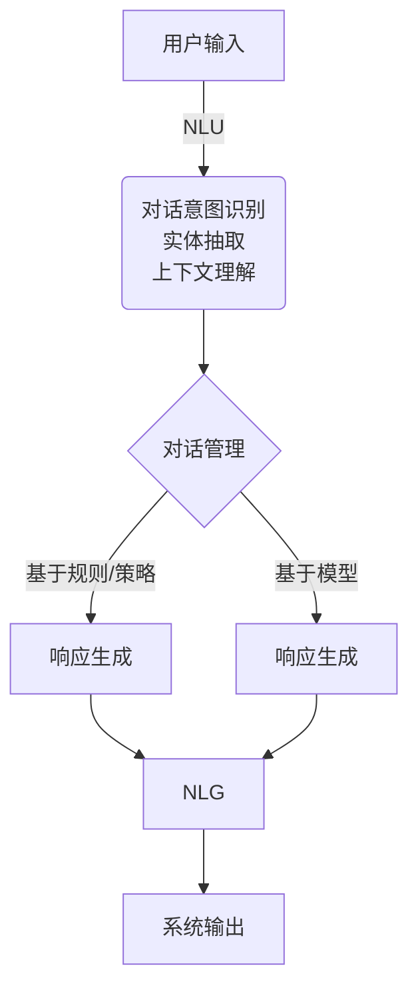

# 对话系统(Chatbots) - 原理与代码实例讲解

## 1.背景介绍

在当今的数字时代,人工智能技术已经渗透到我们生活的方方面面。其中,对话系统或称为聊天机器人(Chatbots)是一种基于自然语言处理(NLP)和机器学习技术的智能系统,能够与人类进行类似人与人之间的对话交互。

对话系统的出现旨在提供更加自然、高效和智能化的人机交互方式,帮助人们解决各种问题和完成特定任务。从简单的客户服务到复杂的决策支持系统,对话系统的应用范围越来越广泛。

### 1.1 对话系统的发展历程

对话系统的发展可以追溯到20世纪60年代,当时麻省理工学院的约瑟夫·维森鲍姆(Joseph Weizenbaum)开发了一个名为ELIZA的早期对话系统。ELIZA通过模式匹配和简单的规则,能够进行有限的对话交互。

随着自然语言处理和机器学习技术的不断进步,对话系统也逐渐演变,从基于规则的系统发展到基于统计模型的系统,再到当前主流的基于深度学习的端到端对话系统。

近年来,benefrombang 预训练语言模型(如GPT、BERT等)的出现,使得对话系统的性能得到了大幅提升。同时,注意力机制、transformer架构等技术的应用,也推动了对话系统向更加智能化和人性化的方向发展。

### 1.2 对话系统的应用场景

对话系统在诸多领域都有广泛的应用,例如:

- **客户服务**: 通过对话系统提供7x24小时的智能客户服务,解答常见问题、处理订单等。
- **个人助理**: 智能对话助理可以协助用户完成各种日常任务,如日程安排、信息查询等。
- **教育和培训**: 对话系统可以作为智能教学助手,提供个性化的学习体验。
- **医疗保健**: 对话系统可用于初步症状诊断、健康咨询和疾病管理等。
- **电子商务**: 对话式购物助手可以提供个性化的产品推荐和购物指导。
- **金融服务**: 智能对话系统可用于投资咨询、风险评估和合规审查等。

## 2.核心概念与联系

构建一个高质量的对话系统需要多个关键组件的有机结合,包括自然语言理解(NLU)、对话管理(DM)、自然语言生成(NLG)等。下面我们将详细介绍这些核心概念及其相互关系。

### 2.1 自然语言理解 (NLU)

自然语言理解(NLU)是对话系统的核心组件之一,负责从用户输入的自然语言中提取有意义的信息。NLU通常包括以下几个主要任务:

1. **意图识别(Intent Recognition)**: 确定用户输入的意图或目的,如查询天气、预订机票等。
2. **实体抽取(Entity Extraction)**: 从用户输入中识别出关键信息,如日期、地点、数量等。
3. **上下文理解(Context Understanding)**: 利用对话历史和背景知识来理解当前输入的语义。

常见的NLU技术包括基于规则的方法、统计机器学习方法(如条件随机场、最大熵模型等)和深度学习方法(如递归神经网络、注意力机制等)。

### 2.2 对话管理 (DM)

对话管理(DM)是对话系统的"大脑",负责根据当前对话状态和NLU提取的信息,决定系统的下一步行为。DM通常采用以下两种主要方法:

1. **基于规则或策略的方法**: 根据预定义的规则或策略来确定系统的响应。这种方法简单直观,但缺乏灵活性和可扩展性。
2. **基于模型的方法**: 利用机器学习或深度学习模型,从历史对话数据中学习最优的对话策略。这种方法更加灵活和智能,但需要大量的训练数据。

常见的基于模型的DM技术包括马尔可夫决策过程(MDP)、深度强化学习(Deep RL)、序列到序列(Seq2Seq)模型等。

### 2.3 自然语言生成 (NLG)

自然语言生成(NLG)是对话系统的另一个关键组件,负责将DM决策转换为自然语言形式的响应。NLG通常包括以下几个主要步骤:

1. **内容规划**: 确定响应的主题、语气和结构。
2. **句子规划**: 构建语义表示,如概念、关系等。
3. **实现(Realization)**: 将语义表示转换为自然语言文本。

常见的NLG技术包括基于模板的方法、基于规则的方法、统计机器翻译方法和基于神经网络的序列生成方法(如Seq2Seq、Transformer等)。

## 3.核心算法原理具体操作步骤

对话系统的核心算法原理涉及多个领域,包括自然语言处理、机器学习、深度学习等。下面我们将介绍一些常见的算法原理和具体操作步骤。

### 3.1 意图识别和实体抽取

意图识别和实体抽取是NLU的两个关键任务,常用的算法包括:

#### 3.1.1 基于机器学习的方法

1. **特征工程**: 从用户输入中提取相关特征,如词袋(Bag-of-Words)、N-gram、词性标注等。
2. **训练分类器**: 使用机器学习算法(如支持向量机、逻辑回归、决策树等)训练意图识别和实体抽取模型。
3. **模型评估和优化**: 在开发集和测试集上评估模型性能,并进行参数调优和模型选择。

#### 3.1.2 基于深度学习的方法

1. **数据预处理**: 对用户输入进行分词、词性标注、命名实体识别等预处理。
2. **词嵌入**: 将词语映射到低维连续的向量空间,常用的词嵌入方法包括Word2Vec、GloVe等。
3. **神经网络模型**: 使用递归神经网络(RNN)、长短期记忆网络(LSTM)、门控循环单元(GRU)等序列模型捕捉上下文信息。
4. **注意力机制**: 引入注意力机制提高模型对关键信息的关注度。
5. **模型训练和优化**: 使用标注数据训练神经网络模型,并进行超参数调优。

### 3.2 对话管理

对话管理的核心算法包括基于规则的方法和基于模型的方法。

#### 3.2.1 基于规则的方法

1. **定义对话流程**: 根据应用场景设计有限状态机或决策树等对话流程。
2. **制定对话策略**: 为每个对话状态定义相应的规则或策略。
3. **执行对话策略**: 根据当前对话状态和NLU输出执行相应的策略,生成系统响应。

#### 3.2.2 基于模型的方法

1. **构建对话数据集**: 收集真实的人机对话数据,并进行标注和清洗。
2. **建模对话过程**: 将对话过程建模为马尔可夫决策过程(MDP)或部分可观测马尔可夫决策过程(POMDP)。
3. **强化学习训练**: 使用深度强化学习算法(如Deep Q-Network、策略梯度等)从对话数据中学习最优的对话策略。
4. **在线学习和优化**: 在实际应用中持续收集数据,并对模型进行在线学习和优化。

### 3.3 自然语言生成

自然语言生成的核心算法包括基于模板的方法、基于规则的方法和基于神经网络的序列生成方法。

#### 3.3.1 基于模板的方法

1. **设计响应模板**: 根据应用场景手动设计一系列响应模板。
2. **模板填充**: 根据对话上下文和NLU输出,将相应的槽位(Slot)值填充到模板中。
3. **语言实现**: 对生成的响应进行必要的语言调整,如大小写、标点符号等。

#### 3.3.2 基于规则的方法

1. **构建语义表示**: 根据对话上下文和NLU输出构建语义表示,如概念、关系等。
2. **应用语言规则**: 使用一系列语言规则将语义表示转换为自然语言文本。
3. **语言实现**: 对生成的响应进行必要的语言调整。

#### 3.3.3 基于神经网络的序列生成方法

1. **数据预处理**: 对对话数据进行分词、词性标注、命名实体识别等预处理。
2. **词嵌入**: 将词语映射到低维连续的向量空间。
3. **编码器-解码器模型**: 使用序列到序列(Seq2Seq)模型或Transformer模型,将对话上下文编码为向量表示,并生成响应文本。
4. **注意力机制**: 引入注意力机制提高模型对上下文的关注度。
5. **模型训练和优化**: 使用对话数据训练神经网络模型,并进行超参数调优。
6. **响应后处理**: 对生成的响应进行必要的后处理,如去重复、语言调整等。

## 4.数学模型和公式详细讲解举例说明

对话系统中涉及多种数学模型和公式,下面我们将详细讲解其中的一些核心模型。

### 4.1 词嵌入(Word Embedding)

词嵌入是将词语映射到低维连续的向量空间,能够捕捉词与词之间的语义和语法关系。常见的词嵌入方法包括Word2Vec、GloVe等。

#### 4.1.1 Word2Vec

Word2Vec是一种基于神经网络的词嵌入模型,包括两种架构:连续词袋模型(CBOW)和Skip-Gram模型。

**Skip-Gram模型**的目标是根据中心词 $w_t$ 预测其上下文词 $w_{t-n}, \dots, w_{t-1}, w_{t+1}, \dots, w_{t+n}$,其目标函数为:

$$J = \frac{1}{T}\sum_{t=1}^{T}\sum_{-n \leq j \leq n, j \neq 0} \log P(w_{t+j} | w_t)$$

其中, $P(w_{t+j} | w_t)$ 是使用softmax函数计算的条件概率:

$$P(w_{t+j} | w_t) = \frac{\exp(v_{w_t}^{\top}v_{w_{t+j}})}{\sum_{w=1}^{V}\exp(v_{w_t}^{\top}v_w)}$$

这里 $v_w$ 和 $v_{w'}$ 分别是词 $w$ 和 $w'$ 的向量表示,称为词向量(Word Vector)。

通过优化目标函数,我们可以得到每个词的词向量表示,这些向量能够捕捉词与词之间的语义关系。

#### 4.1.2 GloVe

GloVe(Global Vectors for Word Representation)是另一种基于共现矩阵的词嵌入模型。它的目标是学习词向量 $w_i$ 和 $\tilde{w}_j$,使得它们的点积 $w_i^{\top}\tilde{w}_j$ 能够恰好等于 $X_{ij}$ 的某个标量函数 $f(X_{ij})$,其中 $X_{ij}$ 是词 $w_i$ 和 $w_j$ 在语料库中的共现次数。

GloVe的目标函数为:

$$J = \sum_{i,j=1}^{V}f(X_{ij})(w_i^{\top}\tilde{w}_j + b_i + \tilde{b}_j - \log X_{ij})^2$$

其中 $b_i$ 和 $\tilde{b}_j$ 是偏置项, $f(X_{ij})$ 是权重函数,用于平衡频繁词和稀有词的重要性。

通过优化目标函数,我们可以得到每个词的词向量表示。

### 4.2 注意力机制(Attention Mechanism)

注意力机制是一