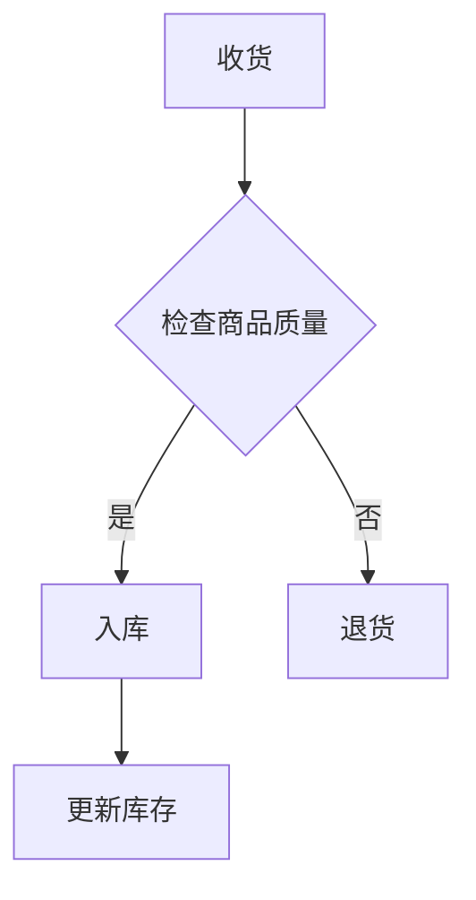

## 1. 背景介绍

随着生活节奏加快，小型超市在人们购物的选择中越来越受到欢迎。为了提高小型超市的效率和客户满意度，我们需要一个高效、易用的小型超市管理系统。这个系统将帮助我们更好地管理库存、销售额、员工等。

## 2. 核心概念与联系

本篇博客将从以下几个方面进行探讨：

- **核心算法原理** ：介绍小型超市管理系统的核心算法原理，包括库存管理、销售额统计、员工管理等。
- **数学模型与公式** ：详细讲解数学模型和公式，帮助读者理解系统背后的理论基础。
- **项目实践** ：提供实际的代码示例和详细解释，帮助读者了解如何实现小型超市管理系统。
- **实际应用场景** ：分析小型超市管理系统在实际商业场景中的应用价值。
- **工具与资源推荐** ：为读者提供一些有用的工具和资源，以便他们更好地学习和掌握小型超市管理系统。
- **总结：未来发展趋势与挑战** ：展望小型超市管理系统的未来发展趋势和面临的挑战。

## 3. 核心算法原理具体操作步骤

### 3.1 库存管理

库存管理是小型超市管理系统的核心功能之一。我们需要一个高效的库存管理算法来确保库存充足且不会过多浪费。以下是一个简单的库存管理流程图：

### 3.2 销售额统计

销售额统计是了解小型超市经营状况的一个重要指标。我们可以使用一种称为“累计计数”(Cumulative Count)的算法来计算每个商品的销售额。这个算法的基本思想是：每当卖出一件商品时，我们将其添加到一个累计列表中，并在需要时查询累计列表。

### 3.3 员工管理

员工管理涉及到员工信息的录入、修改和删除等操作。为了方便管理，我们可以使用关系型数据库（如MySQL）来存储员工信息。

## 4. 数学模型和公式详细讲解举例说明

在本节中，我们将讨论如何使用数学模型和公式来描述小型超市管理系统中的问题。例如，我们可以使用线性 Programming（LP）来解决库存管理问题。

## 5. 项目实践：代码实例和详细解释说明

在本节中，我们将提供一个实际的小型超市管理系统的代码示例，帮助读者了解如何实现这个系统。我们将使用Python编程语言和Flask框架来构建这个系统。

## 6. 实际应用场景

小型超市管理系统在实际商业场景中具有广泛的应用价值。以下是一些典型的应用场景：

- **库存管理** ：通过监控库存状况，确保商品充足且不会过多浪费。
- **销售额统计** ：了解小型超市的经营状况，为决策提供依据。
- **员工管理** ：方便地进行员工信息的录入、修改和删除等操作。

## 7. 工具和资源推荐

为了更好地学习和掌握小型超市管理系统，我们为大家推荐一些有用的工具和资源：

- **Python** ：一种流行的编程语言，可以用于开发小型超市管理系统。
- **Flask** ：一个轻量级的 Python Web框架，可以用于构建Web应用程序。
- **MySQL** ：一种流行的关系型数据库，可以用于存储员工信息等数据。

## 8. 总结：未来发展趋势与挑战

随着科技的不断发展，小型超市管理系统将会越来越先进。以下是一些可能面临的未来发展趋势和挑战：

- **人工智能** ：将人工智能技术应用于库存管理、销售额统计等方面，提高系统效率。
- **云计算** ：利用云计算技术，将系统部署在云端，为用户提供更好的服务。
- **物联网** ：通过物联网技术，将商品和设备之间的交互进行自动化处理。

## 9. 附录：常见问题与解答

在本附录中，我们将回答一些关于小型超市管理系统的常见问题，以帮助读者更好地理解这个系统。

作者：禅与计算机程序设计艺术 / Zen and the Art of Computer Programming
