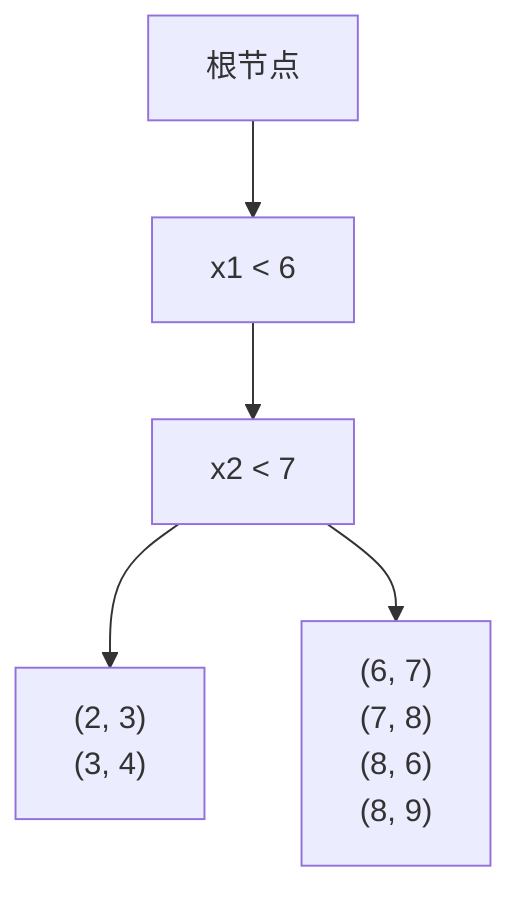

# 异常检测:隔离森林的奥秘

## 1.背景介绍

在现实世界中,异常值或离群点的存在是不可避免的。这些异常值可能源于数据收集过程中的错误、传感器故障或者极端事件等多种原因。及时发现和处理这些异常值对于保证数据质量、提高模型准确性以及识别潜在风险至关重要。异常检测(Anomaly Detection)作为一种无监督学习技术,旨在从大量数据中识别出那些与大多数实例明显不同的"异常"实例,已广泛应用于欺诈检测、系统健康监控、网络入侵检测等诸多领域。

传统的异常检测方法包括基于统计学的方法(如基于高斯分布的模型)、基于最近邻的方法、基于聚类的方法等。然而,这些方法在处理高维数据时往往会遇到"维数灾难"(Curse of Dimensionality)的问题,导致性能下降。为了解决这一问题,隔离森林(Isolation Forest)算法应运而生。

隔离森林算法是一种高效、无参数且对异常值敏感的异常检测算法,由美国麻省理工学院的计算机科学家Fei Tony Liu等人于2008年提出。该算法通过随机构建二叉决策树(Binary Decision Tree)来隔离观测值,并利用路径长度来确定异常分数。与其他基于距离或密度的方法相比,隔离森林算法在处理高维数据时表现出色,而且训练速度快、可扩展性强。自问世以来,隔离森林算法受到了广泛关注和应用,成为异常检测领域的经典算法之一。

## 2.核心概念与联系

隔离森林算法的核心思想是通过随机构建二叉决策树来隔离观测值,并利用路径长度来确定异常分数。具体来说,隔离森林算法包含以下几个关键概念:

1. **隔离(Isolation)**:隔离是指将观测值与其余数据点分离开来的过程。隔离森林算法通过随机构建二叉决策树来隔离观测值,每个节点通过随机选择一个特征及其分割值将数据划分为两部分。

2. **路径长度(Path Length)**:路径长度指的是从树根节点到达某个终端节点(即叶子节点)所需要经过的边数。在隔离森林算法中,路径长度被用作衡量观测值异常程度的指标。

3. **异常分数(Anomaly Score)**:异常分数是一个介于0到1之间的值,用于量化观测值的异常程度。异常分数越接近1,表示该观测值越有可能是异常值。

4. **集成学习(Ensemble Learning)**:隔离森林算法采用集成学习的思想,通过构建多棵隔离树并对它们的结果进行平均,从而提高异常检测的准确性和鲁棍性。

这些核心概念相互关联、环环相扣,共同构成了隔离森林算法的理论基础和实现框架。下面将详细介绍隔离森林算法的原理和实现细节。

## 3.核心算法原理具体操作步骤

隔离森林算法的核心思想是通过随机构建二叉决策树来隔离观测值,并利用路径长度来确定异常分数。算法的具体操作步骤如下:

### 3.1 构建隔离树

1. **随机选择特征**:对于每棵隔离树,算法首先从数据集的所有特征中随机选择一个特征。

2. **随机选择分割值**:对于选定的特征,算法随机生成一个介于该特征的最小值和最大值之间的分割值。

3. **根据分割值划分数据**:使用上一步生成的分割值,将当前节点的数据划分为两个子节点。

4. **递归构建子树**:对于每个子节点,重复步骤1到3,直到满足以下任一终止条件:
   - 子节点中所有实例属于同一类别(即无需再分割)。
   - 子节点中没有剩余特征可供分割。
   - 子节点已达到预定义的最大树深度。

通过上述步骤,算法可以构建出一棵隔离树。值得注意的是,隔离树的构建过程是完全随机的,不涉及任何距离计算或密度估计,这使得隔离森林算法在处理高维数据时具有很好的性能。

### 3.2 计算路径长度

对于每个观测值,算法计算其在隔离树中的平均路径长度。具体做法是:

1. 将观测值从树根节点开始,一路向下遍历到某个终端节点。
2. 记录从根节点到该终端节点的路径长度,即经过的边数。
3. 重复步骤1和2,对同一观测值在不同隔离树中计算路径长度。
4. 计算该观测值在所有隔离树中的平均路径长度。

直观上,正常观测值需要经过更多的分割才能被隔离,因此其路径长度较长;而异常值由于其特征值较为极端,可以被快速隔离,因此路径长度较短。

### 3.3 计算异常分数

基于路径长度,算法计算每个观测值的异常分数。异常分数的计算公式如下:

$$
s(x, n) = 2^{-\frac{E(h(x))}{c(n)}}
$$

其中:

- $s(x, n)$表示观测值$x$在由$n$棵树组成的隔离森林中的异常分数。
- $E(h(x))$表示观测值$x$在所有隔离树中的平均路径长度。
- $c(n)$是一个用于归一化的常数,表示给定$n$棵树时的平均路径长度。

异常分数的取值范围为$(0, 1)$,值越接近1,表示观测值越有可能是异常值。通常,我们可以设置一个异常分数阈值,将高于该阈值的观测值标记为异常值。

以上三个步骤共同构成了隔离森林算法的核心流程。下面将通过一个简单的示例来进一步说明算法的工作原理。

### 3.4 示例说明

假设我们有一个二维数据集,包含以下6个观测值:

```
X = [(2, 3), (3, 4), (6, 7), (7, 8), (8, 6), (8, 9)]
```

我们构建一棵隔离树,如下所示:



在这棵隔离树中,观测值(2, 3)和(3, 4)的路径长度为3,而其他观测值的路径长度为2。假设我们只构建了这一棵隔离树,那么(2, 3)和(3, 4)的异常分数为$2^{-3/c(1)} \approx 0.125$,其他观测值的异常分数为$2^{-2/c(1)} \approx 0.25$。

可以看出,虽然(2, 3)和(3, 4)在该数据集中并不是真正的异常值,但由于它们被隔离的路径较长,因此被赋予了较低的异常分数。这说明隔离森林算法倾向于将较为"常见"的观测值识别为正常值,而将较为"罕见"的观测值识别为异常值。

通过构建多棵隔离树并对结果进行平均,隔离森林算法可以提高异常检测的准确性和鲁棍性。下面将详细介绍隔离森林算法的数学模型和公式推导过程。

## 4.数学模型和公式详细讲解举例说明

隔离森林算法的数学模型和公式推导过程主要涉及以下几个方面:

1. 路径长度的期望
2. 归一化常数的计算
3. 异常分数的计算

### 4.1 路径长度的期望

在隔离森林算法中,路径长度被用作衡量观测值异常程度的指标。为了理解路径长度的意义,我们需要计算其期望值。

假设我们有一个$d$维数据集$X$,其中每个特征的取值范围为$[0, 1]$。在构建隔离树时,算法会随机选择一个特征及其分割值,将当前节点的数据划分为两个子节点。由于分割值是在特征的取值范围内均匀随机选择的,因此每个观测值被分配到左子节点或右子节点的概率都是$\frac{1}{2}$。

令$h(x)$表示观测值$x$在隔离树中的路径长度,则$h(x)$服从下列递归过程:

$$
h(x) = \begin{cases}
0 & \text{if } |X| = 1\\
1 + h(x|\text{split}) & \text{otherwise}
\end{cases}
$$

其中,$|X|$表示当前节点中观测值的数量,$h(x|\text{split})$表示观测值$x$在子节点中的路径长度。

由于每个观测值被分配到左子节点或右子节点的概率都是$\frac{1}{2}$,因此$h(x)$的期望可以表示为:

$$
E(h(x)) = P(|X| = 1) \cdot 0 + P(|X| > 1) \cdot (1 + E(h(x|\text{split})))
$$

由于分割是在整个特征空间中随机进行的,因此$E(h(x|\text{split}))$与$x$无关,可以简记为$c(n)$,其中$n$表示数据集的大小。将其代入上式,我们得到:

$$
E(h(x)) = P(|X| > 1) \cdot (1 + c(n))
$$

根据离散数学中的结果,对于$n$个观测值,有$\frac{n-1}{n}$的概率会进行分割,因此:

$$
E(h(x)) = \frac{n-1}{n} \cdot (1 + c(n))
$$

上式是一个关于$c(n)$的递归方程,通过数学归纳法可以得到其解析解:

$$
c(n) = 2H(n-1) - \frac{2(n-1)}{n}
$$

其中,$H(n)$是$n$的调和级数,定义为:

$$
H(n) = \sum_{i=1}^{n}\frac{1}{i}
$$

当$n$趋近于无穷大时,$c(n)$趋近于$\ln n + 0.5772\ldots$(欧拉常数)。这说明对于足够大的数据集,路径长度的期望值约为$\ln n$。

### 4.2 归一化常数的计算

在计算异常分数时,我们需要将路径长度进行归一化,使其落在$(0, 1)$区间内。为此,我们引入了归一化常数$c(n)$,它表示给定$n$棵树时的平均路径长度。

根据上一小节的推导,我们知道$c(n) = 2H(n-1) - \frac{2(n-1)}{n}$。当$n$趋近于无穷大时,$c(n)$趋近于$\ln n + 0.5772\ldots$(欧拉常数)。

因此,在实际应用中,我们可以近似地取$c(n) \approx \ln n$。这样做的优点是计算简单,而且当$n$足够大时,近似值与真实值非常接近。

### 4.3 异常分数的计算

现在,我们已经掌握了计算路径长度期望和归一化常数的方法,可以进一步推导异常分数的计算公式。

设$E(h(x))$表示观测值$x$在隔离森林中的平均路径长度,则根据路径长度的期望公式,我们有:

$$
E(h(x)) = \frac{n-1}{n} \cdot (1 + c(n))
$$

将$c(n) \approx \ln n$代入上式,并对$E(h(x))$进行变形,我们得到:

$$
E(h(x)) \approx \frac{n-1}{n} \cdot (1 + \ln n) = 2 \cdot \left(\frac{n-1}{n}\right) \cdot \ln n
$$

令$s(x, n)$表示观测值$x$在由$n$棵树组成的隔离森林中的异常分数,则有:

$$
s(x, n) = 2^{-\frac{E(h(x))}{c(n)}} \approx 2^{-\frac{2\left(\frac{n-1}{n}\right)\ln n}{\ln n}} = 2^{-\frac{2(n-1)}{n