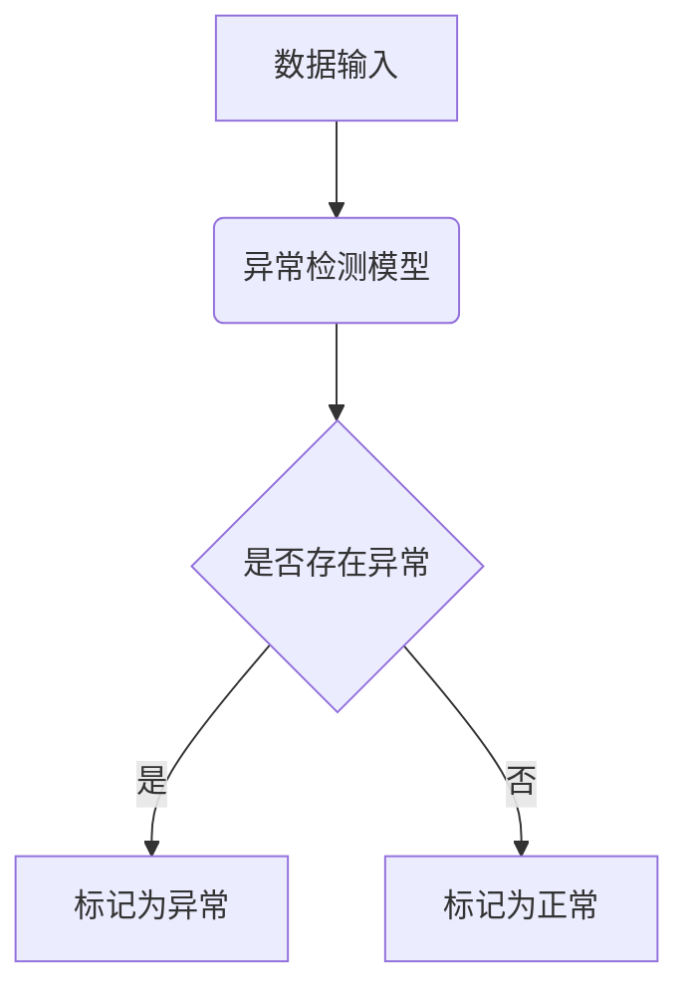
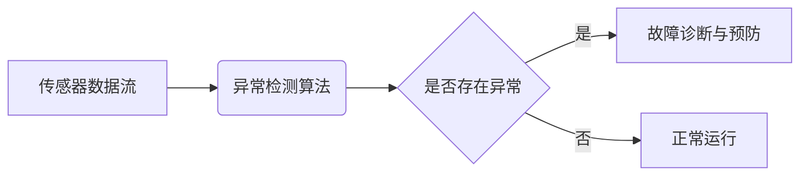

# 异常检测在物联网领域的应用:传感器数据分析与故障检测

## 1.背景介绍

### 1.1 物联网的兴起

随着物联网(IoT)技术的快速发展,越来越多的设备和系统被连接到互联网上。物联网通过将传感器、执行器和其他物理设备连接到网络,使得数据可以被实时收集、传输和分析。这为我们提供了前所未有的机会来监控和控制现实世界中的各种系统和流程。

### 1.2 物联网数据的重要性

在物联网环境中,来自传感器的大量数据是非常宝贵的资源。这些数据反映了被监控系统的运行状态,可用于诊断故障、优化性能、预测未来行为等。然而,由于传感器数量庞大、环境复杂多变,物联网数据往往存在噪音、缺失值、异常值等问题,给数据分析带来了巨大挑战。

### 1.3 异常检测的必要性

异常检测技术在物联网领域扮演着至关重要的角色。它能够自动识别数据中的异常模式,这些异常可能预示着系统故障、安全威胁或异常事件的发生。及时发现异常对于防患于未然、减小损失、提高系统可靠性至关重要。

## 2.核心概念与联系

### 2.1 异常检测概念

异常检测(Anomaly Detection)是一种从数据中发现稀有项目或事件的技术。这些异常项目可能是由于噪音、异常事件或系统故障引起的,与正常数据存在显著差异。异常检测广泛应用于诸如欺诈检测、系统健康监控、网络入侵检测等领域。



### 2.2 异常检测与物联网数据分析

在物联网场景中,异常检测技术可以应用于分析来自传感器的时序数据流。通过建立正常数据模式,异常检测算法能够识别偏离正常模式的数据点或数据段,从而发现潜在的故障或异常事件。



### 2.3 异常检测与故障检测

异常检测与故障检测(Fault Detection)是密切相关的概念。当异常检测算法发现数据异常时,这可能预示着系统存在故障或即将发生故障。通过结合领域知识和专家经验,我们可以将检测到的异常与特定的故障模式相关联,从而实现故障检测和诊断。

## 3.核心算法原理具体操作步骤

异常检测算法可以分为有监督、无监督和半监督三大类。每种算法都有其适用场景和特点。

### 3.1 有监督异常检测算法

有监督异常检测算法需要已标记的正常数据和异常数据作为训练集。常见的有监督算法包括:

#### 3.1.1 逻辑回归

逻辑回归是一种经典的分类算法,可用于二分类异常检测问题。它通过拟合sigmoid函数将数据映射到0-1之间,从而对数据进行正常/异常分类。

#### 3.1.2 支持向量机(SVM)

支持向量机是一种有监督的非概率二分类模型。它通过找到一个最优超平面将数据分为两类,异常数据被视为另一类。SVM具有很好的泛化能力,适用于高维数据。

#### 3.1.3 神经网络

深度神经网络也可以用于异常检测任务。通过对正常数据和异常数据进行大量训练,神经网络能够学习数据的特征模式,对新数据进行分类。

#### 3.1.4 集成学习方法

集成学习方法如随机森林、Adaboost等,通过构建多个基础分类器并对其结果进行集成,能够提高异常检测的准确性和鲁棒性。

### 3.2 无监督异常检测算法

在现实场景中,我们往往只有正常数据,缺乏标记的异常数据样本。这种情况下,需要使用无监督异常检测算法。常见的算法包括:

#### 3.2.1 聚类算法

聚类算法如K-Means、DBSCAN等,能够将数据划分为多个簇。簇之外或者离簇心较远的数据点可被视为异常。

#### 3.2.2 高斯混合模型(GMM)

高斯混合模型假设数据由多个高斯分布混合而成。对于每个高斯分布,我们可以计算一个数据点属于该分布的概率。低概率的数据点被认为是异常。

#### 3.2.3 隔离森林

隔离森林算法通过构建多个随机决策树对数据进行划分。异常值由于其特殊性,很容易被隔离,因此具有较短的路径长度。

#### 3.2.4 一类支持向量机(One-Class SVM)

一类SVM将正常数据映射到高维特征空间,并寻找包围大部分数据的最小超球体。落在超球体之外的数据被视为异常。

### 3.3 半监督异常检测算法

半监督算法结合了有监督和无监督方法的优点,可以利用少量标记数据和大量未标记数据进行训练。常见的半监督算法包括:

#### 3.3.1 半监督支持向量机

半监督SVM在训练过程中同时考虑了标记数据和未标记数据,以最大化正常数据和异常数据之间的边际。

#### 3.3.2 半监督深度自编码器

深度自编码器是一种无监督神经网络模型,可以学习数据的潜在特征表示。通过结合少量标记数据进行微调,自编码器可以用于异常检测任务。

#### 3.3.3 半监督高斯混合模型

与标准GMM不同,半监督GMM在训练过程中同时考虑了标记数据和未标记数据,从而提高了模型的准确性。

## 4.数学模型和公式详细讲解举例说明

异常检测算法通常基于一些数学模型和统计理论,下面我们详细介绍其中的一些核心概念和公式。

### 4.1 高斯分布

高斯分布(也称正态分布)是最常见的连续概率分布之一,广泛应用于数据建模和异常检测。一个$d$维高斯分布的概率密度函数为:

$$
f(\mathbf{x}|\boldsymbol{\mu},\boldsymbol{\Sigma})=\frac{1}{(2\pi)^{d/2}|\boldsymbol{\Sigma}|^{1/2}}\exp\left(-\frac{1}{2}(\mathbf{x}-\boldsymbol{\mu})^T\boldsymbol{\Sigma}^{-1}(\mathbf{x}-\boldsymbol{\mu})\right)
$$

其中$\boldsymbol{\mu}$是均值向量,$\boldsymbol{\Sigma}$是协方差矩阵。对于一个新的数据点$\mathbf{x}$,我们可以计算其在该高斯分布下的概率密度值$f(\mathbf{x}|\boldsymbol{\mu},\boldsymbol{\Sigma})$。如果该值较小,则认为$\mathbf{x}$是一个异常点。

### 4.2 马氏距离

马氏距离(Mahalanobis Distance)是一种常用于异常检测的距离度量,它考虑了数据的协方差结构。对于一个$d$维数据点$\mathbf{x}$,其与均值向量$\boldsymbol{\mu}$的马氏距离定义为:

$$
D_M(\mathbf{x})=\sqrt{(\mathbf{x}-\boldsymbol{\mu})^T\boldsymbol{\Sigma}^{-1}(\mathbf{x}-\boldsymbol{\mu})}
$$

其中$\boldsymbol{\Sigma}$是数据的协方差矩阵。较大的马氏距离值意味着$\mathbf{x}$与正常数据模式存在较大偏离,因此可被视为异常点。

### 4.3 核函数与核技巧

在处理非线性数据时,我们常常需要将数据映射到更高维的特征空间,以期在新空间中数据呈现线性可分性。核函数提供了一种隐式映射数据到高维空间的技巧,而无需显式计算映射函数。常用的核函数包括:

- 线性核: $k(\mathbf{x},\mathbf{y})=\mathbf{x}^T\mathbf{y}$
- 多项式核: $k(\mathbf{x},\mathbf{y})=(\gamma\mathbf{x}^T\mathbf{y}+r)^d$
- 高斯核(RBF核): $k(\mathbf{x},\mathbf{y})=\exp\left(-\gamma\|\mathbf{x}-\mathbf{y}\|^2\right)$

通过核技巧,我们可以在隐式映射的高维特征空间中构建线性分类器或回归模型,从而解决原始空间中的非线性问题。

### 4.4 一类支持向量机

一类支持向量机(One-Class SVM)是一种半监督异常检测算法,其目标是在高维特征空间中寻找包围大部分数据的最小超球体。具体来说,对于映射后的数据$\phi(\mathbf{x}_i)$,我们需要求解以下优化问题:

$$
\begin{aligned}
\min_{R,\mathbf{c},\boldsymbol{\xi}} &\quad R^2+\frac{1}{\nu l}\sum_{i=1}^l\xi_i\\
\text{s.t.} &\quad \|\phi(\mathbf{x}_i)-\mathbf{c}\|^2\leq R^2+\xi_i,\quad\xi_i\geq 0
\end{aligned}
$$

其中$R$和$\mathbf{c}$分别表示超球体的半径和球心,$\nu$控制了异常数据的比例,$\boldsymbol{\xi}$是松弛变量。求解该优化问题后,落在超球体之外的数据点即被视为异常。

### 4.5 隔离森林

隔离森林(Isolation Forest)是一种高效的无监督异常检测算法。其核心思想是:异常点由于其特殊性,在随机分割数据时很容易被隔离,因此具有较短的路径长度。具体来说,对于一个数据点$\mathbf{x}$,我们定义其异常分数为:

$$
s(\mathbf{x},n)=2^{-\frac{E(h(\mathbf{x}))}{c(n)}}
$$

其中$h(\mathbf{x})$是$\mathbf{x}$在隔离树中的路径长度,$E(h(\mathbf{x}))$是$h(\mathbf{x})$的期望值,$c(n)$是一个用于归一化的常数。异常分数越小,数据点$\mathbf{x}$就越有可能是异常点。

通过以上这些数学模型和公式,我们可以更好地理解和应用各种异常检测算法。在实际应用中,需要根据具体问题和数据特点选择合适的模型。

## 5. 项目实践:代码实例和详细解释说明

为了更好地理解异常检测算法在物联网领域的应用,我们将通过一个基于Python的实例项目来演示如何对传感器数据进行异常检测。

我们将使用一个来自NASA的公开数据集,其中包含了某个系统的滚动轴承的运行数据。该数据集由多个数据文件组成,每个文件对应一个滚动轴承在正常运行和故障运行时的振动数据。我们的目标是开发一个异常检测模型,能够从振动数据中识别出故障模式。

### 5.1 数据预处理

在开始建模之前,我们需要对原始数据进行适当的预处理,包括缺失值处理、数据标准化等。以下是相关的Python代码:

```python
import pandas as pd
from sklearn.preprocessing import StandardScaler

# 读取数据
data = pd.read_csv('bearing_data.csv')

# 处理缺失值
data = data.dropna()

# 数据标准化
scaler = StandardScaler()
data_norm = scaler.fit_transform(data)
```

### 5.2 异常检测模型构建

在这个例子中,我们将使用隔离森林算法对滚动轴承的振动数据进行异常检测。隔离森林是一种高效的无监督异常检测算法,