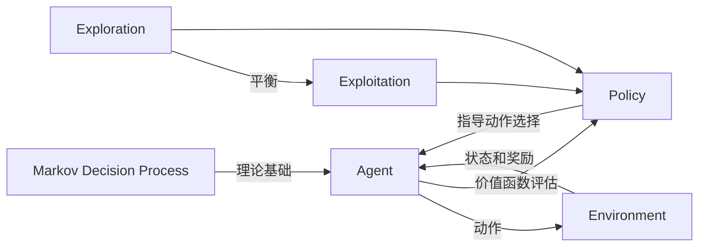

# 强化学习(Reinforcement Learning) - 原理与代码实例讲解

## 1. 背景介绍
### 1.1 强化学习的起源与发展
强化学习(Reinforcement Learning, RL)是机器学习的一个重要分支,其灵感来源于心理学中的行为主义理论。早在20世纪50年代,Richard Sutton和Andrew Barto等先驱就开始了对强化学习的研究。近年来,随着深度学习的兴起,深度强化学习取得了突破性进展,在AlphaGo、自动驾驶、机器人控制等领域展现出了巨大的应用前景。

### 1.2 强化学习的定义
强化学习是一种让智能体(agent)通过与环境的交互来学习最优策略的机器学习方法。与监督学习和非监督学习不同,强化学习并没有预先准备好的训练数据,而是让智能体在与环境的交互过程中,通过试错和反馈来不断优化自身的策略,最终达到预定的目标。

### 1.3 强化学习的应用领域
强化学习在很多领域都有广泛的应用,包括但不限于:
- 游戏AI:如国际象棋、围棋、雅达利游戏等
- 自动驾驶:让无人车学会在复杂环境中安全高效地行驶  
- 机器人控制:让机器人学会灵活地完成各种任务
- 推荐系统:学习用户偏好,提供个性化推荐
- 智能电网:优化电力调度,提高能源利用效率

## 2. 核心概念与联系
### 2.1 智能体(Agent)与环境(Environment) 
强化学习的两个核心概念是智能体和环境。智能体是学习和决策的主体,通过动作(action)来影响环境,并从环境获得状态(state)和奖励(reward)的反馈。环境则定义了智能体可以进行的交互,以及交互的规则。

### 2.2 状态(State)、动作(Action)与奖励(Reward)
- 状态:表示智能体所处的环境状况,通常用一个状态向量来表示。
- 动作:智能体根据当前状态采取的行为决策,可以是离散的(如左转/右转),也可以是连续的(如油门/刹车)。 
- 奖励:环境根据智能体的动作和状态转移给出的即时反馈,通常是一个标量值。奖励函数的设计直接影响智能体学习的目标。

### 2.3 策略(Policy)与价值函数(Value Function)
- 策略:是将状态映射到动作的函数,表示智能体在每个状态下应该采取的行为决策。优化策略是强化学习的核心目标。
- 价值函数:表示每个状态或状态-动作对的长期累积奖励期望,分为状态价值函数V(s)和动作价值函数Q(s,a)。价值函数可以用来评估一个策略的好坏。

### 2.4 探索(Exploration)与利用(Exploitation)
强化学习面临探索与利用的权衡(Exploration-Exploitation Trade-off)。探索是尝试新的动作以发现可能更好的策略,利用则是基于已有经验采取当前最优动作。两者需要平衡,过度探索会降低学习效率,过度利用则可能错失全局最优。

### 2.5 马尔可夫决策过程(Markov Decision Process)
马尔可夫决策过程(MDP)为强化学习提供了理论基础。MDP由状态空间、动作空间、转移概率和奖励函数组成,符合马尔可夫性质:下一状态只取决于当前状态和动作,与之前历史无关。求解MDP就是找到最优策略以最大化长期累积奖励。

强化学习的核心概念联系如下图所示:

## 3. 核心算法原理具体操作步骤
强化学习有很多经典算法,这里重点介绍几种核心算法的原理和操作步骤。

### 3.1 值迭代(Value Iteration)
值迭代是一种基于动态规划的无模型算法,通过迭代更新状态价值函数来求解最优策略。

算法步骤:
1. 随机初始化状态价值函数V(s)
2. 重复直到收敛:
   - 对每个状态s,更新状态价值: 
     $V(s) \leftarrow \max\limits_a \sum\limits_{s',r} p(s',r|s,a)[r+\gamma V(s')]$
3. 根据收敛的状态价值函数得到最优策略:
   $\pi^*(s)=\arg\max\limits_a \sum\limits_{s',r} p(s',r|s,a)[r+\gamma V(s')]$

其中,$p(s',r|s,a)$是环境动力学模型(转移概率和奖励函数),$\gamma$是折扣因子。

### 3.2 策略迭代(Policy Iteration)
策略迭代也是基于动态规划的无模型算法,通过交替执行策略评估和策略提升来求解最优策略。

算法步骤:
1. 随机初始化策略$\pi(s)$  
2. 重复直到策略收敛:
   - 策略评估:固定当前策略,求解该策略下的状态价值函数
     $V^{\pi}(s)=\sum\limits_{s',r} p(s',r|s,\pi(s))[r+\gamma V^{\pi}(s')]$
   - 策略提升:根据状态价值函数更新策略
     $\pi'(s)=\arg\max\limits_a \sum\limits_{s',r} p(s',r|s,a)[r+\gamma V^{\pi}(s')]$
3. 返回最优策略$\pi^*=\pi$

策略迭代通过价值函数来评估和提升策略,最终收敛到最优策略。

### 3.3 蒙特卡洛方法(Monte Carlo Methods)
蒙特卡洛方法是一类基于采样的无模型算法,通过智能体与环境的交互采样轨迹数据来学习最优策略。

算法步骤(以首次访问型为例):
1. 随机初始化动作价值函数Q(s,a)和返回次数计数器N(s,a)
2. 重复多个回合:
   - 根据当前策略(如$\epsilon$-贪婪)生成一条完整轨迹$\{s_0,a_0,r_1,s_1,a_1,...,s_T\}$
   - 对轨迹中的每个状态-动作对$(s_t,a_t)$,倒序计算累积回报:
     $G_t=\sum\limits_{k=t+1}^T \gamma^{k-t-1}r_k$
   - 若$(s_t,a_t)$是首次访问,更新动作价值函数:
     $N(s_t,a_t) \leftarrow N(s_t,a_t)+1$
     $Q(s_t,a_t) \leftarrow Q(s_t,a_t)+\frac{1}{N(s_t,a_t)}(G_t-Q(s_t,a_t))$
3. 根据最终的Q值得到最优策略:
   $\pi^*(s)=\arg\max\limits_a Q(s,a)$

蒙特卡洛方法通过采样得到的轨迹数据,用实际累积回报来更新动作价值函数,进而得到最优策略。

### 3.4 时序差分学习(Temporal Difference Learning)
时序差分学习(如Q-learning、Sarsa等)结合了动态规划和蒙特卡洛方法的思想,通过自举(bootstrap)的方式更新值函数。

以Q-learning为例,算法步骤:
1. 随机初始化动作价值函数Q(s,a) 
2. 重复多个回合直到收敛:
   - 初始化状态$s$
   - 重复直到回合结束:
     - 根据当前Q值和探索策略(如$\epsilon$-贪婪)选择动作$a$
     - 执行动作$a$,观察到下一状态$s'$和奖励$r$
     - 更新动作价值函数:
       $Q(s,a) \leftarrow Q(s,a)+\alpha[r+\gamma \max\limits_{a'}Q(s',a')-Q(s,a)]$
     - $s \leftarrow s'$   
3. 根据最终的Q值得到最优策略:
   $\pi^*(s)=\arg\max\limits_a Q(s,a)$

其中,$\alpha$是学习率。Q-learning是一种异策略(off-policy)算法,目标策略由贪婪选取最大Q值的动作,而行为策略可以是$\epsilon$-贪婪以平衡探索与利用。

## 4. 数学模型和公式详细讲解举例说明
强化学习中的几个重要的数学模型和公式包括:

### 4.1 马尔可夫决策过程(MDP)
MDP定义为一个五元组$(S,A,P,R,\gamma)$:
- 状态空间$S$:有限的状态集合
- 动作空间$A$:每个状态下可用的有限动作集合
- 转移概率$P$:$P(s'|s,a)$表示在状态$s$下执行动作$a$后转移到状态$s'$的概率
- 奖励函数$R$:$R(s,a)$表示在状态$s$下执行动作$a$后获得的即时奖励期望值
- 折扣因子$\gamma \in [0,1]$:表示未来奖励的折算比例

例如,一个简单的网格世界MDP:
- 状态:网格中的位置坐标(x,y)
- 动作:上、下、左、右
- 转移概率:执行动作后转移到相邻网格的概率为1,其他为0
- 奖励:到达目标位置奖励为+1,其他为0
- 折扣因子:$\gamma=0.9$,表示更看重短期奖励

### 4.2 贝尔曼方程(Bellman Equation)
贝尔曼方程是MDP的最优性条件,描述了状态价值函数和动作价值函数的递归关系。

状态价值函数$V^*(s)$的贝尔曼最优方程:

$$V^*(s)=\max\limits_a \sum\limits_{s',r} p(s',r|s,a)[r+\gamma V^*(s')]$$

动作价值函数$Q^*(s,a)$的贝尔曼最优方程:

$$Q^*(s,a)=\sum\limits_{s',r} p(s',r|s,a)[r+\gamma \max\limits_{a'} Q^*(s',a')]$$

例如,对于一个确定性MDP,状态价值函数的贝尔曼方程可以写成:

$$V^*(s)=\max\limits_a [R(s,a)+\gamma V^*(P(s,a))]$$

即当前状态的最优价值等于选择最优动作后获得的即时奖励和折扣后下一状态最优价值之和。

### 4.3 策略梯度定理(Policy Gradient Theorem)
策略梯度定理给出了策略函数参数化后的梯度表达式,使得可以用梯度上升等优化方法直接优化策略。

对于参数化策略$\pi_{\theta}(a|s)$,其性能度量函数定义为所有状态的价值函数加权和:

$$J(\theta)=\sum\limits_s d^{\pi}(s)V^{\pi}(s)=\sum\limits_s d^{\pi}(s)\sum\limits_a \pi_{\theta}(a|s)Q^{\pi}(s,a)$$

其中,$d^{\pi}(s)$是策略$\pi$下状态$s$的稳态分布。根据策略梯度定理,性能度量函数对策略参数的梯度为:

$$\nabla_{\theta}J(\theta)=\sum\limits_s d^{\pi}(s) \sum\limits_a Q^{\pi}(s,a)\nabla_{\theta}\pi_{\theta}(a|s)$$

即梯度方向是动作价值函数与概率对数梯度的乘积在状态分布上的期望。这个结果可以用蒙特卡洛采样的方法估计:

$$\nabla_{\theta}J(\theta) \approx \frac{1}{N} \sum\limits_{i=1}^N \sum\limits_{t=0}^{T-1} Q^{\pi}(s_{i,t},a_{i,t}) \nabla_{\theta} \log \pi_{\theta}(a_{i,t}|s_{i,t}) $$

其中,$N$是采样轨迹数,$T$是轨迹长度。这就是著名的REINFORCE算法。

## 5. 项目实践