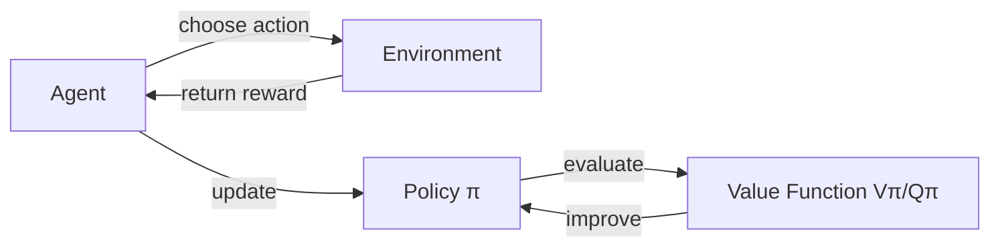

# 强化学习Reinforcement Learning中价值函数近似方法解读

## 1.背景介绍

强化学习(Reinforcement Learning, RL)是机器学习的一个重要分支,它主要研究如何让智能体(agent)通过与环境的交互来学习最优策略,以获得最大的累积奖励。在强化学习中,价值函数(Value Function)扮演着至关重要的角色,它评估了在给定状态下执行某个动作的好坏程度。然而,在大规模或连续状态空间下,直接存储每个状态的价值是不现实的。因此,价值函数近似(Value Function Approximation, VFA)应运而生,它使用参数化的函数来近似真实的价值函数,从而使强化学习算法能够处理更加复杂的问题。本文将深入探讨强化学习中几种主要的价值函数近似方法,揭示其内在原理和实现细节,并分析其优缺点和适用场景。

## 2.核心概念与联系

在介绍价值函数近似方法之前,我们先来回顾一下强化学习中的一些核心概念:

- 状态(State): 环境的完整描述,通常用 $s$ 表示。
- 动作(Action): 智能体可执行的行为,用 $a$ 表示。  
- 策略(Policy): 智能体的行为准则,定义为在给定状态下应该采取的动作,通常用 $\pi$ 表示。
- 奖励(Reward): 环境对智能体动作的即时反馈,用 $r$ 表示。
- 回报(Return): 从某个状态开始,智能体执行一系列动作后获得的累积奖励,通常用 $G_t$ 表示。
- 状态价值函数(State-Value Function): 评估状态的好坏,定义为从该状态开始能获得的期望回报,用 $V^\pi(s)$ 表示。 
- 动作价值函数(Action-Value Function): 评估在某状态下执行某动作的好坏,定义为在该状态下执行该动作后能获得的期望回报,用 $Q^\pi(s,a)$ 表示。

价值函数与策略密切相关,我们通常把在策略 $\pi$ 下的状态价值函数和动作价值函数分别记为 $V^\pi$ 和 $Q^\pi$。它们满足贝尔曼方程(Bellman Equation):

$$
\begin{aligned}
V^\pi(s) &= \mathbb{E}_{a\sim\pi}[Q^\pi(s,a)] \\
Q^\pi(s,a) &= r(s,a) + \gamma \mathbb{E}_{s'\sim p}[V^\pi(s')]
\end{aligned}
$$

其中 $\gamma$ 是折扣因子,用于平衡即时奖励和长期奖励。

下图展示了强化学习中这些核心概念之间的关系:

## 3.核心算法原理具体操作步骤

### 3.1 线性价值函数近似

线性价值函数近似是最简单和常用的一种近似方法,它假设价值函数可以用状态特征的线性组合来表示。形式化地,我们用特征向量 $\phi(s)=(\phi_1(s),\ldots,\phi_n(s))^\top$ 来表示状态 $s$,其中每个 $\phi_i(s)$ 都是状态 $s$ 的一个特征值。线性价值函数近似定义为:

$$\hat{v}(s,\mathbf{w}) = \mathbf{w}^\top\phi(s) = \sum_{i=1}^n w_i\phi_i(s)$$

其中 $\mathbf{w}=(w_1,\ldots,w_n)^\top$ 是一个权重向量,需要通过学习来确定。

线性价值函数近似的学习通常基于随机梯度下降(Stochastic Gradient Descent, SGD)。每次更新时,我们先计算 $\hat{v}(S_t,\mathbf{w})$ 和真实回报 $G_t$ 之间的误差:

$$\delta_t = G_t - \hat{v}(S_t,\mathbf{w})$$

然后根据该误差来更新权重向量:

$$\mathbf{w}_{t+1} = \mathbf{w}_t + \alpha\delta_t\phi(S_t)$$

其中 $\alpha$ 是学习率。这个更新过程不断重复,直到权重向量收敛。

线性价值函数近似的优点是简单高效,易于实现和调试。但它的表达能力有限,难以刻画非线性的价值函数。此外,线性近似对特征选择很敏感,需要领域知识来设计合适的特征。

### 3.2 深度Q网络(DQN)

为了提升价值函数近似的表达能力,我们可以使用深度神经网络来参数化价值函数,这就是著名的DQN算法。DQN使用一个深度神经网络 $Q(s,a;\theta)$ 来近似动作价值函数,其中 $\theta$ 为网络参数。网络的输入为状态 $s$,输出为各个动作的Q值估计。

DQN的训练也是基于时序差分(Temporal-Difference, TD)学习,它使用了两个重要的技巧:经验回放(Experience Replay)和目标网络(Target Network)。

- 经验回放: 在训练过程中,智能体与环境交互得到的转移样本 $(s_t, a_t, r_t, s_{t+1})$ 被存储到一个回放缓冲区(Replay Buffer)中。每次更新时,我们从缓冲区中随机采样一批样本,而不是使用最新的样本。这样可以打破样本之间的相关性,减少训练的振荡。

- 目标网络: DQN使用两个结构相同但参数不同的网络,一个是当前网络 $Q(s,a;\theta)$,一个是目标网络 $\hat{Q}(s,a;\theta^-)$。当前网络用于生成Q值估计和选择动作,目标网络用于生成训练目标。每隔一定步数,目标网络的参数被更新为当前网络的参数。这样可以提高训练的稳定性。

DQN的训练目标是最小化TD误差:

$$L(\theta) = \mathbb{E}_{(s,a,r,s')\sim D}[(r + \gamma\max_{a'}\hat{Q}(s',a';\theta^-) - Q(s,a;\theta))^2]$$

其中 $D$ 为回放缓冲区。每次从 $D$ 中采样一批转移样本,然后通过随机梯度下降来更新当前网络参数 $\theta$,使TD误差最小化。

DQN的优点是利用深度神经网络强大的表达能力,可以直接从原始状态中提取特征,并逼近复杂的非线性价值函数。但它也有一些局限性,如对离散动作空间的限制,以及在高维连续状态空间下的样本效率低下等。

### 3.3 深度确定性策略梯度(DDPG)

为了处理连续动作空间,研究者提出了一系列基于策略梯度(Policy Gradient)的算法,其中最具代表性的就是DDPG。不同于DQN直接逼近动作价值函数,DDPG使用一个参数化的确定性策略(Deterministic Policy) $\mu(s;\theta^\mu)$ 来生成动作,再结合一个参数化的动作价值函数 $Q(s,a;\theta^Q)$ 来评估动作的好坏。

DDPG的训练也使用了经验回放和目标网络的技巧。对于动作价值函数 $Q$,其更新与DQN类似,只不过动作由策略网络生成:

$$L(\theta^Q) = \mathbb{E}_{(s,a,r,s')\sim D}[(r + \gamma Q(s',\mu(s';\theta^{\mu^-});\theta^{Q^-}) - Q(s,a;\theta^Q))^2]$$

而对于策略网络 $\mu$,我们希望生成的动作能使 $Q$ 最大化。根据链式法则,其参数更新为:

$$\nabla_{\theta^\mu}J \approx \mathbb{E}_{s\sim D}[\nabla_a Q(s,a;\theta^Q)|_{a=\mu(s;\theta^\mu)}\nabla_{\theta^\mu}\mu(s;\theta^\mu)]$$

DDPG在连续控制领域取得了不错的效果,但它对参数的初始化和超参数的选择比较敏感,训练时需要小心调参。此外,DDPG采用的是确定性策略,输出的动作缺乏探索性。

## 4.数学模型和公式详细讲解举例说明

在本节,我们将详细推导价值函数近似中的一些关键公式,并给出具体的例子来帮助理解。

### 4.1 线性价值函数近似中的参数更新公式

在第3.1节中,我们给出了线性价值函数近似中参数 $\mathbf{w}$ 的更新公式:

$$\mathbf{w}_{t+1} = \mathbf{w}_t + \alpha\delta_t\phi(S_t)$$

这里我们详细解释一下这个公式的由来。回顾线性近似的定义:

$$\hat{v}(s,\mathbf{w}) = \mathbf{w}^\top\phi(s) = \sum_{i=1}^n w_i\phi_i(s)$$

我们希望学到的参数 $\mathbf{w}$ 能使近似值函数 $\hat{v}$ 尽可能接近真实值函数 $v^\pi$。一个自然的想法是最小化均方误差(Mean Squared Error, MSE):

$$J(\mathbf{w}) = \mathbb{E}_\pi[(\hat{v}(S,\mathbf{w}) - v^\pi(S))^2]$$

为了简化表示,我们定义目标函数 $J$ 关于 $\mathbf{w}$ 的梯度为:

$$\mathbf{g} \doteq \nabla_{\mathbf{w}}J(\mathbf{w}) = \mathbb{E}_\pi[(\hat{v}(S,\mathbf{w}) - v^\pi(S))\nabla_{\mathbf{w}}\hat{v}(S,\mathbf{w})]$$

将 $\hat{v}$ 的定义代入,利用梯度的线性性质,可得:

$$\begin{aligned}
\mathbf{g} &= \mathbb{E}_\pi[(\mathbf{w}^\top\phi(S) - v^\pi(S))\phi(S)] \\
&= \mathbb{E}_\pi[\delta(S)\phi(S)]
\end{aligned}$$

其中 $\delta(S) = \hat{v}(S,\mathbf{w}) - v^\pi(S)$ 为状态 $S$ 的近似误差。

现在我们可以使用随机梯度下降来更新参数 $\mathbf{w}$:

$$\mathbf{w}_{t+1} = \mathbf{w}_t - \frac{1}{2}\alpha\mathbf{g}_t$$

其中 $\alpha$ 为学习率,$\mathbf{g}_t$ 为梯度的采样估计:

$$\mathbf{g}_t = \delta_t\phi(S_t)$$

这里 $\delta_t = \hat{v}(S_t,\mathbf{w}_t) - G_t$ 为第 $t$ 步的近似误差,$G_t$ 为真实回报。将 $\mathbf{g}_t$ 代入参数更新公式,即得到:

$$\mathbf{w}_{t+1} = \mathbf{w}_t + \alpha\delta_t\phi(S_t)$$

这就是线性价值函数近似中参数更新的完整推导过程。

### 4.2 DQN中的TD误差计算

DQN算法的核心是最小化TD误差,即:

$$L(\theta) = \mathbb{E}_{(s,a,r,s')\sim D}[(r + \gamma\max_{a'}\hat{Q}(s',a';\theta^-) - Q(s,a;\theta))^2]$$

这里我们来详细解释一下这个误差项的含义。考虑一个转移样本 $(s,a,r,s')$,根据Q学习的思想,对于状态动作对 $(s,a)$,其真实Q值应为:

$$Q^\pi(s,a) = \mathbb{E}[R_{t+1} + \gamma\max_{a'}Q^\pi(S_{t+1},a')|S_t=s,A_t=a]$$

即执行动作 $a$ 后获得的即时奖励 $r$,加上下一状态 $s'$ 的最大Q值乘以折扣因子 $\gamma$。

但在实际中,我们无法直接获得真实的 $Q^\pi$,而是通过神经网络 $Q(s,a;\theta)$ 来近似。为了计算TD误差,我们用目标网络 $\hat{Q}(s,a;\theta^-)$ 来生成目标值:

$$y = r + \gamma\