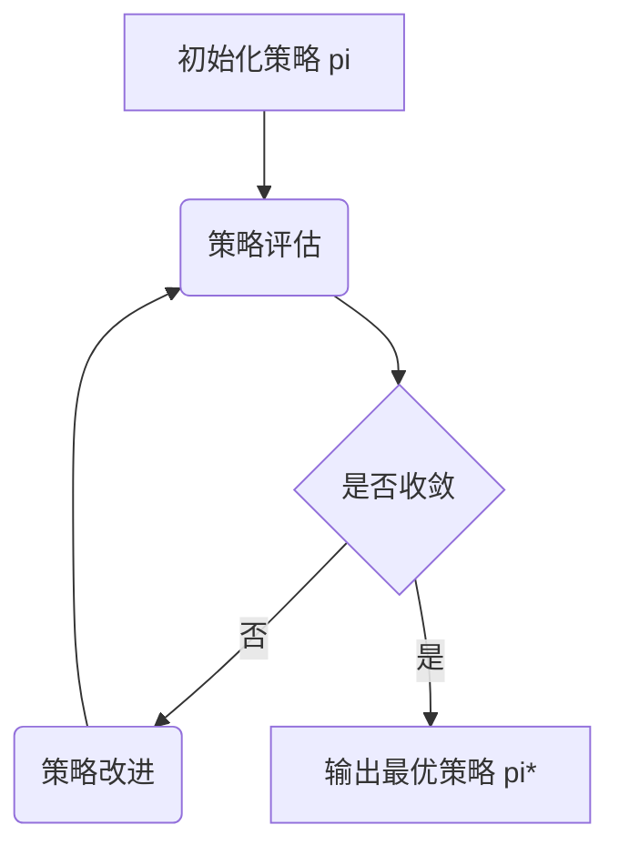

# 强化学习Reinforcement Learning中的策略迭代算法与实现细节

## 1. 背景介绍
### 1.1 强化学习的定义与特点
强化学习(Reinforcement Learning, RL)是机器学习的一个重要分支,它主要研究如何基于环境而行动,以取得最大化的预期利益。不同于监督式学习由训练数据"指导"学习,强化学习通过智能体(Agent)与环境(Environment)的交互,根据环境的反馈信号(奖励值)来学习最优策略。强化学习的核心是通过试错来学习最佳行为策略,其具有自主学习、适应性强等特点。

### 1.2 强化学习的主要元素
强化学习主要由以下几个基本元素组成:
- 智能体(Agent):做出动作的主体,如机器人、自动驾驶汽车等。
- 环境(Environment):智能体所处的环境,环境中包含各种状态(State)。
- 动作(Action):智能体根据当前状态所做的决策。
- 奖励(Reward):环境对智能体动作的即时反馈,引导智能体朝着最优策略方向学习。
- 策略(Policy):智能体的决策函数,将状态映射到动作的概率分布。

### 1.3 强化学习的主要算法分类
强化学习算法主要分为以下三大类:
1. 基于值函数(Value-based)的方法:通过学习状态-动作值函数(Q函数),来选择动作,代表算法有Q-learning、Sarsa等。
2. 基于策略(Policy-based)的方法:直接对策略函数进行参数化,通过梯度上升等方法对策略函数进行优化,代表算法有REINFORCE、Actor-Critic等。
3. 基于模型(Model-based)的方法:通过学习环境模型来进行规划和决策,代表算法有Dyna-Q等。

本文将重点介绍基于策略的强化学习算法中的策略迭代(Policy Iteration)算法。

## 2. 核心概念与联系
### 2.1 马尔可夫决策过程(MDP)
马尔可夫决策过程是描述强化学习问题的经典数学框架。MDP由一个五元组$(S,A,P,R,\gamma)$定义:
- 状态空间$S$:所有可能的状态集合。
- 动作空间$A$:在各个状态下所有可能的动作集合。
- 状态转移概率$P$:$P(s'|s,a)$表示在状态$s$下执行动作$a$后转移到状态$s'$的概率。
- 奖励函数$R$:$R(s,a)$表示在状态$s$下执行动作$a$获得的即时奖励值。
- 折扣因子$\gamma \in [0,1]$:表示未来奖励的折现比例,用于平衡即时奖励和未来奖励。

MDP的目标是寻找一个最优策略$\pi^*$,使得智能体在所有状态下采取该策略,能获得最大的期望累积奖励。

### 2.2 策略、状态值函数与动作值函数
- 策略$\pi(a|s)$:在状态$s$下选择动作$a$的概率。
- 状态值函数$V^{\pi}(s)$:在状态$s$下遵循策略$\pi$能获得的期望回报。
$$V^{\pi}(s)=\mathbb{E}_{\pi}[\sum_{t=0}^{\infty}\gamma^t R(s_t,a_t)|s_0=s] $$
- 动作值函数$Q^{\pi}(s,a)$:在状态$s$下采取动作$a$,遵循策略$\pi$能获得的期望回报。
$$Q^{\pi}(s,a)=\mathbb{E}_{\pi}[\sum_{t=0}^{\infty}\gamma^t R(s_t,a_t)|s_0=s,a_0=a]$$

状态值函数和动作值函数满足贝尔曼方程(Bellman Equation):
$$
\begin{aligned}
V^{\pi}(s)&=\sum_{a}\pi(a|s)Q^{\pi}(s,a) \\
Q^{\pi}(s,a)&=R(s,a)+\gamma \sum_{s'}P(s'|s,a)V^{\pi}(s')
\end{aligned}
$$

最优值函数$V^*(s)$和$Q^*(s,a)$满足贝尔曼最优方程:
$$
\begin{aligned}
V^*(s)&=\max_{a}Q^*(s,a)\\
Q^*(s,a)&=R(s,a)+\gamma \sum_{s'}P(s'|s,a)V^*(s')
\end{aligned}
$$

### 2.3 策略迭代算法
策略迭代是一种经典的强化学习算法,旨在通过迭代求解最优策略。它由策略评估(Policy Evaluation)和策略改进(Policy Improvement)两个交替进行的步骤组成。

- 策略评估:在固定策略$\pi$下,通过求解贝尔曼方程,得到该策略下的状态值函数$V^{\pi}$。
- 策略改进:根据当前值函数,贪婪地更新策略,得到一个改进的新策略$\pi'$。
$$\pi'(s)=\arg\max_{a}Q^{\pi}(s,a)$$

策略迭代算法流程如下:



## 3. 核心算法原理与具体操作步骤
### 3.1 策略评估
策略评估旨在计算在给定策略$\pi$下,每个状态的值函数$V^{\pi}(s)$。一般使用迭代法求解贝尔曼方程:
$$V_{k+1}^{\pi}(s)=\sum_a \pi(a|s)(R(s,a)+\gamma \sum_{s'}P(s'|s,a)V_k^{\pi}(s')) $$

其中,$k$表示迭代次数。初始化$V_0^{\pi}(s)=0$,重复迭代直到值函数收敛。

策略评估的具体操作步骤如下:
1. 初始化每个状态的值函数$V_0^{\pi}(s)=0$。
2. 重复以下步骤,直到值函数收敛($\max_{s}|V_{k+1}^{\pi}(s)-V_k^{\pi}(s)|<\epsilon$):
   - 对每个状态$s\in S$:
     - 计算$V_{k+1}^{\pi}(s)=\sum_a \pi(a|s)(R(s,a)+\gamma \sum_{s'}P(s'|s,a)V_k^{\pi}(s'))$
3. 返回值函数$V^{\pi}(s)$。

### 3.2 策略改进
在获得当前策略$\pi$下的值函数$V^{\pi}(s)$后,策略改进步骤旨在生成一个新的改进策略$\pi'$。改进策略基于贪婪原则,选择能使Q值最大的动作:
$$\pi'(s)=\arg\max_a Q^{\pi}(s,a)$$

其中,
$$Q^{\pi}(s,a)=R(s,a)+\gamma \sum_{s'}P(s'|s,a)V^{\pi}(s')$$

策略改进的具体操作步骤如下:
1. 对每个状态$s\in S$:
   - 对每个动作$a\in A$:
     - 计算$Q^{\pi}(s,a)=R(s,a)+\gamma \sum_{s'}P(s'|s,a)V^{\pi}(s')$
   - 令$\pi'(s)=\arg\max_a Q^{\pi}(s,a)$
2. 返回新策略$\pi'$。

### 3.3 策略迭代算法完整流程
将策略评估和策略改进结合,即可得到完整的策略迭代算法:
1. 初始化策略$\pi_0$
2. 重复以下步骤,直到策略收敛($\pi_{k+1}=\pi_k$):
   - 策略评估:计算$V^{\pi_k}(s)$
   - 策略改进:生成新策略$\pi_{k+1}$
3. 返回最优策略$\pi^*$

## 4. 数学模型与公式详细讲解举例说明
这里以一个简单的网格世界环境为例,说明策略迭代算法的数学模型与计算过程。

考虑一个$3\times 3$的网格世界,每个格子表示一个状态。智能体可以执行上、下、左、右四个动作,但有10%的概率会向其他方向移动。每个状态的即时奖励如下图所示,折扣因子$\gamma=0.9$,目标是找到最优策略。

```
+---+---+---+
| -1| 0 | 1 |
+---+---+---+
| 0 | 0 | 0 |
+---+---+---+
| 0 | 0 | 0 |
+---+---+---+
```

我们用$V_k(s)$表示第$k$次策略评估时,状态$s$的值函数。初始化一个随机策略$\pi_0$,令所有状态的初始值函数为0,即$V_0(s)=0$。

在第1次迭代中,策略评估步骤更新每个状态的值函数:
$$
\begin{aligned}
V_1(s_1)&=-1+0.9 \times 0.1 \times (V_0(s_2)+V_0(s_4))=-1\\
V_1(s_2)&=0+0.9 \times 0.1 \times (V_0(s_1)+V_0(s_3)+V_0(s_5))=0\\
&\cdots \\
V_1(s_9)&=0+0.9 \times 0.1 \times (V_0(s_6)+V_0(s_8))=0
\end{aligned}
$$

然后进行策略改进,生成新策略$\pi_1$。例如,对于状态$s_5$,有:
$$
\begin{aligned}
Q(s_5,\text{上})&=0+0.9 \times (0.9 \times V_1(s_2)+0.1 \times (V_1(s_4)+V_1(s_6)))=0\\
Q(s_5,\text{下})&=0+0.9 \times (0.9 \times V_1(s_8)+0.1 \times (V_1(s_4)+V_1(s_6)))=0\\
Q(s_5,\text{左})&=0+0.9 \times (0.9 \times V_1(s_4)+0.1 \times (V_1(s_2)+V_1(s_8)))=-0.09\\
Q(s_5,\text{右})&=0+0.9 \times (0.9 \times V_1(s_6)+0.1 \times (V_1(s_2)+V_1(s_8)))=0
\end{aligned}
$$
因此,新策略在状态$s_5$选择向右移动的概率最大。

重复策略评估和策略改进的过程,直到策略收敛。最终得到的最优策略如下:
```
+---+---+---+
| ← | ↑ | → |
+---+---+---+
| ↑ | → | ↑ |
+---+---+---+
| ↑ | ↑ | ↑ |
+---+---+---+
```

## 5. 项目实践:代码实例与详细解释说明
下面给出策略迭代算法的Python代码实现。我们定义`GridWorld`类表示网格世界环境,`PolicyIteration`类实现策略迭代算法。

```python
import numpy as np

class GridWorld:
    def __init__(self, grid_size=3, discount=0.9, transition_prob=0.9):
        self.grid_size = grid_size
        self.num_states = grid_size * grid_size
        self.num_actions = 4
        self.discount = discount
        self.transition_prob = transition_prob
        self.actions = [(-1, 0), (1, 0), (0, -1), (0, 1)]  # 上下左右
        
        # 状态转移概率矩阵
        self.P = np.zeros((self.num_states, self.num_actions, self.num_states))
        for s in range(self.num_states):
            for a in range(self.num_actions):
                next_s = self._get_next_state(s, a)
                self.P[s, a, next_s] = self.transition_prob
                for dir in range(self.num_actions):
                    if dir != a:
                        ns = self._get_next_state(s, dir)
                        self.P[s, a, ns] += (1 - self.transition_prob) / (self.num_actions - 1)
        
        # 奖励函数        
        self.R = np.full(self.num_states, 0)
        self.R[0] = -1
        self.R[self.num_states - 1] = 1
    
    def _get_next_state(self, s, a):
        x, y = s // self.grid_size, s % self.grid_size
        dx, dy = self.actions[a]
        