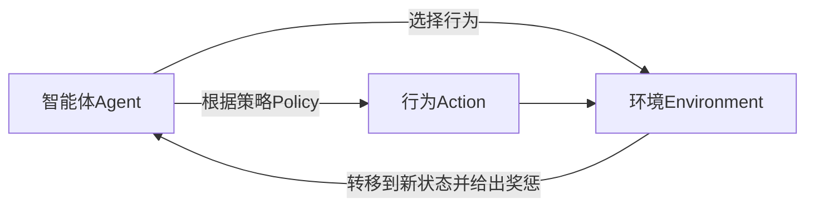

# 强化学习Reinforcement Learning的模型无关学习算法分析

## 1.背景介绍

### 1.1 什么是强化学习

强化学习(Reinforcement Learning, RL)是机器学习的一个重要分支,它研究如何基于环境反馈来学习决策策略,以最大化某种累积奖励。与监督学习不同,强化学习没有给定的输入输出对,而是通过与环境的交互来学习。

强化学习的核心思想是让智能体(Agent)通过与环境(Environment)的互动来学习,获得最优策略。这种学习过程类似于人类或动物通过反复试错和获得奖惩来逐步掌握某种技能。

### 1.2 强化学习的应用

强化学习在诸多领域有着广泛的应用,例如:

- 机器人控制
- 游戏AI
- 自动驾驶
- 资源管理
- 投资组合优化
- 自然语言处理等

随着算力和数据的不断增长,强化学习展现出了巨大的潜力。

## 2.核心概念与联系

强化学习涉及以下几个核心概念:

### 2.1 智能体(Agent)

智能体是强化学习系统中的决策者,它根据当前状态选择行为,并获得相应的奖惩反馈。

### 2.2 环境(Environment) 

环境是智能体所处的外部世界,智能体通过与环境交互来学习。

### 2.3 状态(State)

状态描述了智能体和环境的当前情况。

### 2.4 行为(Action)

行为是智能体在当前状态下可以采取的动作。

### 2.5 奖励(Reward)

奖励是环境对智能体行为的反馈,它是一个标量值,指导智能体朝着目标行为学习。

### 2.6 策略(Policy)

策略是智能体在每个状态下选择行为的规则或函数映射。

这些概念之间的关系如下:



## 3.核心算法原理具体操作步骤

强化学习算法可分为基于价值的算法和基于策略的算法。本文重点介绍一种基于策略的模型无关算法——REINFORCE算法。

### 3.1 REINFORCE算法原理

REINFORCE算法是一种基于策略梯度的强化学习算法,它直接对策略进行参数化,并通过梯度上升来优化策略参数,使期望奖励最大化。

算法的核心思想是:增大那些产生高回报行为序列的概率,减小那些产生低回报行为序列的概率。

算法步骤如下:

1. 初始化策略参数 $\theta$
2. 对一个episode进行采样,获得轨迹 $\tau = (s_0, a_0, r_0, s_1, a_1, r_1, \ldots, s_T)$
3. 计算该轨迹的回报: $R(\tau) = \sum_{t=0}^{T} r_t$
4. 更新策略参数:

$$\theta \leftarrow \theta + \alpha R(\tau) \sum_{t=0}^{T} \nabla_\theta \log \pi_\theta(a_t|s_t)$$

其中 $\alpha$ 是学习率, $\pi_\theta(a|s)$ 是当前策略在状态 $s$ 下选择行为 $a$ 的概率。

5. 重复步骤2-4,直到收敛

该算法实现了策略梯度上升,使期望回报最大化。

### 3.2 算法优缺点

优点:

- 直接对策略进行建模,无需估计值函数
- 可应用于连续动作空间
- 相对简单,易于实现

缺点: 

- 高方差,收敛慢
- 只利用了单个轨迹的信息
- 探索效率低下

## 4.数学模型和公式详细讲解举例说明

### 4.1 策略梯度定理

REINFORCE算法的理论基础是策略梯度定理,它给出了最大化期望回报的策略梯度:

$$\nabla_\theta \mathbb{E}_{\tau \sim \pi_\theta}[R(\tau)] = \mathbb{E}_{\tau \sim \pi_\theta}\left[\sum_{t=0}^{T}R(\tau)\nabla_\theta\log\pi_\theta(a_t|s_t)\right]$$

其中 $\tau \sim \pi_\theta$ 表示轨迹 $\tau$ 是按照当前策略 $\pi_\theta$ 采样得到的。

直观解释:该梯度表示,如果我们增大那些产生高回报轨迹的概率,就能提高期望回报。

### 4.2 减小方差

由于 REINFORCE 算法使用单个轨迹的回报作为估计,方差较大。为了减小方差,可以使用基线(Baseline)函数 $b(s)$:

$$\nabla_\theta \mathbb{E}_{\tau \sim \pi_\theta}[R(\tau)] = \mathbb{E}_{\tau \sim \pi_\theta}\left[\sum_{t=0}^{T}(R(\tau) - b(s_t))\nabla_\theta\log\pi_\theta(a_t|s_t)\right]$$

其中 $b(s)$ 可以是一个状态值函数估计或者其他函数。当 $b(s) = V^{\pi}(s)$ 时,方差最小。

### 4.3 实例: 简单的网格世界

考虑一个 $4 \times 4$ 的网格世界,智能体的目标是从起点 $(0, 0)$ 到达终点 $(3, 3)$。每一步,智能体可以选择上下左右四个方向之一移动,移动到终点获得 +1 奖励,其他情况奖励为 0。

我们使用一个两层神经网络来表示策略 $\pi_\theta(a|s)$,输入是当前状态 $s$,输出是四个动作的概率。使用 REINFORCE 算法训练该策略网络,最终可以得到一个能够找到最短路径到达终点的策略。

## 5.项目实践:代码实例和详细解释说明

以下是一个使用 PyTorch 实现 REINFORCE 算法的简单示例:

```python
import torch
import torch.nn as nn
import numpy as np

# 定义策略网络
class PolicyNetwork(nn.Module):
    def __init__(self, state_dim, action_dim):
        super(PolicyNetwork, self).__init__()
        self.fc1 = nn.Linear(state_dim, 64)
        self.fc2 = nn.Linear(64, action_dim)

    def forward(self, x):
        x = torch.relu(self.fc1(x))
        x = self.fc2(x)
        return nn.functional.softmax(x, dim=-1)

# REINFORCE 算法实现
def reinforce(env, policy_net, num_episodes, gamma=0.99, lr=0.01):
    optimizer = torch.optim.Adam(policy_net.parameters(), lr=lr)
    
    for episode in range(num_episodes):
        log_probs = []
        rewards = []
        
        # 生成一个episode
        state = env.reset()
        done = False
        while not done:
            state_tensor = torch.FloatTensor(state)
            action_probs = policy_net(state_tensor)
            action_dist = torch.distributions.Categorical(action_probs)
            action = action_dist.sample()
            
            next_state, reward, done, _ = env.step(action.item())
            
            log_probs.append(action_dist.log_prob(action))
            rewards.append(reward)
            
            state = next_state
        
        # 计算回报
        returns = []
        R = 0
        for r in reversed(rewards):
            R = r + gamma * R
            returns.insert(0, R)
        
        returns = torch.tensor(returns)
        
        # 更新策略网络
        policy_loss = []
        for log_prob, R in zip(log_probs, returns):
            policy_loss.append(-log_prob * R)
        
        optimizer.zero_grad()
        policy_loss = torch.cat(policy_loss).sum()
        policy_loss.backward()
        optimizer.step()
        
    return policy_net
```

代码解释:

1. 定义一个简单的两层神经网络作为策略网络 `PolicyNetwork`。
2. `reinforce` 函数实现了 REINFORCE 算法的核心逻辑:
    - 对每一个 episode,生成一个轨迹,记录 log 概率和奖励。
    - 计算每一步的回报 (折现累积奖励)。
    - 根据策略梯度公式,计算策略损失,并通过反向传播更新策略网络参数。
3. 通过多次迭代,策略网络将逐步收敛到一个能够最大化期望回报的最优策略。

## 6.实际应用场景

强化学习在诸多领域有着广泛的应用,以下列举一些典型场景:

### 6.1 游戏AI

强化学习在游戏AI领域取得了巨大成功,如DeepMind的AlphaGo、AlphaZero等,它们通过自我对弈学习,最终达到了超越人类顶尖水平。

### 6.2 机器人控制

强化学习可以用于训练机器人执行各种复杂任务,如行走、抓取、操作等。例如,Boston Dynamics的四足机器人就是通过强化学习训练得到的。

### 6.3 自动驾驶

自动驾驶系统需要根据复杂的环境信息作出实时决策,强化学习可以用于训练自动驾驶策略,使车辆能够安全高效地行驶。

### 6.4 资源管理

在数据中心、电网等资源管理系统中,强化学习可以用于优化资源分配和调度,提高利用效率。

### 6.5 自然语言处理

近年来,强化学习在对话系统、机器翻译等自然语言处理任务中也有一些应用。

## 7.工具和资源推荐

### 7.1 开源框架

- Stable Baselines (基于 PyTorch/TensorFlow)
- Ray RLlib (基于 PyTorch)
- Dopamine (基于 TensorFlow)
- Catalyst.RL (基于 PyTorch)

这些框架提供了多种强化学习算法的实现,并支持各种环境。

### 7.2 环境库

- OpenAI Gym
- Unity ML-Agents
- PettingZoo
- EconomicRL

这些库提供了各种模拟环境,可用于训练和测试强化学习算法。

### 7.3 教程和资源

- OpenAI Spinning Up
- UC Berkeley Deep RL Course
- DeepMind资源
- 强化学习导论(第二版)

这些教程和书籍对于入门和深入学习强化学习都很有帮助。

## 8.总结:未来发展趋势与挑战

强化学习是一个极具潜力的领域,未来可能的发展趋势包括:

### 8.1 多智能体强化学习

在复杂环境中,通常存在多个智能体,它们需要相互协作或竞争。发展多智能体强化学习算法将是一个重要方向。

### 8.2 结合其他机器学习方法

将强化学习与监督学习、无监督学习等其他机器学习方法相结合,可能产生新的突破。

### 8.3 安全性和可解释性

提高强化学习系统的安全性和可解释性,是其在实际应用中不可或缺的。

### 8.4 样本效率

提高强化学习算法的样本效率,减少与环境交互的需求,将极大降低训练成本。

### 8.5 理论基础

加强强化学习的理论基础研究,将为设计新算法提供指导。

### 8.6 应用拓展

将强化学习应用到更多领域,如金融、医疗、社会科学等,是一个值得探索的方向。

总的来说,强化学习正在为人工智能系统赋予更强大的决策能力,未来仍有广阔的发展空间。

## 9.附录:常见问题与解答

### 9.1 强化学习与监督学习和无监督学习有什么区别?

强化学习区别于监督学习和无监督学习的一个关键点是,它没有给定的输入输出对,而是通过与环境的交互来学习。强化学习的目标是找到一个最优策略,使累积奖励最大化。

### 9.2 为什么需要探索?

探索是强化学习中一个重要概念。如果智能体只利用已知的经验,很容易陷入次优的策略。通过适当的探索,智能体可以发现新的有益行为,从而找到更优的策略。

### 9.3 如何平衡探索与利用?

这是强化学习中一个经典的权衡问题。过多探索会降低学习效率,过多利用则可能错过更优策略。常见的方法包括 $\epsilon-greedy$ 策略、软更新(