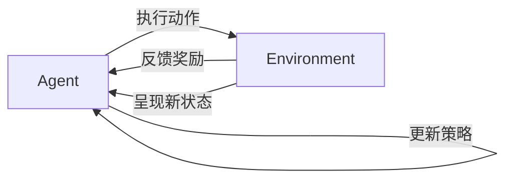

# 强化学习算法：Q-learning 原理与代码实例讲解

## 1. 背景介绍
### 1.1 强化学习概述
#### 1.1.1 强化学习的定义
强化学习(Reinforcement Learning, RL)是机器学习的一个重要分支,它主要研究如何基于环境而行动,以取得最大化的预期利益。不同于监督式学习,强化学习并不需要准备标注数据,而是通过智能体(Agent)与环境(Environment)的交互,根据环境的反馈来指导决策,从而达到优化决策过程的目的。

#### 1.1.2 强化学习的基本元素  
强化学习主要由以下几个基本元素构成:
- 智能体(Agent):做出决策和执行动作的主体。
- 环境(Environment):智能体所处的环境,提供观测信息和反馈。  
- 状态(State):环境的状态表示。
- 动作(Action):智能体能够采取的行动。
- 奖励(Reward):环境对智能体动作的即时反馈。
- 策略(Policy):将状态映射到动作的函数。
- 价值函数(Value Function):衡量状态或状态-动作对的长期累积奖励。

#### 1.1.3 强化学习的基本过程
强化学习的基本过程可以概括为:
1. 智能体观测当前环境状态 
2. 根据当前状态,选择一个动作并执行  
3. 环境状态转移到下一个状态,并反馈给智能体一个即时奖励
4. 智能体根据观测到的新状态和获得的奖励更新策略
5. 重复上述过程,不断优化策略,最大化长期累积奖励



### 1.2 Q-learning算法引入
#### 1.2.1 Q-learning的定义
Q-learning是强化学习中的一种重要的无模型、异策略的时序差分学习算法。它通过学习动作-状态值函数Q(s,a),来为智能体提供在给定状态下应该采取的最优动作。Q值表示在状态s下采取动作a的长期累积奖励期望。

#### 1.2.2 Q-learning的优势
与其他强化学习算法相比,Q-learning具有以下优势:  
- 无需预先建立环境模型,通过不断的探索来学习最优策略
- 异策略(Off-policy)学习,可以学习与当前行为策略不同的目标策略
- 基于时序差分(TD)学习,可以在单步交互后即时更新价值函数估计
- 收敛性得到理论保证,在一定条件下Q值函数能收敛到最优值函数

## 2. 核心概念与联系
### 2.1 马尔可夫决策过程(MDP) 
#### 2.1.1 MDP的定义
马尔可夫决策过程为顺序决策问题提供了标准的数学框架。MDP由以下元素构成:
- 状态集合S
- 动作集合A  
- 状态转移概率P(s'|s,a)
- 奖励函数R(s,a)
- 折扣因子γ∈[0,1]

其中,状态转移概率P(s'|s,a)表示在状态s下采取动作a后转移到状态s'的概率;奖励函数R(s,a)表示在状态s下采取动作a后获得的即时奖励。

#### 2.1.2 MDP的性质
MDP满足马尔可夫性质,即下一状态s'仅取决于当前状态s和动作a,与之前的状态和动作无关:

$$
P(s_{t+1}|s_t,a_t,s_{t-1},a_{t-1},...) = P(s_{t+1}|s_t,a_t)
$$

同时,奖励函数R(s,a)也只与当前状态s和动作a有关。

### 2.2 价值函数
#### 2.2.1 状态价值函数 
状态价值函数V(s)表示从状态s开始,遵循某一策略π,累积获得的期望折扣奖励:

$$
V^\pi(s)=\mathbb{E}[G_t|S_t=s]=\mathbb{E}[\sum_{k=0}^{\infty}\gamma^k R_{t+k+1}|S_t=s]
$$

其中,G_t为t时刻后的累积折扣奖励,γ为折扣因子。

#### 2.2.2 动作价值函数
动作价值函数Q(s,a)表示在状态s下采取动作a,遵循某一策略π,累积获得的期望折扣奖励:

$$
Q^\pi(s,a)=\mathbb{E}[G_t|S_t=s,A_t=a]=\mathbb{E}[\sum_{k=0}^{\infty}\gamma^k R_{t+k+1}|S_t=s,A_t=a] 
$$

状态价值函数和动作价值函数满足以下关系:

$$
V^\pi(s)=\sum_{a\in A}\pi(a|s)Q^\pi(s,a)
$$

$$
Q^\pi(s,a)=R(s,a)+\gamma\sum_{s'\in S}P(s'|s,a)V^\pi(s')
$$

### 2.3 贝尔曼方程
#### 2.3.1 状态价值贝尔曼方程
状态价值函数满足贝尔曼方程:

$$
V^\pi(s)=\sum_{a\in A}\pi(a|s)[R(s,a)+\gamma\sum_{s'\in S}P(s'|s,a)V^\pi(s')]
$$

#### 2.3.2 动作价值贝尔曼方程  
动作价值函数满足贝尔曼方程:

$$
Q^\pi(s,a)=R(s,a)+\gamma\sum_{s'\in S}P(s'|s,a)\sum_{a'\in A}\pi(a'|s')Q^\pi(s',a')
$$

贝尔曼方程刻画了价值函数的递归性质,为价值函数的迭代更新提供了理论基础。求解最优价值函数可以通过迭代求解贝尔曼最优方程来实现。

## 3. 核心算法原理具体操作步骤
### 3.1 Q-learning 算法
#### 3.1.1 Q-learning的更新规则
Q-learning算法基于贝尔曼最优方程,通过时序差分(TD)学习的方式来更新动作价值函数。给定状态s_t,动作a_t,奖励r_t和下一状态s_{t+1},Q值的更新规则为:

$$
Q(s_t,a_t) \leftarrow Q(s_t,a_t) + \alpha[r_t+\gamma \max_{a}Q(s_{t+1},a)-Q(s_t,a_t)]
$$

其中,α∈(0,1]为学习率,控制每次更新的幅度;γ为折扣因子。

#### 3.1.2 Q-learning的异策略学习  
Q-learning是一种异策略(Off-policy)学习算法,即学习到的Q值函数对应最优策略,而智能体实际遵循的行为策略可以是其他探索性策略(如ε-greedy)。这种异策略学习使得Q-learning能更有效地探索状态-动作空间。

#### 3.1.3 Q-learning的收敛性
在适当的条件下(如所有状态-动作对被无限次访问),Q-learning算法能够收敛到最优动作价值函数Q*。Q*满足贝尔曼最优方程:

$$
Q^*(s,a)=R(s,a)+\gamma\sum_{s'\in S}P(s'|s,a)\max_{a'\in A}Q^*(s',a') 
$$

### 3.2 Q-learning算法流程
Q-learning的具体算法流程如下:

```mermaid
graph TB
A[初始化Q(s,a)]-->B[初始化状态s]
B-->C{是否终止}
C--否-->D[选择动作a,执行]
D-->E[观测奖励r和新状态s']
E-->F[更新Q(s,a)]
F-->G[s<-s']
G-->C
C--是-->H[输出最优策略π*]
```

1. 初始化Q(s,a),对所有s∈S,a∈A,令Q(s,a)=0
2. 初始化状态s  
3. 循环直至终止:
   - 根据某一探索策略(如ε-greedy)选择动作a,执行动作
   - 观测奖励r和新状态s'
   - 更新Q值:
     $$Q(s,a) \leftarrow Q(s,a) + \alpha[r+\gamma \max_{a'}Q(s',a')-Q(s,a)]$$
   - s←s'
4. 输出最优策略:π*(s)=argmax_a Q(s,a)

## 4. 数学模型和公式详细讲解举例说明
### 4.1 Q-learning的数学模型
Q-learning算法可以用以下数学模型来描述:

- 状态空间:S
- 动作空间:A
- 状态转移概率(未知):P(s'|s,a)
- 奖励函数(未知):R(s,a)  
- 折扣因子:γ∈[0,1]
- 学习率:α∈(0,1]
- 动作价值函数:Q(s,a)

目标是通过不断更新Q(s,a),使其收敛到最优动作价值函数Q*(s,a),进而得到最优策略π*。

### 4.2 Q值更新公式推导
Q-learning的核心是Q值更新公式:

$$
Q(s_t,a_t) \leftarrow Q(s_t,a_t) + \alpha[r_t+\gamma \max_{a}Q(s_{t+1},a)-Q(s_t,a_t)]
$$

这个公式可以从贝尔曼最优方程推导得到。根据贝尔曼最优方程,最优动作价值函数Q*满足:

$$
Q^*(s,a)=R(s,a)+\gamma\sum_{s'\in S}P(s'|s,a)\max_{a'\in A}Q^*(s',a') 
$$

将上式改写为期望形式:

$$
Q^*(s,a)=\mathbb{E}[R(s,a)+\gamma\max_{a'\in A}Q^*(s',a')|s,a]
$$

由于实际中状态转移概率P(s'|s,a)和奖励函数R(s,a)未知,无法直接计算期望。但我们可以用样本均值来近似期望:

$$
Q^*(s,a)\approx r+\gamma\max_{a'\in A}Q^*(s',a')
$$

其中,(s,a,r,s')为一组采样数据。

为了逐步逼近最优值函数Q*,我们可以用当前估计值Q(s,a)和估计目标值r+γmax_{a'}Q(s',a')之间的差来更新Q(s,a):

$$
Q(s,a) \leftarrow Q(s,a) + \alpha[r+\gamma \max_{a'}Q(s',a')-Q(s,a)]
$$

其中,α为学习率,控制更新幅度。这就得到了Q-learning的核心更新公式。

### 4.3 数值例子说明
考虑一个简单的网格世界环境,如下图所示:

```
+---+---+---+
| S |   |   |
+---+---+---+
|   |   | G |
+---+---+---+
```

其中,S为起始状态,G为目标状态,中间为可行走的格子。智能体在每个格子上可以选择上下左右四个动作。执行每个动作的奖励为-1,到达目标状态的奖励为0。

假设折扣因子γ=0.9,学习率α=0.5。我们用Q-learning算法来学习最优策略。

初始化Q值表:
```
+-------+-------+-------+
|   0   |   0   |   0   |
+-------+-------+-------+
|   0   |   0   |   0   |
+-------+-------+-------+
```

假设一个状态转移序列为:(S,↑,-1,S),(S,→,-1,中),(中,↑,-1,中),(中,→,-1,G)。根据Q-learning更新公式,每次状态转移后Q值表更新如下:

(S,↑,-1,S):
```
+-------+-------+-------+
|   0   |   0   |   0   |
+-------+-------+-------+
|  -0.5 |   0   |   0   |
+-------+-------+-------+
```

(S,→,-1,中):
```
+-------+-------+-------+
|  -0.5 |  -0.5 |   0   |
+-------+-------+-------+
|  -0.5 |   0   |   0   |
+-------+-------+-------+
```

(中,↑,-1,中):  
```
+-------+-------+-------+
|  -0.5 |  -0.5 |   0   |
+-------+-------+-------+
|  -1.0 |  -0.5 |   0   |
+-------+-------+-------+
```

(中,→,-1,G):
```