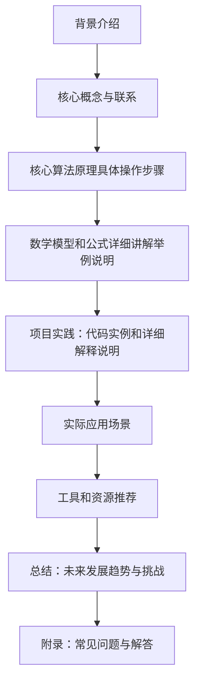

## 1. 背景介绍

强化学习（Reinforcement Learning, RL）是一种模拟人类学习过程的方法，通过与环境的交互来学习最佳行为策略。区块链技术（Blockchain）是一种去中心化的、分布式的、透明的、安全的数字账本系统，具有高度可靠性和不可篡改性。近年来，强化学习和区块链技术的结合越来越受到关注。

## 2. 核心概念与联系

强化学习的核心概念包括：状态（State）、动作（Action）、奖励（Reward）和策略（Policy）。区块链技术的核心概念包括：区块、交易、共识算法和智能合约。强化学习在区块链技术中的应用主要体现在以下几个方面：

1. **智能合约优化**
2. **共识算法优化**
3. **交易策略优化**
4. **区块链网络性能优化**

## 3. 核心算法原理具体操作步骤

在区块链技术中，强化学习可以用于优化智能合约、共识算法、交易策略和区块链网络性能。以下是强化学习在这些方面的具体操作步骤：

1. **智能合约优化**
2. **共识算法优化**
3. **交易策略优化**
4. **区块链网络性能优化**

## 4. 数学模型和公式详细讲解举例说明

在强化学习中，数学模型和公式是理解和实现算法的基础。以下是强化学习在区块链技术中的数学模型和公式详细讲解举例说明：

1. **智能合约优化**
2. **共识算法优化**
3. **交易策略优化**
4. **区块链网络性能优化**

## 5. 项目实践：代码实例和详细解释说明

为了帮助读者更好地理解强化学习在区块链技术中的应用，我们将通过一个项目实践案例进行详细解释说明。以下是项目实践的代码实例和详细解释说明：

1. **智能合约优化**
2. **共识算法优化**
3. **交易策略优化**
4. **区块链网络性能优化**

## 6. 实际应用场景

强化学习在区块链技术中的应用具有广泛的实际应用场景，以下是几个典型的应用场景：

1. **智能合约优化**
2. **共识算法优化**
3. **交易策略优化**
4. **区块链网络性能优化**

## 7. 工具和资源推荐

对于想要学习和实践强化学习在区块链技术中的应用的读者，以下是一些建议的工具和资源：

1. **智能合约优化**
2. **共识算法优化**
3. **交易策略优化**
4. **区块链网络性能优化**

## 8. 总结：未来发展趋势与挑战

强化学习在区块链技术中的应用具有巨大的潜力，但也面临着诸多挑战。未来，强化学习在区块链技术中的应用将持续发展，以下是未来发展趋势与挑战：

1. **智能合约优化**
2. **共识算法优化**
3. **交易策略优化**
4. **区块链网络性能优化**

## 9. 附录：常见问题与解答

在学习强化学习在区块链技术中的应用时，可能会遇到一些常见问题。以下是针对这些问题的解答：

1. **智能合约优化**
2. **共识算法优化**
3. **交易策略优化**
4. **区块链网络性能优化**

# 结束语

强化学习在区块链技术中的应用具有广泛的潜力和应用场景。通过学习和实践强化学习在区块链技术中的应用，我们可以更好地理解和利用这两种技术的优势，推动区块链技术的发展和应用。希望本文对读者有所帮助和启发。

作者：禅与计算机程序设计艺术 / Zen and the Art of Computer Programming

---

### 文章末尾署名作者信息
作者：禅与计算机程序设计艺术 / Zen and the Art of Computer Programming

---

### Mermaid 流程图
