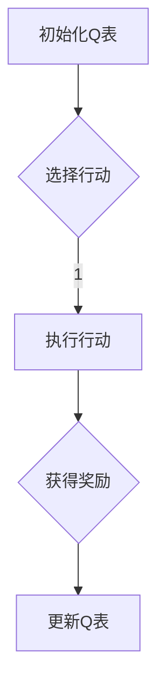

## 背景介绍

强化学习（Reinforcement Learning, RL）是人工智能领域的一个重要分支，它研究如何让计算机通过试错学习来做出决策。近年来，强化学习在各个行业中得到了广泛的应用，如自动驾驶、游戏AI等。其中，新闻推荐系统也成为强化学习的一个重要应用场景。

本篇博客将从以下几个方面探讨强化学习在新闻推荐中的应用：

1. 核心概念与联系
2. 核心算法原理具体操作步骤
3. 数学模型和公式详细讲解举例说明
4. 项目实践：代码实例和详细解释说明
5. 实际应用场景
6. 工具和资源推荐
7. 总结：未来发展趋势与挑战
8. 附录：常见问题与解答

## 核心概念与联系

强化学习是一种基于模型-free的机器学习方法，其核心思想是通过交互地与环境进行接触来学习最佳行为策略。在新闻推荐系统中，我们可以将用户视为一个智能体，系统作为其环境。系统需要根据用户的反馈（如点击、收藏等）来优化推荐策略。

强化学习在新闻推荐中的主要作用是提高推荐系统的个性化程度。传统的推荐系统通常采用内容过滤或协同过滤等方法，但这些方法往往缺乏动态性和适应性。强化学习则可以根据用户的历史行为和喜好实时调整推荐策略，从而提供更精准的推荐。

## 核心算法原理具体操作步骤

强化学习的典型算法之一是Q-learning。它的基本思想是为每个状态-action对估计一个价值函数Q(s,a)，并通过更新规则不断优化这个值函数。以下是一个简单的Q-learning流程图：



具体来说，Q-learning的过程如下：

1. 初始化Q表：为每个状态-action对初始化一个Q值。
2. 选择行动：根据当前状态选择一个行动。
3. 执行行动：执行选定的行动，并得到相应的奖励。
4. 更新Q表：根据新的经验更新Q值。

## 数学模型和公式详细讲解举例说明

在Q-learning中，我们使用Bellman方程来更新Q值。其数学形式为：

$$
Q(s, a) \\leftarrow Q(s, a) + \\alpha [r + \\gamma \\max_{a'} Q(s', a') - Q(s, a)]
$$

其中，$s$表示状态,$a$表示行动,$r$表示奖励,$\\alpha$表示学习率，$\\gamma$表示折扣因子，$s'$表示下一状态。

举个例子，假设我们有一个新闻推荐系统，其中状态表示用户已阅读的新闻集合，行动表示推荐给用户哪篇新闻。我们可以用上面的公式来更新每篇新闻的Q值，从而优化推荐策略。

## 项目实践：代码实例和详细解释说明

为了实现强化学习在新闻推荐中的应用，我们需要选择合适的算法和工具。以下是一个简单的Q-learning实现示例：

```python
import numpy as np

class QLearning:
    def __init__(self, state_space, action_space, learning_rate=0.1, discount_factor=0.9):
        self.state_space = state_space
        self.action_space = action_space
        self.learning_rate = learning_rate
        self.discount_factor = discount_factor
        self.q_table = np.zeros((state_space, action_space))

    def choose_action(self, state, epsilon=0.1):
        if np.random.uniform(0, 1) < epsilon:
            return np.random.choice(self.action_space)
        else:
            return np.argmax(self.q_table[state])

    def learn(self, state, action, reward, next_state):
        predict = self.q_table[state, action]
        target = reward + self.discount_factor * np.max(self.q_table[next_state])
        self.q_table[state, action] += self.learning_rate * (target - predict)

# 使用QLearning类实现新闻推荐系统
```

## 实际应用场景

强化学习在新闻推荐系统中的实际应用有以下几个方面：

1. 个性化推荐：根据用户的历史行为和喜好提供个性化的推荐。
2. 动态优化：实时调整推荐策略，适应用户的变化。
3. 增强用户体验：提高推荐系统的准确性和可靠性。

## 工具和资源推荐

对于想要了解并实际应用强化学习在新闻推荐中的读者，可以参考以下工具和资源：

1. TensorFlow（[官方网站](https://www.tensorflow.org/)): 一个流行的深度学习框架，可以用于实现强化学习算法。
2. OpenAI Gym（[官方网站](http://gym.openai.com/)): 一个开源的机器学习实验平台，包含了许多预先构建好的环境，可以用于训练和测试强化学习算法。
3. 《强化学习》（Reinforcement Learning）by Richard S. Sutton and Andrew G. Barto: 一本详细介绍强化学习理论和方法的经典书籍。

## 总结：未来发展趋势与挑战

随着人工智能技术的不断发展，强化学习在新闻推荐系统中的应用将得到更广泛的探索。未来，我们可以期待强化学习在推荐系统中实现更高效、个性化和智能化的推荐。但同时，也需要面对一些挑战，如数据稀疏、奖励设计等。

## 附录：常见问题与解答

1. Q-learning与深度Q-network（DQN）有什么区别？

   Q-learning是一种表格式的强化学习算法，而DQN则是基于神经网络的强化学习算法。DQN通过使用神经网络来估计状态-action值函数，从而提高了Q-learning的性能。

2. 如何选择合适的奖励策略？

   奖励策略的设计对于强化学习的效果至关重要。一般来说，奖励应该是有意义且可衡量的，它们应该反映出系统的目标和用户的需求。不同的场景可能需要不同的奖励策略，因此需要根据具体情况进行调整。

作者：禅与计算机程序设计艺术 / Zen and the Art of Computer Programming
