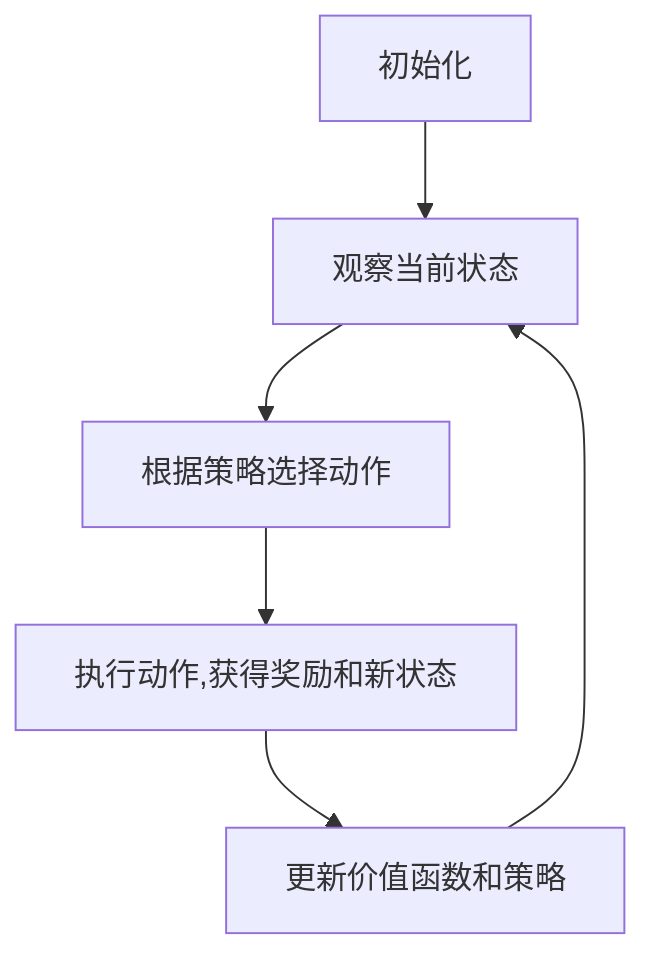

# 强化学习：在无人仓库中的应用

## 1.背景介绍

### 1.1 无人仓库的兴起

随着电子商务的蓬勃发展,物流配送行业面临着前所未有的压力。传统的人工操作仓库已经无法满足日益增长的订单需求,效率低下且成本高昂。为了应对这一挑战,无人仓库应运而生。

无人仓库是一种高度自动化的仓储系统,利用机器人、自动导航技术、机器视觉等先进技术实现货物的自动存取、分拣和运输。它可以大幅提高仓储运营效率,降低人力成本,并提供更准确、更可靠的服务。

### 1.2 强化学习在无人仓库中的作用

尽管无人仓库具有诸多优势,但其运营效率和决策能力仍然受到一定限制。这主要源于复杂的仓库环境和不确定的货物流动。传统的规则引擎和算法难以应对这种动态变化和不确定性。

强化学习(Reinforcement Learning)作为一种人工智能技术,可以帮助无人仓库系统从环境中学习,自主做出最优决策。它通过试错和奖惩机制,不断优化决策策略,从而提高整个系统的运营效率和决策质量。

## 2.核心概念与联系

### 2.1 强化学习基本概念

强化学习是机器学习的一个重要分支,它研究如何基于环境反馈来学习最优策略,以获得最大化的累积奖励。它包含以下核心概念:

- **环境(Environment)**:智能体与之交互的外部世界。
- **状态(State)**:描述环境的当前情况。
- **动作(Action)**:智能体可以执行的操作。
- **奖励(Reward)**:环境对智能体动作的反馈,可正可负。
- **策略(Policy)**:智能体根据状态选择动作的规则或函数。
- **价值函数(Value Function)**:评估某个状态的长期累积奖励。

强化学习的目标是找到一个最优策略,使智能体在环境中获得最大的累积奖励。

### 2.2 强化学习与无人仓库的联系

将强化学习应用于无人仓库,可以将无人仓库视为一个复杂的环境。智能体即为控制系统,它需要根据当前的仓库状态(如货物分布、机器人位置等),选择合适的动作(如分派机器人取货、规划路径等),以获得最大化的奖励(如最小化订单完成时间、最大化吞吐量等)。

通过不断尝试不同的策略并获得环境反馈,强化学习算法可以逐步优化决策策略,提高整个无人仓库系统的运营效率和决策质量。

## 3.核心算法原理具体操作步骤

强化学习算法通常遵循以下操作步骤:



1. **初始化**: 初始化智能体、环境、策略和价值函数等参数。

2. **观察当前状态**: 获取当前环境的状态信息。

3. **根据策略选择动作**: 根据当前状态和策略,选择要执行的动作。

4. **执行动作,获得奖励和新状态**: 在环境中执行选定的动作,获得相应的奖励,并观察环境转移到新的状态。

5. **更新价值函数和策略**: 根据获得的奖励和新状态,更新价值函数和策略。

6. **重复步骤2-5**: 不断重复上述过程,直到达到终止条件(如最大迭代次数或收敛)。

不同的强化学习算法在具体实现上会有所不同,但总体遵循上述操作步骤。常见的强化学习算法包括Q-Learning、Sarsa、策略梯度(Policy Gradient)等。

## 4.数学模型和公式详细讲解举例说明

### 4.1 马尔可夫决策过程(MDP)

强化学习问题通常被建模为马尔可夫决策过程(Markov Decision Process, MDP)。MDP是一种数学框架,用于描述一个完全可观测的、随机的、离散时间的决策过程。

一个MDP可以用一个元组 $(S, A, P, R, \gamma)$ 来表示,其中:

- $S$ 是有限的状态集合
- $A$ 是有限的动作集合
- $P(s' \mid s, a)$ 是转移概率,表示在状态 $s$ 执行动作 $a$ 后,转移到状态 $s'$ 的概率
- $R(s, a, s')$ 是奖励函数,表示在状态 $s$ 执行动作 $a$ 后,转移到状态 $s'$ 时获得的奖励
- $\gamma \in [0, 1)$ 是折扣因子,用于权衡当前奖励和未来奖励的重要性

在MDP中,智能体的目标是找到一个最优策略 $\pi^*(s)$,使得在任意状态 $s$ 下执行该策略,可以获得最大的期望累积奖励,即:

$$
\pi^*(s) = \arg\max_\pi \mathbb{E}\left[ \sum_{t=0}^\infty \gamma^t R(s_t, a_t, s_{t+1}) \mid s_0 = s, \pi \right]
$$

其中,期望累积奖励可以通过价值函数 $V^\pi(s)$ 来表示:

$$
V^\pi(s) = \mathbb{E}\left[ \sum_{t=0}^\infty \gamma^t R(s_t, a_t, s_{t+1}) \mid s_0 = s, \pi \right]
$$

### 4.2 Q-Learning算法

Q-Learning是一种基于价值迭代的强化学习算法,它直接学习状态-动作对的价值函数 $Q(s, a)$,而不需要先学习状态价值函数 $V(s)$。

$Q(s, a)$ 表示在状态 $s$ 执行动作 $a$,然后按照最优策略继续执行下去,可以获得的期望累积奖励。它可以通过下式进行迭代更新:

$$
Q(s_t, a_t) \leftarrow Q(s_t, a_t) + \alpha \left[ r_{t+1} + \gamma \max_a Q(s_{t+1}, a) - Q(s_t, a_t) \right]
$$

其中:

- $\alpha$ 是学习率,控制更新幅度
- $r_{t+1}$ 是在执行动作 $a_t$ 后获得的即时奖励
- $\gamma$ 是折扣因子,控制未来奖励的权重
- $\max_a Q(s_{t+1}, a)$ 是在下一状态 $s_{t+1}$ 下,所有可能动作对应的最大 $Q$ 值

通过不断更新 $Q$ 值,Q-Learning算法最终会收敛到最优的 $Q^*$ 函数,从而可以得到最优策略 $\pi^*(s) = \arg\max_a Q^*(s, a)$。

### 4.3 深度Q网络(DQN)

传统的Q-Learning算法使用表格来存储 $Q$ 值,当状态空间和动作空间很大时,会遇到维数灾难的问题。深度Q网络(Deep Q-Network, DQN)通过使用神经网络来近似 $Q$ 函数,从而解决了这一问题。

DQN的核心思想是使用一个神经网络 $Q(s, a; \theta)$ 来拟合 $Q$ 函数,其中 $\theta$ 是网络的参数。在训练过程中,通过最小化损失函数来更新网络参数:

$$
L(\theta) = \mathbb{E}_{(s, a, r, s')\sim D} \left[ \left( r + \gamma \max_{a'} Q(s', a'; \theta^-) - Q(s, a; \theta) \right)^2 \right]
$$

其中:

- $D$ 是经验回放池(Experience Replay),用于存储智能体与环境的交互经验
- $\theta^-$ 是目标网络的参数,用于计算目标 $Q$ 值,以提高训练稳定性
- $\max_{a'} Q(s', a'; \theta^-)$ 是在下一状态 $s'$ 下,所有可能动作对应的最大 $Q$ 值

通过梯度下降等优化算法,不断调整网络参数 $\theta$,使得 $Q(s, a; \theta)$ 逐渐逼近真实的 $Q^*$ 函数。

DQN算法在许多复杂的决策问题中取得了巨大成功,如在Atari游戏中超越人类水平。它也被广泛应用于无人仓库等物流领域,用于优化机器人调度、路径规划等决策问题。

## 5.项目实践:代码实例和详细解释说明

为了更好地理解强化学习在无人仓库中的应用,我们将通过一个简化的Python示例来演示DQN算法在无人仓库机器人调度问题中的实现。

### 5.1 问题描述

假设我们有一个简化的无人仓库,包含 $n$ 个货架和 $m$ 个机器人。每个货架上都有一定数量的货物需要取出。我们的目标是通过合理调度机器人,尽快完成所有货物的取出,从而最大化吞吐量。

具体来说,我们需要为每个机器人规划一条路径,使其能够依次访问指定的货架,取出相应的货物。在这个过程中,我们需要考虑机器人之间的协作和避免碰撞等约束条件。

### 5.2 环境构建

我们首先构建一个简单的无人仓库环境,用于模拟机器人的移动和货物取出过程。

```python
import numpy as np

class WarehouseEnv:
    def __init__(self, n_shelves, n_robots):
        self.n_shelves = n_shelves
        self.n_robots = n_robots
        self.shelves = np.random.randint(1, 10, size=n_shelves)  # 每个货架上的货物数量
        self.robot_positions = np.zeros(n_robots, dtype=int)  # 机器人的初始位置
        self.remaining_goods = self.shelves.sum()  # 剩余货物总数

    def step(self, robot_actions):
        """
        执行机器人动作,返回新状态、奖励和是否终止
        """
        # 更新机器人位置和取出货物
        for robot_id, action in enumerate(robot_actions):
            if action < self.n_shelves:
                self.shelves[action] -= 1
                self.remaining_goods -= 1

        # 计算奖励和是否终止
        reward = -self.remaining_goods
        done = self.remaining_goods == 0

        # 返回新状态、奖励和是否终止
        state = np.concatenate((self.shelves, self.robot_positions))
        return state, reward, done

    def reset(self):
        """
        重置环境状态
        """
        self.shelves = np.random.randint(1, 10, size=self.n_shelves)
        self.robot_positions = np.zeros(self.n_robots, dtype=int)
        self.remaining_goods = self.shelves.sum()
        state = np.concatenate((self.shelves, self.robot_positions))
        return state
```

在这个简化的环境中,我们使用一个一维数组来表示货架上的货物数量,以及机器人的当前位置。每个机器人在每个时间步可以选择前往某个货架取货,或者保持原位置不动。

环境的状态由货架上的货物数量和机器人位置组成。奖励函数设置为负的剩余货物数量,这样可以鼓励机器人尽快取出所有货物。当所有货物都被取出时,环境终止。

### 5.3 DQN算法实现

接下来,我们实现DQN算法,用于训练一个智能体来解决上述机器人调度问题。

```python
import torch
import torch.nn as nn
import torch.optim as optim
import random
from collections import deque

class DQN(nn.Module):
    def __init__(self, state_dim, action_dim):
        super(DQN, self).__init__()
        self.fc1 = nn.Linear(state_dim, 64)
        self.fc2 = nn.Linear(64, action_dim)

    def forward(self, x):
        x = torch.relu(self.fc1(x))
        x = self.fc2(x)
        return x

class ReplayBuffer:
    def __init__(self, capacity):
        self.buffer = deque(maxlen=capacity)

    def push(self, state, action, reward, next_state, done):
        self.buffer.append((state, action, reward, next_state, done))

    def sample(self, batch_size):
        samples = random.sample(self.buffer, batch_size)
        states,