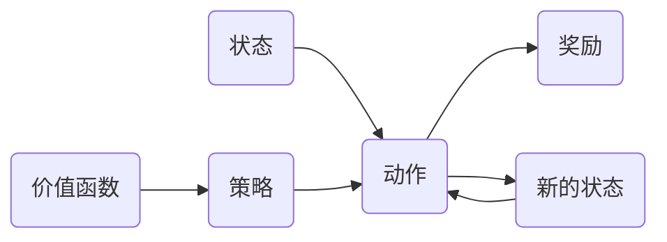

## 1.背景介绍

强化学习作为人工智能的一种重要方法，近年来受到了广泛的关注。从AlphaGo的闪亮登场，到无人驾驶、机器人技术的飞速发展，强化学习的应用越来越广泛，其强大的学习能力和无限的可能性引人注目。

## 2.核心概念与联系

强化学习是机器学习中的一种方法，它以交互为基础，通过试错的方式，不断调整策略，以达到最大的回报。其核心概念包括状态(state)、动作(action)、奖励(reward)、策略(policy)和价值函数(value function)。

- 状态：描述环境的信息，如机器人的位置、棋盘的布局等。
- 动作：在某一状态下，智能体可以执行的操作。
- 奖励：智能体执行动作后，环境给出的反馈，用以评价该动作的好坏。
- 策略：定义了在每个状态下应该选择哪个动作。
- 价值函数：评估在某个状态下执行某个动作的长期回报。

这些概念之间的关系可以用以下的Mermaid流程图表示：



## 3.核心算法原理具体操作步骤

强化学习的核心算法包括值迭代(Value Iteration)、策略迭代(Policy Iteration)和Q学习(Q-Learning)等。

以值迭代为例，其操作步骤如下：

1. 初始化价值函数V。
2. 对每个状态s，更新其价值：V(s) = max_a{R(s,a) + γ∑s'P(s'|s,a)V(s')}。
3. 重复步骤2，直到价值函数收敛。

其中，R(s,a)是执行动作a在状态s下得到的即时奖励，γ是折扣因子，P(s'|s,a)是在状态s执行动作a转移到状态s'的概率。

## 4.数学模型和公式详细讲解举例说明

强化学习的数学模型通常基于马尔科夫决策过程(Markov Decision Process, MDP)。MDP由一个状态集合S、一个动作集合A、一个奖励函数R和一个转移概率矩阵P组成。

在MDP中，智能体在每个时间步t选择一个动作a_t，环境会根据转移概率矩阵P给出新的状态s_{t+1}和奖励r_t。

智能体的目标是找到一个策略π，使得累积奖励的期望值最大，即：

$$\max_\pi E[\sum_{t=0}^\infty \gamma^t r_t|\pi]$$

其中，γ是折扣因子，0≤γ<1。

## 5.项目实践：代码实例和详细解释说明

以OpenAI Gym的CartPole环境为例，我们可以使用Q-Learning算法训练一个智能体。

```python
import gym
import numpy as np

# 创建环境
env = gym.make('CartPole-v0')

# 初始化Q表
Q = np.zeros([env.observation_space.n, env.action_space.n])

# 设置参数
alpha = 0.5
gamma = 0.95
epsilon = 0.1
episodes = 5000

# Q-Learning
for episode in range(episodes):
    s = env.reset()
    done = False
    while not done:
        # 选择动作
        if np.random.uniform(0, 1) < epsilon:
            a = env.action_space.sample()
        else:
            a = np.argmax(Q[s, :])
        # 执行动作
        s_, r, done, info = env.step(a)
        # 更新Q表
        Q[s, a] = (1 - alpha) * Q[s, a] + alpha * (r + gamma * np.max(Q[s_, :]))
        s = s_
```

在这段代码中，我们首先创建了一个CartPole环境，并初始化了Q表。然后，我们设置了学习率α、折扣因子γ、探索率ε和训练的回合数。在每个回合中，智能体根据ε-贪婪策略选择动作，执行动作后，根据Q-Learning的更新规则更新Q表。

## 6.实际应用场景

强化学习在很多领域都有广泛的应用，如：

- 游戏：如AlphaGo、AlphaStar等，它们通过强化学习训练出超越人类的游戏智能。
- 机器人：强化学习可以用于训练机器人完成各种任务，如搬运、打扫、烹饪等。
- 推荐系统：强化学习可以用于优化推荐策略，提高用户的点击率和留存率。
- 交通优化：强化学习可以用于优化交通信号灯的控制策略，减少交通拥堵。

## 7.工具和资源推荐

- OpenAI Gym：一个用于开发和比较强化学习算法的工具包，提供了许多预定义的环境。
- TensorFlow Agents：一个基于TensorFlow的强化学习库，提供了许多已实现的算法和示例。
- RLCard：一个用于研究和开发卡牌游戏强化学习的工具包。

## 8.总结：未来发展趋势与挑战

强化学习的未来发展趋势主要有以下几点：

- 深度强化学习：结合深度学习和强化学习，能处理更复杂的环境和任务。
- 多智能体强化学习：研究多个智能体共同学习和决策的问题。
- 实时强化学习：研究在不断变化的环境中进行实时学习和决策的问题。

强化学习面临的主要挑战包括：

- 探索与利用的平衡：如何在学习新知识（探索）和利用已有知识（利用）之间找到平衡。
- 稳定性和收敛性：强化学习的学习过程往往不稳定，收敛性也难以保证。
- 数据效率：强化学习通常需要大量的试错，数据效率较低。

## 9.附录：常见问题与解答

1. 问：强化学习和监督学习有什么区别？
   答：强化学习是通过与环境的交互进行学习，目标是最大化长期奖励；而监督学习是通过给定的输入输出对进行学习，目标是最小化预测误差。

2. 问：强化学习能解决所有的问题吗？
   答：不一定。虽然强化学习具有强大的学习能力，但并不是所有的问题都适合用强化学习来解决。选择合适的方法解决问题是很重要的。

3. 问：强化学习的学习过程为什么不稳定？
   答：因为强化学习是在不断变化的环境中进行学习，其学习过程受到许多因素的影响，如探索与利用的平衡、学习率的选择、折扣因子的设置等，这些都可能导致学习过程不稳定。

作者：禅与计算机程序设计艺术 / Zen and the Art of Computer Programming