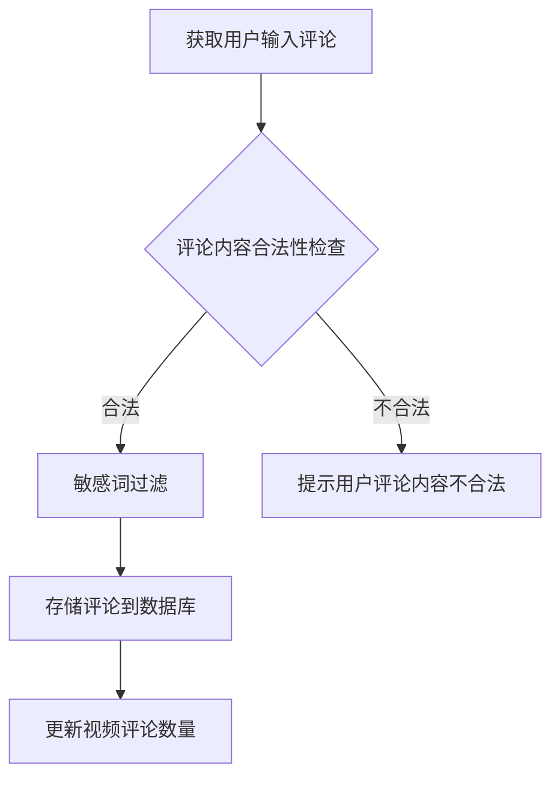
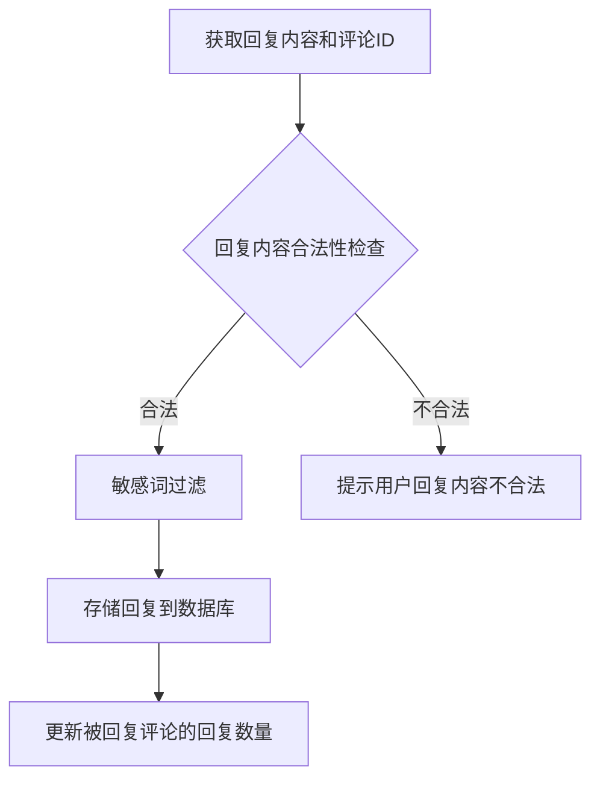
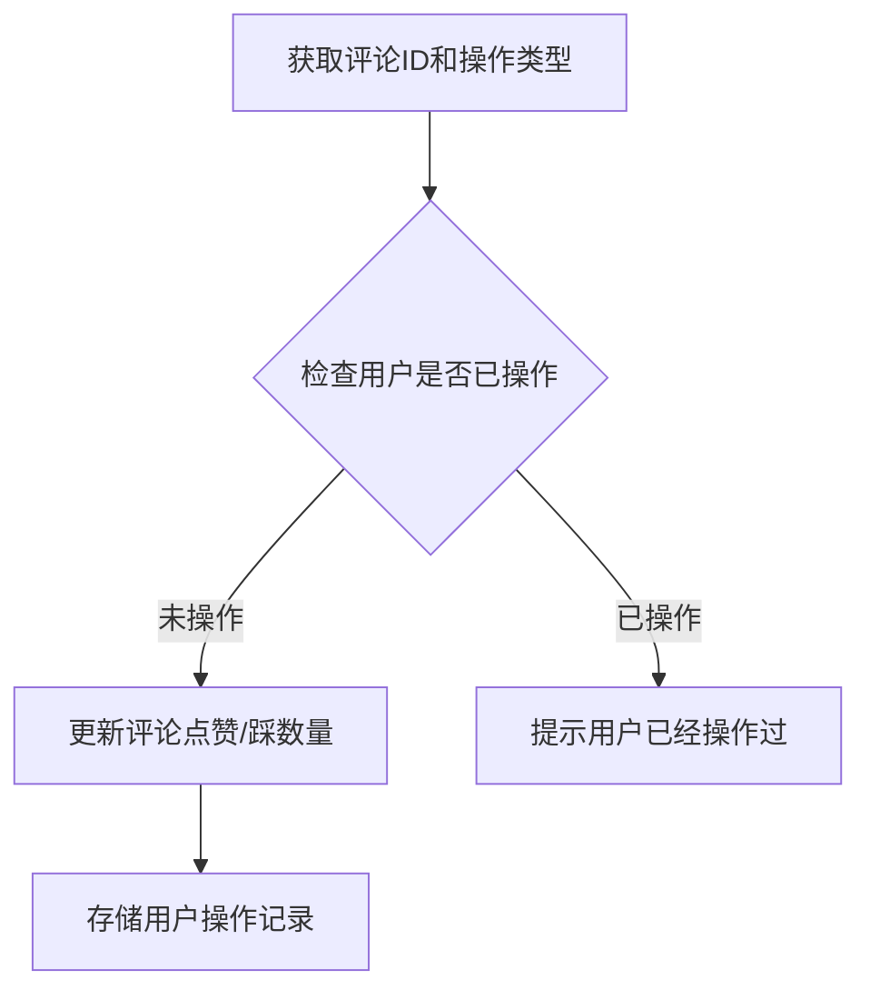
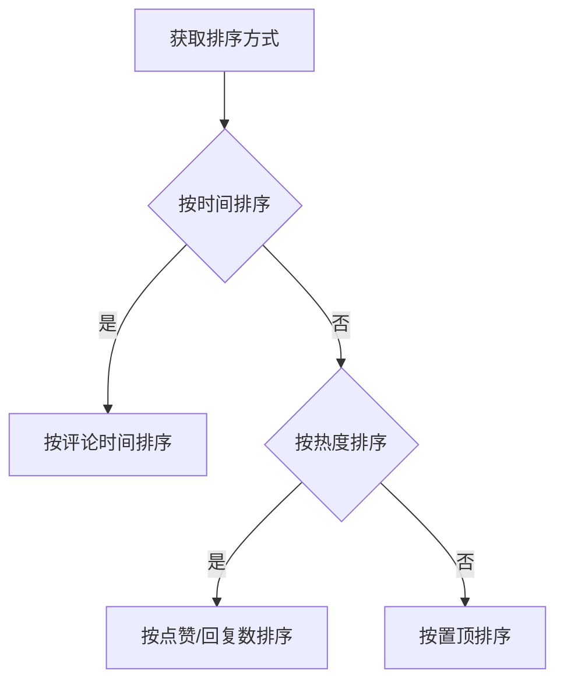
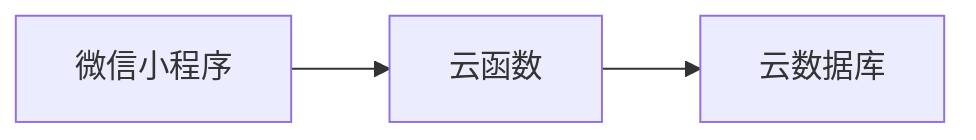

# 微信小程序的动漫视频评论系统

## 1.背景介绍

随着移动互联网和智能终端的快速发展,微信小程序作为一种全新的移动应用形式逐渐走进大众视野。与传统的APP相比,微信小程序具有无需安装、即用即走的优势,用户可以通过扫码或搜索小程序名称便可快速访问。同时,微信小程序与微信生态紧密相连,用户无需注册和登录即可使用,极大降低了使用门槛。

动漫视频作为年轻群体中的一种流行文化形式,在小程序中开发动漫视频相关的应用具有广阔的市场前景。然而,现有的动漫视频小程序大多只提供视频播放功能,缺乏与用户互动的评论系统。一个良好的评论系统不仅能够增强用户粘性,还可以促进用户之间的交流互动,提升用户体验。

因此,本文将重点探讨如何在微信小程序中开发一个动漫视频评论系统,包括系统架构设计、核心算法实现、数据存储方案等关键技术点,旨在为开发者提供一个完整的技术方案参考。

## 2.核心概念与联系

在开发动漫视频评论系统之前,我们需要了解以下几个核心概念:

### 2.1 微信小程序

微信小程序是一种全新的连接用户与服务的技术方案,它可以在微信内被便捷地获取和传播,同时具有出色的性能和将近无摩擦的体验。小程序的开发基于Web技术,采用WXML、WXSS和JavaScript等语言,并且可以调用微信提供的丰富API。

### 2.2 评论系统

评论系统是一种允许用户对特定内容(如视频、文章等)发表评论并与其他用户互动的系统。一个完整的评论系统通常包括以下几个核心功能:

- 发表评论
- 回复评论
- 点赞/踩评论
- 评论排序
- 敏感词过滤

### 2.3 云开发

云开发是微信小程序提供的一种云端一体化的开发方案,开发者可以在小程序云端运行代码、存储数据、并且无需自行搭建服务器。云开发提供了云函数、云数据库、云存储等多种服务,极大简化了小程序的开发和运维。

上述三个核心概念在动漫视频评论系统中息息相关,微信小程序作为系统的载体,评论系统作为系统的核心功能,而云开发则为系统提供了强有力的技术支持。

## 3.核心算法原理具体操作步骤

### 3.1 评论发表算法

评论发表算法是评论系统的核心部分,它需要实现以下几个步骤:

1. 获取用户输入的评论内容
2. 对评论内容进行敏感词过滤
3. 将过滤后的评论内容存储到数据库
4. 更新视频的评论数量

具体的实现步骤如下:



其中,敏感词过滤可以使用基于词库的方式,或者使用更高级的机器学习模型(如BERT等)进行检测。评论存储可以使用云开发提供的云数据库服务,并通过云函数实现数据库操作。

### 3.2 评论回复算法

评论回复算法用于实现对某个评论进行回复的功能,其步骤如下:

1. 获取用户输入的回复内容和被回复的评论ID
2. 对回复内容进行敏感词过滤
3. 将过滤后的回复内容存储到数据库,关联被回复的评论ID
4. 更新被回复评论的回复数量

具体的实现步骤如下:



### 3.3 评论点赞/踩算法

点赞/踩算法用于实现对某个评论进行点赞或踩的功能,其步骤如下:

1. 获取用户点赞/踩的评论ID和操作类型(点赞或踩)
2. 检查用户是否已经对该评论进行过点赞/踩操作
3. 根据操作类型,更新评论的点赞/踩数量
4. 存储用户的点赞/踩记录到数据库

具体的实现步骤如下:



### 3.4 评论排序算法

评论排序算法用于对评论进行排序,以便于用户浏览。常见的排序方式包括:

- 按时间排序(最新/最早)
- 按热度排序(点赞数/回复数)
- 按置顶排序(管理员可手动置顶某些评论)

具体的实现步骤如下:



排序算法可以在云函数中实现,通过对数据库中的评论数据进行查询和排序,然后返回排序后的结果。

## 4.数学模型和公式详细讲解举例说明

在评论系统中,我们可以使用一些数学模型和公式来提高系统的智能化水平,例如:

### 4.1 评论相似度计算

在检测重复评论或垃圾评论时,我们可以计算两个评论之间的相似度。常用的相似度计算方法包括:

1. **编辑距离(Edit Distance)**

编辑距离是指将一个字符串转换为另一个字符串所需的最少编辑操作次数,包括插入、删除和替换操作。编辑距离越小,两个字符串越相似。

对于两个字符串 $s_1$ 和 $s_2$,其编辑距离 $d(s_1, s_2)$ 可以通过动态规划算法计算:

$$
d(s_1, s_2) = \begin{cases}
0 & \text{if } s_1 = s_2 = \empty \\
m & \text{if } s_1 = \empty \\
n & \text{if } s_2 = \empty \\
\min\begin{cases}
d(s_1[:-1], s_2) + 1 \\
d(s_1, s_2[:-1]) + 1 \\
d(s_1[:-1], s_2[:-1]) + \text{cost}(s_1[-1], s_2[-1])
\end{cases} & \text{otherwise}
\end{cases}
$$

其中 $m$ 和 $n$ 分别表示字符串 $s_1$ 和 $s_2$ 的长度,cost函数用于计算两个字符的替换代价。

2. **余弦相似度(Cosine Similarity)**

余弦相似度是一种常用的文本相似度计算方法,它将文本表示为向量,然后计算两个向量之间的夹角余弦值。余弦值越接近1,两个文本越相似。

对于两个文本 $t_1$ 和 $t_2$,其余弦相似度 $\text{sim}(t_1, t_2)$ 可以计算为:

$$
\text{sim}(t_1, t_2) = \frac{\vec{t_1} \cdot \vec{t_2}}{||\vec{t_1}|| \cdot ||\vec{t_2}||}
$$

其中 $\vec{t_1}$ 和 $\vec{t_2}$ 分别表示文本 $t_1$ 和 $t_2$ 的向量表示,可以使用TF-IDF等方法计算。

### 4.2 评论情感分析

情感分析是自然语言处理领域的一个重要任务,它旨在自动识别文本中所表达的情感倾向,如正面、负面或中性等。在评论系统中,我们可以对用户评论进行情感分析,了解用户对视频的整体评价。

常见的情感分析方法包括:

1. **基于词典的方法**

基于词典的方法首先构建一个情感词典,其中每个词都被标注为正面、负面或中性情感。然后,通过统计文本中正面词和负面词的数量,计算情感得分。

设 $p$ 和 $n$ 分别表示文本中正面词和负面词的数量,则情感得分 $s$ 可以计算为:

$$
s = \frac{p - n}{p + n}
$$

得分 $s$ 的取值范围为 $[-1, 1]$,正值表示正面情感,负值表示负面情感,0表示中性情感。

2. **基于机器学习的方法**

基于机器学习的方法通常将情感分析建模为一个分类问题,利用标注好的语料训练分类器,然后对新的文本进行情感预测。

常用的机器学习模型包括支持向量机(SVM)、逻辑回归(LR)、长短期记忆网络(LSTM)等。这些模型可以自动学习文本的特征表示,并根据这些特征进行情感分类。

以LSTM为例,对于一个长度为 $n$ 的文本序列 $X = (x_1, x_2, \dots, x_n)$,LSTM模型可以计算出每个时间步的隐藏状态 $h_t$:

$$
h_t = \text{LSTM}(x_t, h_{t-1})
$$

然后,将最后一个隐藏状态 $h_n$ 输入到一个全连接层,得到情感分类结果 $y$:

$$
y = \text{softmax}(W h_n + b)
$$

其中 $W$ 和 $b$ 是全连接层的权重和偏置参数。

通过上述数学模型和公式,我们可以提高评论系统的智能化水平,实现重复评论检测、情感分析等高级功能。

## 5.项目实践:代码实例和详细解释说明

在本节中,我们将通过一个具体的代码实例,演示如何在微信小程序中实现一个动漫视频评论系统。

### 5.1 系统架构

我们采用前端(小程序) + 后端(云函数) + 数据库(云数据库)的架构,其中:

- 前端小程序负责展示视频列表、评论列表,以及提供评论输入界面
- 后端云函数负责处理评论相关的业务逻辑,如发表评论、回复评论、点赞/踩等
- 云数据库用于存储视频信息、评论信息等数据

系统架构如下所示:



### 5.2 数据库设计

我们在云数据库中创建两个集合:

1. `videos` 集合,用于存储视频信息,包括视频ID、标题、封面等。
2. `comments` 集合,用于存储评论信息,包括评论ID、评论内容、评论者ID、评论时间、点赞数、踩数等。

`comments` 集合中的数据结构如下:

```javascript
{
  _id: 'comment_id',
  content: '评论内容',
  videoId: 'video_id',
  userId: 'user_id',
  createTime: 1623456789, // 评论时间戳
  likes: 10, // 点赞数
  dislikes: 2, // 踩数
  replies: [ // 回复列表
    {
      _id: 'reply_id',
      content: '回复内容',
      userId: 'user_id',
      createTime: 1623456790
    },
    ...
  ]
}
```

### 5.3 发表评论

发表评论的云函数代码如下:

```javascript
// 云函数入口函数
exports.main = async (event, context) => {
  const { content, videoId } = event;
  const userId = context.getUserInfo().openId;

  // 敏感词过滤
  const filteredContent = filterSensitiveWords(content);

  // 存储评论