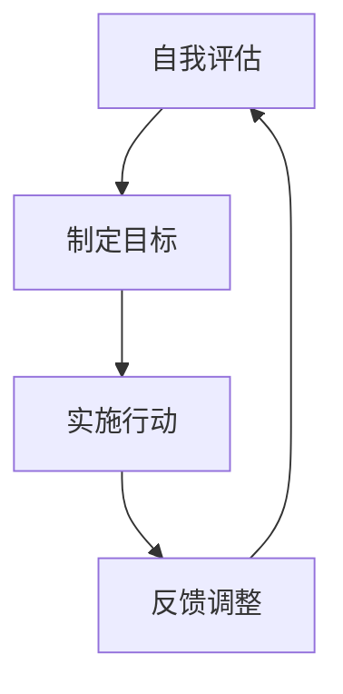

## 1.背景介绍

在信息化社会，技术人员不仅需要具备扎实的技术基础，更需要优秀的沟通协调能力、领导能力、组织能力、控制能力、分析判断能力和组织能力。这些能力对于技术人员来说，不仅可以提高个人素质，更能提升团队协作效率，推动项目的顺利进行。本文将结合实际案例，详细介绍如何培养这些能力。

## 2.核心概念与联系

沟通协调能力是指在工作中，能够有效地与他人进行信息交流，协调各方利益，推动工作的进行。领导能力是指通过影响他人，使其愿意并能够向共同目标努力。组织能力是指在完成任务的过程中，能够有效地安排使用资源，包括人力、物力和时间。控制能力是指能够对任务完成的过程和结果进行有效的监控和调整。分析判断能力是指能够对问题进行深入分析，并做出正确的判断。这些能力之间相互影响，相互促进，共同构成了一个高效的工作体系。

## 3.核心算法原理具体操作步骤

培养这些能力的过程，可以看作是一个迭代的过程，每一次迭代都包括以下四个步骤：

1. 自我评估：首先，要对自己的能力进行客观地评估，找出自己的优点和不足。
2. 制定目标：根据自我评估的结果，制定具体、可量化的提升目标。
3. 实施行动：根据目标，制定详细的行动计划，并付诸实施。
4. 反馈调整：在行动的过程中，要不断地获取反馈，根据反馈调整行动计划。

这个过程可以用下面的Mermaid流程图来表示：

## 4.数学模型和公式详细讲解举例说明

在这个过程中，我们可以使用一些数学模型和公式来帮助我们进行量化管理。例如，我们可以使用SMART原则来帮助我们制定目标，SMART原则是指目标应该是具体(Specific)、可衡量(Measurable)、可达成(Achievable)、相关性(Relevant)和时限(Time-bound)。

我们还可以使用PDCA循环来帮助我们进行反馈调整，PDCA循环是指计划(Plan)、执行(Do)、检查(Check)和行动(Act)。

这两个模型可以用下面的公式来表示：

- SMART原则：

$S = Specific$

$M = Measurable$

$A = Achievable$

$R = Relevant$

$T = Time-bound$

- PDCA循环：

$P = Plan$

$D = Do$

$C = Check$

$A = Act$

## 5.项目实践：代码实例和详细解释说明

在实际的项目中，我们可以通过以下方式来培养这些能力：

- 沟通协调能力：定期组织团队会议，积极参与讨论，提出自己的观点和建议。
- 领导能力：主动承担项目的领导角色，对项目的进度和质量负责。
- 组织能力：合理安排项目的时间和资源，确保项目的顺利进行。
- 控制能力：定期对项目的进度和质量进行检查，及时发现并解决问题。
- 分析判断能力：对项目中出现的问题进行深入分析，做出正确的判断和决策。

## 6.实际应用场景

这些能力在实际的工作中有广泛的应用。例如，项目经理需要优秀的沟通协调能力和领导能力，以确保项目的顺利进行。软件工程师需要优秀的组织能力和控制能力，以确保代码的质量和效率。数据分析师需要优秀的分析判断能力，以从大量的数据中提取有价值的信息。

## 7.工具和资源推荐

以下是一些可以帮助你提升这些能力的工具和资源：

- 《软技能：代码之外的生存指南》：这本书详细介绍了软技能的重要性，以及如何提升自己的软技能。
- 《领导力21法则》：这本书从21个方面介绍了领导力的要素，对提升领导力非常有帮助。
- Trello：这是一个项目管理工具，可以帮助你更好地组织和控制项目。
- Google Analytics：这是一个数据分析工具，可以帮助你提升分析判断能力。

## 8.总结：未来发展趋势与挑战

随着社会的发展，这些能力的重要性将越来越高。然而，提升这些能力并不容易，需要长时间的学习和实践。希望通过本文，能够帮助你更好地理解这些能力，以及如何培养这些能力。

## 9.附录：常见问题与解答

Q: 这些能力有哪些关联？
A: 这些能力相互影响，相互促进，共同构成了一个高效的工作体系。

Q: 如何量化管理这些能力？
A: 可以使用SMART原则和PDCA循环来进行量化管理。

Q: 如何在实际项目中培养这些能力？
A: 可以通过定期组织团队会议、主动承担项目的领导角色、合理安排项目的时间和资源、定期对项目的进度和质量进行检查、对项目中出现的问题进行深入分析等方式来培养这些能力。

Q: 这些能力在实际工作中有哪些应用？
A: 这些能力在项目管理、软件工程、数据分析等多个领域都有广泛的应用。

Q: 有哪些工具和资源可以帮助我提升这些能力？
A: 《软技能：代码之外的生存指南》、《领导力21法则》、Trello、Google Analytics等都是非常好的工具和资源。

作者：禅与计算机程序设计艺术 / Zen and the Art of Computer Programming