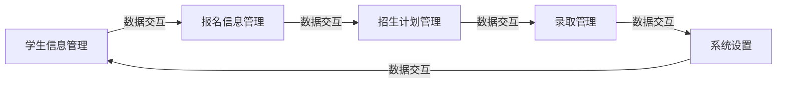

## 1.背景介绍

在当今信息化的时代，招生管理系统已经成为了教育机构必不可少的一部分。这种系统能够帮助教育机构更加有效地管理和组织招生活动，提高招生工作的效率和效果。然而，设计和实现一个功能完善、操作简便的招生管理系统并非易事。本文将详细介绍招生管理系统的设计和实现过程，以及相关的核心概念和算法。

## 2.核心概念与联系

招生管理系统主要包括以下几个核心模块：学生信息管理、招生计划管理、报名信息管理、录取管理和系统设置。这些模块之间存在着密切的联系，需要通过数据库进行数据的交互和共享。



## 3.核心算法原理具体操作步骤

招生管理系统的核心算法主要包括学生信息管理算法、招生计划管理算法、报名信息管理算法和录取管理算法。这些算法都是基于数据库操作的，主要涉及到数据的增删改查。

例如，学生信息管理算法的具体操作步骤如下：

1. 查询：通过学生的姓名、性别、年龄等信息，从数据库中查询学生的详细信息。
2. 新增：输入学生的详细信息，将这些信息添加到数据库中。
3. 修改：选择需要修改的学生信息，更新数据库中的相应数据。
4. 删除：选择需要删除的学生信息，从数据库中删除相应的数据。

## 4.数学模型和公式详细讲解举例说明

在招生管理系统中，我们需要对学生的成绩进行统计分析，以帮助教育机构做出更好的招生决策。这就需要用到一些数学模型和公式。

例如，我们可以使用均值和标准差来描述学生的成绩分布。均值表示学生的平均成绩，可以通过以下公式计算：

$$
\mu = \frac{1}{n}\sum_{i=1}^{n}x_i
$$

其中，$n$ 是学生的总数，$x_i$ 是第 $i$ 个学生的成绩。

标准差表示学生成绩的离散程度，可以通过以下公式计算：

$$
\sigma = \sqrt{\frac{1}{n}\sum_{i=1}^{n}(x_i - \mu)^2}
$$

## 5.项目实践：代码实例和详细解释说明

下面以学生信息管理模块的查询功能为例，介绍一下具体的代码实现。我们使用 Python 的 Django 框架来实现这个功能。

```python
from django.shortcuts import render
from .models import Student

def search(request):
    if 'q' in request.GET:
        q = request.GET['q']
        students = Student.objects.filter(name__icontains=q)
        return render(request, 'search.html', {'students': students, 'query': q})
    else:
        return render(request, 'search.html', {})
```

这段代码首先从请求中获取查询关键字 `q`，然后调用 `Student.objects.filter(name__icontains=q)` 来从数据库中查询含有关键字 `q` 的学生信息。最后，将查询结果返回给前端进行展示。

## 6.实际应用场景

招生管理系统广泛应用于各类教育机构，包括但不限于小学、中学、大学和培训机构。通过使用招生管理系统，教育机构可以更加高效地进行招生工作，提高工作效率，降低工作难度。

## 7.工具和资源推荐

在设计和实现招生管理系统时，以下工具和资源可能会对你有所帮助：

- Django：一个高级的 Python Web 框架，可以快速开发安全和可维护的网站。
- MySQL：一个广泛使用的关系型数据库管理系统，可以用来存储和管理招生管理系统的数据。
- Bootstrap：一个前端开发框架，可以帮助你快速设计出美观的界面。

## 8.总结：未来发展趋势与挑战

随着信息技术的发展，招生管理系统的功能将会越来越强大，操作也会越来越简便。然而，如何保护学生的隐私信息，如何防止数据的误操作，如何提高系统的稳定性和可用性，都是未来需要面对的挑战。

## 9.附录：常见问题与解答

Q：如何保护学生的隐私信息？
A：可以通过数据加密、权限控制等手段来保护学生的隐私信息。

Q：如何防止数据的误操作？
A：可以通过设置操作确认、操作日志、数据备份等手段来防止数据的误操作。

作者：禅与计算机程序设计艺术 / Zen and the Art of Computer Programming