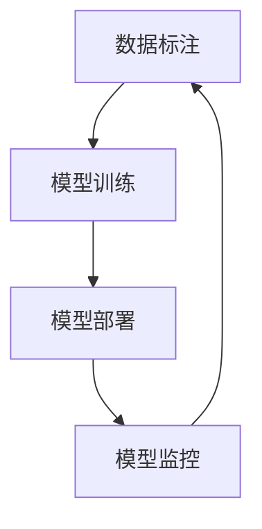

## 1.背景介绍

在当今的人工智能时代，模型的训练和部署已经成为了一项重要的任务。然而，我们往往忽视了一点，那就是模型的长期稳定运行。数据标注和模型监控是保障模型长期稳定运行的两个重要环节。

## 2.核心概念与联系

### 2.1 数据标注

数据标注是机器学习中的一个重要步骤，它涉及将原始数据标记或分类，以便机器学习算法可以理解。在监督学习中，标注数据是必不可少的，因为模型需要标注数据来学习如何区分不同的类别。

### 2.2 模型监控

模型监控是指在模型部署后，持续监控模型的性能，以确保其在长期运行中的稳定性和准确性。模型监控包括但不限于对模型的预测性能、数据质量、业务指标等进行监控。

### 2.3 数据标注与模型监控的联系

数据标注和模型监控是相辅相成的。数据标注提供了训练模型所需的输入，而模型监控则确保了模型能够在长期稳定地运行。没有高质量的数据标注，模型的性能可能会受到影响；没有有效的模型监控，我们可能无法及时发现模型的问题。



## 3.核心算法原理具体操作步骤

### 3.1 数据标注

数据标注通常包括以下步骤：

1. 数据收集：收集原始数据，这些数据可以是图片、文本、音频等。
2. 数据预处理：清洗数据，去除无关的信息，如噪声、异常值等。
3. 数据标注：根据任务需求，对数据进行标注，如分类、定位、分割等。
4. 数据审核：对标注结果进行审核，确保标注的准确性。

### 3.2 模型监控

模型监控通常包括以下步骤：

1. 模型部署：将训练好的模型部署到生产环境。
2. 实时监控：实时收集模型的预测结果，监控模型的性能。
3. 性能评估：定期对模型的性能进行评估，如准确率、召回率等。
4. 问题定位：当模型性能下降时，定位问题，找到性能下降的原因。
5. 模型更新：根据问题定位的结果，更新模型，如重新训练、调整参数等。

## 4.数学模型和公式详细讲解举例说明

在模型监控中，我们通常会使用一些数学模型和公式来度量模型的性能，如准确率、召回率、F1值等。

### 4.1 准确率

准确率（Accuracy）是最常见的评价指标，它表示模型预测正确的样本数占总样本数的比例。公式如下：

$$
\text{Accuracy} = \frac{\text{Number of correct predictions}}{\text{Total number of predictions}}
$$

### 4.2 召回率

召回率（Recall）是在所有实际为正的样本中，模型预测为正的样本数的比例。公式如下：

$$
\text{Recall} = \frac{\text{Number of true positives}}{\text{Number of true positives + Number of false negatives}}
$$

### 4.3 F1值

F1值是准确率和召回率的调和平均值，它同时考虑了模型的准确率和召回率。公式如下：

$$
F1 = 2 * \frac{\text{Precision * Recall}}{\text{Precision + Recall}}
$$

## 5.项目实践：代码实例和详细解释说明

以下是一个简单的模型监控的代码实例：

```python
from sklearn.metrics import accuracy_score, recall_score, f1_score

# 假设 y_true 是真实的标签，y_pred 是模型的预测结果
y_true = [1, 0, 1, 1, 0, 1]
y_pred = [0, 0, 1, 1, 0, 1]

# 计算准确率
accuracy = accuracy_score(y_true, y_pred)
print(f'Accuracy: {accuracy}')

# 计算召回率
recall = recall_score(y_true, y_pred)
print(f'Recall: {recall}')

# 计算 F1 值
f1 = f1_score(y_true, y_pred)
print(f'F1: {f1}')
```

在这个代码实例中，我们使用了 scikit-learn 库中的 `accuracy_score`、`recall_score` 和 `f1_score` 函数来计算模型的准确率、召回率和 F1 值。

## 6.实际应用场景

数据标注和模型监控在许多领域都有广泛的应用，如自动驾驶、医疗图像分析、语音识别等。

在自动驾驶中，数据标注被用来标注道路、车辆、行人等对象，而模型监控则用来实时监控模型的性能，确保自动驾驶系统的安全运行。

在医疗图像分析中，数据标注被用来标注病灶区域，而模型监控则用来监控模型的预测性能，确保模型能够准确地识别病灶。

在语音识别中，数据标注被用来标注语音的文本内容，而模型监控则用来监控模型的识别准确率，确保模型能够准确地识别语音。

## 7.工具和资源推荐

以下是一些数据标注和模型监控的工具和资源推荐：

- 数据标注工具：Labelbox、VGG Image Annotator（VIA）、LabelImg
- 模型监控工具：TensorBoard、Weights & Biases、Prometheus
- 学习资源：《Deep Learning》（Ian Goodfellow, Yoshua Bengio, Aaron Courville）、《Hands-On Machine Learning with Scikit-Learn, Keras, and TensorFlow》（Aurélien Géron）

## 8.总结：未来发展趋势与挑战

随着人工智能的发展，数据标注和模型监控的重要性将越来越高。未来的发展趋势可能会朝着以下几个方向：

- 自动化数据标注：利用机器学习算法自动进行数据标注，降低人工标注的成本和时间。
- 智能模型监控：利用机器学习算法自动监控模型的性能，及时发现和解决问题。
- 全链路优化：从数据收集、数据标注、模型训练、模型部署到模型监控，实现全链路的优化和自动化。

然而，这些发展也带来了一些挑战，如如何保证自动化数据标注的准确性，如何实现实时的模型监控，如何处理大规模的数据和模型等。

## 9.附录：常见问题与解答

Q1：数据标注的质量如何影响模型的性能？

A1：数据标注的质量直接影响模型的性能。如果数据标注的质量不高，模型可能会学习到错误的信息，导致性能下降。

Q2：如何进行模型监控？

A2：模型监控通常包括实时监控、性能评估、问题定位和模型更新等步骤。实时监控是通过收集模型的预测结果，实时监控模型的性能。性能评估是通过一些评价指标，如准确率、召回率等，定期评估模型的性能。问题定位是当模型性能下降时，定位问题，找到性能下降的原因。模型更新是根据问题定位的结果，更新模型，如重新训练、调整参数等。

Q3：数据标注和模型监控有什么联系？

A3：数据标注和模型监控是相辅相成的。数据标注提供了训练模型所需的输入，而模型监控则确保了模型能够在长期稳定地运行。没有高质量的数据标注，模型的性能可能会受到影响；没有有效的模型监控，我们可能无法及时发现模型的问题。

作者：禅与计算机程序设计艺术 / Zen and the Art of Computer Programming