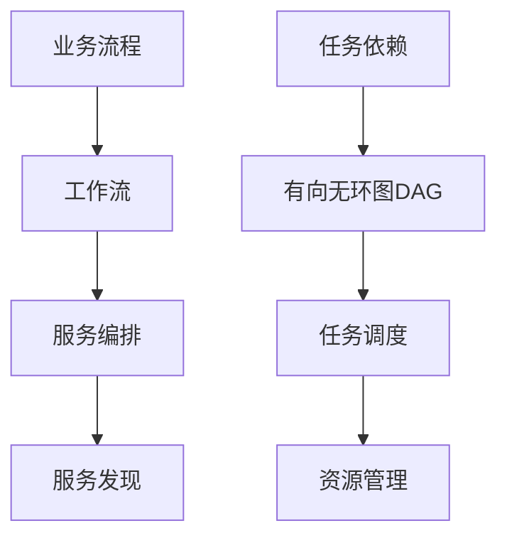

# 服务编排与任务调度原理与代码实战案例讲解

## 1. 背景介绍

在现代分布式系统和微服务架构中,服务编排和任务调度扮演着至关重要的角色。随着应用程序复杂度的增加和业务需求的多样化,如何高效地协调和管理各个服务组件,并合理地调度任务资源,成为了系统设计和开发中的关键问题。本文将深入探讨服务编排和任务调度的原理,并结合实际代码案例,为读者提供全面而深入的理解。

### 1.1 服务编排的定义与意义

服务编排(Service Orchestration)是指在分布式系统中,通过定义一系列的规则和流程,将多个服务组件组合和协调起来,以实现特定的业务逻辑和功能。它的目标是将分散的服务整合成一个统一的、可管理的业务流程,并提供一致的用户体验。

服务编排的意义在于:

1. 简化复杂系统的管理:通过编排,可以将复杂的业务流程拆分成多个独立的服务,每个服务专注于特定的功能,降低了系统的耦合度,使得系统更易于维护和扩展。

2. 提高服务复用性:编排允许将已有的服务组件进行组合和复用,避免了重复开发的工作,提高了开发效率。

3. 增强系统的灵活性:通过编排,可以灵活地修改和重组业务流程,快速响应市场变化和用户需求。

### 1.2 任务调度的定义与意义

任务调度(Task Scheduling)是指在系统中,根据一定的调度策略,将待执行的任务分配给合适的资源(如服务器、线程、进程等)进行处理的过程。其目标是最大化资源利用率,同时保证任务的及时性和公平性。

任务调度的意义在于:

1. 提高系统性能:合理的任务调度可以充分利用系统资源,避免资源的浪费和竞争,从而提升系统的整体性能。

2. 保证任务的及时性:通过优先级控制和截止时间管理,调度器可以确保关键任务得到及时处理,满足业务的时效性要求。

3. 实现负载均衡:调度器可以根据资源的实时状态和任务的特点,动态地将任务分配给负载较轻的资源,实现负载的均衡分布。

## 2. 核心概念与联系

为了深入理解服务编排和任务调度,我们需要了解一些核心概念及其相互之间的联系。

### 2.1 工作流(Workflow)

工作流是对业务流程的抽象和建模,它定义了一系列活动(Activity)的执行顺序和条件依赖关系。在服务编排中,工作流通常用于描述服务组件之间的调用关系和执行逻辑。常见的工作流建模语言包括BPMN、YAWL等。

### 2.2 有向无环图(DAG)

有向无环图是一种常用于表示任务之间依赖关系的数据结构。在DAG中,节点表示任务,有向边表示任务之间的依赖关系,且图中不存在环路。许多任务调度系统都使用DAG来描述任务的拓扑结构和执行顺序。

### 2.3 服务发现(Service Discovery)  

在微服务架构中,服务发现是服务编排的重要组成部分。它允许服务消费者动态地获取服务提供者的地址信息,而无需硬编码服务的位置。常见的服务发现方式包括客户端发现和服务端发现。

### 2.4 资源管理(Resource Management)

任务调度离不开对系统资源的管理。资源管理模块负责跟踪和管理系统中的各类资源,如CPU、内存、I/O等,为调度决策提供依据。常见的资源管理策略包括集中式管理和分布式管理。

下图展示了服务编排与任务调度中的核心概念及其关联:



从图中可以看出,业务流程通过工作流的方式进行建模,工作流中的活动对应于不同的服务组件,服务编排负责协调这些服务组件的执行,并借助服务发现机制实现服务位置的动态获取。另一方面,任务之间的依赖关系可以用DAG来表示,任务调度根据DAG进行任务的分配和执行,同时需要资源管理模块的支持,以实现对系统资源的有效利用。

## 3. 核心算法原理与具体操作步骤

本节将介绍服务编排和任务调度中的几种核心算法,并给出其具体的操作步骤。

### 3.1 工作流编排算法

工作流编排算法的目标是根据工作流定义,自动生成服务组件的调用序列和执行计划。常见的工作流编排算法包括:

#### 3.1.1 基于规则的编排算法

该算法通过预定义一系列的编排规则,根据工作流中活动的执行条件和数据依赖,推断出服务调用的顺序。具体步骤如下:

1. 解析工作流定义,提取活动及其执行条件和数据依赖。
2. 根据预定义的编排规则,分析活动之间的依赖关系。
3. 生成服务调用序列,并构建执行计划。
4. 返回执行计划,供编排引擎执行。

#### 3.1.2 基于状态机的编排算法

该算法将工作流看作一个状态机,每个活动对应一个状态,活动之间的转换对应状态之间的迁移。具体步骤如下:

1. 将工作流转换为状态机模型。
2. 根据状态机模型,生成状态迁移表。
3. 从初始状态出发,根据迁移条件,遍历状态迁移表,生成服务调用序列。
4. 返回服务调用序列,供编排引擎执行。

### 3.2 任务调度算法

任务调度算法的目标是根据任务的特性和系统的实时状态,将任务分配给合适的资源进行执行。常见的任务调度算法包括:

#### 3.2.1 优先级调度算法

该算法根据任务的优先级进行调度,优先级高的任务会优先获得资源。具体步骤如下:

1. 将待调度的任务按照优先级从高到低排序。
2. 遍历任务列表,为每个任务分配可用资源。
3. 如果当前任务无法获得资源,则跳过,继续尝试下一个任务。
4. 重复步骤2-3,直到所有任务都得到调度或无可用资源。

#### 3.2.2 基于负载均衡的调度算法

该算法根据资源的实时负载情况进行任务分配,以实现负载的均衡分布。具体步骤如下:

1. 获取系统中所有可用资源的实时负载信息。
2. 对资源按照负载水平从低到高排序。
3. 遍历任务列表,将每个任务分配给当前负载最低的资源。
4. 更新资源的负载信息,重复步骤2-3,直到所有任务都得到调度。

## 4. 数学模型和公式详细讲解举例说明

在服务编排和任务调度中,一些数学模型和公式常被用于描述系统的性能指标和优化目标。本节将详细讲解几个常用的数学模型和公式。

### 4.1 排队论模型

排队论是描述服务系统性能的重要数学工具。在服务编排中,可以用排队论模型来分析服务的响应时间和吞吐量。假设服务请求到达率为$\lambda$,服务率为$\mu$,则系统的平均响应时间$W$可以用下式计算:

$$
W = \frac{1}{\mu - \lambda}
$$

举例说明:假设一个服务的请求到达率为10个/秒,服务率为20个/秒,则该服务的平均响应时间为:

$$
W = \frac{1}{20 - 10} = 0.1秒
$$

### 4.2 线性规划模型

线性规划是一种常用的优化模型,可以用于求解资源分配问题。在任务调度中,可以用线性规划模型来描述任务与资源之间的约束关系,并求解最优的调度方案。设$x_{ij}$表示将任务$i$分配给资源$j$的决策变量,$c_{ij}$表示任务$i$在资源$j$上的执行成本,则调度问题可以表示为:

$$
\begin{aligned}
\min \quad & \sum_{i=1}^{n} \sum_{j=1}^{m} c_{ij} x_{ij} \\
\textrm{s.t.} \quad & \sum_{j=1}^{m} x_{ij} = 1, \forall i \\
& \sum_{i=1}^{n} x_{ij} \leq 1, \forall j \\
& x_{ij} \in \{0, 1\}, \forall i,j
\end{aligned}
$$

其中,目标函数表示最小化总执行成本,约束条件保证每个任务只分配给一个资源,每个资源最多执行一个任务。

举例说明:假设有3个任务和2个资源,任务在资源上的执行成本矩阵为:

$$
C = \begin{bmatrix}
2 & 3\\
4 & 2\\
3 & 5
\end{bmatrix}
$$

求解该线性规划问题,可得最优调度方案为:$x_{11}=1, x_{22}=1, x_{31}=1$,总执行成本为$2+2+3=7$。

## 5. 项目实践:代码实例和详细解释说明

本节将通过一个简单的服务编排和任务调度的代码实例,展示如何使用Python实现相关功能。

### 5.1 服务编排代码实例

下面是一个基于有限状态机的服务编排示例代码:

```python
from transitions import Machine

class ServiceOrchestrator(object):
    states = ['start', 'service1', 'service2', 'service3', 'end']

    def __init__(self):
        self.machine = Machine(model=self, states=ServiceOrchestrator.states, initial='start')
        
        self.machine.add_transition(trigger='next', source='start', dest='service1', before='execute_service1')
        self.machine.add_transition(trigger='next', source='service1', dest='service2', before='execute_service2')
        self.machine.add_transition(trigger='next', source='service2', dest='service3', before='execute_service3')
        self.machine.add_transition(trigger='next', source='service3', dest='end')
        
    def execute_service1(self):
        print("Executing Service 1...")
        
    def execute_service2(self):
        print("Executing Service 2...")
        
    def execute_service3(self):
        print("Executing Service 3...")

if __name__ == "__main__":
    orchestrator = ServiceOrchestrator()
    orchestrator.next()  # start -> service1
    orchestrator.next()  # service1 -> service2
    orchestrator.next()  # service2 -> service3
    orchestrator.next()  # service3 -> end
```

代码解释:

1. 定义了一个`ServiceOrchestrator`类,表示服务编排器。
2. 在类中定义了状态列表`states`,包括`start`、`service1`、`service2`、`service3`和`end`五个状态。
3. 在构造函数中,创建了一个有限状态机`machine`,初始状态为`start`。
4. 使用`add_transition`方法定义状态之间的转换关系,并指定转换前需要执行的动作,如`execute_service1`等。
5. 定义了三个服务执行的方法`execute_service1`、`execute_service2`和`execute_service3`,用于模拟服务的执行过程。
6. 在`main`函数中,创建`ServiceOrchestrator`实例,并通过调用`next`方法触发状态转换,实现服务的编排和执行。

### 5.2 任务调度代码实例

下面是一个基于优先级的任务调度示例代码:

```python
import heapq

class Task(object):
    def __init__(self, name, priority):
        self.name = name
        self.priority = priority
        
    def __lt__(self, other):
        return self.priority < other.priority
        
class ResourceManager(object):
    def __init__(self, num_resources):
        self.resources = [True] * num_resources
        
    def allocate_resource(self):
        for i in range(len(self.resources)):
            if self.resources[i]:
                self.resources[i] = False
                return i
        return None
        
    def free_resource(