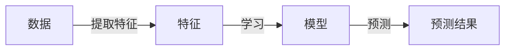

## 1.背景介绍

机器学习，简称ML，是人工智能的一个重要分支。它是让计算机通过学习数据，自动获取知识并改善性能的技术。在过去的几十年里，机器学习已经在许多领域取得了显著的成功，包括计算机视觉、自然语言处理、推荐系统等。

## 2.核心概念与联系

机器学习的核心概念可以分为以下几个部分：

- 数据(Data)：机器学习的过程始于数据，这些数据可以是图片、文本、音频或其他形式。数据通常被划分为训练数据和测试数据。

- 特征(Features)：特征是描述数据的属性，如图像的像素值，文本的单词频率等。选择合适的特征对于机器学习的成功至关重要。

- 模型(Model)：模型是一个算法，它从数据中学习并预测出结果。常见的模型包括决策树、神经网络、支持向量机等。

- 学习(Learning)：学习是通过调整模型的参数，使模型在训练数据上的预测结果与真实结果尽可能接近的过程。

- 预测(Prediction)：预测是使用学习到的模型对新的数据进行预测的过程。

这些概念之间的关系可以用以下的Mermaid流程图表示：



## 3.核心算法原理具体操作步骤

以决策树为例，其主要步骤包括：

1. 特征选择：选择一个最优特征来划分数据。

2. 决策树生成：根据选择的特征划分数据，生成决策树。

3. 剪枝：为了防止过拟合，需要对决策树进行剪枝。

## 4.数学模型和公式详细讲解举例说明

决策树的特征选择通常使用信息增益或信息增益比。信息增益是父节点的熵和子节点熵的差，计算公式如下：

$$
Gain(D, a) = Ent(D) - \sum_{v=1}^{V} \frac{|D^v|}{|D|} Ent(D^v)
$$

其中，$D$表示数据集，$a$表示特征，$Ent(D)$表示数据集$D$的熵，$D^v$表示数据集$D$在特征$a$上取值为$v$的子集。

## 5.项目实践：代码实例和详细解释说明

以下是一个使用Python的sklearn库实现决策树的例子：

```python
from sklearn.datasets import load_iris
from sklearn.model_selection import train_test_split
from sklearn.tree import DecisionTreeClassifier

# 加载数据
iris = load_iris()
X = iris.data
y = iris.target

# 划分数据集
X_train, X_test, y_train, y_test = train_test_split(X, y, test_size=0.2, random_state=42)

# 创建决策树模型
clf = DecisionTreeClassifier(max_depth=3)

# 训练模型
clf.fit(X_train, y_train)

# 预测
y_pred = clf.predict(X_test)
```

## 6.实际应用场景

机器学习被广泛应用在各个领域，例如：

- 计算机视觉：机器学习被用来识别图片中的对象、人脸等。

- 自然语言处理：机器学习被用来理解和生成文本。

- 推荐系统：机器学习被用来预测用户的喜好，为用户推荐商品。

## 7.工具和资源推荐

以下是一些学习和使用机器学习的推荐资源：

- 书籍：《Hands-On Machine Learning with Scikit-Learn, Keras, and TensorFlow》

- 在线课程：Coursera的“Machine Learning”课程

- 工具：Python的sklearn库、TensorFlow库

## 8.总结：未来发展趋势与挑战

随着数据的增多和计算能力的提高，机器学习的应用将更加广泛。然而，机器学习也面临着许多挑战，例如数据的质量和安全性，模型的可解释性，以及算法的公平性等。

## 9.附录：常见问题与解答

Q: 机器学习和深度学习有什么区别？

A: 深度学习是机器学习的一个子集，它使用神经网络进行学习。与传统的机器学习方法相比，深度学习可以处理更复杂的任务，如语音识别、图像识别等。

Q: 如何选择合适的模型？

A: 选择模型需要考虑问题的性质、数据的大小和特性、以及计算资源等因素。一般来说，可以尝试多种模型，然后选择在验证集上表现最好的模型。

作者：禅与计算机程序设计艺术 / Zen and the Art of Computer Programming