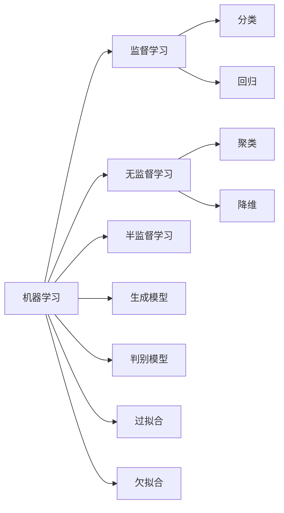

# 机器学习 原理与代码实例讲解

## 1.背景介绍
### 1.1 机器学习的定义
机器学习是一门多领域交叉学科，涉及概率论、统计学、逼近论、凸分析、算法复杂度理论等多门学科。机器学习理论主要是设计和分析一些让计算机可以自动"学习"的算法。机器学习算法是一类从数据中自动分析获得规律,并利用规律对未知数据进行预测的算法。
### 1.2 机器学习的发展历程
机器学习作为一门独立学科,起源于上世纪50年代。1950年,图灵提出"图灵测试"的概念,用以评判机器的智能。1956年,在达特茅斯学会上,McCarthy等科学家共同提出了"人工智能"的概念。20世纪70年代,Duda和Hart出版了第一本机器学习专著《模式分类》。1986年,Rumelhart等人提出了反向传播算法,使多层感知机重新引起人们的关注。1997年,IBM公司制造的"深蓝"战胜了国际象棋世界冠军卡斯帕罗夫。进入21世纪以来,机器学习在互联网、生物、金融等领域得到了广泛应用,并取得了巨大成功。
### 1.3 机器学习的应用领域
机器学习在各行各业都有广泛的应用,主要包括以下几个方面:
1. 计算机视觉:图像识别、目标检测、人脸识别等
2. 自然语言处理:文本分类、情感分析、机器翻译、智能问答等  
3. 语音识别:语音识别、说话人识别等
4. 推荐系统:电商推荐、个性化推荐等
5. 金融领域:信用评分、反欺诈、量化投资等
6. 医疗领域:医学影像识别、辅助诊断等
7. 工业领域:设备故障预测、工业质检等

## 2.核心概念与联系
### 2.1 监督学习、无监督学习与半监督学习
- 监督学习:训练数据由输入和期望输出(标签)组成。常见算法有决策树、支持向量机、神经网络等。
- 无监督学习:训练数据只有输入,没有期望输出。常见算法有聚类、降维等。
- 半监督学习:结合了监督学习和无监督学习,训练数据既有标签数据,也有未标注数据。
### 2.2 分类、回归与聚类
- 分类:预测离散值,如判断一封邮件是否为垃圾邮件。
- 回归:预测连续值,如预测房价。
- 聚类:将相似的对象归到一个簇中,如将新闻划分为不同主题。
### 2.3 生成模型与判别模型
- 生成模型:由数据学习联合概率分布P(X,Y),然后求出条件概率分布P(Y|X)作为预测模型,如朴素贝叶斯。
- 判别模型:由数据直接学习决策函数Y=f(X)或条件概率分布P(Y|X)作为预测模型,如SVM。
### 2.4 过拟合与欠拟合
- 过拟合:模型过于复杂,把训练样本学得太好,泛化能力差。
- 欠拟合:模型过于简单,无法很好地拟合训练数据。
- 解决方法:交叉验证、正则化、提前停止等。

下面是机器学习中一些核心概念之间的联系的 Mermaid 流程图:

## 3.核心算法原理具体操作步骤
本节将介绍几种常见的机器学习算法,包括决策树、支持向量机、朴素贝叶斯和 k-means 聚类。
### 3.1 决策树
决策树是一种树形结构,其中每个内部节点表示一个属性上的判断,每个分支代表一个判断结果的输出,最后每个叶节点代表一种分类结果。决策树的学习通常包括3个步骤:特征选择、决策树的生成和决策树的修剪。
#### 3.1.1 特征选择
常用的特征选择方法有信息增益、增益率、基尼指数等。以信息增益为例,假设 D 为训练集,|D|为样本个数,有 K 个类 Ck,|Ck|为属于类 Ck 的样本个数。D 的信息熵定义为:
$$
Ent(D) = -\sum_{k=1}^K \frac{|C_k|}{|D|} \log_2 \frac{|C_k|}{|D|}
$$
假设属性 a 有 V 个可能的取值,将 D 按 a 分成 V 个子集 D1,D2,...,DV,则属性 a 对训练集 D 的信息增益为:
$$
Gain(D,a) = Ent(D) - \sum_{v=1}^V \frac{|D_v|}{|D|} Ent(D_v)
$$
#### 3.1.2 决策树的生成
通常使用ID3、C4.5等算法生成决策树。以ID3为例,其生成过程为:
1. 若 D 中所有样本属于同一类,则将该类作为节点的标记,返回单节点树;
2. 若属性集为空,则将 D 中样本数最多的类作为该节点的标记;
3. 否则,计算每个属性的信息增益,选择信息增益最大的属性 a* 作为节点的测试属性;
4. 对 a* 的每一个可能值 av,令 Dv 表示 D 中在 a* 上取值为 av 的样本子集;
5. 若 Dv 为空,将 D 中样本数最多的类作为标记,构建子节点;
6. 否则,以 Dv 为训练集,以 A\{a*} 为属性集,递归调用步骤1-5,构建子树。
#### 3.1.3 决策树的剪枝
剪枝是决策树学习中解决过拟合的主要手段。常见的剪枝方法有预剪枝和后剪枝。预剪枝是在决策树生成过程中,对每个节点在划分前进行估计,若当前节点的划分不能带来决策树泛化性能的提升,则停止划分并将当前节点标记为叶节点。后剪枝则是先从训练集生成一棵完整的决策树,然后自底向上地对非叶节点进行考察,若将该节点对应的子树替换为叶节点能带来决策树泛化性能的提升,则将该子树替换为叶节点。

### 3.2 支持向量机
支持向量机(SVM)是一种二分类模型,它的基本模型是定义在特征空间上的间隔最大的线性分类器。
#### 3.2.1 线性SVM
对于线性可分数据,SVM的目标是找到一个超平面,能够将不同类别的数据点分开,且间隔最大。假设超平面 $(w,b)$ 能将训练样本正确分类,即对于 $(x_i,y_i) \in D$,若 $y_i=+1$,则有 $w \cdot x_i + b \geq +1$;若 $y_i=-1$,则有 $w \cdot x_i + b \leq -1$。两个异类支持向量到超平面的距离之和为 $\gamma = \frac{2}{||w||}$,最大化间隔即最小化 $\frac{1}{2}||w||^2$。因此,线性SVM的学习问题可以表示为以下凸二次规划问题:
$$
\min_{w,b} \frac{1}{2}||w||^2 \\
s.t. \quad y_i(w \cdot x_i + b) \geq 1, \quad i=1,2,...,N
$$
求解该最优化问题的对偶问题,得到线性SVM的最优解 $w^*,b^*$,从而得到分类决策函数:
$$
f(x) = sign(w^* \cdot x + b^*)
$$
#### 3.2.2 非线性SVM
对于线性不可分数据,可以通过核技巧将样本从原始空间映射到一个高维特征空间,使得样本在这个高维特征空间内线性可分。令 $\phi(x)$ 表示将 $x$ 映射后的特征向量,于是,在特征空间中的超平面可表示为:
$$
f(x) = w \cdot \phi(x) + b
$$
学习问题变成在特征空间中求解最优化问题:
$$
\min_{w,b} \frac{1}{2}||w||^2 \\
s.t. \quad y_i(w \cdot \phi(x_i) + b) \geq 1, \quad i=1,2,...,N
$$
求解其对偶问题,可得最优解:
$$
w^* = \sum_{i=1}^N \alpha_i^* y_i \phi(x_i) \\
f(x) = sign(\sum_{i=1}^N \alpha_i^* y_i \phi(x_i) \cdot \phi(x) + b^*)
$$
其中,$\alpha_i^*$ 是最优化问题的拉格朗日乘子。定义核函数 $K(x,z)=\phi(x) \cdot \phi(z)$,则分类决策函数可写为:
$$
f(x) = sign(\sum_{i=1}^N \alpha_i^* y_i K(x_i,x) + b^*)
$$
这样,对于给定的核函数 K(x,z),SVM的学习过程就不需要显式地计算特征映射 $\phi$,而只需计算核函数 K(x,z)。常用的核函数有:
- 多项式核: $K(x,z)=(x \cdot z + 1)^p$
- 高斯核: $K(x,z)=exp(-\frac{||x-z||^2}{2\sigma^2})$
- Sigmoid核: $K(x,z)=tanh(\beta x \cdot z + \theta)$

### 3.3 朴素贝叶斯
朴素贝叶斯是一种基于贝叶斯定理与特征条件独立假设的分类方法。给定训练集 $T=\{(x_1,y_1),(x_2,y_2),...,(x_N,y_N)\}$,其中 $x_i=(x_i^{(1)},x_i^{(2)},...,x_i^{(n)})^T$,$x_i^{(j)}$ 是第 i 个样本的第 j 个特征,$y_i \in \{C_1,C_2,...,C_K\}$ 是 $x_i$ 的类标记。朴素贝叶斯通过训练数据集学习联合概率分布 $P(X,Y)$。
朴素贝叶斯的学习过程如下:
1. 计算先验概率 $P(Y=C_k)$:
$$
P(Y=C_k) = \frac{\sum_{i=1}^N I(y_i=C_k)}{N}, \quad k=1,2,...,K
$$
其中 $I(y_i=C_k)$ 为示性函数,即当 $y_i=C_k$ 时取值为1,否则为0。
2. 计算条件概率 $P(X^{(j)}=x^{(j)}|Y=C_k)$:
$$
P(X^{(j)}=x^{(j)}|Y=C_k) = \frac{\sum_{i=1}^N I(x_i^{(j)}=x^{(j)}, y_i=C_k)}{\sum_{i=1}^N I(y_i=C_k)}
$$
3. 对给定的输入 $x=(x^{(1)},x^{(2)},...,x^{(n)})^T$,计算
$$
P(Y=C_k|X=x) = \frac{P(X=x|Y=C_k)P(Y=C_k)}{P(X=x)}
$$
根据特征条件独立假设,有
$$
P(X=x|Y=C_k) = \prod_{j=1}^n P(X^{(j)}=x^{(j)}|Y=C_k)
$$
于是,朴素贝叶斯分类器可表示为:
$$
y = f(x) = \arg\max_{C_k} P(Y=C_k) \prod_{j=1}^n P(X^{(j)}=x^{(j)}|Y=C_k)
$$

### 3.4 k-means聚类
k-means 是一种常用的聚类算法,它以 k 为参数,把 n 个对象分成 k 个簇,使簇内具有较高