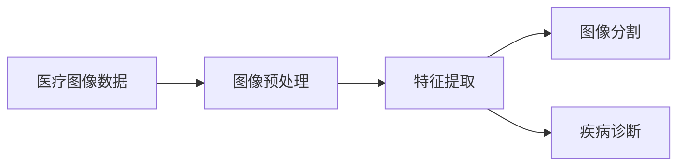

# 机器学习在医疗图像分析中的应用

## 1. 背景介绍
### 1.1 医疗图像分析的重要性
医疗图像分析在现代医疗诊断和治疗中扮演着至关重要的角色。随着医学影像技术的不断进步,如X射线、CT、MRI和PET等,医疗图像数据呈现出爆炸式增长的趋势。然而,传统的人工分析方法已经无法有效处理如此庞大的医疗图像数据。因此,迫切需要开发高效、准确的自动化医疗图像分析技术,以辅助医生进行疾病诊断和治疗决策。

### 1.2 机器学习在医疗图像分析中的应用前景
机器学习作为人工智能的核心技术之一,在医疗图像分析领域展现出了广阔的应用前景。机器学习算法能够从大量医疗图像数据中自动学习和提取有价值的特征,并建立高效的预测模型,用于疾病诊断、病变检测、影像分割等任务。与传统方法相比,机器学习能够显著提高医疗图像分析的效率和准确性,减轻医生的工作负担,为精准医疗提供有力支持。

## 2. 核心概念与联系
### 2.1 医疗图像的类型与特点
- X射线:利用X射线穿透人体组织,获得人体内部结构的投影图像。
- CT(计算机断层扫描):通过X射线围绕人体旋转扫描,重建人体内部器官的三维图像。
- MRI(磁共振成像):利用强磁场和射频脉冲,获得人体内部组织的高分辨率图像。
- PET(正电子发射断层扫描):通过示踪剂的代谢过程,反映人体内部器官的功能状态。

医疗图像具有高维度、多模态、非结构化等特点,给机器学习算法的应用带来了挑战。

### 2.2 机器学习的基本概念
机器学习是一种通过数据来学习规律和知识的方法。其基本流程包括:
1. 数据收集与预处理
2. 特征提取与选择
3. 模型训练与优化
4. 模型评估与应用

根据学习方式的不同,机器学习可分为监督学习、无监督学习和强化学习等类型。

### 2.3 机器学习与医疗图像分析的结合
将机器学习应用于医疗图像分析,主要涉及以下几个方面:
- 图像预处理:对原始医疗图像进行去噪、增强、标准化等预处理操作,提高图像质量。
- 特征提取:从医疗图像中提取能够反映疾病特征的影像组学特征,如纹理、形状、灰度等。
- 图像分割:将医疗图像划分为不同的解剖结构或病变区域,为后续分析提供基础。
- 疾病诊断:利用机器学习模型对医疗图像进行分类,实现疾病的自动诊断和筛查。



## 3. 核心算法原理具体操作步骤
### 3.1 卷积神经网络(CNN)
CNN是一种广泛应用于医疗图像分析的深度学习模型,其基本结构包括:
1. 卷积层:通过卷积操作提取图像的局部特征。
2. 池化层:对卷积特征进行下采样,减少参数量并提高特征的鲁棒性。
3. 全连接层:将提取的特征映射到输出空间,实现分类或回归任务。

CNN的训练过程通过反向传播算法来优化模型参数,最小化预测结果与真实标签之间的损失函数。

### 3.2 U-Net
U-Net是一种用于医学图像分割的CNN变体,其结构呈现出对称的U型。U-Net的关键特点包括:
1. 编码器:通过卷积和下采样操作提取图像的多尺度特征。
2. 解码器:通过上采样和跳跃连接恢复图像的空间细节。
3. 跳跃连接:将编码器的特征图与解码器的特征图进行拼接,保留了位置信息。

U-Net在医学图像分割任务中取得了广泛成功,能够准确地勾勒出器官和病变的边界。

### 3.3 生成对抗网络(GAN)
GAN由生成器和判别器两部分组成,通过对抗学习的方式生成逼真的医疗图像。其基本流程如下:
1. 生成器接收随机噪声,生成假的医疗图像。
2. 判别器接收真实图像和生成的假图像,判断其真假。
3. 生成器和判别器互相博弈,不断提升各自的性能,直到达到平衡。

GAN在医疗图像的数据增强、图像修复、跨模态合成等任务中展现出了巨大潜力。

## 4. 数学模型和公式详细讲解举例说明
### 4.1 卷积操作
卷积是CNN的核心操作,用于提取图像的局部特征。二维卷积的数学定义为:

$$
(f*g)(i,j) = \sum_{m}\sum_{n}f(m,n)g(i-m,j-n)
$$

其中,$f$表示输入图像,$g$表示卷积核,$*$表示卷积操作。卷积核在图像上滑动,对局部区域进行加权求和,得到输出特征图。

例如,假设输入图像为:
$$
\begin{bmatrix}
1 & 2 & 3\\
4 & 5 & 6\\
7 & 8 & 9
\end{bmatrix}
$$
卷积核为:
$$
\begin{bmatrix}
0 & 1\\
2 & 3
\end{bmatrix}
$$
则卷积结果为:
$$
\begin{bmatrix}
14 & 20\\
30 & 36
\end{bmatrix}
$$

### 4.2 损失函数
损失函数用于衡量模型预测结果与真实标签之间的差异,常见的损失函数包括:

- 交叉熵损失:用于分类任务,衡量预测概率分布与真实分布之间的差异。
  $$
  L = -\sum_{i=1}^{N}y_i\log(\hat{y}_i)
  $$
  其中,$y_i$为真实标签,$\hat{y}_i$为预测概率。

- 均方误差损失:用于回归任务,衡量预测值与真实值之间的欧氏距离。
  $$
  L = \frac{1}{N}\sum_{i=1}^{N}(y_i-\hat{y}_i)^2
  $$
  其中,$y_i$为真实值,$\hat{y}_i$为预测值。

模型训练的目标是最小化损失函数,通过梯度下降等优化算法来更新模型参数。

## 5. 项目实践：代码实例和详细解释说明
下面以基于CNN的肺结节分类为例,给出PyTorch代码实现:

```python
import torch
import torch.nn as nn
import torch.optim as optim
from torchvision import transforms, datasets

# 定义CNN模型
class CNN(nn.Module):
    def __init__(self):
        super(CNN, self).__init__()
        self.conv1 = nn.Conv2d(1, 16, kernel_size=3, padding=1)
        self.conv2 = nn.Conv2d(16, 32, kernel_size=3, padding=1)
        self.fc1 = nn.Linear(32 * 28 * 28, 128)
        self.fc2 = nn.Linear(128, 2)

    def forward(self, x):
        x = nn.functional.relu(self.conv1(x))
        x = nn.functional.max_pool2d(x, 2)
        x = nn.functional.relu(self.conv2(x))
        x = nn.functional.max_pool2d(x, 2)
        x = x.view(-1, 32 * 28 * 28)
        x = nn.functional.relu(self.fc1(x))
        x = self.fc2(x)
        return x

# 加载数据集
transform = transforms.Compose([
    transforms.Resize((224, 224)),
    transforms.ToTensor()
])
dataset = datasets.ImageFolder('data', transform=transform)
dataloader = torch.utils.data.DataLoader(dataset, batch_size=32, shuffle=True)

# 初始化模型和优化器
model = CNN()
criterion = nn.CrossEntropyLoss()
optimizer = optim.Adam(model.parameters(), lr=0.001)

# 训练模型
num_epochs = 10
for epoch in range(num_epochs):
    for images, labels in dataloader:
        outputs = model(images)
        loss = criterion(outputs, labels)

        optimizer.zero_grad()
        loss.backward()
        optimizer.step()

    print(f'Epoch [{epoch+1}/{num_epochs}], Loss: {loss.item():.4f}')

# 测试模型
model.eval()
with torch.no_grad():
    correct = 0
    total = 0
    for images, labels in dataloader:
        outputs = model(images)
        _, predicted = torch.max(outputs.data, 1)
        total += labels.size(0)
        correct += (predicted == labels).sum().item()

    print(f'Accuracy: {100 * correct / total:.2f}%')
```

代码解释:
1. 定义了一个简单的CNN模型,包含两个卷积层和两个全连接层。
2. 使用`ImageFolder`加载肺结节图像数据集,并进行预处理。
3. 初始化模型、损失函数和优化器。
4. 循环遍历数据集进行模型训练,每个epoch输出当前的损失值。
5. 在测试集上评估模型性能,输出分类准确率。

该代码实现了一个基本的肺结节分类流程,可根据实际需求进行改进和优化。

## 6. 实际应用场景
机器学习在医疗图像分析中有广泛的应用场景,包括但不限于:

### 6.1 肿瘤检测与分割
利用机器学习算法对医学影像进行自动分析,实现肿瘤的早期检测和精确分割。如利用CNN对肺部CT图像进行肺结节检测,利用U-Net对脑部MRI图像进行脑肿瘤分割等。

### 6.2 疾病诊断与分类
将机器学习模型应用于医疗图像的疾病诊断和分类任务。如利用CNN对皮肤镜图像进行皮肤癌的诊断,利用迁移学习对眼底图像进行糖尿病性视网膜病变的分级等。

### 6.3 影像组学分析
从医疗图像中提取大量定量影像组学特征,结合机器学习算法构建预测模型,用于疾病诊断、预后评估和治疗决策。如利用radiomics特征预测肺癌患者的生存期,利用MRI组学特征预测乳腺癌的分子亚型等。

### 6.4 图像配准与融合
利用机器学习算法实现多模态医学图像的自动配准和融合,提高诊断和治疗的精度。如利用深度学习实现CT和PET图像的非刚性配准,利用GAN实现MRI和CT图像的跨模态合成等。

## 7. 工具和资源推荐
### 7.1 深度学习框架
- TensorFlow:由Google开发的端到端开源机器学习平台。
- PyTorch:由Facebook开发的基于Torch的开源深度学习框架。
- Keras:基于TensorFlow和Theano的高级神经网络API。

### 7.2 医学图像数据集
- LUNA16:肺结节检测数据集,包含888例CT扫描图像。
- BraTS:脑肿瘤分割挑战数据集,包含多模态MRI图像。
- ISIC:皮肤镜图像数据集,用于皮肤病变分类和分割。
- Kaggle:包含多个医学图像分析竞赛和数据集。

### 7.3 开源代码库
- NiftyNet:用于医学图像分析的TensorFlow开源平台。
- MONAI:用于医疗图像深度学习的PyTorch开源框架。
- MedicalZooPytorch:包含多个医学图像分析任务的PyTorch实现。

## 8. 总结：未来发展趋势与挑战
机器学习在医疗图像分析领域取得了显著进展,但仍面临着诸多挑战:
- 数据质量和标注成本:高质量的医疗图像数据和专家标注的获取成本较高。
- 模型泛化性和可解释性:如何提高模型在不同数据集和场景下的泛化性能,同时增强模型的可解释性。
- 数据隐私和安全:医疗数据涉及患者隐私,需要平