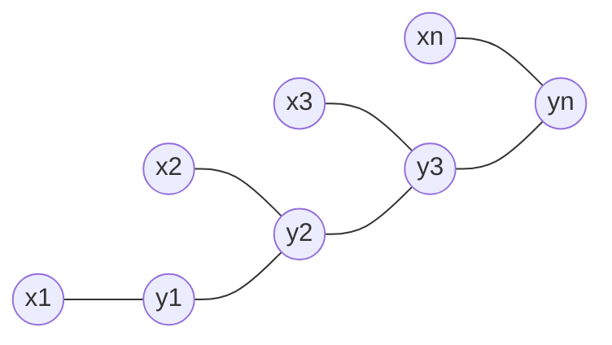

# 条件随机场(Conditional Random Fields) - 原理与代码实例讲解

## 1. 背景介绍

### 1.1 序列标注问题
在自然语言处理、语音识别、生物信息学等领域,我们经常会遇到序列标注(Sequence Labeling)问题。序列标注就是给定一个观测序列,预测其对应的标签序列。常见的序列标注任务包括:

- 词性标注(Part-of-Speech Tagging):给定单词序列,预测每个单词的词性
- 命名实体识别(Named Entity Recognition):给定单词序列,预测其中的人名、地名、机构名等命名实体
- 基因预测(Gene Prediction):给定DNA序列,预测基因位置

传统的序列标注方法主要有隐马尔可夫模型(Hidden Markov Models, HMM)和最大熵马尔可夫模型(Maximum Entropy Markov Models, MEMM)。但它们都存在一些局限性,如难以加入丰富的特征、标注偏置等问题。

### 1.2 判别式概率模型
条件随机场(Conditional Random Fields,CRF)是一种判别式概率模型,由Lafferty等人于2001年提出。与生成式模型(如HMM)不同,判别式模型直接对条件概率P(Y|X)建模,其中X为观测序列,Y为相应的标签序列。通过引入特征函数,CRF 可以方便地加入丰富的特征信息,克服了HMM等模型的缺陷。

CRF在序列标注任务上展现出了优异的性能,在词性标注、命名实体识别、语义角色标注等任务上都取得了很好的效果。本文将详细介绍CRF的基本原理,并给出详细的代码实例,帮助读者深入理解CRF模型。

## 2. 核心概念与联系

### 2.1 无向图模型
CRF是定义在无向图(Undirected Graph)G=(V,E)上的随机场。图中的节点V表示随机变量,边E表示变量之间的依赖关系。与有向图模型(如贝叶斯网络)不同,无向图模型对变量之间的依赖关系没有方向性的要求。

### 2.2 概率无向图模型的因子分解
在概率无向图模型中,联合概率分布P(Y)可以表示为图中各个最大团上因子的乘积:

$$P(Y)=\frac{1}{Z}\prod_{C} \Psi_C(Y_C)$$

其中C为无向图中的最大团(Maximal Clique),Y_C为团C中的变量,ψ_C为定义在团C上的势函数(Potential Function),Z为归一化因子(Partition Function)。

### 2.3 线性链条件随机场
线性链条件随机场(Linear-chain CRF)是定义在线性链无向图上的特殊的CRF。设X=(x_1,x_2,...,x_n)为观测序列,Y=(y_1,y_2,...,y_n)为相应的标签序列。在线性链CRF中,X和Y组成下图所示的无向图结构:



由于图的特殊的线性链结构,线性链CRF的条件概率可以写成:

$$P(Y|X)=\frac{1}{Z(X)} \prod_{i=1}^n \exp \left(\sum_{k} \lambda_k f_k(y_{i-1}, y_i, X, i) \right)$$

其中f_k为特征函数,λ_k为对应的权重,Z(X)为归一化因子。线性链CRF的优点是因子分解形式简单,推断和训练都可以通过动态规划高效完成。

## 3. 核心算法原理具体操作步骤

### 3.1 特征函数设计
特征函数f_k刻画了输入观测序列X和输出标签序列Y在位置i的交互作用。通常使用二值函数(Binary Feature)表示特征:

$$f_k(y_{i-1}, y_i, X, i) = \begin{cases} 
1, & \text{if } g_k(X, i)=1 \text{ and } y_{i-1}=a, y_i=b \\ 
0, & \text{otherwise}
\end{cases}$$

其中g_k为观测序列X在位置i的预定义特征。常用的观测特征包括:

- 单词特征:x_i的identity、前缀、后缀、长度等
- 词性特征:x_i的词性
- 上下文特征:x_{i-1},x_{i+1}等
- 组合特征:x_i和x_{i-1}的组合等

### 3.2 推断
给定观测序列X,CRF的推断任务是找到条件概率P(Y|X)最大的标签序列Y^*:

$$Y^* = \arg\max_Y P(Y|X)$$

这个问题可以通过动态规划(Dynamic Programming)的方法求解,类似于HMM中的维特比算法(Viterbi Algorithm)。

定义前向变量α_i(y_i)表示到位置i标签为y_i的非规范化概率:

$$\alpha_i(y_i) = \sum_{y_1,\ldots,y_{i-1}} \prod_{j=1}^i \exp \left(\sum_{k} \lambda_k f_k(y_{j-1}, y_j, X, j) \right)$$

可以通过递推公式高效计算前向变量:

$$\alpha_i(y_i) = \sum_{y_{i-1}} \alpha_{i-1}(y_{i-1}) \exp \left(\sum_{k} \lambda_k f_k(y_{i-1}, y_i, X, i) \right)$$

类似地,定义后向变量β_i(y_i)表示从位置i+1到n标签为y_{i+1},...,y_n的非规范化概率。

最优标签序列可以通过最大化非规范化概率得到:

$$Y^* = \arg\max_Y \prod_{i=1}^n \exp \left(\sum_{k} \lambda_k f_k(y_{i-1}, y_i, X, i) \right)$$

使用类似维特比算法的动态规划可以高效求解。

### 3.3 训练
CRF的训练过程就是估计特征权重λ_k的过程。给定m个训练样本{(X^(i),Y^(i))}(i=1,2,...,m),通过极大化对数似然函数来估计参数:

$$L(\lambda) = \sum_{i=1}^m \log P(Y^{(i)}|X^{(i)}) - \sum_k \frac{\lambda_k^2}{2\sigma^2}$$

其中第二项为L2正则化项,用于控制过拟合。

对数似然函数求导可得:

$$\frac{\partial L}{\partial \lambda_k} = \sum_{i=1}^m \sum_{j=1}^n f_k(y_{j-1}^{(i)}, y_j^{(i)}, X^{(i)}, j) - \sum_{i=1}^m \sum_{j=1}^n \sum_{y,y'} P(y,y'|X^{(i)}) f_k(y, y', X^{(i)}, j) - \frac{\lambda_k}{\sigma^2}$$

其中P(y,y'|X)表示在观测序列X下标签y和y'的边缘概率(Marginal Probability),可以通过前向后向算法(Forward-backward Algorithm)高效计算。

利用梯度下降法(如BFGS、L-BFGS等)可以求解上述优化问题,得到最优参数估计。

## 4. 数学模型和公式详细讲解举例说明

### 4.1 线性链条件随机场的数学定义
线性链CRF由如下三元组表示:G=(V,E),Y,X。其中:

- G=(V,E)为线性链无向图,V={Y_1,Y_2,...,Y_n},E={(i,i+1)}
- Y={y_1,y_2,...,y_n}为标签序列,y_i∈S为标签集合
- X={x_1,x_2,...,x_n}为观测序列

线性链CRF的条件概率定义为:

$$P(Y|X) = \frac{1}{Z(X)} \prod_{i=1}^n \Psi_i (y_{i-1},y_i,X) = \frac{1}{Z(X)} \exp \left(\sum_{i=1}^n \sum_{k} \lambda_k f_k(y_{i-1}, y_i, X, i) \right)$$

其中势函数ψ_i定义为指数形式:

$$\Psi_i (y_{i-1},y_i,X) = \exp \left(\sum_{k} \lambda_k f_k(y_{i-1}, y_i, X, i) \right)$$

归一化因子Z(X)为:

$$Z(X) = \sum_Y \prod_{i=1}^n \Psi_i (y_{i-1},y_i,X) = \sum_Y \exp \left(\sum_{i=1}^n \sum_{k} \lambda_k f_k(y_{i-1}, y_i, X, i) \right)$$

### 4.2 例子:词性标注
下面以词性标注任务为例,说明CRF的建模过程。假设观测序列为:

X = {"The", "dog", "chased", "the", "cat", "."}

对应的词性标签序列为:

Y = {"DET", "NN", "VBD", "DET", "NN", "."}

定义如下二值特征:

- f_1(y_{i-1},y_i,X,i)=1 if y_i="NN" and x_i ends with "ed"
- f_2(y_{i-1},y_i,X,i)=1 if y_{i-1}="DET" and y_i="NN"
- f_3(y_{i-1},y_i,X,i)=1 if y_i="VBD"

则词性标注的条件概率为:

$$\begin{align*}
P(Y|X) &= \frac{1}{Z(X)} \exp \bigg( \lambda_1 f_1(\text{VBD},\text{DET},X,4) + \lambda_2 f_2(\text{DET},\text{NN},X,2) \\
       &\quad + \lambda_2 f_2(\text{DET},\text{NN},X,5) + \lambda_3 f_3(\text{NN},\text{VBD},X,3) \bigg) \\
       &= \frac{1}{Z(X)} \exp ( \lambda_1 + 2\lambda_2 + \lambda_3 )
\end{align*}$$

其中Z(X)为归一化因子。通过训练数据估计出特征权重λ后,就可以对新的观测序列进行标注。

## 5. 项目实践:代码实例和详细解释说明

下面给出一个使用Python实现线性链CRF的简单示例。本例使用了CRF++的数据格式,通过sklearn-crfsuite库实现。

### 5.1 数据准备
首先准备训练数据train.txt和测试数据test.txt,格式如下:

```
The	DET
dog	NN
chased	VBD
the	DET
cat	NN
.	.

The	DET
quick	JJ
brown	JJ
fox	NN
jumped	VBD
over	IN
a	DET
lazy	JJ
dog	NN
.	.
```

每个句子以空行分隔,每行包含单词及其对应的词性标签,以制表符分隔。

### 5.2 特征提取
定义特征提取函数,将单词序列转化为特征序列:

```python
def word2features(sent, i):
    word = sent[i][0]
    features = [
        'bias',
        'word=' + word,
        'word.lower=' + word.lower(),
        'word[-3:]=' + word[-3:],
        'word[-2:]=' + word[-2:],
        'word.isupper=%s' % word.isupper(),
        'word.istitle=%s' % word.istitle(),
        'word.isdigit=%s' % word.isdigit(),
    ]
    if i > 0:
        word1 = sent[i-1][0]
        features.extend([
            '-1:word=' + word1,
            '-1:word.lower=' + word1.lower(),
            '-1:word.istitle=%s' % word1.istitle(),
            '-1:word.isupper=%s' % word1.isupper(),
        ])
    else:
        features.append('BOS')
        
    if i < len(sent)-1:
        word1 = sent[i+1][0]
        features.extend([
            '+1:word=' + word1,
            '+1:word.lower=' + word1.lower(),
            '+1:word.istitle=%s' % word1.istitle(),
            '+1:word.isupper=%s' % word1.isupper(),
        ])
    else:
        features.append('EOS')
                
    return features

def sent2features(sent):
    return [word2features(sent, i) for i in range(len(sent))]

def sent2labels(sent):
    return [label for token, label in sent]

def sent2tokens(sent):
    return [token for token, label in sent]
```

### 5.3 模型训练与测试
使用sklearn-crfsuite训练并评估线性链CRF模型:

```python
import sklearn_cr