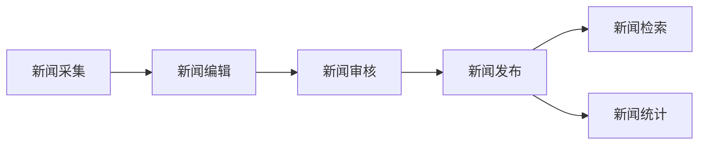

# 校园新闻管理系统设计与实现

## 1. 背景介绍

### 1.1 校园新闻管理系统的意义

在当今信息化时代,高校校园新闻工作面临着新的机遇和挑战。传统的校园新闻管理模式已经无法满足日益增长的信息需求,亟需建立一个高效、便捷、智能化的校园新闻管理系统。该系统不仅可以提高校园新闻的传播效率和质量,而且可以为校园文化建设和思想政治教育提供有力支撑。

### 1.2 国内外研究现状

国外许多高校已经建立了较为完善的校园新闻管理系统,如美国斯坦福大学的"Stanford News"系统、英国剑桥大学的"Cambridge News"系统等。这些系统普遍采用了先进的信息技术,实现了新闻的采集、编辑、发布、存档等全流程管理。

国内高校近年来也开始重视校园新闻管理系统的建设。清华大学、北京大学、复旦大学等知名高校纷纷建立了自己的新闻管理平台,取得了良好的应用效果。但总体而言,国内高校的校园新闻管理系统还处于起步阶段,在功能设计、技术实现等方面还有较大的提升空间。

### 1.3 系统设计目标

本文旨在设计并实现一个功能完备、易用高效的校园新闻管理系统。该系统将充分利用计算机网络技术、数据库技术、人工智能技术,实现校园新闻的智能化采集、编辑、审核、发布、检索、统计分析等功能,为高校校园新闻工作提供一站式信息化解决方案。

## 2. 核心概念与联系

### 2.1 新闻采集

新闻采集是指通过各种渠道获取原始新闻素材的过程。传统的新闻采集主要依靠记者的调查采访,效率较低。在校园新闻管理系统中,可以利用网络爬虫技术,自动抓取校内各类网站、论坛、公众号等平台上的新闻信息。同时,还可以为师生提供新闻投稿渠道,鼓励全员参与。

### 2.2 新闻编辑

新闻编辑是指对采集到的新闻素材进行筛选、整理、加工,最终形成可发布新闻稿件的过程。传统的新闻编辑主要依靠人工操作,容易出现失误。在校园新闻管理系统中,可以运用自然语言处理、文本挖掘等人工智能技术,实现新闻的自动分类、摘要、关键词提取、相似度检测等功能,提高编辑效率和质量。

### 2.3 新闻审核

新闻审核是指对拟发布的新闻稿件进行把关,确保其政治方向正确、内容真实可靠、文字规范得体的过程。在校园新闻管理系统中,可以设置多级审核机制,由不同角色(如编辑、主编、管理员等)分别把关。同时,还可以利用机器学习算法,对新闻内容进行自动分析,识别出政治敏感、低俗色情、虚假谣言等不良信息。

### 2.4 新闻发布

新闻发布是指将审核通过的新闻稿件推送给目标受众的过程。传统的新闻发布主要通过纸媒、广播、电视等渠道,覆盖面有限。在校园新闻管理系统中,可以利用网站、手机APP、微信公众号、RSS订阅等新媒体渠道,实现新闻的精准推送。同时,还可以根据用户的兴趣爱好、行为习惯等,进行个性化新闻推荐。

### 2.5 新闻检索

新闻检索是指用户通过关键词、标签、分类等方式,快速查找所需新闻内容的过程。在校园新闻管理系统中,可以利用全文检索、语义检索等技术,实现新闻的多维度、多层次检索。同时,还可以提供新闻订阅、收藏、评论、分享等互动功能,提升用户体验。

### 2.6 新闻统计

新闻统计是指对新闻的数量、类型、热度、传播效果等进行量化分析的过程。在校园新闻管理系统中,可以利用大数据分析技术,对新闻的各项指标进行实时监测和可视化呈现。这不仅可以帮助新闻工作者及时把握舆情动向,优化选题策划,而且可以为领导决策提供数据支撑。

### 2.7 概念联系图

下面使用Mermaid流程图展示上述核心概念之间的逻辑联系:

从图中可以看出,新闻采集是校园新闻管理系统的起点,经过编辑、审核、发布等环节,最终实现新闻的检索和统计分析。各个环节之间紧密关联、相互促进,共同构成了一个完整的闭环。

## 3. 核心算法原理和具体操作步骤

### 3.1 新闻自动分类算法

新闻自动分类是指利用机器学习算法,根据新闻内容自动判断其所属类别(如教学科研、校园文化、学生活动等)的过程。常用的算法包括:

(1) 朴素贝叶斯算法
- 基本原理:利用贝叶斯定理,通过已知类别的新闻样本,计算各个词语在每个类别中出现的概率,再根据新闻中包含的词语,预测其最可能的类别。
- 优点:原理简单,实现容易,对缺失数据不敏感,适合大规模数据集。
- 缺点:假设特征之间相互独立,实际效果一般。

(2) 支持向量机(SVM)算法
- 基本原理:将新闻映射到高维空间,寻找一个最优超平面将不同类别的新闻分开。
- 优点:泛化能力强,适合高维、非线性数据,分类精度高。
- 缺点:训练速度慢,对参数敏感,适用于小规模数据集。

(3) 卷积神经网络(CNN)算法
- 基本原理:利用卷积层提取新闻的局部特征,再通过池化层压缩特征,最后用全连接层对新闻进行分类。
- 优点:能够自动学习新闻的深层特征,分类精度高。
- 缺点:需要大量标注数据,训练时间长,调参难度大。

下面以朴素贝叶斯算法为例,介绍其具体操作步骤:

输入:已标注类别的新闻训练集D={d1,d2,...,dn},新闻类别集合C={c1,c2,...,cm}
输出:新闻d的预测类别c

Step1:数据预处理
- 对新闻进行分词,去除停用词,提取关键词作为特征
- 将新闻表示为词袋向量,即新闻中各个词语的出现次数

Step2:模型训练
- 计算每个类别ck的先验概率P(ck)=类别ck的新闻数/总新闻数
- 计算每个词语wj在类别ck中的条件概率P(wj|ck)=(词语wj在类别ck中出现的次数+1)/(类别ck的总词数+词表大小)

Step3:模型预测
- 对于新闻d,提取其关键词向量 W={w1,w2,...,ws}
- 计算新闻d属于每个类别的后验概率:P(ck|W)=P(ck)×P(w1|ck)×P(w2|ck)×...×P(ws|ck)
- 取后验概率最大的类别作为新闻d的预测类别:c*=argmax P(ck|W)

Step4:模型评估
- 采用留出法或k折交叉验证,将数据集划分为训练集和测试集
- 在测试集上评估模型的准确率、召回率、F1值等指标

### 3.2 新闻摘要生成算法

新闻摘要生成是指利用自然语言处理技术,自动提取新闻正文中的关键信息,生成简洁、连贯的摘要文本的过程。常用的算法包括:

(1) 基于统计的提取式方法
- 基本原理:根据句子的统计特征(如词频、位置、长度等),对句子重要性进行打分,提取得分最高的若干句子作为摘要。
- 优点:实现简单,速度快,可解释性强。
- 缺点:提取的摘要可能不连贯,无法生成新的句子。

(2) 基于图的排序式方法
- 基本原理:将新闻正文表示为句子之间的有向图,利用TextRank、LexRank等算法对句子重要性进行排序,提取排名靠前的句子作为摘要。
- 优点:充分考虑了句子之间的语义关系,提取的摘要较为连贯。
- 缺点:图的构建和迭代计算比较耗时。

(3) 基于深度学习的生成式方法
- 基本原理:利用编码器-解码器框架,将新闻正文编码为语义向量,再解码生成摘要文本。常用的模型有Seq2Seq、Transformer等。
- 优点:能够生成流畅、连贯的新句子,摘要质量高。
- 缺点:需要大量的标注数据,训练周期长,泛化能力有限。

下面以TextRank算法为例,介绍其具体操作步骤:

输入:新闻正文文本D
输出:新闻摘要S

Step1:数据预处理
- 对新闻正文进行分句,得到句子序列{s1,s2,...,sn}
- 对每个句子进行分词,去除停用词

Step2:构建句子相似度图
- 计算任意两个句子si和sj的相似度wij,常用的相似度计算方法有:
  - 词袋模型:wij=si和sj共现词语的数量/si和sj所有词语的数量
  - TF-IDF:wij=si和sj共现词语的TF-IDF值之和
  - Word2Vec:wij=si和sj词向量的平均cosine相似度
- 构建句子相似度图G=(V,E),其中V为句子节点,E为相似度大于阈值的句子之间的边

Step3:迭代计算句子重要性
- 初始化每个句子节点的重要性得分为1
- 迭代计算每个句子节点的重要性得分:
  - Score(si)=(1-d)+d×∑wij×Score(sj)/∑wkj
  - 其中d为阻尼系数,一般取值0.85
- 迭代若干轮直至收敛,得到每个句子的最终重要性得分

Step4:生成摘要
- 按照句子重要性得分从高到低排序
- 选取前k个句子作为摘要,k可以根据压缩比自适应确定
- 将提取的句子按照在原文中的顺序重新排列,生成最终的摘要文本

## 4. 数学模型和公式详细讲解举例说明

在校园新闻管理系统中,可以利用各种数学模型和公式来量化分析新闻的传播效果。下面以新闻热度预测模型为例进行详细讲解。

### 4.1 新闻热度预测模型

新闻热度预测是指根据新闻的内容特征和用户反馈,预测其未来一段时间内的传播热度(如点击量、评论数、转发数等)。这对于优化新闻推荐、提高用户粘性具有重要意义。

我们可以将新闻热度预测建模为一个多元线性回归问题。假设新闻热度与其内容特征和已有用户反馈之间存在线性关系,即:

$$y=w_0+w_1x_1+w_2x_2+...+w_nx_n+b$$

其中,y为新闻热度预测值,$x_i$为新闻的第i个特征,$w_i$为第i个特征的权重,b为偏置项。

我们可以选取如下特征来刻画一条新闻:
- 新闻标题的长度、词数、平均词长
- 新闻正文的长度、句数、平均句长
- 新闻正文中的名词、动词、形容词、数词的比例
- 新闻正文中的正向、负向情感词的